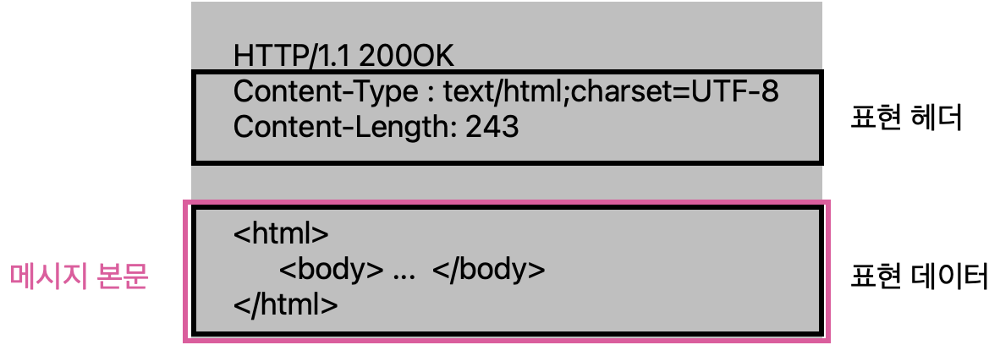

# HTTP 헤더

> HTTP 헤더

<!-- more -->

### HTTP BODY

-   메시지 본문(=payload)을 통해 표현데이터를 전달한다.
-   표현 : 표현 헤더 + 표현 데이터, 요청이나 응답에서 전달할 실제 데이터
-   표현 헤더 : 표현 데이터를 해석할 수 있는 정보를 제공한다.
    -   데이터유형(html, json), 데이터 길이, 압축 정보
