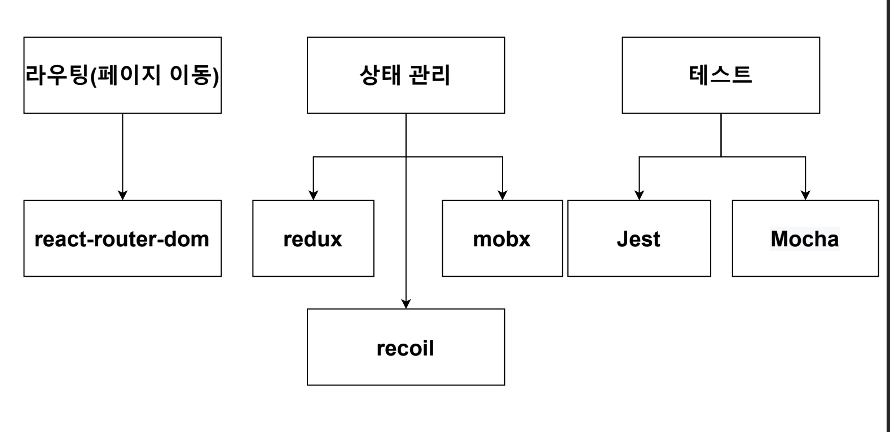

# React 기본 개념

> React 기본 개념 정리하기

<!-- more -->

## 리액트란?

-   리액트는 프레임워크가 아닌 라이브러리이다.  
    리액트는 전적으로 UI를 렌더링 하는 데 관여하기 때문이다. 그리고 화면을 바꾸는 라우팅은 react-router-dom 모듈을
    사용하며, 상태 관리를 위해서는 redux, mobx 등 여러 모듈을 사용하며, 빌드를 위해서는 webpack, npm 등등, 테스팅을 위해서도 Eslint, Mocha 등을 이용하기 때문에 리액트는 프레임워크가 아닌 라이브러리입니다.  
    

-   리액트는 여러개의 컴포넌트로 이루어져 있다.
    재사용성이 높아진다.

    -   클래스형 컴포넌트 vs 함수형 컴포넌트  
        리액트에서 리액트 훅스를 발표한 이후로 함수형 컴포넌트를 더 많이 사용하는 추세이다.

    ```javascript
    class App extends Cmponent {
        render() {
            return <h1> 안녕하세요 </h1>;
        }
    }
    ```

    ```javascript
    function App() {
        return <h1> 안녕하세요 </h1>;
    }
    ```

-   브라우저가 그려지는 원리(CRP)
    DOM Tree 생성: 렌더엔진이 문서를 읽어서 파싱하고 어떤 내용을 페이지에 렌더링 할 지 결정 -> Render Tree 생성: DOM과 CSSOM을 결합하는 곳, 화면에 표시되는 모든 노드의 콘텐츠 및 스타일 정보를 포함한다. -> Layout(reflow): 브라우저 페이지에 표시되는 각 요소의 크기와 위치 계산 -> 실제 화면에 그리기  
    ⛔️ 인터렉션에 의해 DOM에 변화가 생기면 render tree가 재생성 된다 ⛔️  
    그래서 나오게 된 것이 Virtual DOM!

-   가상돔(Virtual DOM)  
    실제 Dom을 메모리에 복사 해둔 것.  
    이전 가상돔과 비교해서 바뀐 부분만 찾아서(Diffing), 실제 돔에 적용(Reconcilition)시킨다.

### 리액트 앱 설치

    ```bash
    npx create-react-app <폴더이름>
    npx create-react-app ./
    ```

-   위 명령어로 리액트 앱을 만들면 webpack, Babel이 자동으로 설치된다.

> webpack

여러 파일의 자바스크립트 코드를 압축하여 최적화할 수 있다. 로딩에 대한 네트워크 비용을 줄일 수 있다. 모듈 단위로 개발 가능해 가독성과 유지보수가 쉽다.

> Babel

최신 자바스크립트 문법을 지원하지 않는 브라우저들을 위해서 최신 자바스크립트 문법을 구형 브라우저에서도 실행 될 수 있게 지원해주는 라이브러리이다.

### SPA(Single Page Application)

-   웹 사이트의 전체 페이지를 하나의 페이지(index.hmtl)에 담아 동적으로 화면을 바꿔가며 표현하는것.
-   전통적인 웹사이트는 원래 (Multi Page Application)였다.
-   그렇다면 SPA에서 화면 변경은 어떻게 이루어질까? -> React-Route-Dom

### JSX(Javascript Syntax extension)

-   리액트에서 사용하는 JS의 확장 문법이다. JS와 HTML구조를 함께 사용할 수있으므로 기본 UI에 데이터가 변하는 것들이나 이벤트가 처리되는 부분을 쉽게 구현할 수 있다.

> 조건

-   반드시 부모 요소로 감싸줄 것.
    ```javascript
    function hello() {
        return (
            <div>
                <div>안녕하세요</div>
            </div>
        );
    }
    ```
