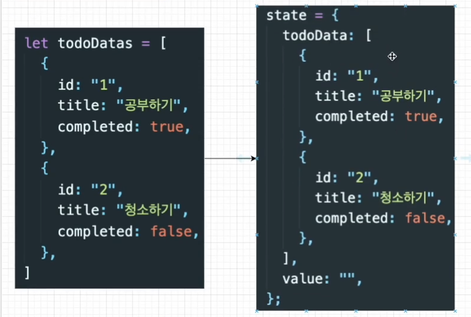
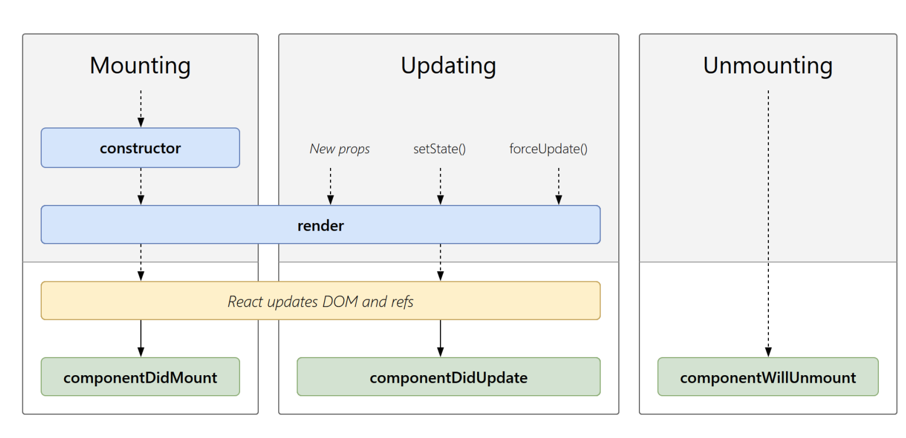
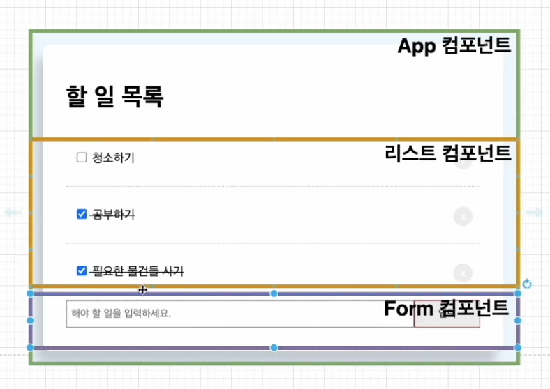
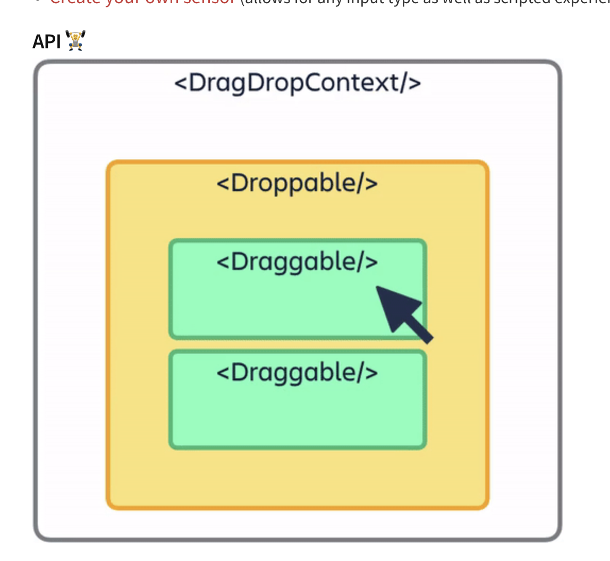
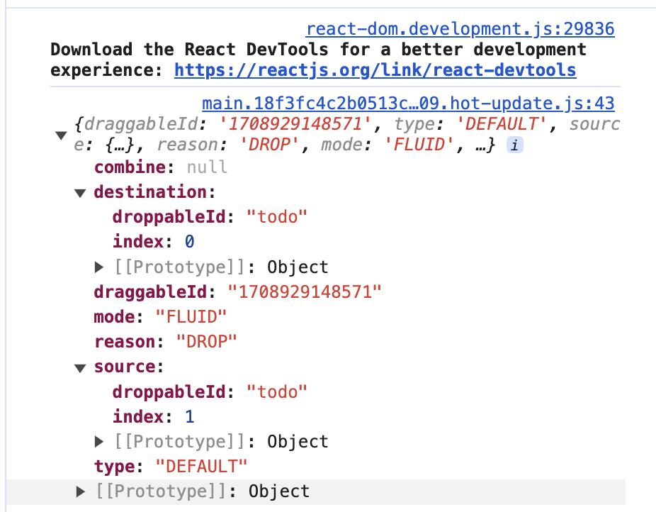

# React To-Do

> 간단한 To-Do 앱 만들기, 최적화

<!-- more -->

## JSX Key 속성

-   리액트에서 요소의 리스트를 나열할 때는 Key를 넣어줘야합니다. 키는 React가 변경, 추가 또는 제거된 항목을 식별하는 데 도움이 됩니다. 요소에 안정적인 ID를 부여하려면 배열 내부의 요소에 키를 제공해야 합니다.

-   가상 돔을 이용해서 바뀐 부분만 실제 돔에 적용해주는데, 리액트에서는 리스트를 나열할 때 바뀐 부분만 찾을 때 key를 이용해서 어떠한 부분이 바뀌었는지 인식할 수 있다.

-   유니크한 값을 넣기(index는 비추천!)
    -   새로 맨앞에 들어온 리스트가 그 전에 있던 index를 key값으로 가져 key 값이 변하는 현상이
        일어난다.

### React State

-   리액트에서 데이터가 변할 때 화면을 다시 렌더링 해주기 위해 React State를 사용한다.
-   컴포넌트의 렌더링 결과물에 영향을 주는 데이터를 갖고 있는 객체이다.
    -   State가 변경되면 컴포넌트는 리랜더링(Re-rendering)된다.
    -   State는 컴포넌트 안에서 관리된다.
-   setState 이용해서 바꿔주기
    

### React Hooks

-   class없이 state를 사용할 수 있는 새로운 기능
-   리액트의 생명주기 생명주기를 함수형 컴포넌트에서는 사용을 못했기 때문에 함수형 컴포넌트가 더 간결하고 빠르더라도 클래스형 컴포넌트를 사용했다.
    

### Hooks 관련 문제들

#### 📌 HOC(Higher Order Component)

-   컴포넌트를 인자로 받아서 새로운 리액트 컴포넌트를 리턴하는 함수

#### 📌 많은 HOC를 사용하게 되면 Wrapper가 너무 많아지는 것을 Hooks에서는 처리하는 방법?

-   React Hooks에서는 HOC대신에 따로 Custom Hooks를 이용해서 컴포넌트룰 만들어서 처리를 해준다.
-   생명주기를 위해 Hooks에서는 useEffect를 이용해서 처리한다.

#### 📌 Hooks에서 state를 업데이트 하는 방법?

stste를 정의할때 아래와 같이 한다.

```javascript
const [name, setName] = useState("");
```

#### 📌 class컴포넌트에 비해 함수형 컴포넌트의 장점?

1. 더 짧고 간결한 코드
2. 더 빠른 성능
3. 더 나은 가독성

## State vs Props

### State

-   부모 컴포넌트에서 자식 컴포넌트로 데이터를 보내는게 아닌 해당 컴포넌트 내부에서 데이터를 전달하는 방법
-   state는 변경 가능하다 (mutable)
-   State가 변하면 re-render 된다.

### Props

-   properties의 줄임말
-   상속하는 부모컴포넌트로부터 자녀 컴포넌트에 데이터 등을 전달하는 방법
-   properties는 읽기전용(immutable)으로 자녀 컴포넌트 입장에서 state가 변하지 않는다.
    -   상태가 변하고자 하면 부모 컴포넌트에서 state를 변경시켜야 한다.

## Component 분리



### tailwind css

1. 빠른 스타일링 작업 가능
2. class 혹은 id 명을 작성하지 않아도 된다.
3. 유틸리티 클래스가 익숙해지는 시간이 필요할 수 있지만 IntelliSense 플러그인이 제공돼서 금방 익숙해질 수 있다.

-   https://tailwindcss.com/

-   https://tailwindcss.com/docs/guides/create-react-app

```bash
npm install -D tailwindcss
npx tailwindcss init
```

> tailwind.config.js

```bash

/** @type {import('tailwindcss').Config} */
module.exports = {
    content: ["./src/**/*.{js,jsx,ts,tsx}"],
    theme: {
        extend: {},
    },
    plugins: [],
};

```

> app.css

```bash
@tailwind base;
@tailwind components;
@tailwind utilities;
```

### drag and drop 기능

> 기능 구현 순서

1. HTML 드래그 앤 드롭 API를 사용하여 원하는 목록을 드래그 가능하게 만듭니다.
2. 사용자가 드래그를 할 때 적절한 애니메이션을 줍니다.
3. 사용자가 드래그를 멈췄는지 확인합니다. 그리고 여기에도 애니메이션을 줍니다.
4. 클라이언트가 목록을 재정렬한 경우 항목의 위치를 새 항목으로 업데이트합니다.
   이를 쉽게 구현하도록 도와주는 모듈이 react-beautiful-dnd 이다.

> react-beautiful-dnd 사용법

```bash
npm install react-beautiful-dnd --save
```

-   https://www.npmjs.com/package/react-beautiful-dnd
-   

```javascript
const handleEnd = (result) => {
    console.log(result);
    if (!result.Destination) return;
    const newTodoData = todoData;

    // 1. 변경시키는 아이템을 배열에서 지운다
    // 2. return 값으로 지워진 아이템을 잡는다.
    const [reorderItem] = newTodoData.splice(result.source.index, 1);
    // 3. 원하는 자리에 reorderItem을 insert 해준다.
    newTodoData.splice(result.destination.index, 0, reorderItem);
    setTodoData(newTodoData);
};
```



> Array.prototype.splice() 사용법

-   https://developer.mozilla.org/ko/docs/Web/JavaScript/Reference/Global_Objects/Array/splice

## 불변성

> 상태를 변경할 수 없는 것

원시 타입(불변성o) : Boolean, String, Number, null, undefined, Symbol (불변성을 가지고 있다.)
참조 타입(불변성x): Object, Array

## 최적화 관련

### React.memo : 컴포넌트 렌더링 최적화

-   한 글자 입력 시마다 props가 바뀌지 않아서 렌더링 하지 않아도 되는 Lists 컴포넌트와 List 컴포넌트까지 다시 렌더링 되고있다.
-   원하는 컴포넌트를 React.memo로 감싸주기.

### useCallback : 함수 최적화

-   부모 컴포넌트가 자식 컴포넌트에 props로 내려 준다면 부모컴포넌트가 리 렌더링 될 때마다 자식 컴포넌트도 함수가 새롭게 만들어지니 계속 re-rendering 된다는 단점이 있다.

> 예시

-   List.js에 있던 삭제버튼(handleClick)함수를 App.js로 이동 후 props로 함수 넘겨주기
-   원래는 React.memo로 감싸줘서 리 렌더링 되지 않던 컴포넌트들이 한 글자 입력 시마다 Lists 컴포넌트와 List 컴포넌트까지 다시 리 렌더링 된다.

-   React.useCallback 적용  
    todoData 상태가 변하지 않는 다면 함수는 새로 생성되지 않는다. 의존성 배열[]에 아무것도 없다면, 컴포넌트가 최초 렌더링 시에만 함수가 생성되며, 그 이후에는 동일한 참조값을 사용하는 함수가 된다.

```javascript
const handleClick = (id) => {
    let newTodoData = todoData.filter((data) => data.id !== id);
    setTodoData(newTodoData);
};
```

```javascript
const handleClick = useCallback(
    (id) => {
        let newTodoData = todoData.filter((data) => data.id !== id);
        setTodoData(newTodoData);
    },
    [todoData]
);
```

### useMemo

> Memoization

메모이제이션은 비용이 많이 드는 함수 호출의 결과를 저장하고 동일한 입력이 다시 발생할 때 캐시된 결과를 반환하여 컴퓨터 프로그램의 속도를 높이는 데 주로 사용되는 최적화 기술이다.
