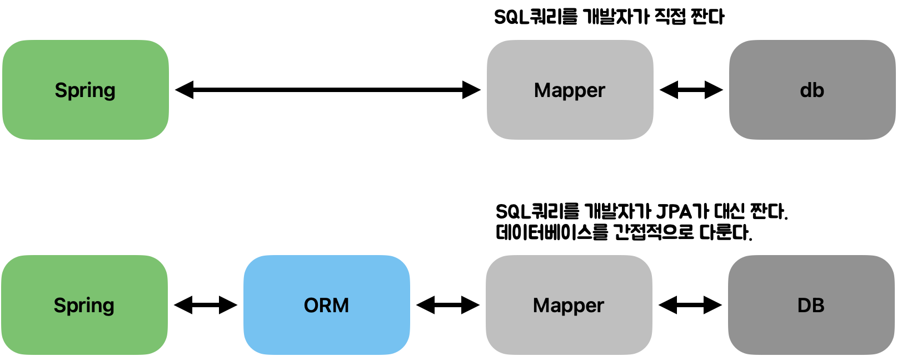

# ORM Framework

<!-- more -->

## ORM(Object Relational Mapping), 객체-관계 매핑

- 객체(object)와 관계형 데이터베이스의 데이터를 자동으로 mapping(연결)해주는 것 - OOP는 클래스를 사용하고, 관계형 데이터베이스는 테이블을 사용한다.  
   - 객체 모델과 관계형 모델 간에 불일치가 존재한다. - ORM을 통해 객체(db table의 row) 간의 관계를 바탕으로 SQL을 자동으로 생성하여 불일치를 해결한다.
  간접적으로 데이터베이스 데이터를 다룬다.

### 1. 스프링 <-> mapper <-> DB

- 개발자가 직접 SQL 쿼리를 작성
- 'mapper'는 SQL 쿼리를 데이터베이스로 전달하고 결과를 애플리케이션으로 가져오는 역할 수행
  - ex) MyBatis 프레임워크

### 2. 스프링 <-> ORM <-> mapper <-> DB

- ORM (예: JPA, Hibernate)을 사용하면, 개발자는 객체 중심의 코드로 데이터를 다루며, ORM 프레임워크가 이를 SQL 쿼리로 변환
- ORM은 데이터베이스의 테이블과 자바 객체 간의 매핑을 자동으로 관리한다.
- 데이터를 간접적으로 다루게 해줍니다.  
  

---

## ORM 종속성

ORM이 특정 프로그래밍 언어나 데이터베이스 시스템에 최적화 되어있어 다른 환경으로 이전이 어려울 수 있다는 것을 의미한다. 대부분 ORM 솔루션은 DB에 종속적이지 않다

> 프로그래밍 언어에 대한 종속성

- Java 언어를 사용하는 경우, Hibernate나 EclipseLink와 같은 JPA(Java Persistence API) 구현체를 주로 사용한다.
- C# 언어를 사용하는 경우, Entity Framework나 Dapper 같은 .NET 기반 ORM을 사용한다.
- 이 경우, ORM 솔루션은 특정 프로그래밍 언어와 밀접하게 연결되어 있으며, 다른 언어 환경에서는 사용하기 어려울 수 있다.

## 데이터베이스 독립성

- JPA를 사용하는 애플리케이션은 MySQL, PostgreSQL, Oracle 같은 다양한 SQL 데이터베이스를 거의 변경 없이 사용할 수 있다.

---

## ORM 장단점

> 장점

1. 객체 지향적인 코드로 인해 더 직관적이고, 비즈니스 로직에 더 집중할 수 있게 도와줍니다.

   - ORM을 이용하면 SQL 쿼리가 아닌 직관적인 코드로 데이터를 조작할 수 있어 개발자가 객체 지향 프로그래밍하는 데 집중할 수 있도록 도와줍니다.
   - 선언문, 할당, 종료 같은 부수적인 코드가 없거나 급격히 줄어듭니다.
   - 각종 객체에 대한 코드를 별도록 작성하기 때문에 코드의 가독성을 올려줍니다.
   - SQL의 절차적이고 순차적인 접근이 아닌 객체 지향적인 접근으로 인해 생산성이 증가합니다.
   - 재사용성 및 유지보수의 편리성이 증가합니다.

2. ORM은 독립적으로 작성되어있고, 해당 객체들을 재활용할 수 있습니다.

   - 이로 인해 모델에서 가공된 데이터를 컨트롤러에 의해 뷰와 합쳐지는 형태로 디자인 패턴을 견고하게 다지는데 유리합니다.
   - 매핑정보가 명확하여 ERD를 보는 것에 대한 의존도를 낮출 수 있습니다.
   - DBMS에 대한 종속성이 줄어듭니다.

3. 대부분 ORM 솔루션은 DB에 종속적이지 않습니다.
   - 종속적이지 않다는 것은 구현 방법 뿐만 아니라 많은 솔루션에서 자료형 타입까지 유효하다는 것입니다.
   - 개발자는 Object에 집중함으로써 극단적으로 DBMS를 교체하는 거대한 작업에도 비교적 적은 리스크와 시간이 소요됩니다.
   - 또한 자바에서 가공할 경우 equals, hashCode의 오버라이드 같은 자바의 기능을 이용할 수 있고, 간결하고 빠른 가공이 가능해집니다.

> 단점

1. 완벽한 ORM으로만 서비스를 구현하기가 어렵다.
   - 사용하기는 편하지만 설계는 매우 신중하게 해야한다.
   - 프로젝트의 복잡성이 커질 경우 난이도 또한 올라갈 수 있다.
   - 잘못 구현된 경우에 속도 저하 및 심각할 경우 일관성이 무너지는 문제점이 생길수 있다.
2. 프로시저가 많은 시스템에서는 ORM의 객체 지향적인 장점을 활용하기 어렵다.
   - 이미 프로시저가 많은 시스템에서는 다시 객체로 바꿔야함, 그 과정에서 생산성 저하나 리스크가 많이 발생할 수 있다.

---

## ODM (Object-Document Mapping)

- NoSQL 데이터베이스 (예: MongoDB, Cassandra, Couchbase)의 경우에는 ORM이 아닌 ODM를 사용한다.
- NoSQL 데이터베이스는 테이블이 아닌 문서, 키-값 쌍, 그래프와 같은 다른 데이터 구조를 사용한다.

---

> (추가 스터디) JPA_Jakarta(Java) Persistence API, JPQL_Jakarta(java) Persistence Query Language

 
 
 
 
 
