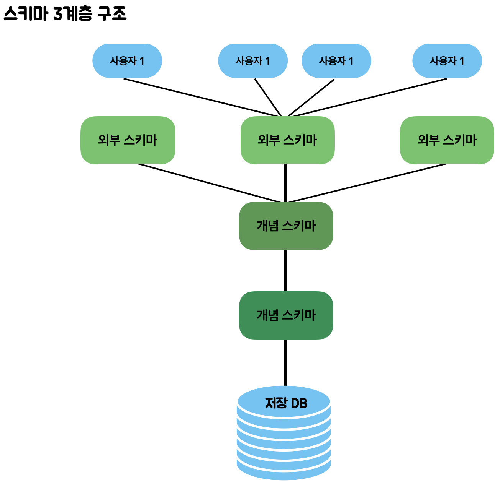

# RDB / NoSQL

> 데이터베이스 스키마, 관계형 데이터베이스, NoSQL 데이터베이스

<!-- more -->

## 스키마 (Schema)

- 데이터베이스에 저장되는 데이터 구조와 제약 조건을 정하는 것
- 데이터베이스 내의 테이블, 열, 데이터 타입, 관계 등을 포함
  - 예를들어 데이터베이스는 데이터에 INT, CHAR 등의 데이터 타입을 지정한다거나, 중복된 값을 허용하지 않는 등의 제약조건을 지정할 수 있다.
- 개체(entity),속성(Attribute),관계(Relationship) 및 데이터 조작시 데이터 값들이 갖는 제약 조건등에 관해 전반적으로 정의
  - 개체 : 데이터로 표현하려고 하는 객체(여러 속성들로 구성)  
     ex) 학생,과목
  - 속성 : 개체가 갖는 속성  
     ex) 홍길동(학생),이순신(학생),수학(과목),영어(과목)
  - 관계 : 개체와 개체 사이의 연관 성  
     ex) 학생과 과목 간의 "수강"이라는 관계를 가짐

> 스키마 3계층

1. 외부 스키마(External Schema) = 사용자 뷰(View)
   - 개별 사용자들의 입장에서 데이터 베이스의 논리적 구조를 정의한 것이다.
   - 동일한 데이터에 대해, 서로 다른 관점을 정의할 수 있도록 허용한다.
   - 사용자의 관점에 따라 스키마가 구성된다
   - ex) 같은 회사의 CEOdhk 직원은 같은 회사에 대해 서로 다른 요구와 인식을 갖는다
2. 개념 스키마
   - DB 전체의 논리적인 구조를 정의
   - 논리적 스키마라고도 함
   - 데이터베이스의 엔티티와 해당 속성 및 관계를 정의
   - ER모델링(엔티티 관계 모델링)은 엔티티 유형간의 관계가 무엇인지 지정한다. ER 모델링은 논리적 스키마를 생성하기 위한 도구이다.
3. 내부 스키마 - 물리적 스키마라고도 함 - 실제로 데이터베이스에 저장될 레코드의 물리적인 구조를 정의 - 데이터가 디스크 스토리지에 저장되는 방식을 나타낸다.  
    
   

---

## 1️⃣ Relational Database (관계형 테이더베이스)

- 엄격한 스키마와 테이블 형태로 데이터를 관리.
- ex) MySQL, Oracle, PostgreSQL, SQLite
- Schema-on-write 방식
  - 데이터를 데이터베이스에 저장하기 전에 스키마를 미리 정의해야 하고, 모든 데이터는 이 스키마에 맞게 저장

## 2️⃣ NoSQL (Not Only SQL 비관계형 데이터베이스)

- 테이블 형태가 아니고, 엄격하지 않은 Key-Value 형태로 데이터를 관리.
- Schema-on-read 방식
  - 데이터를 저장할 때 스키마를 엄격하게 정의하지 않고, 데이터를 읽을 때 필요한 구조로 해석
  - 데이터 형식이 자주 변경되거나, 미리 정의되지 않은 형식의 데이터를 다룰 때 유용함
- Transaction과 SQL을 지원하지 않음.
- ex) MongoDB, DynamoDB, Cassandra, Bigtable

---

## ✏️ RDB vs NoSQL 비교

| 구분             | RDB (SQL)                                                                                                                                     | NoSQL                                                                                                                                                   |
| ---------------- | --------------------------------------------------------------------------------------------------------------------------------------------- | ------------------------------------------------------------------------------------------------------------------------------------------------------- |
| 데이터 저장 모델 | table                                                                                                                                         | json document / key-value / 그래프 등                                                                                                                   |
| 개발 목적        | 데이터 중심 관소                                                                                                                              | 애플리케이션 / 확장가능성 / 수직가능성                                                                                                                  |
| 예시             | Oracle, MySQL, PostgreSQL 등                                                                                                                  | MongoDB, DynamoDB 등                                                                                                                                    |
| 스키마(Schema)   | 엄격한 데이터 구조                                                                                                                            | 유연한 데이터 구조                                                                                                                                      |
| ⭐️ 장점         | - 망연한 데이터구조 보장 - 데이터 중복 없이 한 번만 저장 (무결성)   - 데이터 중복이 없어서 데이터 update 용이                           | - 유연하고 자유로운 데이터 구조   - 새로운 필드 추가   - 수평적 확장(scale out)                                                                   |
| 🍎 단점          | - 시스템에 적지 않은 Join문 많은 부하를 줄 수 있음 - 성능 향상을 위해 수직적 확장(Scale up)이 주로 이용됨 - 데이터 구조가 엄격하지 않음 | - 데이터 중복 발생 가능   - 중복 데이터가 많기 때문에 데이터 변경 시 포인트 관리에서 수동적 필요함   - 엄격한 데이터구조 보장 X                   |
| ✅ 사용          | - 데이터 구조가 변경될 여지가 많지 않을 때 유리   - 데이터 update가 자주 일어나지 않을 때 유리                                             | - 정확한 데이터 구조가 정해지지 않은 경우   - Update가 자주 이루어지지 않는 경우 (수직가 많은 경우)   - 데이터 양이 많을 때 유리 (scale out 가능) |

## 👀 NoSQL이 유리한 경우, 불리한 경우는 언제일까?

> 유리한 경우

1. 데이터 구조가 비정형이거나 빈번하게 변경될 때
   - NoSQL은 유연한 스키마를 가지기 때문
2. 수평적 확장(scale out)이 필요할 때
3. 읽기 및 쓰기 연산이 매우 높은 어플리케이션인 경우
4. 분산형 시스템에서 작업하는 경우 (샤딩, %계산)
5. 대용량 데이터 및 실시간 처리가 필요

> 불리한 경우

1. 데이터 간 복잡한 관계를 맺고 있을 때
2. 무결성과 일관성이 매우 중요할 때
   - 금융서비스
3. 복잡한 보고와 데이터 분석을 필요로 하는 시스템

 
 
 
 
 
