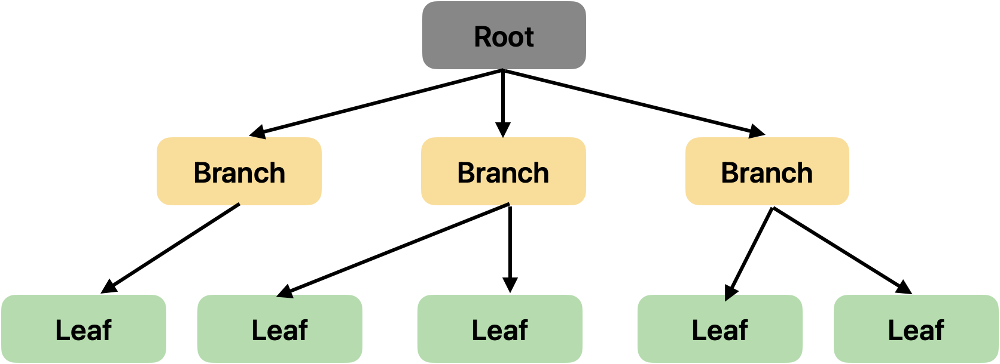

# Index란?
> B-Tree / Hash Index / B+Tree 개념 알아보자
<!-- more -->
- RDBMS에서 검색 속도를 높이기 위한 기술
- 인덱스가 검색 범위를 제한시켜주기 때문에 빠르게 데이터를 검색할 수 있다.

## 인덱스를 어떤 column에 사용하는 것이 좋을까?
- 자주 조회
- 수정 빈도 낮은
- 카디널리티 높은 (데이터가 중복되지 않는 정도가 높은, 예를들어 주민번호는 카디널리티 높음)
- 그냥 자주 조회되고, 수정 잘 안되고, 중복이 적은 컬럼에 사용하는게 좋다.
- 데이터 양 자체가 적을 때보단 양이 많을 때 사용하는 것이 좋다.

## B-Tree 인덱스
- 자식 2개만을 가지는 이진트리에서 확장된 것으로 N개의 자식을 가진다.
    - 노드의 개수를 늘리고 트리의 전체 높이를 줄여서 빠른 탐색 속도
- 메모리에 담기 어려운 큰 크기의 데이터를 다루기 위해 사용된다.
    - 파일 시스템 혹은 데이터베이스
- 인덱스는 보통 B-Tree 자료구조로 이루어져 있다.
- 인덱스 키를 바탕으로 항상 정렬된 상태를 유지⭐️
    - 조회 속도는 빠르지만, 삽입/수정/삭제 느리다.
- 최상위에 단 하나의 노드 만이 존재하는데, 이를 루트 노드(Root Node)라고 한다. 그리고 중간 노드를 브랜치 노드(Branch Node), 최하위 노드를 리프 노드(Leaf Node)라고 한다.
  
- 균형트리이다
    - 루트로부터 리프까지의 거리가 일정한 트리 구조
    - 성능 안정화
    - 처음에는 균형 트리이지만 테이블 갱신(INSERT, UPDATE, DELETE)을 반복하다 보면 균형이 깨지고, 성능 악화됨
  
## Hash 인덱스
- Key-Value 쌍으로 데이터를 저장하는 자료구조
    - 데이터의 Key를 알고 있으면, 데이터에 O(1)의 시간복잡도로 접근 가능
- 정렬할 필요가 없어서 삽입/삭제가 빠르다.
- 해싱된 데이터 값에 따라 저장될 버킷 위치를 저장하기 떄문에 빠른 속도록 검색 영역을 제한할 수 있다. 동등비교(=)에서 효과적이다.

> DBMS들은 Hash 테이블을 사용하지 않는 이유?

- 부등호 연산에 부적합 
- 정렬이 되어 있지 않다.
    - 'Key가 500보다 작은 데이터'를 찾기 위해서는 하기 위해서는 모든 데이터에 접근해야한다.
  
## B+Tree 인덱스
- B-tree의 확장된 개념이다.
- 모든 key, data가 리프에 모여있다. (리프까지 가야만 데이터 탐색 가능)
- 모든 리프노드가 연결리스트 형태를 가진다.

## 좋은 인덱스 설계 조건

### 1. Cardinality(기수성)
- Cardinality 높으면 중복도 낮아짐 = 유니크한 값 많다 => 검색 대상 수 감소
### 2. 선택도(Selectivity)
### 3. 크기(Size)
### 4. 접근 패턴(Access Patterns)

## 인덱스 설계시 Null값 고려
- 인덱스 설계시 Null 값을 고려하는 것은 중요하다.
- 

## 클러스터 인덱스 논클러스터인덱스 차이

## 인덱스(Index Server) 샤딩 방식
대규모 데이터베이스에서 검색 성능을 향상시키기 위해 인덱스를 여러 샤드(데이터베이스 조각)으로 분산하는 방법
- 데이터를 샤드에 고르게 분배할 것

### % 계산법
- % 계산법을 통해 각 데이터를 적절한 샤드에 배치한다.
- 해시 값을 샤드의 수로 나누고, 그 나머지를 이용하는 방식이다.

> 예시 

1. 데이터 키: "사용자123"
2. 해시 함수 적용: hash("사용자123") = 예를 들어, 45678이라고 가정
3. 샤드 개수: 10개
4. 할당 샤드 계산: 45678 % 10 = 8
5. 따라서, "사용자123"은 8번 샤드에 저장됩니다

 
 
 
 
 