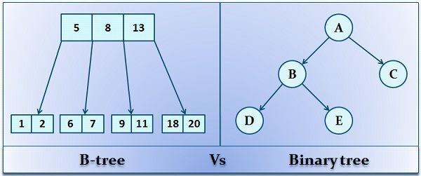
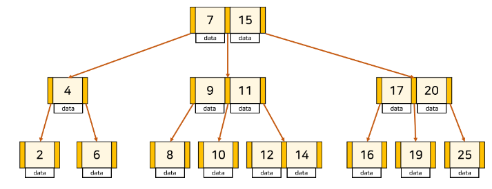
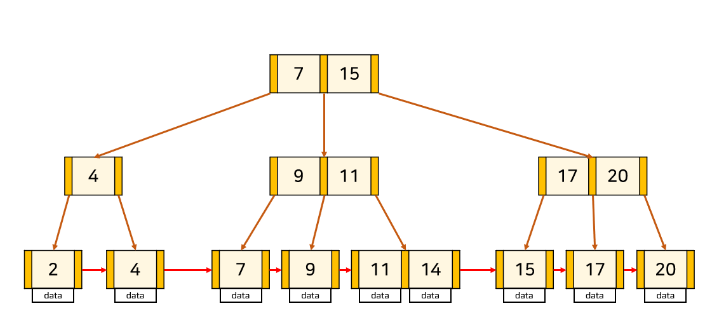

# Index
> B-Tree / Hash Index / B+Tree 개념 알아보자
<!-- more -->

## 📎 Index란?
- 데이터베이스 테이블에 저장된 데이터의 검색 속도를 높이기 위한 자료구조
- 특정 컬럼에 인덱스를 생성하면, 해당 컬럼의 데이터들을 정렬하여 별도의 메모리 공간에 데이터의 물리적 주소와 함께 저장된다.

> 📚 예시  

데이터 -> 책의 내용  
인덱스 -> 책의 목차  
물리적주소 -> 책의 페이지 번호     

 

> 장점

1. 검색 대상 레코드의 범위를 줄일 수 있다 -> 검색 속도 향상  
2. 중복데이터를 방지하거나 특정 컬러의 유일성을 보장할 수 있다.
3. 데이터가 정렬 되어 있다.
    - Where절: 특정 조건에 맞는 데이터를 찾기 위해 데이터를 처음부터 끝까지 다 비교지 않고, 인덱스를 통해 데이터가 정렬되어 있으면 빠르게 찾아낼 수 있다.
    - Order by: 인덱스를 사용하면 Order by에 의한 Sort과정을 피할 수 있다.
    - MIN, MAX: 인덱스로 정렬된 데이터에서 MIN, MAX를 효율적으로 추출할 수 있다.

> 단점

1. 정렬된 상태를 계속 유지시켜야 한다는 것
    - CREATE(삽입), DELETE(삭제), UPDATE(수정) 명령어가 수행된다면, 계속 정렬을 해줘야 하기 때문에 하므로 성능 저하가 발생할 수 있다.  
2. 인덱스를 잘못 사용할 경우 오히려 성능이 저하되는 역효과가 발생할 수 있다.
    - 100만개의 데이터가 있는 테이블이라면 인덱스 스캔이 유리하지만, 1개의 데이터 들어 있는 테이블의 경우 풀스캔이 효율적이다.
3. 인덱스를 관리하기 위해서는 DB의 약 10%에 해당하는 저장공간이 추가로 필요하다.

### 🚀 sql문을 효율적으로 짜고, 인덱스 생성은 마지막 수단으로 사용하자!

 

---

## 📎 인덱스 자료구조

### 1. Hash Table
- 컬럼의 값, 물리적 주소를 (Key, Value) 한 쌍으로 데이터를 저장하는 자료구조
- 정렬되어 있지 않다. 
- key값을 이용해 고유한 index를 생성하여, 그 index에 저장된 값을 꺼내오는 구조
- 빠른 데이터 검색 가능
    

> 해시테이블이 실제로 잘 사용되지 않는 이유?
 
- 등호 연산(=)에 최적화되어 있기 때문이다.   
 db에서는 부등호(<, >)연산이 자주 사용되는데, 해시 테이블내의 데이터들은 정렬되어 있지 않기 때문에 특정 기준보다 크거나 작은 값을 빠른시간 내에 찾을 수 없다.

---
  
> 노드 구분하기 

- 루트 노드(Root Node) : 최상단에 위치한 노드 
- 브랜치 노드(Branch Node) : 루트, 리프 노드 제외 
- 리프 노드(Leaf Node) : 자식이 없는 최하위 노드

    

### 2. B-Tree 
- 이진 트리와는 다르게 하나의 노드에 많은 정보를 가지거나, 두 개 이상의 자식을 가질 수도 있다.  
    

- 인덱스 키를 바탕으로 항상 정렬된 상태를 유지 ⭐️
- 검색(조회)속도 빠름
- 삽입/수정/삭제 느림
- 균형트리이다
    - 노드에 데이터가 너무 많아지면 자동으로 분할(split)되며, 반대로 데이터가 적어지면 병합(merge) 됨.
    - 루트로부터 리프까지의 거리가 일정한 트리 구조
    - 처음에는 균형 트리이지만 테이블 갱신(INSERT, UPDATE, DELETE)을 반복하다 보면 균형이 깨지고, 성능 악화됨
  
  

### 3. B+Tree 
- B-Tree의 단점을 개선한 자료구조이다
- 모든 리프노드가 LinkedList로 연결되어 있고, 순차적으로 저장되어 있다.⭐️
- 실제 데이터는 리프노드에만 저장된다.⭐️
    - Leaf Node만 인덱스(Key)와 함께 데이터(Value)를 가지고 있어 풀 스캔시에도 모든 데이터를 한 번 순회하는 B-Tree 보다 유리하다.

  

> B+Tree 장점  

- leaf node에만 데이터 저장하므로 메모리 최적화  
- 링크드 리스트로 연결되어 있기 full scan 시 리프 노드들만 순차 탐색하면 되기 때문에 탐색에 유리하다.

> B+Tree 단점  

반드시 특정 key에 접근하기 위해서 leaf node까지 가야하고, 브랜치 노드에서 키를 올바르게 찾아가기 위해 중복된 키가 존재할 수도 있다.

### 🚀 결론
db에서 부등호를 이용한 순차 검색 연산이 자주 발생하기 때문에 B+Tree를 주로 사용한다!  

### 💡 B-Tree & B+Tree 정리

| 구분       | B-Tree                        | B+Tree                              |
|------------|------------------------------|-------------------------------------|
| 데이터 저장 | 모든 노드에서 데이터 저장 가능             | 리프노드에만 데이터 저장 가능            |
| 트리의 높이 | 높음 (한 노드 당 Key를 적게 담을 수 있음) | 낮음 (한 노드 당 Key를 많이 담을 수 있음) |
| 풀 스캔시  검색 속도 | 모든 노드 탐색, 느림        | 리프 노드에서 선형 탐색, 빠르고 정확       |
| 삭제    | 브랜치 노드의 삭제는 복잡하고 트리 변형이 많다 | 어떠한 노드든 리프에 있기 때문에 삭제가 쉽다 |
| 키 중복    | 없음                                 | 있음 (리프 노드에 모든 데이터가 있기 때문에) |
| 검색       | 자주 access 되는 노드를 루트 노드에 가까이 배치하여 루트 노드에서 가까울 경우,   브랜치 노드에도 데이터가 존재하기 때문에 빠름 | 리프 노드까지 가야 데이터 존재            |

---

## 📎 좋은 인덱스 설계 조건

| 기준                     | 정도                     |
|------------------------|------------------------|
| 카디널리티 (Cardinality) | 높을 수록 적합              |
| 선택도 (Selectivity)    | 낮을 수록 적합 (5~10% 적정) |
| 활용도                  | 높을 수록 적합              |
| 중복도                  | 없을 수록 적합              |

### 1. Cardinality
- Cardinality가 높을 수록 인덱스 설정에 좋은 컬럼이다.   
- Cardinality 높다 = 중복도 낮아짐 = 유니크한 값 많다 => 검색 대상 수 감소
### 2. 선택도(Selectivity)
- 데이터에서 특정 값을 얼마나 잘 선택할 수 있는지에 대한 지표
- 5~10% 적정
- 특정 필드값을 지정했을 때 선택되는 레코드 수를 테이블 전체 레코드 수로 나눈 것
> = 컬럼의 특정 값의 row 수 / 테이블의 총 row 수 * 100  
> = 컬럼의 값들의 평균 row 수 / 테이블의 총 row 수 * 100  

### 3. 활용도
- 활용도가 높을 수록 인덱스 설정에 좋은 컬럼이다.
- 해당 컬럼이 실제 작업에서 얼마나 활용되는지에 대한 값
- 수동 쿼리 조회, 로직과 서비스에서 쿼리를 날릴 때 WHERE 절에 자주 활용되는지를 판단  

### 4. 중복도
- 중복도가 없을 수록 인덱스 설정에 좋은 컬럼이다.

---

## 📎 인덱스 샤딩(Sharding) 방식
- 대규모 데이터베이스에서 검색 성능을 향상시키기 위해 인덱스를 여러 샤드(데이터베이스 조각)으로 분산하는 방법

### % 계산법
- % 계산법을 통해 각 데이터를 적절한 샤드에 배치한다.
- 해시 값을 샤드의 수로 나누고, 그 나머지를 이용하는 방식이다.

 

> 예시 

1. 데이터 키: "user1"
2. 해시 함수 적용: hash("user1") = 예를 들어, 45678이라고 가정
3. 샤드 개수: 10개
4. 할당 샤드 계산: 45678 % 10 = 8
5. 따라서, "user1"은 8번 샤드에 저장됩니다

 

> 인덱스 샤딩 단점

1. 복잡성 증가: 관리해야 할 대상이 늘어남.
2. 복잡한 쿼리 처리: 샤드간에 데이터가 분산되어 있기 때문에, 복잡한 쿼리나 조인이 필요한 경우 성능 문제가 발생할 수 있다

---

(추가) 인덱스 설계시 Null값 고려, 클러스터 인덱스 논클러스터인덱스 차이

 
 
 
 
 