# Docker 기본

> 비전공자도 이해할 수 있는 Docker 입문/실전

<!-- more -->

## ✅ Docker CLI 익히기

중단된 컨테이너 한번에 삭제

```bash
docker rm  ${docker ps -qa}
```

실행되고 있는 컨테이너 중단 + 제거 한번에 하기
도커 컨테이너는 실행되고 있는 상태에서는 지울 수 없다. (꼭 중단 시키고 제거해야됨)

```bash
docker rm -f  도커컨테이너명
```

docker run

1. 도커 이미지 다운로드(pull) 받아서 컨테이너 생성(create)
2. create만 해도 이미지가 없다면 알아서 docker hub로 부터 이미지를 pull받은 후 컨테이너를 생성한다.
3. 컨테이너 실행(start)

포그라운드
백그라운드

## ✅ 컨테이너에서 발생하는 로그 확인

로그 확인

```bash
docker logs 69d
```

로그 마지막 10줄 확인

```bash
docker logs --tail 10 69d
```

실시간으로 생성되는 로그 확인

```bash
docker logs --tail 0 -f 컨테이너아이디
```

```bash

```

## ✅ 실행중인 컨테이너 내부 환경에 접속하는 방법

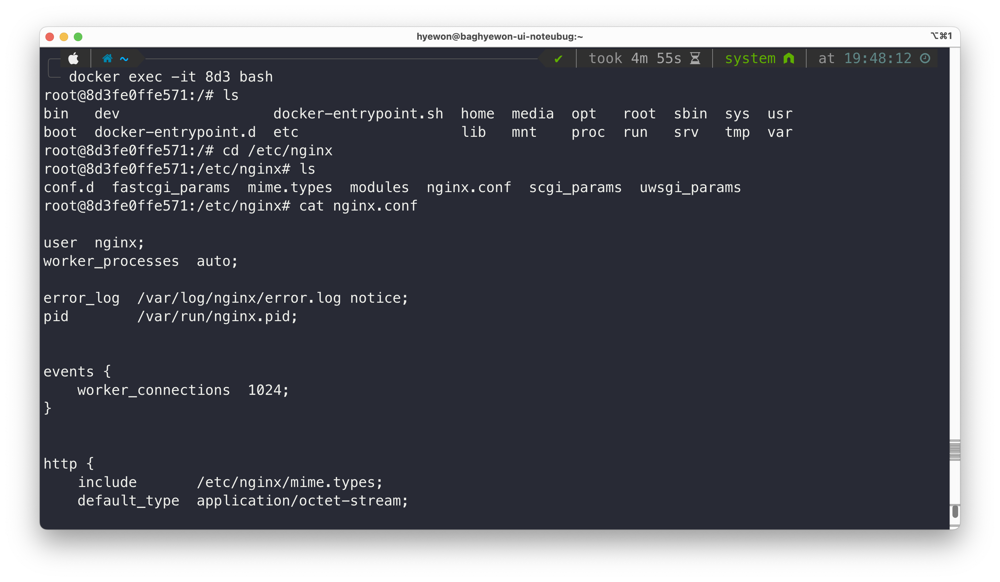

```bash
docker exec -it 컨테이너아이디 bash
```

다시 내 PC 환경(host os)으로 나오기
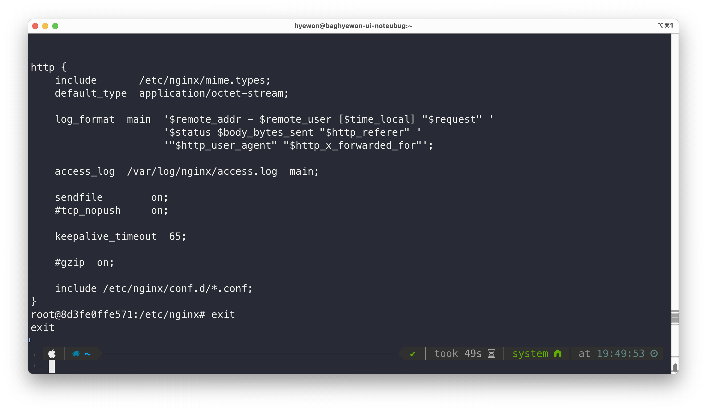

```bash
exit
```

### 예제 redis 실행해보기

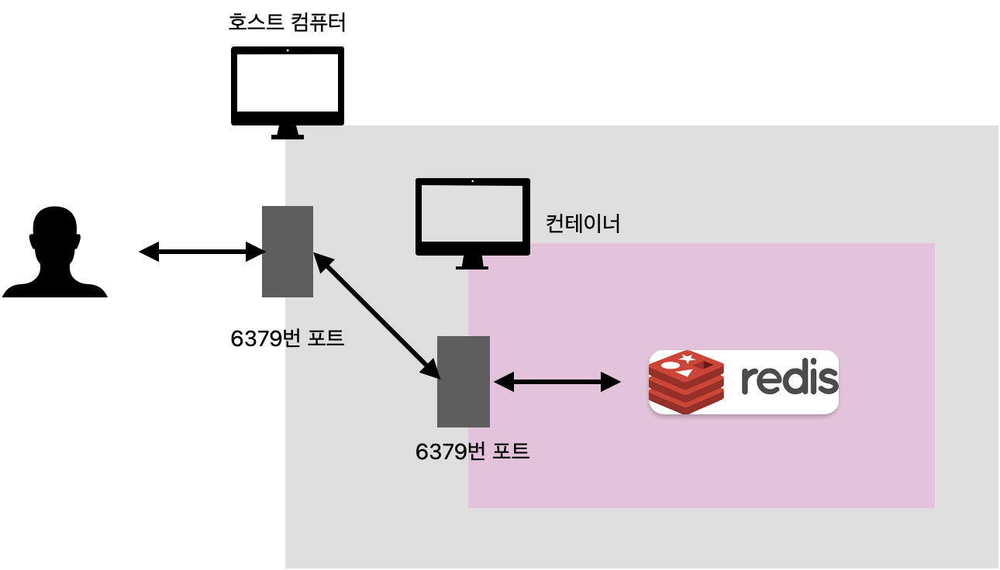

1. docker hub에서 redis 이미지 검색해보기

    https://hub.docker.com/search?q=redis

2. 도커 이미지 다운 + 컨테이너 생성 + 컨테이너 실행

    - 이미지 확인
    - 컨테이너 확인
    - 로그 확인

    ```bash
    docker run -d -p 6379:6379 redis
    docker image ls
    docker ps
    docker logs 4f3
    ```

3. 레디스 컨테이너 접근

    ```bash
    docker exec -it 4f3 bash
    ```

4. 레디스에 직접 접근

    ```bash
    root@4f3f8cc95a6f:/# redis-cli
    ```

5. 이미지 삭제, 컨테이너 삭제

    ```bash
    docker rm -f 4f3
    docker ps
    docker image ls
    docker image rm redis
    docker rm -f 8d3
    ```

## ✅ Docker Volume(도커 볼륨)

-   도커 이미지를 변경하고싶을 때 이미지를 수정하는 것 보다 새로 만드는 것이 효율적이라고 생각했다
-   하지만 기존 컨테이너 내부에 있던 데이터가 같이 삭제된다. 이렇게 컨테이너 내부에 저장된 데이터가 삭제되면 안되는 경우에 Volume 라는 개념을 활용하게 된다.
-   새로 만들어지는 컨테이너의 자체 저장공간을 사용하지 않고, 호스트 자체 저장공간을 공유해서 사용하는 방식이다.

```bash
$ docker run -v [호스트의 디렉토리 절대경로]:[컨테이너의 디렉토리 절대경로] [이미지명]:[태그명]
```

```bash

```

### 🍀 [실습] Docker로 MySQL 실행시켜보기 - 1

1. MySQL 이미지를 바탕으로 컨테이너 실행시키기

    https://hub.docker.com/_/mysql

    ```bash
    $ docker run -e MYSQL_ROOT_PASSWORD=password123 -p 3306:3306 -d mysql
    ```

2. mysql 포트가 이미 사용중이라는 에러가 뜬다.
   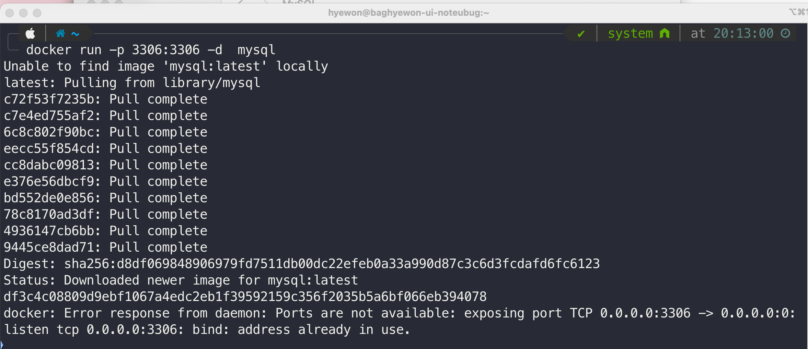
   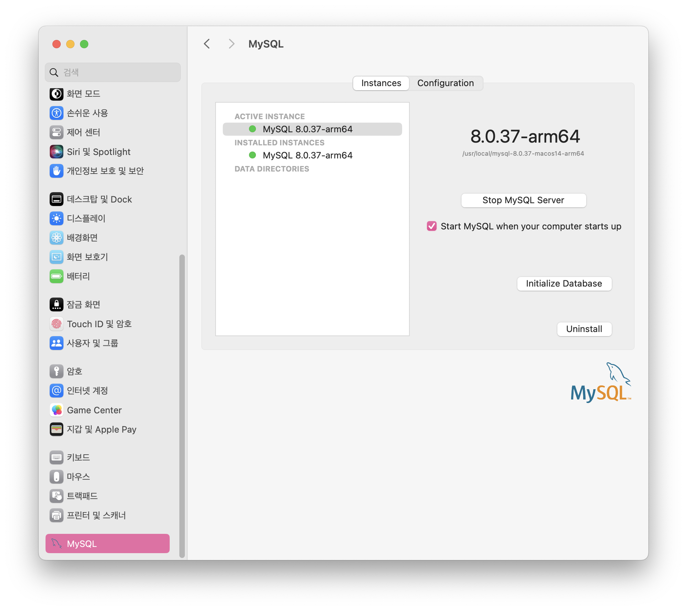

3. 해당 포트가 어디에 사용되고 있는지 확인하고 kill

    - docker run 잘 됨!

    ```bash
    sudo lsof -i:3306
    ```

    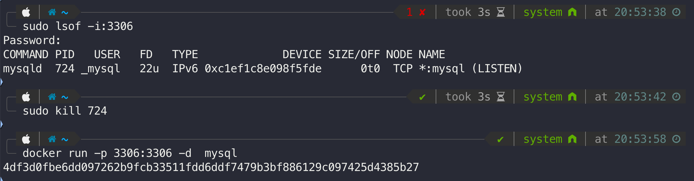
    

4. docker ps 했는데, 컨테이너가 없음

    - 에러가 발생했다는 것을 유추할 수 있다.
    - 우선 로그를 확인한다.  
      ✔️ 에러내용 : 패스워드 옵션이 정의되지 않아서 db가 시작을 못했다

    ```bash
    docker ps
    docker ps -a
    docker logs 4df
    ```

    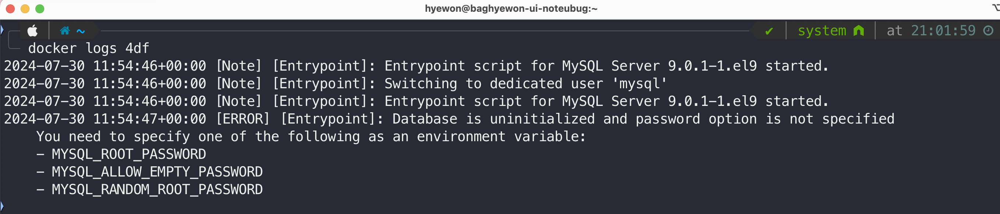

5. `-e` : 환경변수 설정

    - `e MYSQL_ROOT_PASSWORD=password123` : -e 옵션은 컨테이너의 환경 변수를 설정하는 옵션이다.
    - Dockerhub의 MySQL 공식 문서를 보면 환경 변수로 MYSQL_ROOT_PASSWORD를 정해주어야만 정상적으로 컨테이너가 실행된다고 적혀져있다.

    ```bash
    docker run -e  MYSQL_ROOT_PASSWORD=pass123# -d -p 3306:3306 mysql
    ```

    - 환경변수가 컨테이너 내에서 잘 설정 되어있는지 확인하기.

    ```bash

    docker exec -it [MySQL 컨테이너 ID] bash
    echo $MYSQL_ROOT_PASSWORD   # MYSQL_ROOT_PASSWORD라는 환경변수 값 출력
    ```

    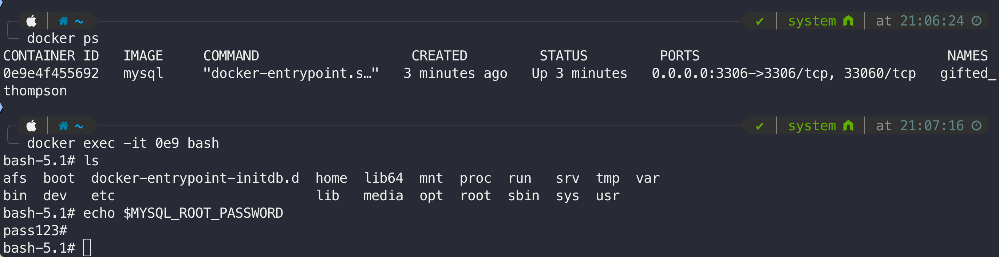

워크벤치, 디비버 등으로 확인할 수 있다.

<hr>

💡 볼륨을 사용하지 않으면 컨테이너 삭제 후 다시 띄웠을 때 데이터가 사라진다.

1. mysql에 접속해서 hyewondb 데이터베이스 생성하기

    ```bash
    docker run -e  MYSQL_ROOT_PASSWORD=pass123# -d -p 3306:3306 mysql
    docker exec -it 09e bash
    mysql -u root -p
    패스워드 입력 : pass123#
    create database hyewondb;
    docker rm -f 09e  # 09e컨테이너 삭제
    ```

    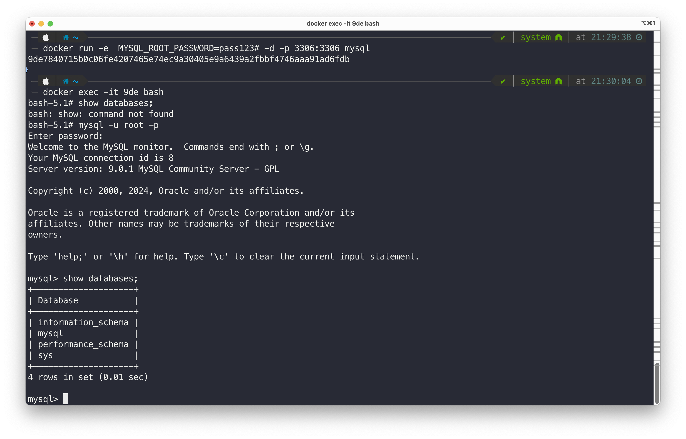

2. mysql 컨테이너 다시 생성 -> hyewondb 사라져 있음

    ```bash
    docker run -e  MYSQL_ROOT_PASSWORD=pass123# -d -p 3306:3306 mysql
    docker exec -it 9de bash  # 새로운 9de 컨테이너 생성됨
    mysql -u root -p
    패스워드 입력 : pass123#
    show databases;
    ```

    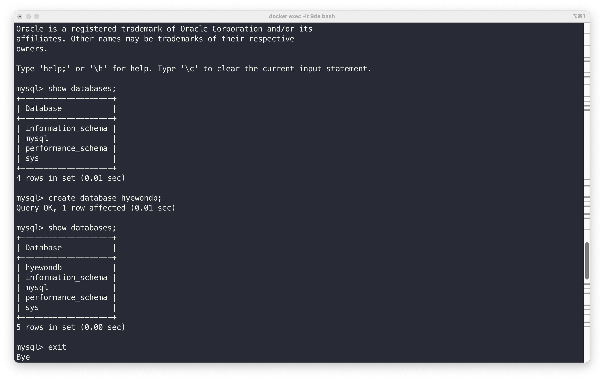

📌 위 방식은 볼륨(Volume)을 활용하지 않고 MySQL 컨테이너를 띄웠다. 그래서 MySQL 컨테이너를 삭제함과 동시에 MySQL 내부에 저장되어 있던 데이터도 함께 삭제되어 없어졌다. 이를 방지하기 위해 볼륨(Volume)을 활용해 MySQL 컨테이너를 띄우는 방식에 대해 알아볼 것이다.

### 💡 볼륨 사용하여 mysql 띄우기

1. MySQL 컨테이너 띄우기

    ```bash
    cd /Users/hyewon/Documents/Develop
    mkdir docker-mysql # MySQL 데이터를 저장하고 싶은 폴더 만들기

    # docker run -e MYSQL_ROOT_PASSWORD=password123 -p 3306:3306 -v {호스트의 절대경로}/mysql_data:/var/lib/mysql -d mysql

    docker run -e MYSQL_ROOT_PASSWORD=pass123# -d -p 3306:3306 -v /Users/hyewon/Documents/Develop/docker-mysql/mysql_data:/var/lib/mysql mysql
    ```

    - DB에 관련된 데이터가 저장되는 곳이 /var/lib/mysql인지는 Dockerhub MySQL의 공식 문서에 나와있다.

    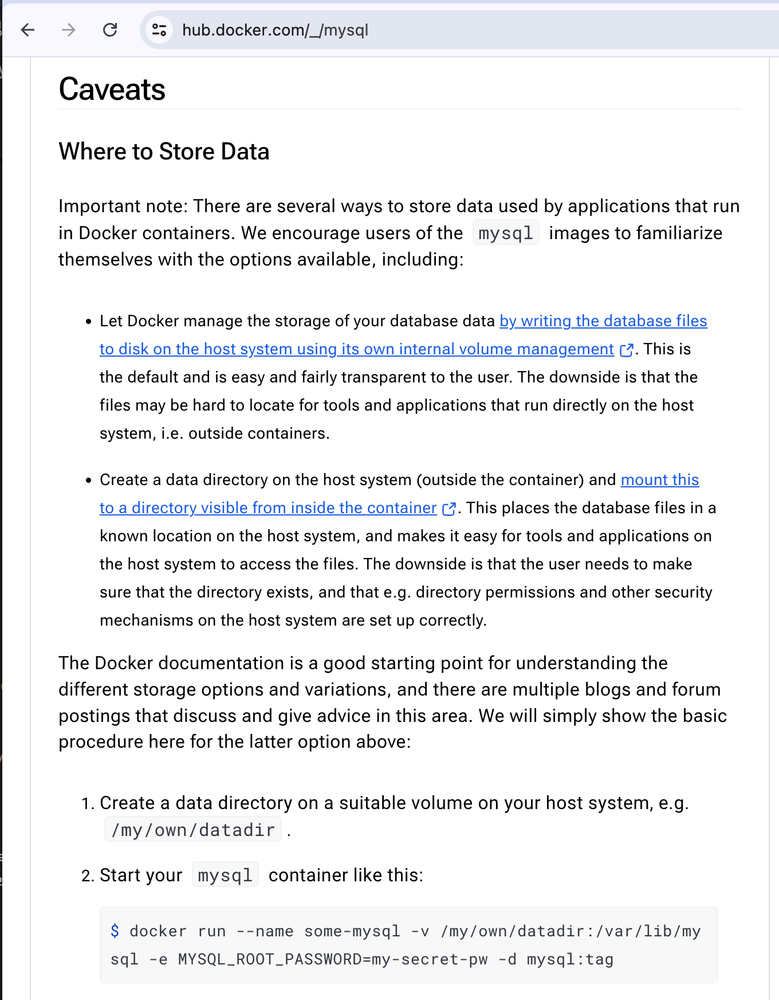

2. MySQL 컨테이너에 접속해서 데이터베이스 만들기

    ```bash
    $ docker exec -it [MySQL 컨테이너 ID] bash

    $ mysql -u root -p

    mysql> show databases;
    mysql> create database hyewondb;
    mysql> show databases;
    ```

3. 컨테이너 종료 후 다시 생성해보기

    ```bash
    # 컨테이너 종료
    $ docker stop [MySQL 컨테이너 ID]
    $ docker rm [MySQL 컨테이너 ID]

    # 컨테이너 생성
    $ docker run -e MYSQL_ROOT_PASSWORD=pass123! -p 3306:3306 -v /Users/hyewon/Documents/Develop/docker-mysql/mysql_data:/var/lib/mysql -d mysql

    $ docker exec -it [MySQL 컨테이너 ID] bash
    $ mysql -u root -p
    mysql> show databases;
    ```

    - 아까 생성한 데이터베이스가 새로 생성한 컨테이너에서도 존재한다.

        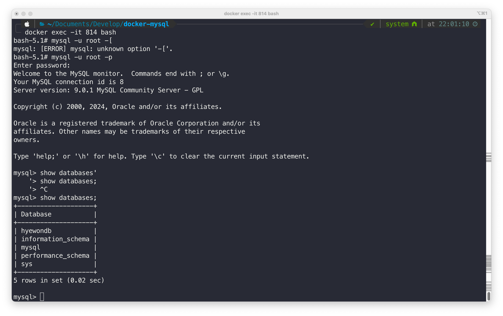

<hr>

#### 🤔 비밀번호를 바꿔서 컨테이너를 생성하면 어떻게 될까?

```bash
# 컨테이너 종료
$ docker stop [MySQL 컨테이너 ID]
$ docker rm [MySQL 컨테이너 ID]

# 컨테이너 생성

$ docker run -e MYSQL_ROOT_PASSWORD=change123! -p 3306:3306 -v /Users/hyewon/Documents/Develop/docker-mysql/mysql_data:/var/lib/mysql -d mysql

$ docker exec -it [MySQL 컨테이너 ID] bash
# 접속 안됨 🚨

```

-   접속이 안되는 이유?
    -   처음 환경변수 설정 시 Volume으로 설정해둔 폴더에 이미 비밀번호 정보가 저장되버렸기 때문이다.
    -   아예 mysql_data를 지우고 다시 mysql을 띄우면 된다.
        -   rm -rf -mysql_data
    -   볼륨의 특성이다.

<hr>

#### 🤔 볼룸의 경로를 잘못 작성한다면?

🚨 주의) mysql_data 디렉토리를 미리 만들어 놓으면 안 된다. 그래야 처음 이미지를 실행시킬 때 mysql 내부에 있는 /var/lib/mysql 파일들을 호스트 컴퓨터로 공유받을 수 있다. mysql_data 디렉토리를 미리 만들어놓을 경우, 기존 컨테이너의 /var/lib/mysql 파일들을 전부 삭제한 뒤에 mysql_data로 덮어씌워 버린다.

1. mysql_data 파일을 생성하고, aaa.txt 작성
   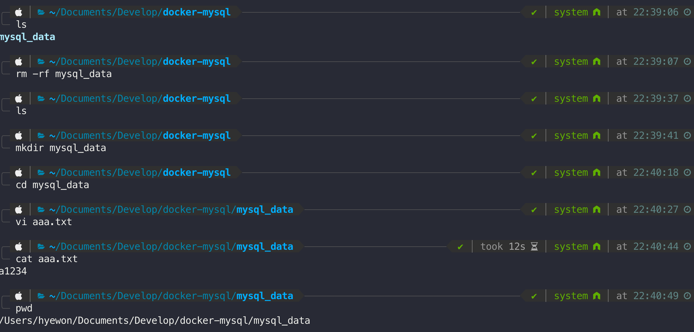

    - docker ps 결과 컨테이너가 생성이 안됨
    - 에러 발생 : [Server] --initialize specified but the data directory has files in it. Aborting.
    - ✔️ [호스트의 디렉토리 절대 경로]에 디렉토리가 이미 존재할 경우, 호스트의 디렉터리가 컨테이너의 디렉터리를 덮어씌운다.

    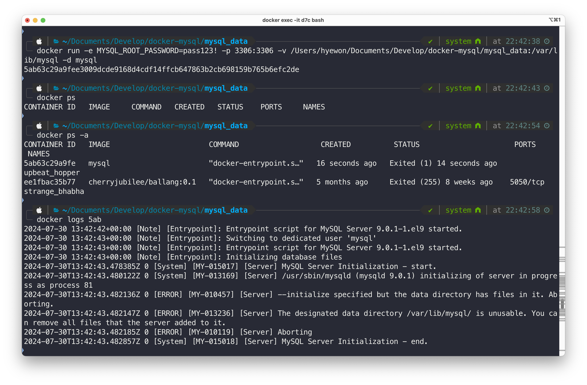

2. mysql_data 파일 지우고, 컨테이너 다시 생성

    - 컨테이너 생성완료
    - ✔️ [호스트의 디렉토리 절대 경로]에 디렉토리가 존재하지 않을 경우, 호스트의 디렉터리 절대 경로에 디렉터리를 새로 만들고 컨테이너의 디렉터리에 있는 파일들을 호스트의 디렉터리로 복사해온다.
      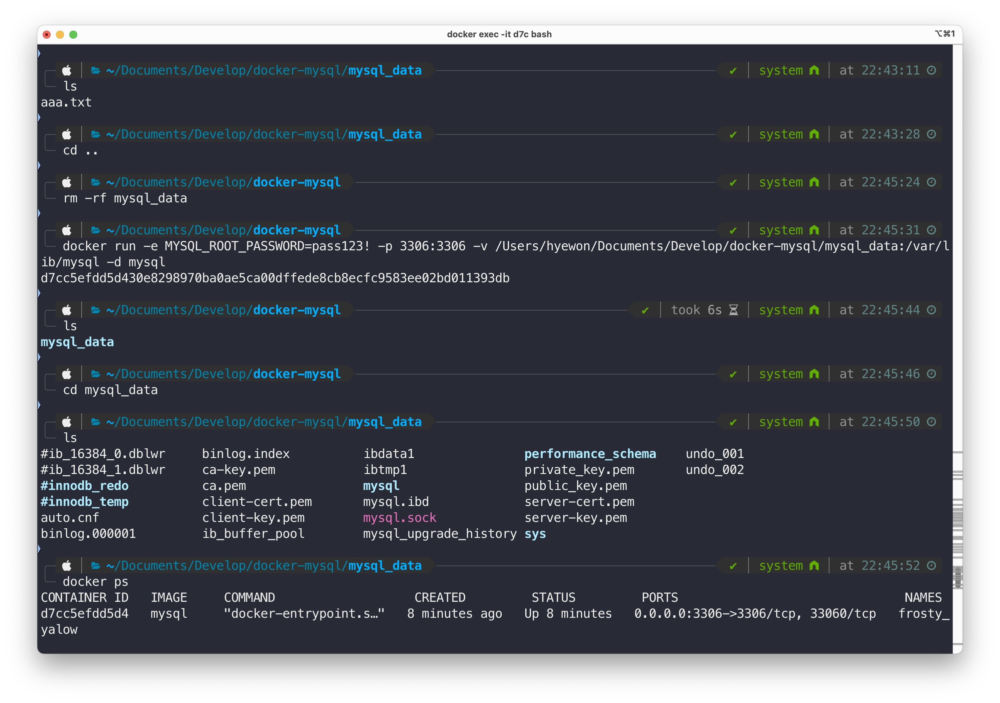

3. 컨테이너 내에서의 파일과, 볼륨의 파일이 완전하게 일치한다.
    - 즉 호스트에서 파일을 추가하면 컨테이너에서도 추가된 파일을 볼 수있다.
      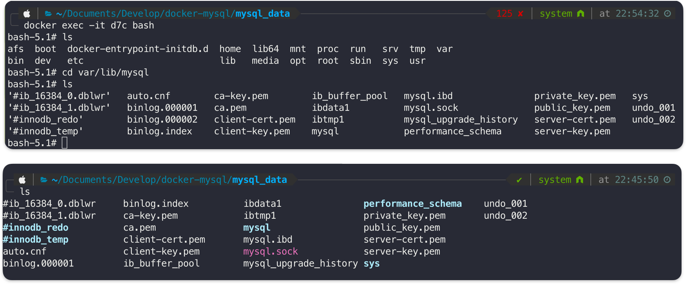

<br>

## ✅ Dockerfile

-   우리가 도커 이미지를 다운 받을 수 있는 이유는, 누군가가 dockerfile로 docker image를 만들어 docker hub에 올린 것이다.
-   우선 Dockerfile 문법에 대해서 알아보자

### 1. FROM

-   베이스 이미지 생성
-   특정 초기 이미지
-   `-t` : tag
-   상대경로로 작성하니까 해당 위치로 들어와있어야 함

```dockerfile
FROM openjdk:17-jdk

ENTRYPOINT [ "/bin/bash", "-c", "sleep 500" ]
```

```bash
docker build -t my-jdk17-server .
docker build -t my-jdk17-server:beta .

docker image ls
```

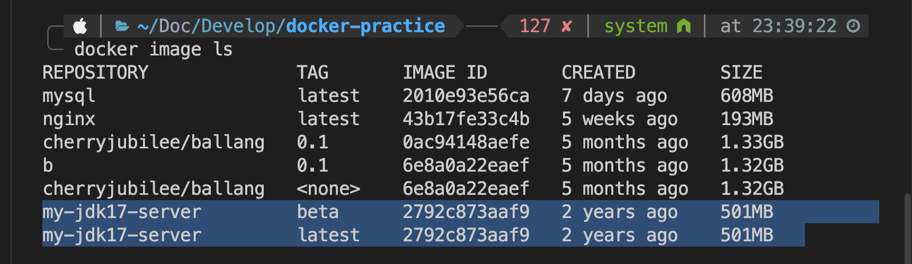

실행 되었다가 종료 되었다고 뜸. 이유는 도커 파일에 작성된 작업이 모두 끝나면 컨테이너가 저절로 종료가 된다.

```bash
docker build -t my-jdk17-server .
docker build -t [원하는 도커 이미지 이름] [도커파일 경로]
docker run -d my-jdk17-server

docker exec -it c98 bash # 실행중인 컨테이너이기 때문에 가능
bash-4.4# java -version # jdk 깔려있는지 버전 확인
```

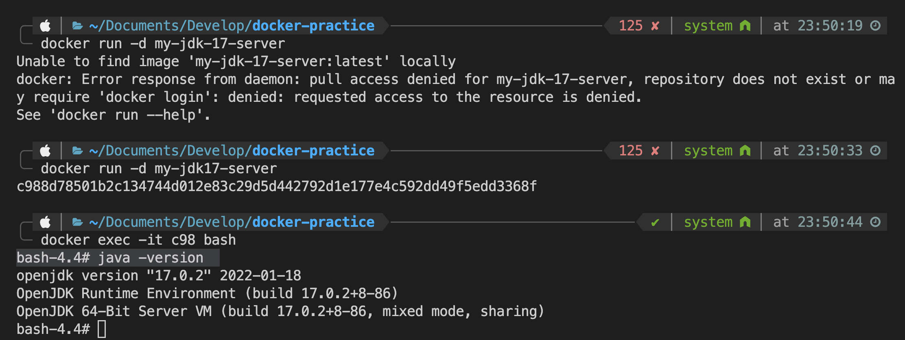

😎 👀 종료된 컨테이너에서 디버깅하고 싶다면?

지금까지는 아래 2가지 방법을 사용했다.

    1.   docker logs
    2.   docker exec -it [컨테이너 ID] bash
    3.   실행중인 컨테이너로 만들기 위해 dockerfile에 `ENTRYPOINT [ "/bin/bash", "-c", "sleep 500" ]` 추가.(디버깅 하기 위함)

    ```bash
    FROM openjdk:17-jdk

    ENTRYPOINT ["/bin/bash", "-c", "sleep 500"] # 500초 동안 시스템을 일시정지 시키는 명령어
    ```

### 2. COPY

-   파일 복사(이동)
-   호스트 컴퓨터에있는 파일을 복사해서 컨테이너로 전달
    -   호스트 -> 컨테이너
-   문법

    ```bash
    COPY [호스트 컴퓨터에 있는 복사할 파일의 경로] [컨테이너에서 파일이 위치할 경로]
    COPY app.txt /app.txt
    ```

> 1️⃣ 파일 복사해보기

-   app.txt 파일 만들기
-   Dockerfile 만들어서 이미지 생성 및 컨테이너 실행

    ```dockerfile
    FROM ubuntu

    COPY app.txt /app.txt

    ENTRYPOINT [ "/bin/bash", "-c", "sleep 500" ]
    ```

    ```bash
    docker build -t my-server .
    docker run -d my-server
    docker exec -it a9a bash
    ```

    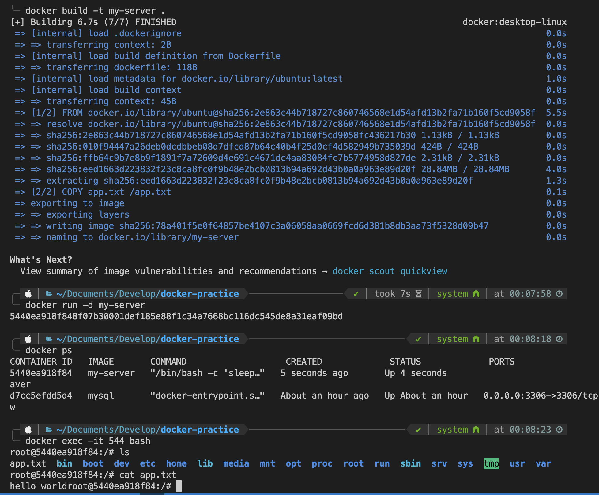

> 2️⃣ 폴더 안에있는 모든 파일 복사하기

-   my-app 디렉터리 만들기, my-app 디렉터리 안에 파일 만들기
-   Dockerfile 만들어서 이미지 생성 및 컨테이너 실행

    ```dockerfile
    FROM ubuntu

    COPY my-app /my-app/

    ENTRYPOINT [ "/bin/bash", "-c", "sleep 500" ]
    ```

    ```bash
    docker build -t my-server .
    docker run -d my-server
    docker exec -it 539 bash
    ```

    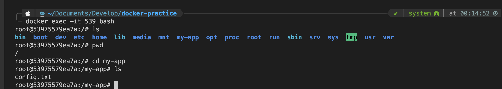

> 3️⃣ 와일드 카드 사용해보기

-   `app.txt`, `readme.txt` 파일 2개 만들기

-   Dockerfile 만들어서 이미지 생성 및 컨테이너 실행

    ```dockerfile
    FROM ubuntu

    COPY *.txt /text-files/

    ENTRYPOINT [ "/bin/bash", "-c", "sleep 500" ]
    ```

    ```bash
    docker build -t my-server .
    docker run -d my-server
    docker exec -it 280 bash
    ```

    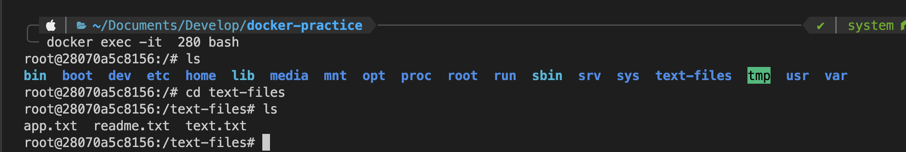

> 4️⃣ .dockerignore 사용해보기

-   특정 파일 또는 폴더만 COPY를 하고 싶지 않을 수 있다. 그럴 때 .dockerignore를 활용한다.
-   .dockerignore 파일 만들기
-   Dockerfile 만들어서 이미지 생성 및 컨테이너 실행

    ```dockerfile
    FROM ubuntu

    COPY ./ /

    ENTRYPOINT [ "/bin/bash", "-c", "sleep 500" ]
    ```

    ```bash
    docker build -t my-server .
    docker run -d my-server
    docker exec -it 3ec bash
    ```

    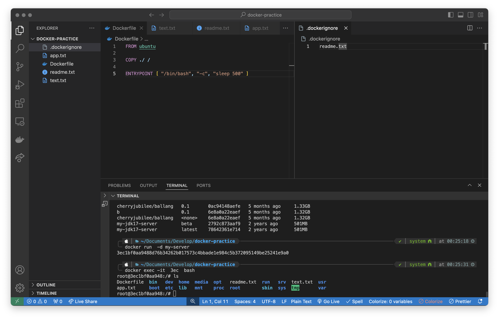

### 3. ENTRYPOINT

-   컨테이너가 시작할 때 실행되는 명령어를 ENTRYPOINT에 작성한다.
-   사용법

    ```bash
    # 문법
    ENTRYPOINT [명령문...]

    # 예시
    ENTRYPOINT ["node", "dist/main.js"]
    ```

-   예제

    ```dockerfile
    FROM ubuntu

    ENTRYPOINT [ "/bin/bash", "-c", "echo hello" ]
    ```

    ```bash
    docker build -t my-server .
    docker logs 52e
    hello
    ```

    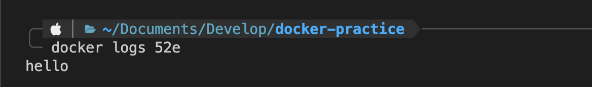

### 🍀 [실습] 백엔드 프로젝트(Spring Boot) 프로젝트를 Docker로 실행시키기

1. spring 프로젝트 셋팅
   
2. 간단한 코드 작성

    - AppController

    ```java
     @RestController
     public class AppController {
     @GetMapping("/")
     public String home() {
         return "Hello, World!";
     }
     }
    ```

3. Dockerfile 작성하기

    ```dockerfile
    FROM openjdk:17-jdk

    COPY build/libs/*SNAPSHOT.jar /app.jar

    ENTRYPOINT ["java", "-jar", "/app.jar"]
    ```

4. Spring Boot 프로젝트 빌드하기

    ```bash
    ./gradleew clean build
    ```

5. Dockerfile을 바탕으로 이미지 빌드하기

    ```bash
     $ docker build -t hello-server .
    ```

6. 이미지가 잘 생성됐는 지 확인하기

    ```bash
    $ docker image ls
    ```

7. 생성한 이미지를 컨테이너로 실행시켜보기

    ```bash
    docker run -d -p 8080:8080 hello-server
    ```

8. 컨테이너 잘 실행되고 있는 지 확인하기

    ```bash
    docker ps
    ```

9. localhost:8080으로 들어가보기

10. 실행시킨 컨테이너 중지 / 삭제하기, 이미지 삭제하기

    ```bash
    $ docker stop {컨테이너 ID}
    $ docker rm {컨테이너 ID}
    $ docker image rm {이미지 ID}
    ```

### 4. RUN

-   이미지를 생성하는 과정에서 사용할 명령문 실행
-   ⭐️ RUN은 ‘이미지 생성 과정’에서 필요한 명령어를 실행시킬 때 사용하고, ENTRYPOINT는 생성된 이미지를 기반으로 컨테이너를 생성한 직후에 명령어를 실행시킬 때 사용한다.
-   사용법

    ```bash
    # 문법
    RUN [명령문]

    # 예시
    RUN npm install
    ```

-   예제 가정 : git, ubuntu가 함께 깔려있으면 좋겠다

    ```shell
    FROM ubuntu

    RUN apt update && apt install -y git

    ENTRYPOINT ["/bin/bash", "-c", "sleep 500"]
    ```

    ```shell
    $ docker build -t my-server .
    $ docker run -d my-server
    $ docker exec -it [Container ID] bash

    $ git -v # 컨테이너 내에 git이 잘 설치됐는 지 확인
    ```

    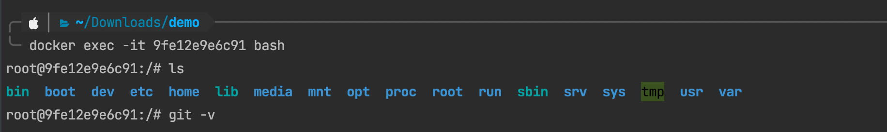

### 5. WORKDIR

-   작업 디렉토리를 지정한다.
-   컨테이너 내부에 존재하던 기존파일들과 분리하여 폴더를 깔끔하기 관리하기 위함이다.
-   사용법

    ```bash
    # 문법
    WORKDIR [작업 디렉토리로 사용할 절대 경로]

    # 예시
    WORKDIR /usr/src/app
    ```

-   예제 : WORKDIR을 안 썼을 때 파일 구성 보기

    ```shell
    FROM ubuntu

    COPY ./ ./

    ENTRYPOINT ["/bin/bash", "-c", "sleep 500"]
    ```

    ```shell
    $ docker build -t my-server .

    $ docker run -d my-server
    $ docker exec -it [Container ID] bash

    $ ls
    ```

    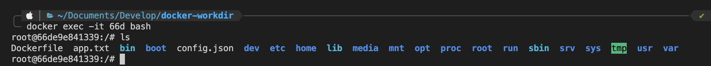

-   예제 : WORKDIR을 썼을 때 파일 구성 보기

    ```shell
    FROM ubuntu

    WORKDIR /my-dir

    COPY ./ ./

    ENTRYPOINT ["/bin/bash", "-c", "sleep 500"]
    ```

    ```shell
    $ docker build -t my-server .

    $ docker run -d my-server
    $ docker exec -it [Container ID] bash

    $ ls
    ```

    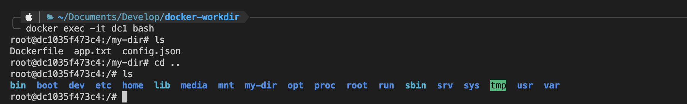

### 6. EXPOSE

-   컨테이너 내부에서 사용 중인 포트를 문서화하기
-   없어도 작동하기 떄문에 문서화 라고 한다.
-   사용법

    ```bash
    # 문법
    EXPOSE [포트 번호]

    # 예시
    EXPOSE 3000
    ```

<br>

### 🍀 NestJS 프로젝트를 도커로 실행하기


### ⭐️ # [실습] 웹 프론트엔드 프로젝트(HTML, CSS, Nginx)를 Docker로 배포하기

## ✅ Docker Compose

아래 명령어를 docker compose로 띄워보기

```shell
docker run --name webserver[컨테이너 이름] -d -p 8080:8080 nginx[이미지]
```

> compose.yml

-   확실히 명령어가 간소해졌다.
-   뒤에서 배우지만, 다수의 컨테이너를 관리하기에 용이하다.

```yml
services:
    my-web-server:
        container_name: webserver
        image: nginx
        ports: -80:80
```

```shell
docker compose up # 포그라운드
docker compose up -d  #  백그라운드
docker ps
docker compose down
```

### Docker compose CLI 명령어

compsoe.yml에 정의된 컨테이너 중 실행중인 컨테이너만 보여준다.

```shell
docker compose ps
```

compsoe.yml에 정의된 컨테이너 중 중지된 것도 보여주기

```shell
docker compose ps -a
```

로그 확인하기

```shell
docker compose logs
```

이미지를 다시 빌드해서 실행시킬 때

```shell
docker compose up --build
```

도커 허브에서 최신 이미지를 가져와서 compsoe.yml의 이미지를 업데이트 해준다.

```shell
docker compose pull
```

#### 🍀 docker compose로 redis 실행하기

> Docker CLI로 컨테이너를 실행시킬 때

```shell
docker run -d -p 6379:6379 redis
```

> Docker Compose로 컨테이너를 실행시킬 때

1.  compose.yml 파일 작성

    ```yml
    services:
        my-cache-server:
            image: redis
            ports:
                - 6379:6379
    ```

2.  compose 파일 실행 및 현황보기

    ```shell
    docker compose up -d
    docker compose ps
    docker  ps
    ```

3.  컨테이너 실행시킬 때 에러없는지 로그 확인

    ```shell
    docker compose logs
    ```

4.  Redis 컨테이너 접속

    ```shell
    docker exec -it [컨테이너ID] bash
    ```

5.  컨테이너에서 redis 사용해보기

    ```shell
    $ redis-cli

    127.0.0.1:6379> set 1 jscode
    127.0.0.1:6379> get 1
    ```

6.  compose로 실행된 컨테이너 삭제

    ```shell
    docker compose down
    ```

#### 🍀 docker compose로 mysql 실행하기

> Docker CLI로 컨테이너를 실행시킬 때

```shell
$ docker run -e MYSQL_ROOT_PASSWORD=pass123! -p 3306:3306 -v /Users/hyewon/Documents/Develop/docker-mysql/mysql_data:/var/lib/mysql -d mysql
```

> Docker Compose로 MySQL 실행시키기

1. compose.yml 파일 작성

    ```yml
    services:
        my-db:
            image: mysql
            environment:
                MYSQL_ROOT_PASSWORD: pass123#
            volumes:
                - ./mysql_data:/var/lib/mysql
            ports:
                - 3306:3306
    ```

🚨 에러

-   3306포트를 이미 mysql workbench에서 사용중이다. 결국 docker compose up -d 를 못했음.
-   아직 mysql_data 파일이 생성 안됨ㅠㅠ

```shell
Error response from daemon: Ports are not available: exposing port TCP 0.0.0.0:3306 -> 0.0.0.0:0: listen tcp 0.0.0.0:3306: bind: address already in use
```

-   결국 호스트의 포트 번호 수정

    ```yml
    ports:
        - 3307:3306
    ```

2. compose 파일 실행시키기

    ```shell
    docker compose up -d
    ```

3. compose 실행 현황 보기

    ```shell
    docker compose ps
    docker ps
    ```

4. 잘 작동하는 지 GUI툴(DBeaver, 워크벤치)에 연결시켜보기

5. volume의 경로에 데이터가 저장되고 있는 지 확인하기

    - volume의 경로에 데이터가 저장되고 있는 지 확인

        - mysql_data 폴더 생겼다.

        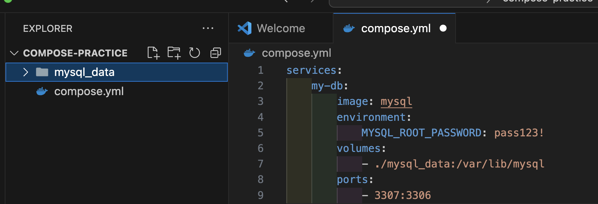

6. compose로 실행된 컨테이너 삭제

    ```shell
    docker compose down
    ```

#### 🍀 docker compose로 백엔드(spring boot) 실행하기

1. 프로젝트 세팅
   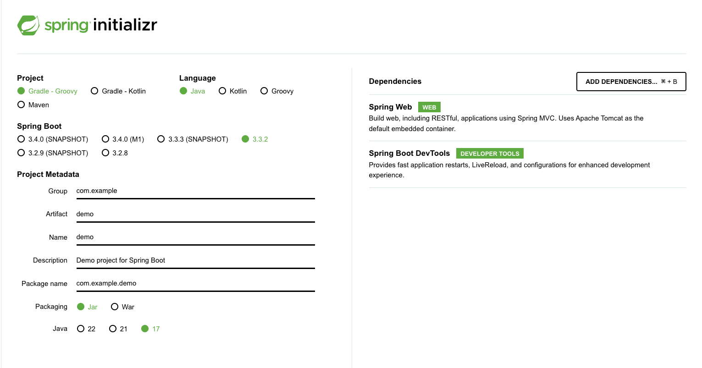

2. DockerFile 작성

    ```yml
    FROM openjdk:17-jdk
    COPY build/libs/\*SNAPSHOT.jar /app.jar
    ENTRYPOINT ["java", "-jar", "/app.jar"]
    ```

3. Spring Boot 프로젝트 빌드하기

    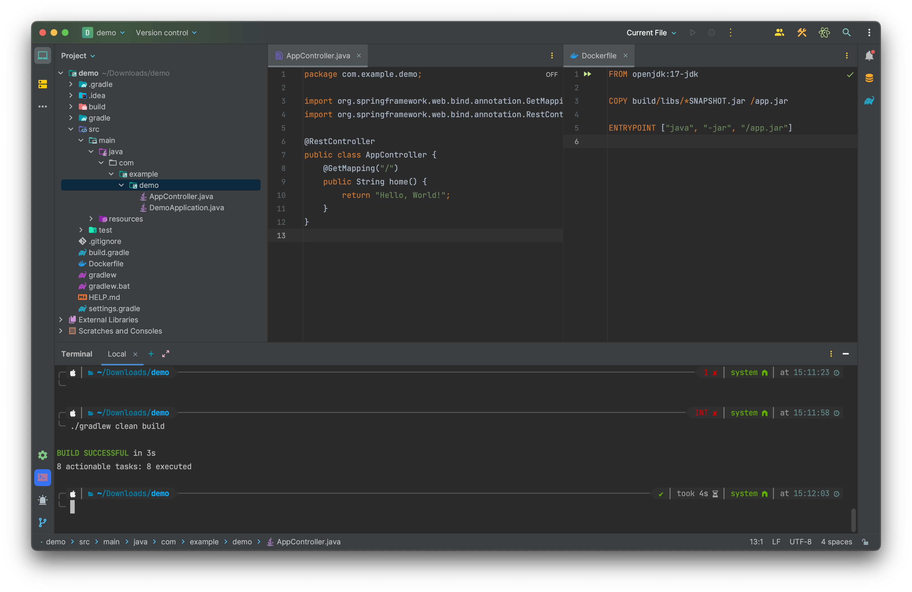

4. compose.yml 파일 작성하기

    - `build: .` : `compose.yml`이 존재하는 디렉토리(`.`)에 있는 `Dockerfile`로 이미지를 생성해 컨테이너를 띄우겠다는 의미이다.

    ```yml
    services:
        my-server:
            build: .
            ports:
                - 8081:8080
    ```

5. compose 파일 실행시키기

    - `--build`: Dockerfile 이미지를 매번 새롭게 로드할 것이다.

    ```shell
    $ docker compose up -d --build
    ```

6. compose 실행 현황 보기

    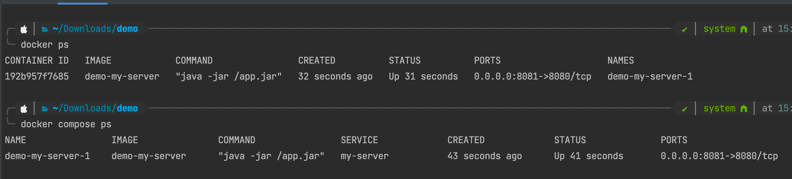

7. localhost:8081으로 들어가보기

    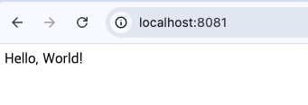

## 📌 Docker Compose를 활용해 2개 이상의 컨테이너 관리하기

> Spring Boot, MySQL 컨테이너 동시에 띄워보기

1. Spring Boot 프로젝트 셋팅

    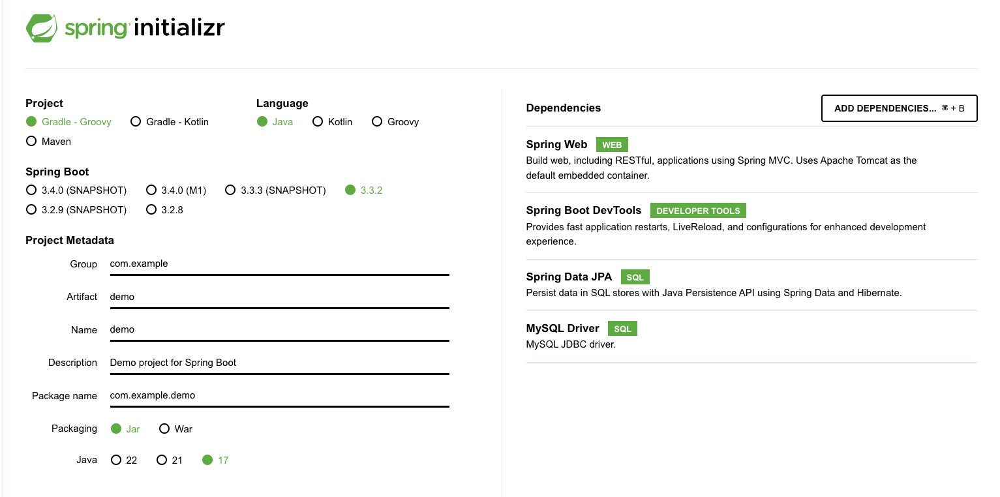

2. AppController

    ```java
    @RestController
    public class AppController {
        @GetMapping("/")
        public String home() {
            return "Hello, World!";
        }
    }
    ```

3. application.yml에 DB 연결을 위한 정보 작성하기

    ```bash

     spring:
     datasource:
         url: jdbc:mysql://localhost:3306/mydb
         username: root
         password: pwd1234
         driver-class-name: com.mysql.cj.jdbc.Driver
    ```

4. 테스트코드는 삭제한다.

5. Dockerfile 작성하기

    ```shell
    FROM openjdk:17-jdk

    COPY build/libs/*SNAPSHOT.jar /app.jar

    ENTRYPOINT ["java", "-jar", "/app.jar"]
    ```

6. compose.yml 파일 작성하기

    ```yml
    services:
        my-server:
            build: .
            ports:
                - 8080:8080
            # my-db의 컨테이너가 생성되고 healthy 하다고 판단 될 때, 해당 컨테이너를 생성한다.
            depends_on:
                my-db:
                    condition: service_healthy
        my-db:
            image: mysql
            environment:
                MYSQL_ROOT_PASSWORD: pwd1234
                MYSQL_DATABASE: mydb # MySQL 최초 실행 시 mydb라는 데이터베이스를 생성해준다.
            volumes:
                - ./mysql_data:/var/lib/mysql
            ports:
                - 3306:3306
            healthcheck:
                test: ["CMD", "mysqladmin", "ping"] # MySQL이 healthy 한 지 판단할 수 있는 명령어
                interval: 5s # 5초 간격으로 체크
                retries: 10 # 10번까지 재시도
    ```

7. Spring 프로젝트 빌드

    ```bash
    $ ./gradlew clean build
    ```

8. compose.yml 파일 실행하기

    ```bash
    $ docker compose up -d **--build**
    ```

9. compose 실행 현황 보기

    ```bash
    $ docker compose ps
    $ docker ps
    $ docker logs [Container ID]
    ```

🚨 에러 발생
spring boot 컨테이너 로그를 열어보면 아래 사진과 같은 에러메시지가 떠있다. DB와 연결이 제대로 이루어지지 않았을 떄 발생하는 에러이다.
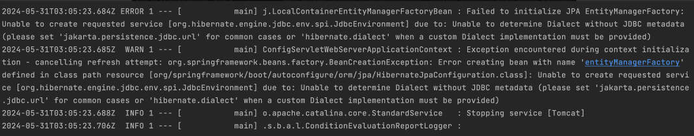

MySQL이 잘 작동하는지 확인하기 위해 DB GUI툴을 통해 연결했는데, 정상적으로 연결이 된다.
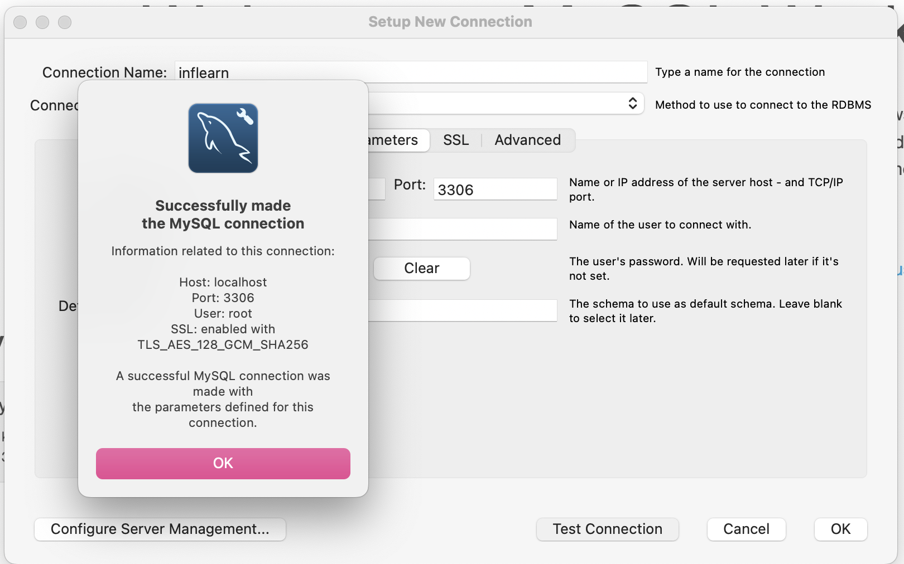
✔️ Spring Boot가 MySQL에 연결이 안되는 이유는?

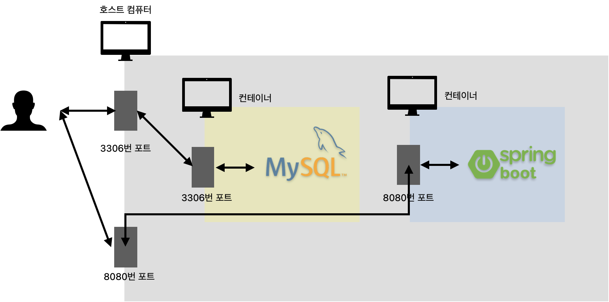

각각의 컨테이너는 자신만의 네트워크망과 IP 주소를 가지고 있다. 호스트 컴퓨터 입장에서 localhost는 호스트 컴퓨터를 가리키지만, Spring Boot 컨테이너 입장에서 localhost는 Spring Boot 컨테이너를 가리킨다.  
<br />
그런데 Spring Boot의 코드를 작성할 때 DB 정보를 아래와 같이 입력했었다. Spring Boot가 실행되는 환경인 컨테이너 입장에서 localhost:3306라는 주소는, Spring Boot 컨테이너 내부에 있는 3306번 포트와 연결을 시도하게 된다. 하지만 Spring Boot가 실행되는 컨테이너 내부의 3306번 포트에는 아무것도 실행되고 있지 않다. 이러한 구조상의 문제 때문에 Spring Boot가 MySQL에 연결이 안 되고 있었던 것이다.

Spring Boot의 컨테이너에서 다른 컨테이너에 존재하는 MySQL에 연결하는 방법 -> compose.yml에서 정의한 Service 이름으로 서로 통신할 수 있다!

우리가 이전에 작성했던 compose.yml을 보면 각 컨테이너에 service 이름(my-server, mysql)을 작성했었다. 이 서비스의 이름이 컨테이너의 주소를 뜻하게 된다. 해당 컨테이너의 IP주소와 같은 역할을 한다.

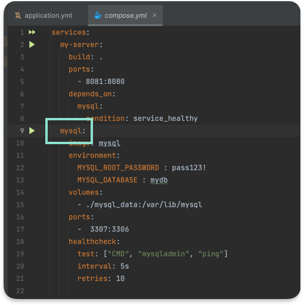

Spring Boot의 DB 정보(application.yml)에 작성된 localhost를 mysql로 수정하고 다시 실행하면 된다.

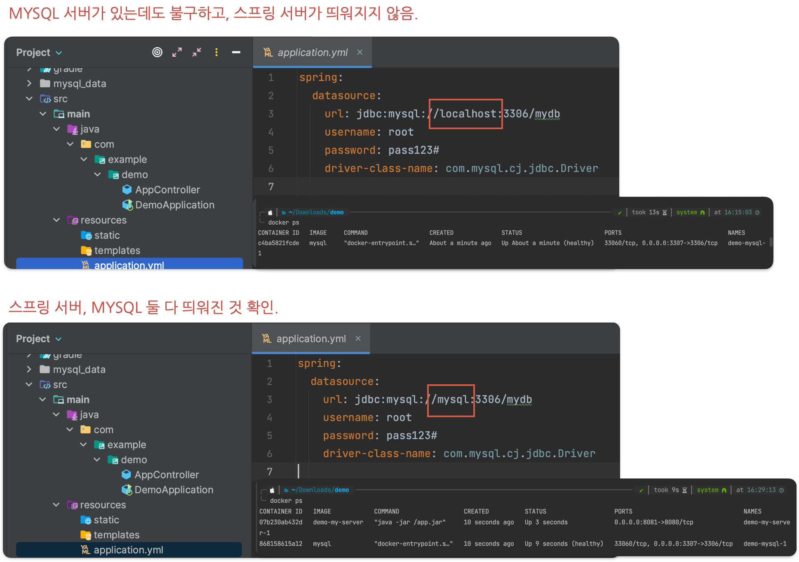

<br />
<br />

> Spring Boot, MySQL, Redis 컨테이너 동시에 띄워보기

```

```
