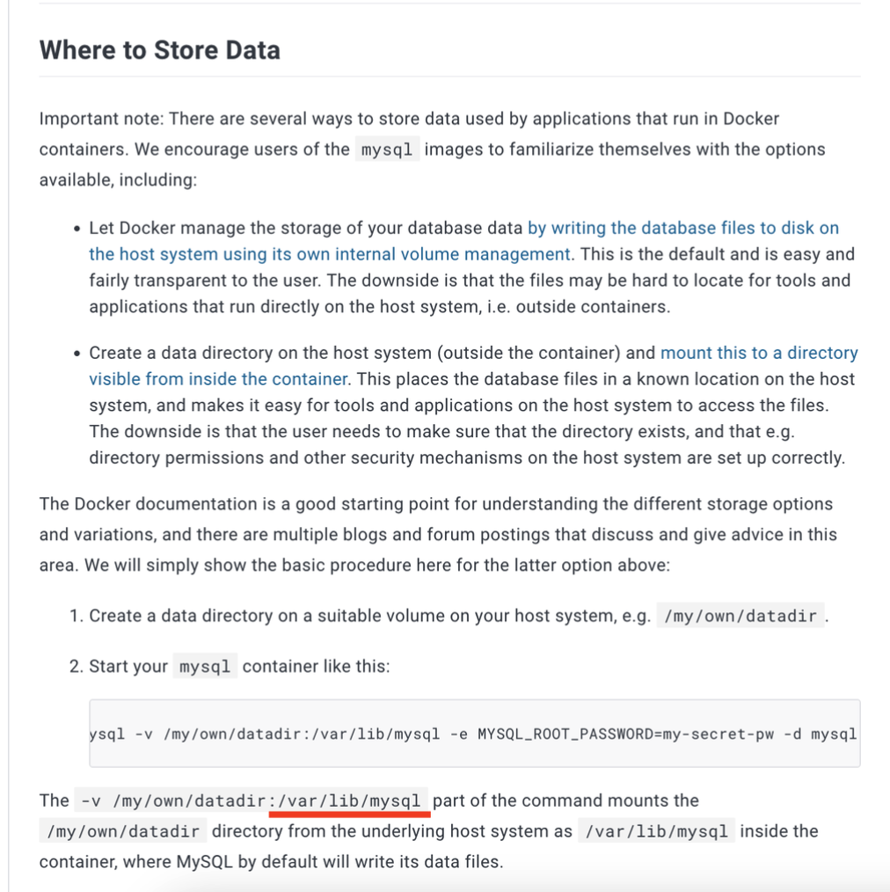

# Docker로 배포하기

> Docker로 배포하기

<!-- more -->

npm run dev  
npm run build

## 📎 로컬 환경에서 Docker 컨테이너를 빌드하고 실행하는 과정

### 1. Dockerfile 작성

-   FROM 부분은 이미지의 기본을 설정하고, EXPOSE 부분은 컨테이너의 네트워크 포트 설정과 관련된 정보를 제공한다.

    ```docker
    FROM node:21
    WORKDIR /usr/src/app
    COPY package*.json ./
    RUN npm install
    COPY ./dist ./
    COPY ./.env ./
    COPY ./src/prisma/schema.prisma ./

    EXPOSE 5050
    RUN npx prisma generate --schema=schema.prisma
    CMD [ "node", "app.js" ]
    ```

-   Node.js 버전 21이 설치된 베이스 이미지를 사용하여 컨테이너 생성

    ```docker
    FROM node:21
    ```

-   작업 디렉토리 설정 : Docker내에서 애플리케이션 작업할 공간 위치 설정

    -   해당 디렉토리는 이후 RUN, CMD, ENTRYPOINT, COPY, ADD 지시문의 기준 경로가 된다.

    ```docker
    WORKDIR /usr/src/app
    ```

-   Step 1 package.json과 package-lock.json 파일 도커 컨테이너로 복사

    -   npm install을 통해 필요한 패키지를 한 번에 설치할 수 있다.

    ```docker
    COPY package*.json ./
    RUN npm install

    ```

-   필요한 파일(빌드된 소스코드, 환경변수, Prisma 스키마 파일)을 도커 컨테이너로 복사

    ```docker
    COPY ./dist ./
    COPY ./.env ./
    COPY ./src/prisma/schema.prisma ./
    ```

-   컨테이너가 실행될 때 외부로 노출될 포트 지정

    ```docker
    EXPOSE 5050
    ```

-   Prisma 클라이언트 생성

    -   Prisma ORM을 사용하는 경우 Prisma 스키마 파일을 바탕으로 데이터베이스 접근에 필요한 클라이언트 코드 생성한다.

    ```docker
    RUN npx prisma generate --schema=schema.prisma
    ```

-   애플리케이션 실행: node app.js

    ```docker
    CMD [ "node", "app.js" ]

    ```

    <br>

### 2. Docker 이미지 빌드

```bash
docker build . --tag {도커이미지 명}
```

-   {도커이미지 명} 이름의 Docker 이미지를 생성한다.

<br>

### 3. Docker 컨테이너 실행

```bash
docker run -p 5050:5050 {도커이미지 명}
```

-   로컬의 5050 포트를 컨테이너의 5050 포트에 바인딩한다.
-   {도커이미지 명} 이미지를 기반으로 하는 컨테이너를 실행한다.

<br>
<br>

## 📎 AWS EC2에 Docker 컨테이너를 배포하는 과정

-   Prisma는 AWS RDS와의 연결을 통해 데이터베이스 스키마와 데이터를 관리하고 있다. AWS EC2를 통해 Docker 컨테이너를 배포할 것이다.

### 1. AWS EC2에서 Docker 설치

-   Docker 공식문서에 따라서 진행한다.  
    https://docs.docker.com/engine/install/ubuntu/#install-using-the-repository

#### Step1. Install using the apt repository

EC2 인스턴스에서 Docker를 설치하기 전에, Docker의 공식 GPG 키를 추가하고, Docker 저장소를 시스템의 APT 소스 목록에 추가한다.

```bash
# Add Docker's official GPG key:
sudo apt-get update
sudo apt-get install ca-certificates curl
sudo install -m 0755 -d /etc/apt/keyrings
sudo curl -fsSL https://download.docker.com/linux/ubuntu/gpg -o /etc/apt/keyrings/docker.asc
sudo chmod a+r /etc/apt/keyrings/docker.asc

# Add the repository to Apt sources:
echo \
  "deb [arch=$(dpkg --print-architecture) signed-by=/etc/apt/keyrings/docker.asc] https://download.docker.com/linux/ubuntu \
  $(. /etc/os-release && echo "$VERSION_CODENAME") stable" | \
  sudo tee /etc/apt/sources.list.d/docker.list > /dev/null
sudo apt-get update
```

#### Step2. Install the Docker packages.

위의 저장소가 설정되면, Docker CE, Docker CE CLI, containerd.io, Docker Buildx 플러그인 및 Docker Compose 플러그인을 설치한다.

```bash
 sudo apt-get install docker-ce docker-ce-cli containerd.io docker-buildx-plugin docker-compose-plugin

```

<br>

### 2. SSH를 통한 EC2 인스턴스 접속

```bash
ssh -i ~/Downloads/{pem키 이름.pem} ubuntu@{퍼블릭 IP 주소}
```

<br>

### 3. Docker 이미지 빌드 및 푸시

⭐️ Apple MAC M1 에서 linux/amd64로 docker 빌드하기

-   MAC m1 OS는 기본적으로 arm기반 아키텍처이기 때문에 m1 노트북으로 도커파일을 빌드하여 도커이미지를 생성하면 platform이 linux/arm64으로 생성됩니다. 하지만 일반적으로 amazonlinux OS를 사용하는 AWS EC2는 linux/arm64가 아닌 linux/amd64 이기 때문에 M1에서 빌드한 이미지를 EC2 에서 사용하려면 아래와 빌드 단계에서 --platform 옵션을 사용해 호환성을 보장해야한다.
-   Docker Hub에 로그인하고, 이미지를 빌드한 후 Docker Hub에 푸시한다.

```bash
docker login
docker build . --platform linux/amd64 --tag cherryjubilee/ballang:0.1
docker push cherryjubilee/ballang:0.1
```

⭐️ 도커 이미지 생성된 것 확인 (로컬(테스트용) 배포용 이미지, 배포용 이미지)


⭐️ health-check 결과 200 응답!


<br>
<br>
<br>
<br>
<br>
<br>
<br>
<br>
