# AWS Lightsail

> AWS lightsail로 mysql 인스턴스 생성 및 연결

<!-- more -->

-   SSH 키 파일의 권한을 400으로 설정하여 소유자만 읽을 수 있도록 한다. 보안 강화를 위해 필요

```bash
chmod 400 ~/LightsailDefaultKey-ap-northeast-2.pem
```

-   ssh키를 사용해 Lightsail 인스턴스에 연결

```bash
ssh -i ~/LightsailDefaultKey-ap-northeast-2.pem ubuntu@3.34.255.183
```

-   명령어 패키지 목록 업데이트, MySQL 서버 설치, MySQL 클라이언트 설치

```bash
sudo apt update
sudo apt install mysql-server
sudo apt install mysql-client
```

-   MySQL 서버의 상태 확인

```bash
sudo systemctl status mysql
```

-   기본적으로 host 이름을 private ip로 사용한다.

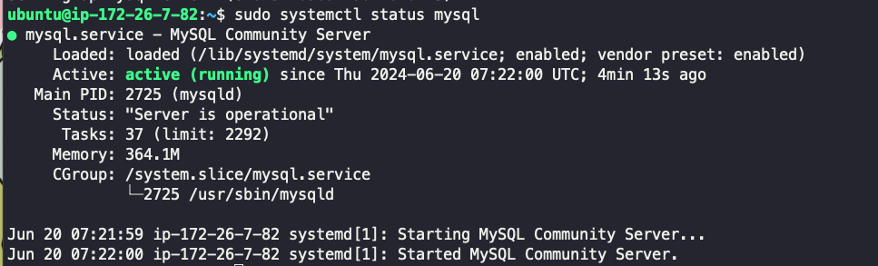

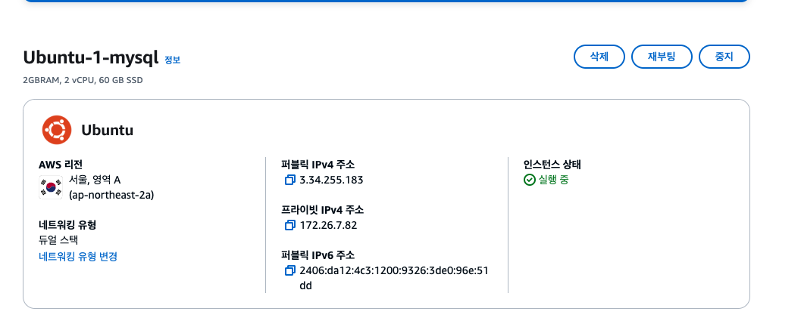

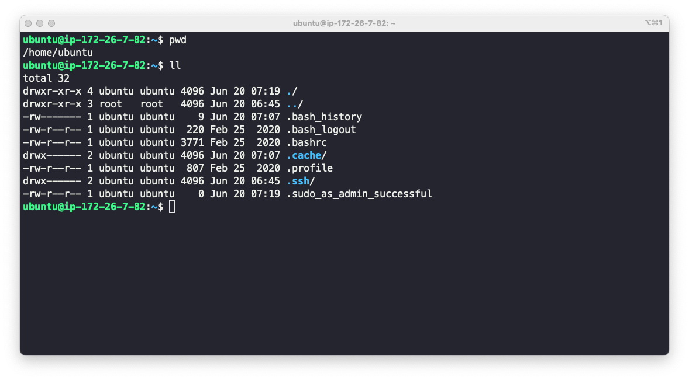

## 📌 secure 관련 설정

-   MySQL 보안 설정 진행. 설치 과정 중 root 비밀번호를 아직 설정하지 않았으므로 모두 다 Y 누름.

```bash
sudo mysql_secure_installation
```

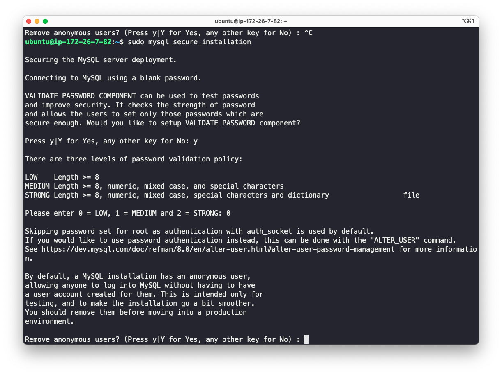

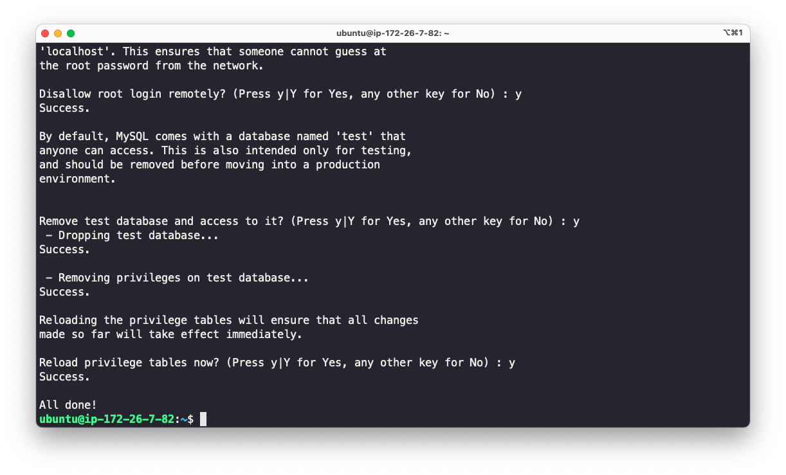

<hr>

-   유저를 루트로 하겠다 + 비번을 입력 하겠다.
-   root 사용자로 MySQL에 접속

```bash
sudo mysql -u root -p

```

-   비밀번호 검증설정 확인

```bash
SHOW VARIABLES LIKE 'validate_password%';
```

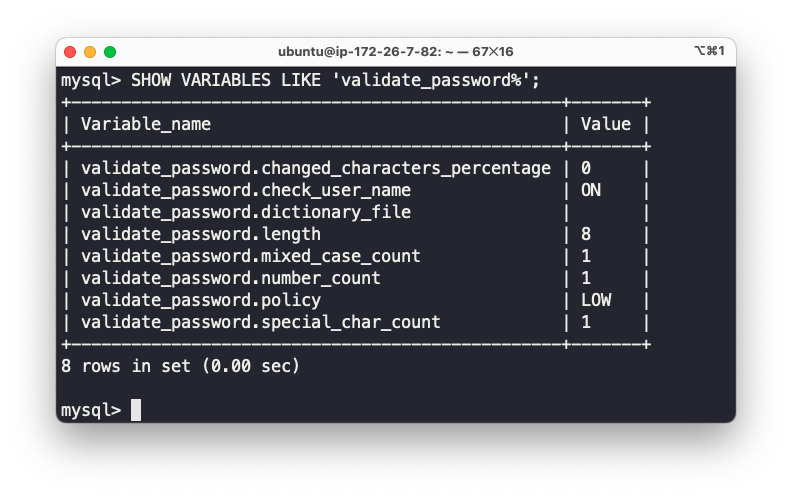

-   root 사용자의 비밀번호를 `pass123#`으로 변경, 권한 변경사항을 즉시 적용

```bash
ALTER USER 'root'@'localhost' IDENTIFIED BY 'pass123#';
FLUSH PRIVILEGES;   // 즉시 실행

```

-   다시 루트계정으로 로그인 해보자

```bash
sudo mysql -u root -p

```

-   보통 루트 계정으로 로그인 하지않는다. db에 접근하는 새로운 계정(kosta) 만들자.
-   kosta 사용자 만들고, 해당 사용자에게 모든 권한 부여
-

```bash
CREATE USER 'kosta'@'%' IDENTIFIED BY 'pass123#';
GRANT ALL PRIVILEGES ON *.* TO 'kosta'@'%' WITH GRANT OPTION;
FLUSH PRIVILEGES;
```

-   kosta 계정으로 로그인

```bash
sudo mysql -u kosta -p

```

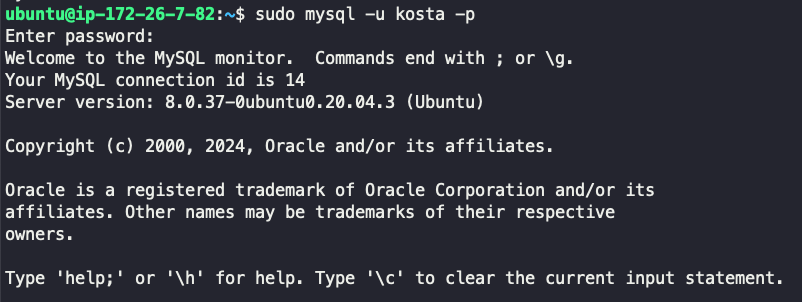

## 📌 어디서든 접근 가능하도록 네트워크 설정

1. IPv4 방화벽 규칙 추가
    - 애플리케이션 : MySQL 선택
2. IP 주소로 제한
    - 어디서든 접근 가능한 ip 주소 추가 : 0.0.0.0/0

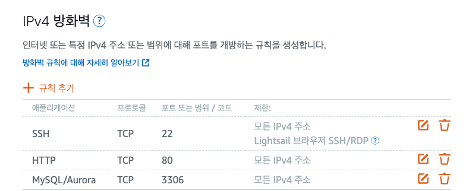

-   MySQL 설정 파일을 확인

```bash
ubuntu@ip-172-26-7-82:~$ sudo cat /etc/mysql/mysql.conf.d/mysqld.cnf
#
# The MySQL database client configuration file
#
# Ref to https://dev.mysql.com/doc/refman/en/mysql-command-options.html

[mysql]
```

-   MySQL 설정 파일을 열어 bind-address를 0.0.0.0으로 변경

```bash
sudo vim /etc/mysql/mysql.conf.d/mysqld.cnf
```

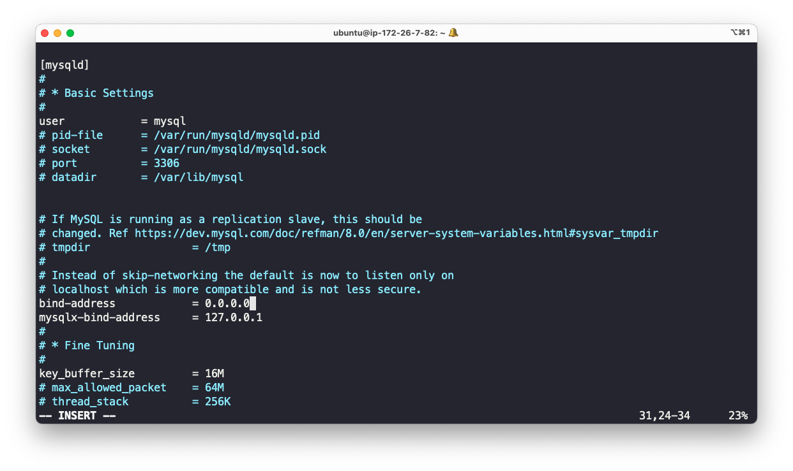

-   MySQL 서버를 재시작하여 변경 사항을 적용

```bash
sudo systemctl restart mysql
```

-   'kosta' 사용자로 원격 MySQL 서버에 접속

```bash
mysql -h 3.34.255.183 -u kosta -p


```

-   데이터베이스 목록 확인

```bash
show databases

```

### MySQl workbench

-   . AWS Lightsail에서 만든 MySQL 인스턴스와 MySQL Workbench를 사용하여 연결 완료

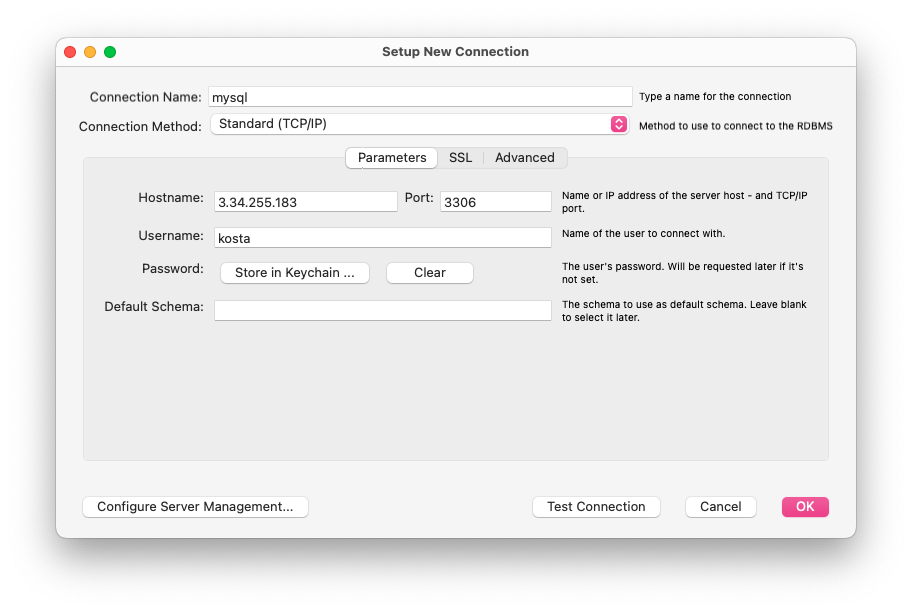
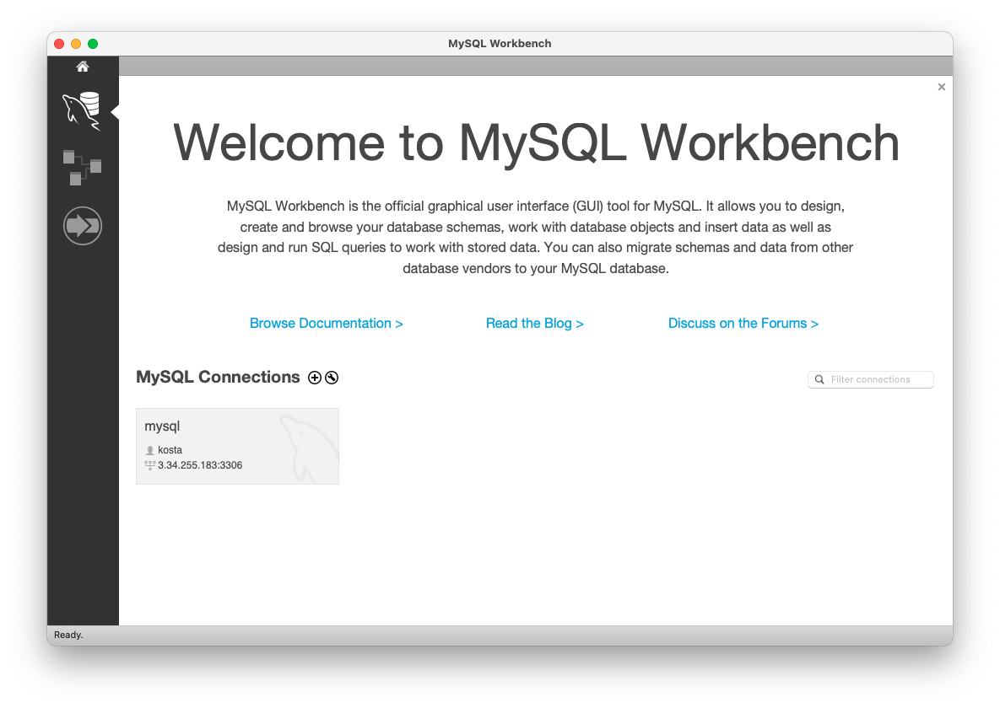

## 📌 (0715) MySQL world DB 다운로드

```bash
ssh -i ~/LightsailDefaultKey-ap-northeast-2.pem ubuntu@3.34.255.183
 wget https://downloads.mysql.com/docs/world-db.zip
```


```bash
unzip world-db.zip
cd world-db
```

### mysql 접속

-   비밀번호 까지 치면 접속 완료

    ```bash
    mysql -u kosta -p
    ```

-   world 데이터베이스 추가 확인

    ```mysql
    show databases;
    source /home/ubuntu/world-db/world.sql
    ```

    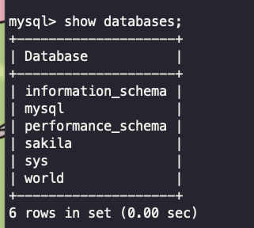
