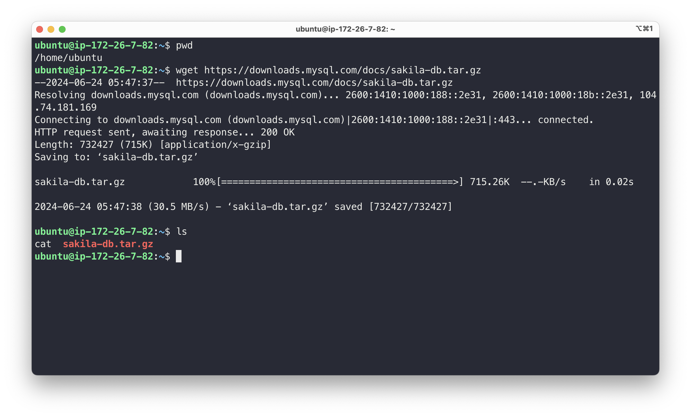
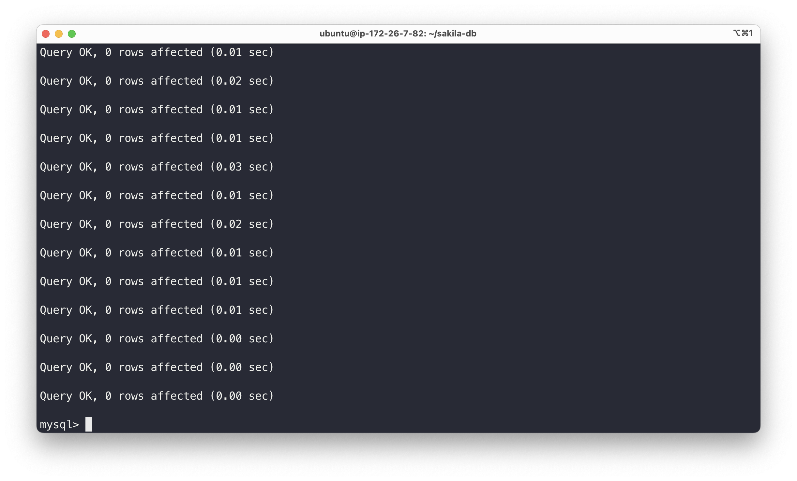
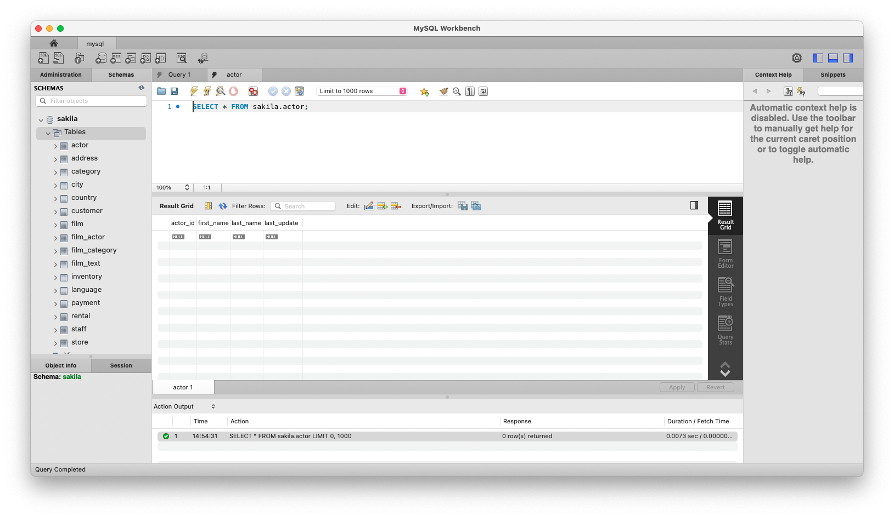
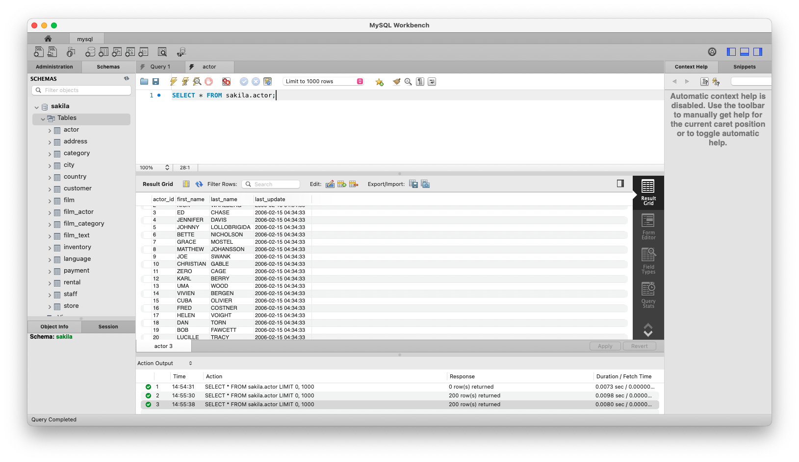

# 데이터베이스 기본

> MySQL 샘플 데이터베이스 Sakila 설치

<!-- more -->

## 📌 데이터 => 데이터베이스

1. 데이터 집합, 데이터의 저장 형태
2. 데이터의 모음을 데이터베이스라고 함
    - 논리적으로 연관된 데이터를 모아 일정한 형태로 저장해 놓은 것
    - 여러 시스템 or 여러 사용자가 데이터를 동시 공유, 사용
3. 데이터베이스
    - 여러 사람이 공유할 목적으로 통합 관리하기 위해 논리적으로
      연결된 데이터를 모아 일정한 형태로 저장해 놓은 것

## 📌 데이터베이스 필요성

1.  데이터 중복을 최소화해서 조직의 목적에 맞게 효율적으로 관리
    -   Integrated Data
2.  매체에 저장된 데이터
    -   Stored Data
3.  업무(비즈니스) 수행하는 데 필요한 데이터
    -   Operational Data
4.  공동으로 소유하고 유지하는 데이터
    -   Shared Data

## 📌 데이터베이스 특징

1.  사용자 질의에 실시간 처리해 응답
2.  CRUD(삽입, 조회, 수정, 삭제)을 통해 항상 최신 데이터를 동적으로 유지
3.  여러 사용자가 동시에 같은 데이터를 공유
4.  데이터를 참조할 때 레코드의 주소나 위치가 아닌
    사용자가 요구하는 데이터 내용으로 참조

## 📌 DB는 DBMS(Database Management System)로 관리

1. 입력, 수정, 삭제, 조회 등 다양한 기능 제공하는 시스템 소프트웨어
    - 사용자 <--------> 응용프로그램 <-------> DBMS <----> DB
2. DB
    - 데이터를 담는 통
      DBMS
    - DB를 관리하는 소프트웨어

## 📌 DB의 장단점

|            장점             |         단점          |
| :-------------------------: | :-------------------: |
|     데이터 중복 최소화      |    전문 인력 필요     |
|        저장공간 절약        | 시스템 운영 비용 부담 |
|      데이터 공유 가능       |  데이터 백업 및 복구  |
| 일관성, 무관성, 보안성 유지 |    시스템의 복잡함    |
|     데이터 표준화 필요      |                       |

## 📌 관계형 데이터베이스

1.  실무에서 가장 많이 사용하는 데이터베이스 종류
2.  구조(구성요소)

    > 열(row)

    -   고유한 이름을 가짐, 자신만의 타입을 가짐
    -   field, attribute 라고도 함

    > 행(column)

    -   관계된 데이터의 묶음
    -   한 테이블의 모든 행은 같은 수의 열을 가지고 있음
    -   tuple, record

    > 테이블(table)

    -   행과 열 값들의 모음을 나타내는 것

<br>

## ✅ MySQL 샘플 데이터베이스 Sakila 설치

### 1. Sakila 데이터베이스 다운로드

    ```bash
    wget https://downloads.mysql.com/docs/sakila-db.tar.gz
    ```



### 2. 압축 해제

-   다운로드한 파일을 tar 명령어를 사용하여 압축을 해재합니다.

    ```bash
    tar -xvf sakila-db.tar.gz
    ```

### 3. MySQL 접속

-   root 사용자로 접속한다.

    ```bash
    sudo mysql -u root -p
    ```

### 4. Sakila 스키마 파일 실행

-   MySQL에 접속한 후, Sakila 스키마 파일을 실행하여 데이터베이스 구조를 생성한다.

    ```sql
    mysql> SOURCE sakila-schema.sql;

    ```





### 5. Sakila 데이터 파일 실행

-   Sakila 데이터 파일을 실행하여 데이터베이스에 데이터를 추가한다.

    ```sql
    mysql> SOURCE sakila-data.sql;

    ```



## 📌 ERD(Entity Relationship Diagram)

1. 테이블 간의 관계를 표현한 그림
2. 논리 모델과 물리 모델
    - 논리 모델은 데이터 모델의 첫 단계
        - 고객의 요구사항 수집, 분석해서 전페 모양 구성
    - 물리 모델은 논리 모델을 바탕으로 실제 저장할 수 있는 모델을 표현한 것이다.
