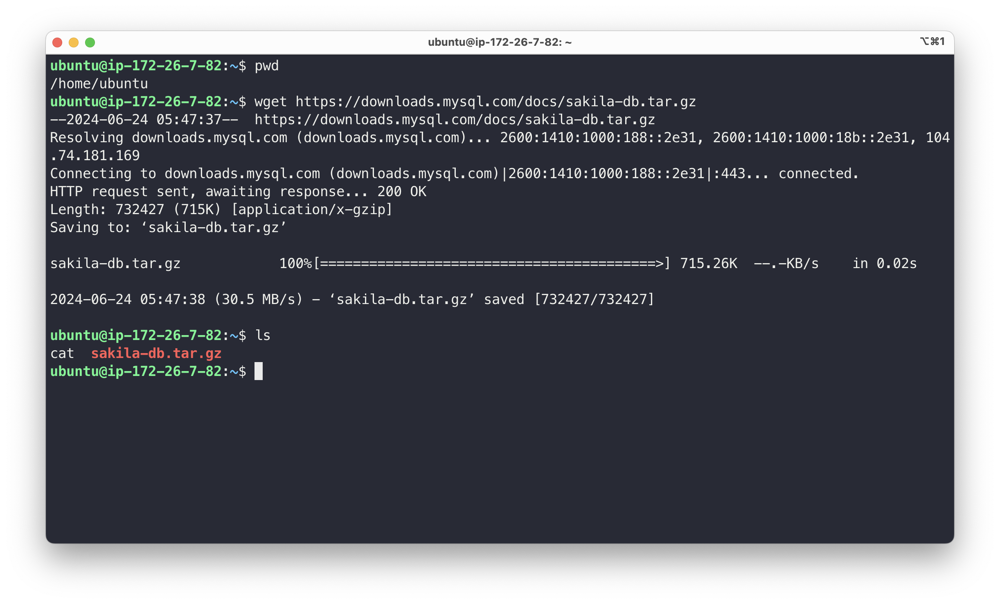
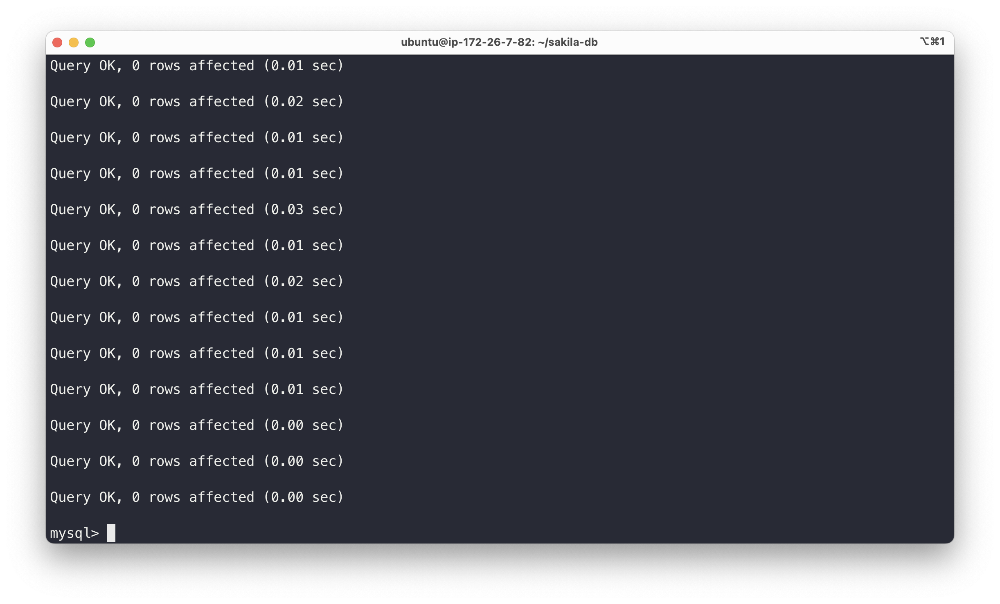
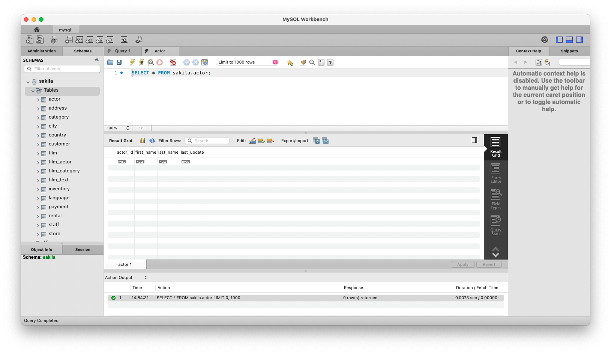

# 데이터베이스 기본

> MySQL 샘플 데이터베이스 Sakila 설치

<!-- more -->

## 📌 DB의 장단점

|            장점             |         단점          |
| :-------------------------: | :-------------------: |
|     데이터 중복 최소화      |    전문 인력 필요     |
|        저장공간 절약        | 시스템 운영 비용 부담 |
|      데이터 공유 가능       |  데이터 백업 및 복구  |
| 일관성, 무관성, 보안성 유지 |    시스템의 복잡함    |
|     데이터 표준화 필요      |                       |

## 📌 관계형 데이터베이스

1.  실무에서 가장 많이 사용하는 데이터베이스 종류
2.  구조(구성요소)

    > 열(row)

    -   고유한 이름을 가짐, 자신만의 타입을 가짐
    -   field, attribute 라고도 함

    > 행(column)

    -   관계된 데이터의 묶음
    -   한 테이블의 모든 행은 같은 수의 열을 가지고 있음
    -   tuple, record

    > 테이블(table)

    -   행과 열 값들의 모음을 나타내는 것

<br>

## ✅ MySQL 샘플 데이터베이스 Sakila 설치

### 1. Sakila 데이터베이스 다운로드

    ```bash
    wget https://downloads.mysql.com/docs/sakila-db.tar.gz
    ```



### 2. 압축 해제

-   다운로드한 파일을 tar 명령어를 사용하여 압축을 해재합니다.

    ```bash
    tar -xvf sakila-db.tar.gz
    ```

### 3. MySQL 접속

-   root 사용자로 접속한다.

    ```bash
    sudo mysql -u root -p
    ```

### 4. Sakila 스키마 파일 실행

-   MySQL에 접속한 후, Sakila 스키마 파일을 실행하여 데이터베이스 구조를 생성한다.

    ```sql
    mysql> SOURCE sakila-schema.sql;

    ```





### 5. Sakila 데이터 파일 실행

-   Sakila 데이터 파일을 실행하여 데이터베이스에 데이터를 추가한다.

    ```sql
    mysql> SOURCE sakila-data.sql;

    ```


