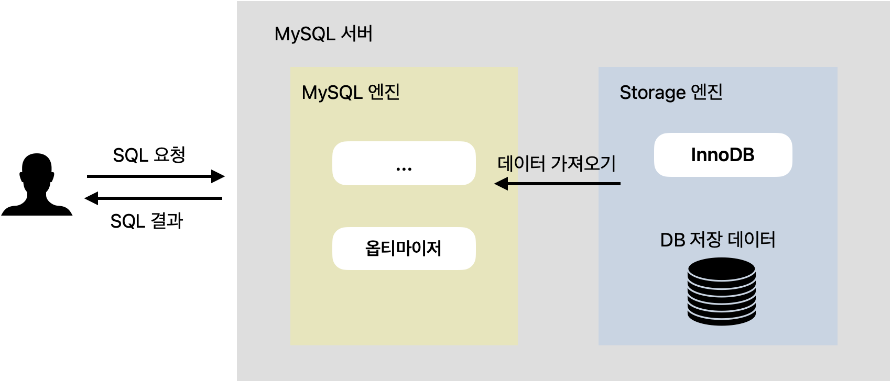
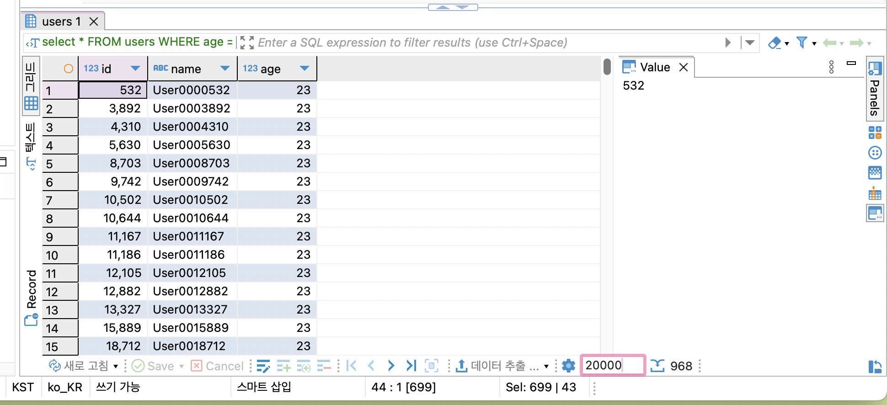
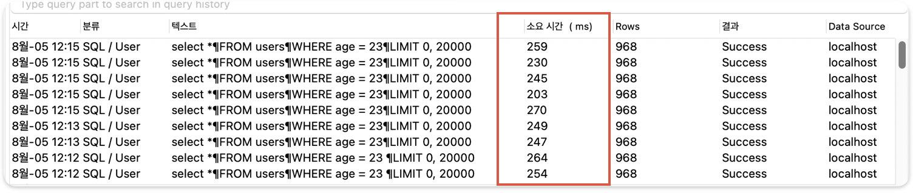
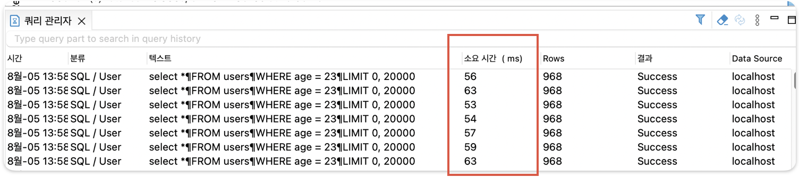
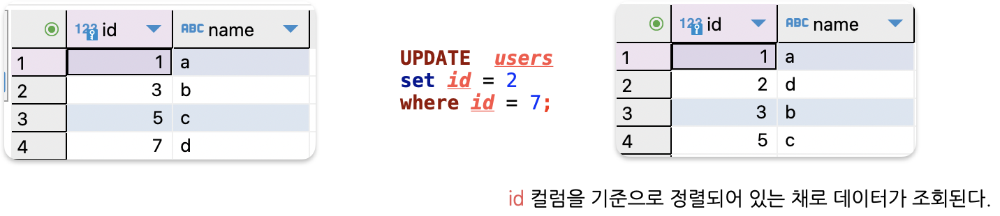
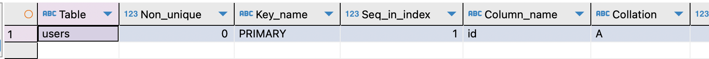
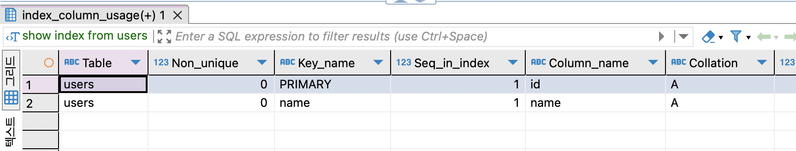
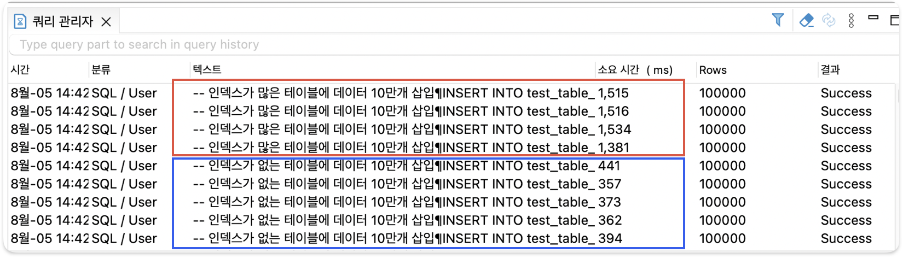
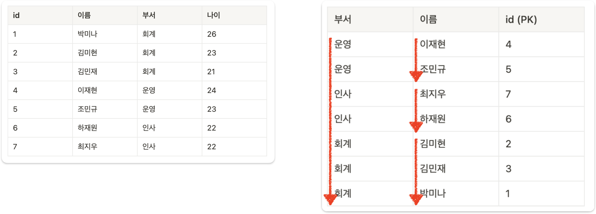

# MySQL 성능 최적화

> 신입으로서 기초 개념인(인덱스, 실행 계획) 등 DB성능 개선 경험에 대한 공부

<!-- more -->

## 신입이 가져야 할 DB 최적화 경험

DB 느려지는 요인

1. 동시 사용자 수의 증가
2. 데이터 양의 증가
3. 비효율적인 SQL문 작성

### DB 성능 개선 방법

1. SQL 튜닝
2. 캐싱 서버 활용 (Redis 등)
3. 샤딩
4. 레플리케이션(Master / slave 구조)
5. 스케일 업 (CPU, Memory, SSD등 하드웨어 업그레이드)

이러한 여러가지 성능 개선 방법이 있는데, SQL 튜닝을 먼저 고려하는 이유는 `기존의 시스템 변경 없이 성능을 개선할 수 있기 때문이다.` 또한 근본적인 문제를 해결하는 방법이 SQL 튜닝일 가능성이 높고 SQL 자체가 비효율적으로 작성됐다면 아무리 시스템적으로 성능을 개선한다고 하더라도 한계가 있다.

## MySQL 구조

> MySQL 아키텍처



SQL문 실행되는 과정은 다음과 같다.

1. 클라이언트가 DB에 SQL 요청을 보낸다.
2. MySQL 엔진에서 `옵티마이저`가 SQL문을 분석한 뒤 빠르고 효율적으로 데이터를 가져올 수 있는 계획을 세운다. 어떤 순서로 테이블에 접근할 지, 인덱스를 사용할 지, 어떤 인덱스를 사용할 지 등을 결정한다.(옵티마이저가 세운 계획은 완벽하지 않다. 따라서 SQL 튜닝이 필요하다.)
3. 옵티마이저가 세운 계획을 바탕으로 스토리지 엔진에서 데이터를 가져온다. (DB 성능에 문제가 생기는 대부분의 원인은 스토리지 엔진으로부터 데이터를 가져올 때 발생한다. 데이터를 찾기가 어려워서 오래 걸리거나, 가져올 데이터가 너무 많아서 오래 걸린다. SQL 튜닝의 핵심은 스토리지 엔진으로부터 되도록이면 데이터를 찾기 쉽게 바꾸고, 적은 데이터를 가져오도록 바꾸는 것을 말한다.)
4. MySQL 엔진에서 정렬, 필터링 등의 마지막 처리를 한 뒤에 클라이언트에게 SQL 결과를 응답한다.

### 🎯 SQL 튜닝 핵심 2가지

1. 스토리지 엔진에서 데이터를 찾기 쉽게 바꾸기.
2. 스토리지 엔진으로부터 가져오는 데이터의 양 줄이기

## 인덱스란?

데이터를 빨리 찾기 위해 특정 컬럼을 기준으로 미리 정렬해둔 표

만약 23살인 사용자를 추출해야할 때 왼쪽과 같이 나이 순으로 정렬된 표가 있다면 어떨까?  
23살인 사용자를 뽑아내려면 `23살로 시작하는 지점 + 24살로 시작되는 지점`만 찾고, 그 사이에 있는 모든 값을 가지고 오면 된다.  
정렬을 했기 때문에 모든 데이터를 일일이 다 확인할 필요가 없어서, 효율적으로 데이터를 조회할 수 있다.

-   인덱스 : 나이 컬럼을 기준으로 정렬 된 표


1. 테이블 생성하기

    ```sql
    Create database inflearndb;
    USE inflearndb;

    DROP TABLE IF EXISTS users;
    CREATE TABLE users (
        id INT AUTO_INCREMENT PRIMARY KEY,
        name VARCHAR(100),
        age INT
    );
    ```

2. 100만 건의 랜덤 데이터 삽입

    ```sql
    -- 높은 재귀(반복) 횟수를 허용하도록 설정
    -- (아래에서 생성할 더미 데이터의 개수와 맞춰서 작성하면 된다.)
    SET SESSION cte_max_recursion_depth = 1000000;

    -- 더미 데이터 삽입 쿼리
    INSERT INTO users (name, age)
    WITH RECURSIVE cte (n) AS
    (
    SELECT 1
    UNION ALL
    SELECT n + 1 FROM cte WHERE n < 1000000 -- 생성하고 싶은 더미 데이터의 개수
    )
    SELECT
        CONCAT('User', LPAD(n, 7, '0')),   -- 'User' 다음에 7자리 숫자로 구성된 이름 생성
        FLOOR(1 + RAND() * 1000) AS age    -- 1부터 1000 사이의 랜덤 값으로 나이 생성
    FROM cte;
    ```

3. 데이터 조회해보기

    ```sql
    -- 잘 생성됐는 지 확인
    select *
    FROM users
    WHERE age = 23;
    ```

    > 데이터 개수가 제한돼서 조회되기 때문에, limit수를 조절하자

    

4. SQL문 실행 시 걸리는 소요 시간 측정하기

    - 데이터를 조회할 떄 걸리는 소요시간이 대략 260ms가 걸린다.

    

5. 인덱스 설정하기

    > 인덱스 생성

    ```sql
    # CREATE INDEX 인덱스명 ON 테이블명 (컬럼명);
    CREATE INDEX idx_age ON users(age);
    ```

    > 인덱스 조회

    ```sql
    # SHOW INDEX FROM 테이블명;
    SHOW INDEX FROM users;
    ```

6. 데이터 다시 조회해보고 SQL문 실행 소요 시간 측정해보기

    

    - 인덱스를 적용 전과 후의 성능 차이가 260ms가 → 50ms로 5배 정도 차이가 난다.

### PK

> PK를 기본으로 인덱스가 설정 된다.

-   id 컬럼을 기준으로 정렬되어 있는 채로 데이터가 조회된다. 왜냐하면 PK가 인덱스의 일종이기 때문이다.
-   이렇게 원본 데이터 자체가 정렬되는 인덱스를 보고 클러스터링 인덱스라고 부른다.
-   PK(Primary Key) = 클러스터링 인덱스라고 생각해도 된다. 클러스터링 인덱스는 PK(Primary Key) 밖에 없기 때문이다.

> 정리

1. PK에는 인덱스가 기본적으로 적용된다.
2. PK에는 인덱스가 적용되어 있으므로 PK를 기준으로 데이터가 정렬된다.

    

> 인덱스 조회

```sql
 show index from users;
```



### UNIQUE

```sql
DROP TABLE IF EXISTS users; # 기존 테이블 삭제

CREATE TABLE users (
    id INT AUTO_INCREMENT PRIMARY KEY,
    name VARCHAR(100) UNIQUE
);
```

> 인덱스 조회

```sql
 show index from users;
```

-   UNIQUE 특징으로 인해 생성되는 인덱스를 보고 고유 인덱스(Unique Index)라고 부른다.
-   UNIQUE 옵션을 사용하면 인덱스가 같이 생성되어 `조회성능`이 향상된다.
    -   이유: 인덱스는 특정 컬럼을 기분으로 미리 정렬을 시켜놓은 표기 때문에 이 표를 보고 빠르게 찾을수 있다.



## Index를 많이 걸면 어떻게 될까?

1. 테이블 생성하기

````sql
-- 테이블 A: 인덱스가 없는 테이블
CREATE TABLE test_table_no_index (
    id INT AUTO_INCREMENT PRIMARY KEY,
    column1 INT,
    column2 INT,
    column3 INT,
    column4 INT,
    column5 INT,
    column6 INT,
    column7 INT,
    column8 INT,
    column9 INT,
    column10 INT
);

-- 테이블 B: 인덱스가 많은 테이블
CREATE TABLE test_table_many_indexes (
    id INT AUTO_INCREMENT PRIMARY KEY,
    column1 INT,
    column2 INT,
    column3 INT,
    column4 INT,
    column5 INT,
    column6 INT,
    column7 INT,
    column8 INT,
    column9 INT,
    column10 INT
);
```​


2. 인덱스 추가
```sql
-- 각 컬럼에 인덱스를 추가
CREATE INDEX idx_column1 ON test_table_many_indexes (column1);
CREATE INDEX idx_column2 ON test_table_many_indexes (column2);
CREATE INDEX idx_column3 ON test_table_many_indexes (column3);
CREATE INDEX idx_column4 ON test_table_many_indexes (column4);
CREATE INDEX idx_column5 ON test_table_many_indexes (column5);
CREATE INDEX idx_column6 ON test_table_many_indexes (column6);
CREATE INDEX idx_column7 ON test_table_many_indexes (column7);
CREATE INDEX idx_column8 ON test_table_many_indexes (column8);
CREATE INDEX idx_column9 ON test_table_many_indexes (column9);
CREATE INDEX idx_column10 ON test_table_many_indexes (column10);
​
````

3. 데이터 삽입 성능 테스트

```sql
-- 높은 재귀(반복) 횟수를 허용하도록 설정
-- (아래에서 생성할 더미 데이터의 개수와 맞춰서 작성하면 된다.)
SET SESSION cte_max_recursion_depth = 100000;

-- 인덱스가 없는 테이블에 데이터 10만개 삽입
INSERT INTO test_table_no_index (column1, column2, column3, column4, column5, column6, column7, column8, column9, column10)
WITH RECURSIVE cte AS (
    SELECT 1 AS n
    UNION ALL
    SELECT n + 1 FROM cte WHERE n < 100000
)
SELECT
    FLOOR(RAND() * 1000),
    FLOOR(RAND() * 1000),
    FLOOR(RAND() * 1000),
    FLOOR(RAND() * 1000),
    FLOOR(RAND() * 1000),
    FLOOR(RAND() * 1000),
    FLOOR(RAND() * 1000),
    FLOOR(RAND() * 1000),
    FLOOR(RAND() * 1000),
    FLOOR(RAND() * 1000)
FROM cte;

-- 인덱스가 많은 테이블에 데이터 10만개 삽입
INSERT INTO test_table_many_indexes (column1, column2, column3, column4, column5, column6, column7, column8, column9, column10)
WITH RECURSIVE cte AS (
    SELECT 1 AS n
    UNION ALL
    SELECT n + 1 FROM cte WHERE n < 100000
)
SELECT
    FLOOR(RAND() * 1000),
    FLOOR(RAND() * 1000),
    FLOOR(RAND() * 1000),
    FLOOR(RAND() * 1000),
    FLOOR(RAND() * 1000),
    FLOOR(RAND() * 1000),
    FLOOR(RAND() * 1000),
    FLOOR(RAND() * 1000),
    FLOOR(RAND() * 1000),
    FLOOR(RAND() * 1000)
FROM cte;

```



인덱스를 생성하지 않은 테이블에 10만개 데이터 삽입 시 걸리는 속도 : `380ms`  
인덱스를 많이 생성한 테이블에 10만개 데이터 삽입 시 걸리는 속도 : `1500ms`  
<br>

인덱스가 추가된 상태라면 원래 테이블과 인덱스용 테이블 둘 다에 데이터를 넣어야 하는 경우 더 느릴 수 밖에 없다. 인덱스의 개수가 많아지면 많아 질수록 성능은 느려질 수 밖에 없다. 데이터 삽입, 수정, 삭제 작업에서 같은 이유로 성능이 느려진다. 인덱스가 무조건 많다고 좋은것이 아니다.

> ⭐️ 결론

최소한의 인덱스만 사용해야 한다.
인덱스를 추가하면 조회 속도는 빨라지나, 쓰기(수정, 삭제 , 삽입) 속도는 느려진다.

## 멀티 컬럼 인덱스

-   Mulitple-Column Index
-   2개 이상의 컬럼을 묶어서 설정하는 인덱스
-   데이터를 빨리 찾기 위해 2개 이사으이 컬럼을 기준으로 미리 정렬해둔 표

> 멀티 컬럼 인덱스 예시

-   users 테이블이 있다고 가정한다.
-   부서와 이름 컬럼을 활용해 멀티 컬럼 인덱스를 만들면 다음과 같은 표가 시스템 내부에 생성된다.
-   부서를 기준으로 오름차순, 같은 부서의 값을 가진 데이터들 사이에서 이름을 기준으로 오름차순 정렬한다.

    

### 멀티 컬럼 인덱스 생성시 주의점

```sql
SELECT * FROM users
WHERE 부서 = '운영';
```

위 SQL문을 봤을 때 부서 컬럼으로 인덱스를 생성할 경우 성능이 향상되리라 짐작할 수 있다. 하지만 부서, 이름 순으로 구성된 멀티 컬럼 인덱스를 이미 만들어 뒀기 때문에, 부서 컬럼의 인덱스를 따로 또 만들 필요는 없다.

✅ 멀티 컬럼 인덱스를 일반 인덱스처럼 활용하지 못하는 경우도 있다.

정렬을 자세히 잘 살펴보면 이름 기준으로 정렬이 되어 있지는 않다. 왜냐면 같은 부서를 가진 데이터끼리만 정렬을 시켰기 때문이다. 실제로 아래 SQL문을 실행시킬 때 인덱스를 활용하지 못한다.

```sql
SELECT * FROM users
WHERE 이름 = '이재현';
```

따라서 멀티 컬럼 인덱스에서 일반 인덱스처럼 활용할 수 있는 건 처음에 배치된 컬럼들뿐이다.

✅ 대분류 → 중분류 → 소분류’ 컬럼순으로 구성하기  
멀티 컬럼 인덱스를 만들 때는 순서에 주의해야 한다. 왜냐하면 순서를 어떻게 정해서 인덱스를 만드느냐에 따라서 성능 차이가 나기 때문이다.

먼저 직관적으로 이해해보자. 10층짜리 회사에서 `박미나`를 찾아야 한다고 가정하자. `박미나`가 속한 `부서`를 먼저 찾은 뒤에 그 `부서`에서 `박미나`를 찾는게 편할까? 아니면 `박미나`를 찾은 다음에 `박미나`한테 `부서`를 물어보는 게 빠를까?

일반적으로 `부서`를 먼저 찾은 뒤에 `박미나`를 찾는게 훨씬 빠를 것이다. 이를 일반화해서 표현하자면 `대분류를 먼저 탐색한 뒤, 소분류를 탐색하는 게 빠르다.`라고 할 수 있다. 컴퓨터도 이 특성이 동일하게 적용된다.

멀티 컬럼 인덱스에서도 배치한 컬럼의 순서대로 데이터를 탐색한다. `(부서, 이름)`의 순서대로 멀티 컬럼 인덱스를 구성했다면 먼저 일치하는 `부서`를 찾은 뒤, 일치하는 `부서`에서 `이름`을 찾는 식으로 처리한다.

따라서 멀티 컬럼 인덱스를 구성할 때는 데이터 중복도가 높은 컬럼이 앞쪽으로 오는 게 좋은 경우가 많다. 데이터 중복도가 높은 컬럼일수록 큼지막하게 분류가 되어 있다는 뜻이기도 하다.
(항상 그런 건 아니니 실행 계획과 SQL문 실행 속도를 측정해서 판단하도록 하자.)

> ⭐️ 정리

-   멀티 컬럼 인덱스 컬럼의 순서는 매우 중요하다.
-   멀티 컬럼 인덱스에서 처음에 배치된 컬럼들은 일반 인덱스처럼 활용할 수 있다.
-   멀티 컬럼 인덱스를 구성할 때 데이터 중복도가 높은 컬럼이 앞쪽으로 오는 게 좋다.
