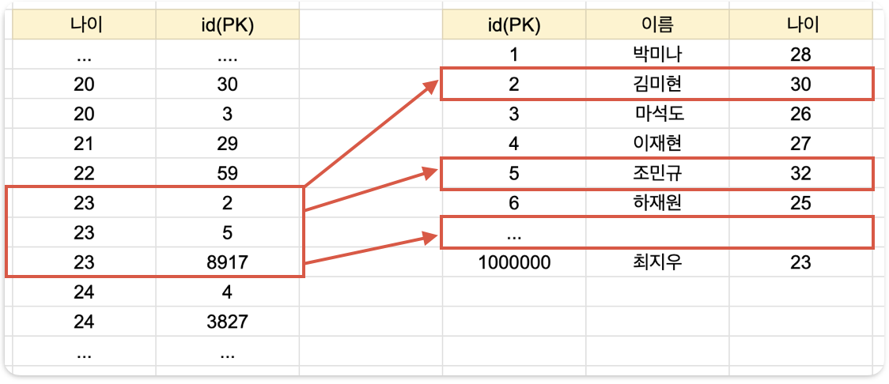

# MySQL 성능 최적화

> MySQL 성능 최적화

<!-- more -->

## 인덱스란?

데이터를 빨리 찾기 위해 특정 컬럼을 기준으로 미리 정렬해둔 표

만약 23살인 사용자를 추출해야할 때 왼쪽과 같이 나이 순으로 정렬된 표가 있다면 어떨까?  
23살인 사용자를 뽑아내려면 `23살로 시작하는 지점 + 24살로 시작되는 지점`만 찾고, 그 사이에 있는 모든 값을 가지고 오면 된다.  
정렬을 했기 때문에 모든 데이터를 일일이 다 확인할 필요가 없어서, 효율적으로 데이터를 조회할 수 있다.

-   인덱스 : 나이컬럼을 기준으로 정렬 된 표

## Index를 많이 걸면 어떻게 될까?

인덱스가 추가된 상태라면 원래 테이블과 인덱스용 테이블 둘 다에 데이터를 넣어야 하는 경우 더 느릴 수 밖에 없다. 인덱스의 개수가 많아지면 많아 질수록 성능은 느려질 수 밖에 없다. 데이터 삽입, 수정, 삭제 작업에서 같은 이유로 성능이 느려진다. 인덱스가 무조건 많다고 좋은것이 아니다.

> 결론

최소한의 인덱스만 사용해야 한다.  
인덱스를 추가하면 조회 속도는 빨라지나, 쓰기(수정, 삭제 , 삽입) 속도는 느려진다.
