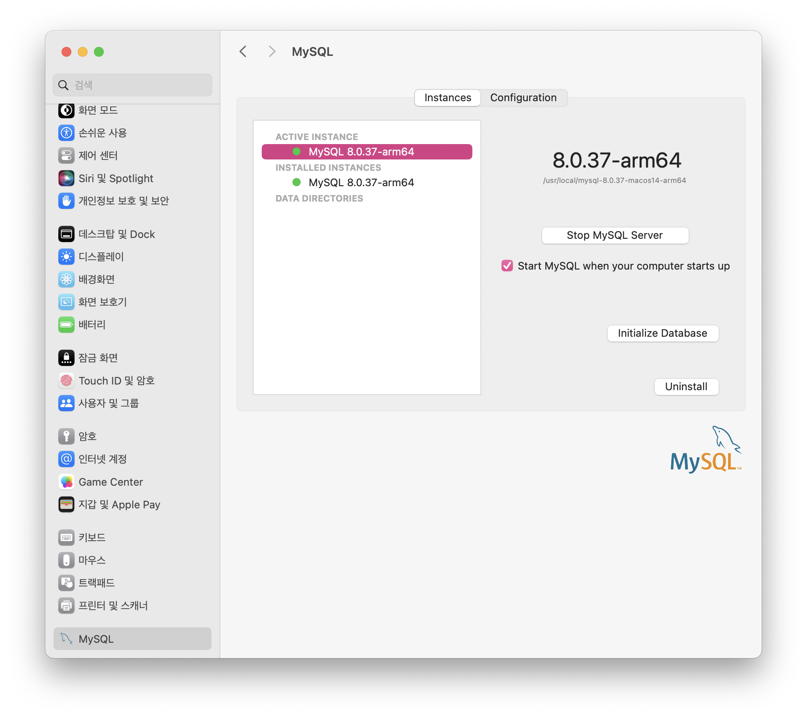

# [MySQL&Mac M1] MySQL Community Server download

> [MySQL&Mac M1] MySQL Community Server download

<!-- more -->

## MySQL Community Downloads ?

-   MySQL 서버 소프트웨어를 다운로드하고 설치하는 곳
-   `MySQL 서버`를 설치하여 로컬에서 데이터베이스를 실제로 호스팅하고 관리할 것이다.
-   현재 MySQL Workbench는 설치 된 상태이다.
    -   MySQL 서버에 연결하여 데이터베이스를 관리, 설계, 개발할 수 있는 도구
    -   데이터베이스를 시각적으로 설계하고, 쿼리를 실행하고, 데이터를 관리하는 등의 기능을 제공
    -   MySQL 서버가 설치되어 있고 실행 중이어야만 제대로 작동함
-   즉, MySQL Community Downloads를 통해 MySQL 서버를 설치한 후 MySQL Workbench를 사용하여 데이터베이스 작업을 수행할 수 있습니다. 따라서 MySQL 서버를 설치해야 한다.

## 다운로드 링크

`https://dev.mysql.com/downloads/mysql/`



## MySQL 서버 시작/종료

> 시스템 환경설정 => MySQL -> Stop&Start Button


## 터미널로 MySQL 서버 시작/종료

```bash
sudo /usr/local/mysql/support-files/mysql.server start
sudo /usr/local/mysql/support-files/mysql.server stop
```

## Workbench 연결 확인

> 로컬로 연결


> 왼쪽 aws lightsail과 ip가 다른것 확인 가능


## sakila, work 스키마 추가

> 샘플 데이터베이스 다운로드

`https://dev.mysql.com/doc/index-other.html`

> 압축해제

```bash
tar -xvzf world-db.tar.gz
tar -xvzf sakila-db.tar.gz
```

## mysql 접속

```bash
mysql -u root -p
```

> 샘플 데이터베이스 로드하기


```bash
SOURCE ~/Downloads/world-db/world.sql;
SOURCE ~/Downloads/sakila-db/sakila-schema.sql;
SOURCE ~/Downloads/sakila-db/sakila-data.sql;
```

## 데이터베이스 사용하기

```bash
use world;
SELECT * FROM city WHERE CountryCode = 'ARG';
```


