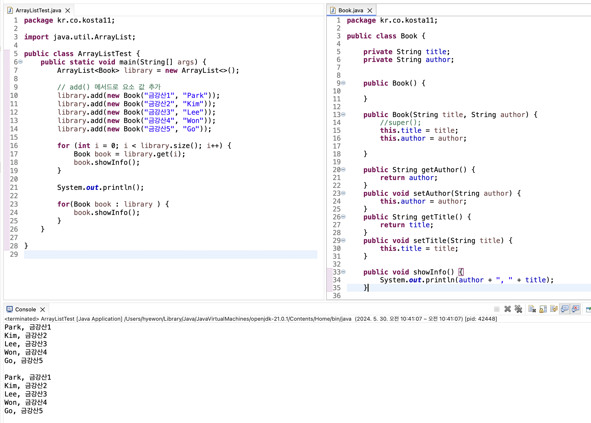
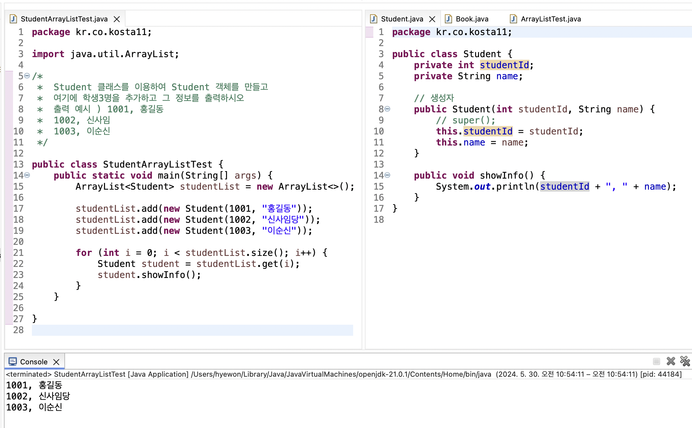

# Java 배열

> Java에서 배열이란?

<!-- more -->

1.  참조 자료형

    1. 배열(Array)
    2. 클래스(Class), 인터페이스(Interface)

2.  배열

    1. 동일한 자료형을 묶어 저장하는 자료형
    2. 생성할 때 크기를 지정해야 함
    3. 한 번 크기를 지정하면 절대 변경할 수 없는 특징이 있음

3.  배열 생성

    1.  배열 선언하기

        -   자료형[] 변수명
        -   자료형 변수명[]

        -   예) int[] a;

    2.  힙 메모리에 배열의 객체 생성하기

        -   new 자료형[배열의 길이]
        -   배열을 생성할 때 배열의 길이를 반드시 지정해야 함

        -   예) new int[3];
            new String[5];

    3.  배열 자료형 변수에 객체 대입하기

        -   자료형[] 변수명 = new 자료형[배열의 길이];
        -   자료형[] 변수명;
            변수명 = new 자료형[배열의 길이];

                  참조변수  힙 메모리에 할당
                     --   ---

        -   예) int[] a = new int[3];
            ***
            int 배열 자료형 int 자료형 3개를 저장할수 있는 공간

    4.  객체에 값 입력하기

        -   배열은 값을 저장할 수 있는 공간
        -   공간마다 공간 번호가 있는데, 이 번호를 인덱스(index)라고 함.
        -   인덱스는 0부터 시작하며, 1씩 증가함

        -   참조 변수명[인덱스] = 값;

    5.  배열 객체 값 읽어오기
        -   참조 변수명[인덱스]

4.  1차원 배열 객체 생성 및 값 대입

    1. 자료형[] 참조 변수명 = new 자료형[배열의 길이];
       참조 변수명[0] = 값;
       참조 변수명[1] = 값;  
       ....
       참조 변수명[배열의 길이-1] = 값;

    2. 자료형[] 참조 변수명 = new 자료형[] {값1, 값2,...,값};

    3. 대입할 값만 입력하기
        - new 키워드 없이 초기화할 값만 중괄호에 넣어 대입하는 경우
        - 자료형[] 참조 변수명 = {값, 값, ..., 값};

5.  힙 메모리에서의 default 값
    1. 초기화를 하지 않았을 때 JVM이 기본(default)값을 초기화 함
    2. default 값
        - 기본형(primitive) 기본값(default)
            - boolean false
            - 정수(byte,short/char,int,long) 0
            - 실수(float, double) 0.0
        - 참조형
            - 클래스, 배열,... null

## 💡 객체 배열 사용하기

1. 기본 자료형 배열은 배열 선언과 동시에 배열의 크기만큼의 메모리에 할당됨.
2. 객체 배열의 경우엔 요소가 되는 객체의 주소가 들어갈(4바이트, 8바이트) 메모리만 할당되고(null) 각 요소 객체는 생성하여 저장해야 함
    - 객체를 생성하여 각 배열의 요소로 저장하기

## 💡 객체 배열 복사하기 (참조형)

1. arraycopy(Object src, int srcPos, Object dest, int destPos, int length)
    - `src` : 복사할 배열 이름
    - `srcPos` : 복사할 배열의 첫 번째 위치
    - `dest` : 복사해서 붙여넣을 대상 배열 이름
    - `destPos` : 복사해서 대상 배열에 붙여 넣기를 시작할 첫 번째 위치
    - `length` : src에서 dest로 자료를 복사할 요소 개수

### 얕은 복사 (Shallow Copy)

-   arraycopy
-   객체 주소만 복사되어 한쪽 배열의 요소를 수정하면 같이 수정 됨
-   객체의 메모리 주소만을 복사하기 때문에, 복사된 배열과 원본 배열이 동일한 객체를 참조하게 된다. 한 배열에서 객체의 속성을 변경하면 다른 배열에도 영향을 미친다는 것을 의미한다.

```java
package kr.co.kosta10;

//  얕은 복사  -> arraycopy 사용
public class ObjectCopyTest2 {
    public static void main(String[] args) {

        Book[] bookArray1 = new Book[3];
        Book[] bookArray2 = new Book[3];

        bookArray1[0] = new Book("아차산1", "코스타");
        bookArray1[1] = new Book("아차산2", "코스타");
        bookArray1[2] = new Book("아차산3", "코스타");

        System.arraycopy(bookArray1, 0, bookArray2, 0, 3);

        for (int i = 0; i < bookArray2.length; i++)
            bookArray2[i].showInfo();

        System.out.println("=======bookArray1=========");
        bookArray1[0].setAuthor("hong");
        bookArray1[0].setTitle("석성산1");

        for (int i = 0; i < bookArray1.length; i++)
            bookArray1[i].showInfo();

        System.out.println("=======bookArray2=========");
        for (int i = 0; i < bookArray2.length; i++)
            bookArray2[i].showInfo();

    }

}

```

### 깊은 복사 (Deep Copy)

-   각각의 객체를 그 객체의 값을 복사해서 배열이 서로 다른 객체를 가리키도록 함
-   깊은 복사는 객체의 실제 내용을 새로운 메모리 위치에 복사하여, 복사된 객체와 원본 객체가 서로 독립적이 되도록 한다.
-   한 객체를 변경해도 다른 객체에는 영향을 미치지 않는다.

```java
package kr.co.kosta10;

public class ObjectCopyTest3 {
    public static void main(String[] args) {

        Book[] bookArray1 = new Book[3];
        Book[] bookArray2 = new Book[3];

        bookArray1[0] = new Book("아차산1", "코스타");
        bookArray1[1] = new Book("아차산2", "코스타");
        bookArray1[2] = new Book("아차산3", "코스타");

        // 기본 생성자로 bookArray2 배열 인스턴스 생성
        bookArray2[0] = new Book();
        bookArray2[1] = new Book();
        bookArray2[2] = new Book();

        // 깊은 복사 (bookArray1 -> bookArray2 배열 인스턴스로 복사)
        for(int i = 0; i < bookArray1.length ;i++) {

            bookArray2[i].setTitle(bookArray1[i].getTitle());
            bookArray2[i].setAuthor(bookArray1[i].getAuthor());
        }

        System.out.println("=======bookArray1=========");
        bookArray1[0].setAuthor("hong");
        bookArray1[0].setTitle("석성산1");

        for (int i = 0; i < bookArray1.length; i++)
            bookArray1[i].showInfo();

        System.out.println("=======bookArray2=========");
        for (int i = 0; i < bookArray2.length; i++)
            bookArray2[i].showInfo();

    }

}

```

## 💡 기존 배열 단점과 ArrayList 클래스

### 기존 배열 단점

1. `고정된 크기` : 기존 배열은 항상 배열 길이를 정하고 시작한다.
2. 배열을 사용하는 중에는 배열의 길이를 변경할 수 없다.
3. 객체 배열을 관리할 수 잇는 멤버 변수와 메서드를 제공하는 ArrayList

### ArrayList 장점

1. ⭐️ `동적 크기 조정`: ArrayList는 요소를 추가하거나 제거할 때 자동으로 크기를 조정합니다. 이는 데이터의 양에 따라 배열의 크기를 유연하게 관리할 수 있게 해줍니다.
2. `풍부한 내장 메서드` : 다음과 같다.

## 💡 ArrayList 클래스의 주요 메서드

1.  boolean add(E e)

    -   요소 하나를 배열에 추가함
    -   E는 요소의 자료형을 의미함

2.  int size()

    -   배열에 추가된 요소 전체 개수를 반환함

3.  E get (int index)

    -   배열의 index 위치에 있는 요소값 반환

4.  E remove(int index)

    -   배열의 index 위치에 있는 요소 값 제거하고 그 값을 반환함

5.  boolean isEmpty()
    -   배열이 비어있는지 확인

### 🍀 ArrayList 예시1

```java
package kr.co.kosta11;

import java.util.ArrayList;

public class ArrayListTest {
	public static void main(String[] args) {
		ArrayList<Book> library = new ArrayList<>();

		// add() 메서드로 요소 값 추가
		library.add(new Book("금강산1", "Park"));
		library.add(new Book("금강산2", "Kim"));
		library.add(new Book("금강산3", "Lee"));
		library.add(new Book("금강산4", "Won"));
		library.add(new Book("금강산5", "Go"));

		for (int i = 0; i < library.size(); i++) {
			Book book = library.get(i);
			book.showInfo();
		}

		System.out.println();

		for(Book book : library ) {
			book.showInfo();
		}
	}

}

```

```bash
Park, 금강산1
Kim, 금강산2
Lee, 금강산3
Won, 금강산4
Go, 금강산5

Park, 금강산1
Kim, 금강산2
Lee, 금강산3
Won, 금강산4
Go, 금강산5
```



### 🍀 ArrayList 예시2



### 🍀 ArrayList 예시3

```java
package kr.co.kosta12;

import java.util.ArrayList;

public class Student {
	int studentId;
	String name;
	ArrayList<Subject> subjectList;

	// 생성자
	public Student(int studentId, String name) {
		// super();
		this.studentId = studentId;
		this.name = name;
		subjectList = new ArrayList<>();
	}

	// 학생이 수강하는 과목을 arrayList 배열에 하나씩 추가하는 메서드
	public void addSubject(String subjectName, int score) {
		Subject subject = new Subject(); // 과목 생성
		subject.setSubjectName(subjectName);
		subject.setScorePoint(score);
		subjectList.add(subject);
	}

	public void showInfo() {
		int total = 0;
		for (Subject s : subjectList) {
			total += s.getScorePoint();
			System.out.println("학생 " +  name + "의 " + s.getSubjectName() + " 과목 성적은 " + s.getScorePoint() +"입니다." );

		}
		System.out.println(name +"의 총점은 " +total);
	}

}

```

```java
package kr.co.kosta12;

public class Subject {

	private String subjectName;
	private int scorePoint;

	public String getSubjectName() {
		return subjectName;
	}

	public void setSubjectName(String subjectName) {
		this.subjectName = subjectName;
	}

	public int getScorePoint() {
		return scorePoint;
	}

	public void setScorePoint(int scorePoint) {
		this.scorePoint = scorePoint;
	}
}

```

```java
package kr.co.kosta12;

public class StudentTest {
	public static void main(String[] args) {


		Student hong = new Student(11111, "Hong");
		hong.addSubject("국어",100);
		hong.addSubject("수학",90);

		Student sin = new Student(11111, "Sin");
		sin.addSubject("국어",95);
		sin.addSubject("수학",100);
		sin.addSubject("과학",85);

		hong.showInfo();
		System.out.println();
		sin.showInfo();

	}

}


```

```bash

학생 Hong의 국어 과목 성적은 100입니다.
학생 Hong의 수학 과목 성적은 90입니다.
Hong의 총점은 190

학생 Sin의 국어 과목 성적은 95입니다.
학생 Sin의 수학 과목 성적은 100입니다.
학생 Sin의 과학 과목 성적은 85입니다.
Sin의 총점은 280

```
