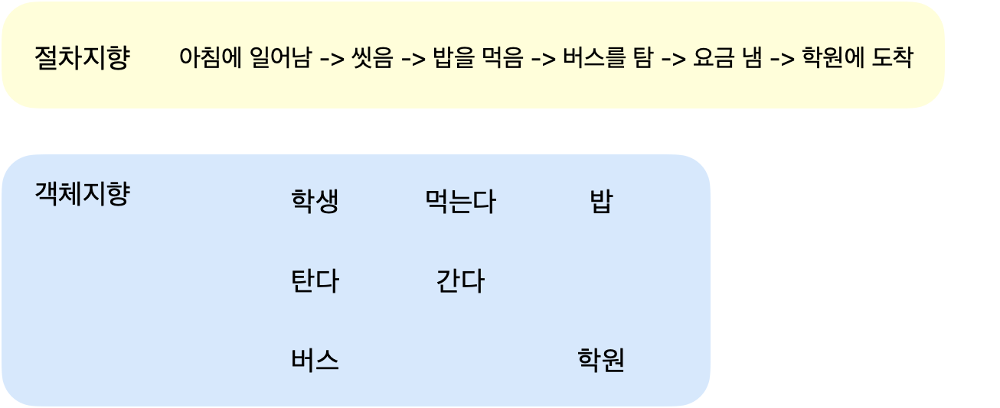

# 객체지향 프로그래밍과 클래스

> 객체지향 프로그래밍이랑 무엇이며 클래스에 대해 알아보자

<!-- more -->

## 🍎 객체란?

1. 객체(object): 사용할 수 있는 실페
2. 생활 속에서 객체

3. 절차지향과 객체지향

    

## 🍎 클래스

1.  클래스(class) : 객체를 만들기 위한 설계도

    > 수강생 객체

        - 이름: 박혜원
        - 사는 곳: 경기도
        - 키: 161cm

    > Trainee 클래스

        - traineeName
        - traineeAddress
        - traineeHeight

2.  클래스 문법

    -   (접근 제어자) class 클래스이름 {
        멤버 변수;
        메서드
        }

3.  클래스 이름

    -   코딩컨벤션(coding convension)
        -   클래스 이름 대문자로 시작

### 💫 멤버변수 vs 지역변수

-   멤버변수의 선언위치는 클래스 영역 이고, 지역변수의 선언 위치는 메소드나 생성자 내부이다.

## 🍎 패키지

1. 클래스 파일의 묶음
2. 패키지를 만들면 프로젝트 하위에 물리적으로 디렉터리가 생성됨
3. 계층 구조를 가짐

## 🍎 메서드

1.  함수(function)의 한 종류
2.  함수 : 하나의 기능을 수행하는 일련의 코드

    > 예

        - 두 수를 입력받아 더하는 경우
        - 가장 좋은 성적 2개를 더하는 경우 => 두 수를 더해서 결과값을 보여준다.
        - 두 거리를 더하는 경우

3.  함수의 입력과 반환

-   num1, num2  
    add함수  
    result = num1 + num2  
    result

## 🍎 메서드(함수) 호출과 (콜)스택 메모리

1. 스택

-   아래에서 위로 쌓이는 구조
-   스택은 마지막에 추가된 자료부터 순서대로 꺼내서 사용할 수 있음
-   LIFO(Last In First Out) 구조

2. 함수를 호출하면 그 함수만을 위한 메모리 공간이 할당됨

-   이 메모리 공간을 스택(stack) 이라고 부름

## 📌 함수의 장점

1. 기능을 나누어 코드를 효율적으로 구현할 수 있다.
2. main() 함수에 너무 긴 코드가 모두 들어 있었음
3. 하나의 함수에 하나의 기능 구현하기

```java

public class Student {

	// 멤버변수
	int studentId;
	String studentName;
	int grade;
	String address;

	// 학생 이름을 반환하는 메서드 -- 가져오는 (get)기능
	public String getStudentName() {
		return studentName;
	}

	// 학생이름을 매개변수로 전달 -- 값을 지정하는(set) 기
	public void setStudentName(String name) {
		studentName = name;
	}
}

```

<br>
<br>
<br>
