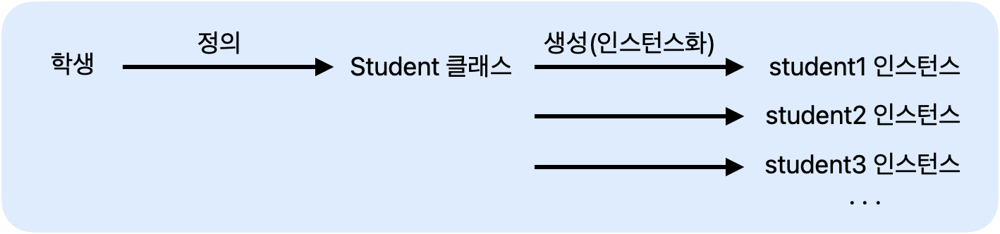

# 클래스와 인스턴스

> 클래스와 인스턴스에 대해서 알아보자

<!-- more -->

## 🍎 클래스 사용과 main()메서드

1.  프로그램을 시작하는 main()메서드
2.  new 예약어로 클래스 생성하기

    ```java
    클래스형 변수 = new 생성자;
    ```

    ```java
    public class StudentTest {

    public static void main(String[] args) {
        Student student1 = new Student();
        student1.setStudentName("박혜원");
        System.out.println(student1.getStudentName());

        Student student2 = new Student();
        student2.setStudentName("망곰");
        System.out.println(student2.getStudentName());
        }
    }
    ```

    위 코드를 그림으로 나타내면 아래와 같다

    

3.  참조변수 사용하기

    -   참조변수.멤버변수
    -   참조변수.메서드

4.  인스턴스와 힙(heap) 메모리

    > 힙(heap)

        - 프로그램에서 사용하는 동적 메모리 공간
        - 객체가 생성될 때 사용하는 공간
        - 힙은 동적으로 할당되며 끝나면 자동으로 가비지 콜랙터가 자동으로 메모리를 해제해 줌

## 용어 정리

1. `객체` : 객체 지향 프로그래밍의 대상, 생성된 인스턴스
2. `클래스` : 객체를 프로그래밍 하기 위해 코드로 만든 상태
3. `인스턴스` : 틀래스가 메모리에 생성된 상태
4. `멤버변수` : 클래스의 속성, 특성
5. `메서드` : 멤버 변수를 이용하여 클래스의 기능을 구현
6. `참조변수` : 메모리에 생성된 인스턴스를 가리키는 변수
7. `참조값` : 생성된 인스턴스의 메모리 주소 값

<hr>

## 🍎 자바 소스파일 구조

```java
    package ...;
    import ...;
    class명 {...}   // 외부 클래스

    public class A {
        // 필드
        // 메서드(기능)
        // 생성자
        // 이너 클래스

    }

```

<br>
<br>
<br>
