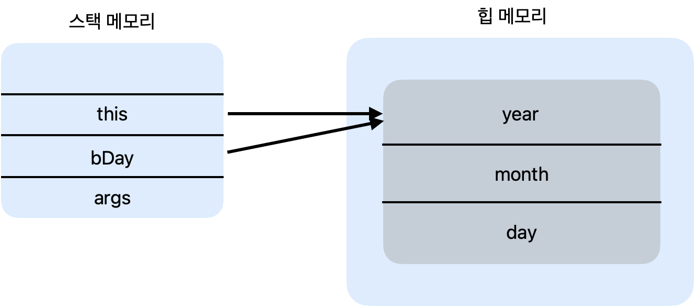
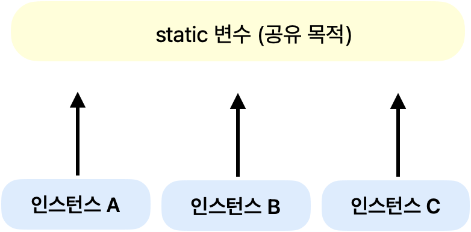

# this의 의미

> this에 대해서 알아보자

<!-- more -->

## 💡 this의 의미

1. 객체 자신을 가리킴
2. 인스턴스 자신의 메모리를 가리킴
3. this(): 생성자에서 또 다른 생성자를 호출 할 때 사용
4. 자신의 주소(참조값)을 반환 함

## 💡 객체지향 프로그래밍의 객체간의 협력(collaboration)

1. OOP에서 객체 간에는 협력이 이루어짐
2. 협력을 위해서는 메세지를 전송하고 이를 처리하는 기능이 구현되어야 함
3. 매개변수로 객체가 전달되는 경우가 발생

> 예
> ClassObjectToTest -> kr.co.kosta5;

## 💡 static 변수

1. 여러 인스턴스에서 공통으로 사용하는 변수
2. 필요한 경우
    - 여러 인스턴스가 공유하는 기준 값이 필요한 경우
    - 학생마다 새로운 학번 생성
    - 카드회사 카드를 새로 발급할 때 마다 새로운 카드번호 부여
    - 회사에 사원이 입사할 때 마다 새로운 사번이 필요한 경우
3. Method영역 (JVM 메모리)
   

## 💡 static 변수 선언과 사용하기

1. 인스턴스가 생성될 때 만들어지는 것이 아니고, 처음 프로그램이 메모리에 로딩될 때 메모리를 할당
2. 클래스 변수, 정적 변수 라고 함
3. 인스턴스 생성과 상관없이 사용 가능함으로 클래스 이름으로 직접 참조
4. public 으로 선언
5. static 변수, 메소드는 인스턴스 변수, 메서드가 아니므로 클래서 이름으로 직접 참조

## 💡 변수의 유효 범위와 메모리

|           변수 유형            |                선언위치                |                                사용 범위                                |   메모리    |                               생성과 소멸                                |
| :----------------------------: | :------------------------------------: | :---------------------------------------------------------------------: | :---------: | :----------------------------------------------------------------------: |
|      지역변수 (로컬변수)       |            함수 내부에 선언            |                          함수 내부에서만 사용                           |  스택 영역  |              함수가 호출될 때 생성   함수가 끝나면 소멸               |
| 멤버변수   (인스턴스 변수)  |        클래스 멤버 변수로 선언         | 클래스 내부에서 사용,   private가 아니라면 다른 클래스에서 사용 가능 |   힙 영역   |        객체가 생성 될 되고   garbage collector가 메모리를 수거        |
| static 변수   (클래스 변수) | 클래스 내부에서 static을 사용하여 선언 |   클래스 내부에서 사용,   private가 아니라면 다른 클래스에서 사용    | 메서드 영역 | 프로그램이 처음 시작할 때 생성   프로그램이 끝나고 메모리를 해제할 때 |

<table>
  <tr>
    <th style="background-color:#FFD700">변수 유형</th>
    <th style="background-color:#FFD700">선언위치</th>
    <th style="background-color:#FFD700">사용 범위</th>
    <th style="background-color:#FFD700">메모리</th>
    <th style="background-color:#FFD700">생성과 소멸</th>
  </tr>
  <tr>
    <td align="center">지역변수   (로컬변수)</td>
    <td align="center">함수 내부에 선언</td>
    <td align="center">함수 내부에서만 사용</td>
    <td align="center">스택 영역</td>
    <td align="center">함수가 호출될 때 생성   함수가 끝나면 소멸</td>
  </tr>
  <tr>
    <td align="center">멤버변수   (인스턴스 변수)</td>
    <td align="center">클래스 멤버 변수로 선언</td>
    <td align="center">클래스 내부에서 사용,   private가 아니라면 다른 클래스에서 사용 가능</td>
    <td align="center">힙 영역</td>
    <td align="center">객체가 생성될 때 생성되고   garbage collector가 메모리를 수거</td>
  </tr>
  <tr>
    <td align="center">static 변수   (클래스 변수)</td>
    <td align="center">클래스 내부에서 static을 사용하여 선언</td>
    <td align="center">클래스 내부에서 사용,   private가 아니라면 다른 클래스에서 사용</td>
    <td align="center">메서드 영역</td>
    <td align="center">프로그램이 처음 시작할 때 생성   프로그램이 끝나고 메모리를 해제할 때</td>
  </tr>
</table>

## 💡 static 응용(싱글톤 패턴)

1. 싱글톤 패턴 (Singleton Pattern)

    - 프로그램에서 인스턴스가 단 한 개만 생성되어야 하는 경우에 사용하는 디자인 패턴

2. 싱글톤 패턴 구현
    - 생성자는 private으로 선언
    - 클래스 내부에 유일한 private 인스턴스 생성
    - 외부에서 유일한 인스턴스를 참조할 수 있는 메서드 생성
