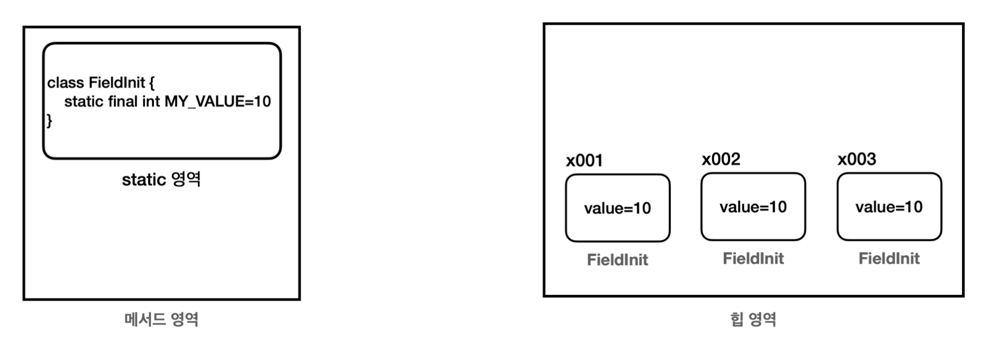

# static 과 final

> static 변수와 static 메서드 그리고 final에 대해서 알아보자

<!-- more -->

## static

-   인스턴스를 생성하지 않고 바로 붕어빵 틀을 불러 오는 것.
-   class에있는 메서드를 바로 호출 할 수 있다.

## 💡 static 변수

## 💡 static 메서드

### 클래스 메서드 vs 인스턴스 메서드

> 클래스 메서드

-   객체 생성 불필요
-   클래스명 + . + 메서드명
-   메서드 앞에도 `static` 을 붙일 수 있다. 이것을 **정적 메서드** 또는 **클래스 메서드**라 한다. 정적 메서드라는 용어는 `static` 이 정적이라는 뜻이기 때문이고, 클래스 메서드라는 용어는 인스턴스 생성 없이 마치 클래스에 있는 메서드를
    바로 호출하는 것 처럼 느껴지기 때문이다.

> 인스턴스 메서드

-   `static` 이 붙지 않은 메서드는 인스턴스를 생성해야 호출할 수 있다. 이것을 **인스턴스 메서드**라 한다.

```java
 public class DecoUtil1 {
     public String deco(String str) {
         String result = "*" + str + "*";
         return result;
} }
```

```java
 public class DecoMain1 {
     public static void main(String[] args) {
         String s = "hello java";
         DecoUtil1 utils = new DecoUtil1();
         String deco = utils.deco(s);
         System.out.println("before: " + s);  // before: hello java
         System.out.println("after: " + deco); // after: *hello java*
     }
}
```

## 💡 static 응용(싱글톤 패턴)

1. 싱글톤 패턴 (Singleton Pattern)

    - 프로그램에서 인스턴스가 단 한 개만 생성되어야 하는 경우에 사용하는 디자인 패턴

2. 싱글톤 패턴 구현
    - 생성자는 private으로 선언
    - 클래스 내부에 유일한 private 인스턴스 생성
    - 외부에서 유일한 인스턴스를 참조할 수 있는 메서드 생성


## 💡 final

- final의 값은 최초 한번만 할당 가능하다
    1. . `final` 을 지역 변수 선언시 바로 초기화 한 경우 이미 값이 할당되었기 때문에 값을 할당할 수 없다.
    2. 매개변수에 `final` 이 붙으면 메서드 내부에서 매개변수의 값을 변경할 수 없다. 따라서 메서드 호출 시점에 사용 된 값이 끝까지 사용된다.

```java
public class FinalLocalMain {
    public static void main(String[] args) { //final 지역 변수1
    final int data1;
    data1 = 10; //최초 한번만 할당 가능 //data1 = 20; //컴파일 오류
    //final 지역 변수2
    final int data2 = 10; //data2 = 20; //컴파일 오류
            method(10);
        }
    //final 매개변수
    static void method(final int parameter) {
    //parameter = 20; 컴파일 오류
    } 
}
```


## 💡 final 필드 - 생성자 초기화 vs  필드 초기화 차이


```java
public class FinalFieldMain {

public static void main(String[] args) {

    //final 필드 - 생성자 초기화
    System.out.println("생성자 초기화");
    ConstructInit constructInit1 = new ConstructInit(10); 
    ConstructInit constructInit2 = new ConstructInit(20); 
    System.out.println(constructInit1.value); 
    System.out.println(constructInit2.value);

    //final 필드 - 필드 초기화 
    System.out.println("필드 초기화"); 
    FieldInit fieldInit1 = new FieldInit(); 
    FieldInit fieldInit2 = new FieldInit(); 
    FieldInit fieldInit3 = new FieldInit(); 
    System.out.println(fieldInit1.value); 
    System.out.println(fieldInit2.value); 
    System.out.println(fieldInit3.value);

    //상수
    System.out.println("상수"); 
    System.out.println(FieldInit.CONST_VALUE);
    } 
}
```

> 필드 초기화
    
- `FieldInit` 과 같이 `final` 필드를 필드에서 초기화 하는 경우, 모든 인스턴스가 다음 오른쪽 그림과 같이 같 은 값을 가진다.
- 모든 인스턴스가 같은 값을 사용하기 때문에 메모리가 낭비된다.
- 이를 보완하기 위해 나온 것이 static final
- 


### 🌸 static final

- `FieldInit.MY_VALUE` 는 `static` 영역에 존재한다. 그리고 `final` 키워드를 사용해서 초기화 값이 변하지 않는다.
- `static` 영역은 단 하나만 존재하는 영역이다. `MY_VALUE` 변수는 JVM 상에서 하나만 존재하므로 앞서 설명 한 중복과 메모리 비효율 문제를 모두 해결할 수 있다.
- 이런 이유로 필드에 `final` + 필드 초기화를 사용하는 경우 `static` 을 붙여서 사용하는 것이 효과적이다.
- 상수(constant)라고 불린다.

## 💡 상수(constant)
- 변하지 않고 항상 일정한 값을 갖는 수 = 단 하나만 존재하는 변하지 않는 고정된 값.
- 필드에 직접 접근해서 사용한다.
- 대문자 사용, _로 구분한다.
- 상수는 런타임에 변경할 수 없다. 변경하려면 프로그램을 종료하고, 코드를 변경한 다음 프로그램을 다시 실행해야 한다.

### 🍀 상수 사용 예시 1

```java

//상수
public class Constant {

    //애플리케이션 설정 상수
    public static final int MAX_USERS = 1000;
}

public class ConstantMain1 {
    public static void main(String[] args) { 
        System.out.println("프로그램 최대 참여자 수 " + Constant.MAX_USERS); 
        int currentUserCount = 999; 
        process(currentUserCount++); 
        process(currentUserCount++);
        process(currentUserCount++);
     }
    private static void process(int currentUserCount) { 
        System.out.println("참여자 수:" + currentUserCount); 
        if (currentUserCount > Constant.MAX_USERS) {
        System.out.println("대기자로 등록합니다."); 
        } else {
        System.out.println("게임에 참가합니다."); }
    } 
}

```


## 💡 final 변수와 참조형 변수

- 참조형 변수는 객체의 참조값을 보관한다.
- 참조형 변수 data에 final이 붙은 상태이다
    - 더이상 다른 객체를 참조할 수 없게 된다. 참조형 변수에 들어있는 참조값만 변경하지 못하며, 이 변수 이외에 다른 곳에 영향을 주지 않는다.


```java
final Data data = new Data()
// data = new Data() // final 변경 불가 컴파일 오류

//참조 대상의 값은 변경 가능 
data.value = 10; 
System.out.println(data.value);  //data.value = 10 
data.value = 20; 
System.out.println(data.value);  //data.value = 20
```

## 💡 final 사용 예시

예를들어 고객 id를 변경했을 때 큰 문제가 발생한다면 final로 선언하고 생성자로 값을 할당하자.
어디선가 실수로 id 값을 변경한다면 컴파일러가 문제를 알려줄 것이다.

