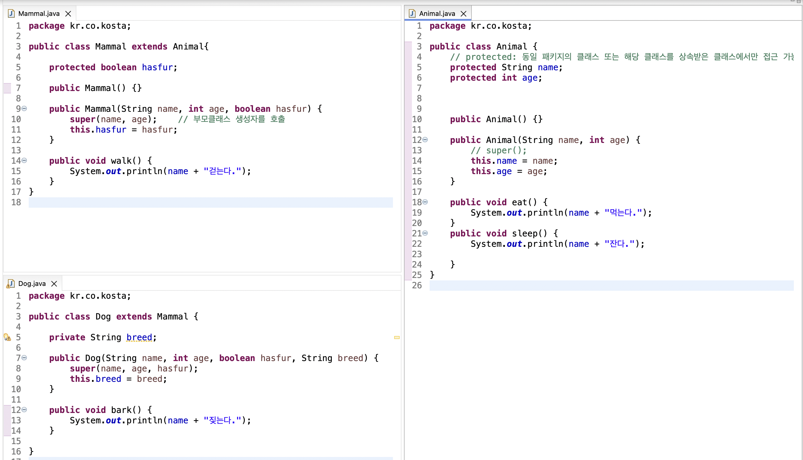
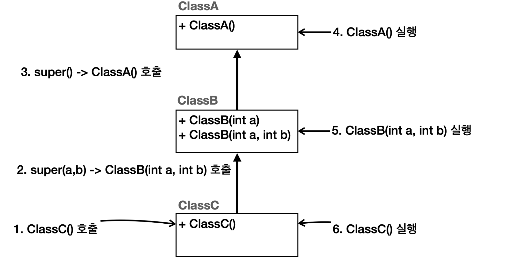

# Java 상속

> Java에서 상속, 오버라이드(Overriding), super(), 다운캐스팅(instanceof), 업캐스팅

<!-- more -->

## 🍎 클래스의 상속

1. 새로운 클래스를 정의 할 때 이미 구현된 클래스를 상속(inheritance) 받아서 속성이나 기능을 확장하여 클래스를 구현하는 것
2. 이미 구현된 클래스보다 더 구체적인 기능을 가진 클래스를 구현해야 할 때 기존 클래스를 상속함
3. 상속 클래스
    - 상위 클래스, parent class, base class, super class
4. 상속 받는 클래스
    - 하위 클래스, child class, derived class, sub class

## 🍎 클래스 상속 문법

1. 형태

    ```java
    class B extends A {

    }
    ```

2. 특징
    - extends 키워드 뒤에는 단 하나의 클래스만 올 수 있다.
    - 자바는 단일 상속(single inheritance)만을 지원함
    - protected 접근 제어자
        - 상위 클래스에 선언된 private 멤버 변수는 하위 클래스에서 접근할 수 없다.
        - 외부 클래스에서는 접근할 수 없지만, 하위 클래스는 접근할 수 있도록 protected 접근 제어자를 사용

## ⭐️ 상속과 메모리 구조

1. 상속 관계의 객체를 생성하면 그 내부에는 부모와 자식 모두 생성된디ㅏ.
2. 상속 관계의 객체를 호출할 때 대상 타입을 정해야된다. 이때 호출자의 타입을 통해 대상 타입(클래스) 기준으로 찾는다.

    ```java
    ElectricCar electricCar = new ElectricCar();
    ```

    

3. 현재 타입에서 기능을 찾기 못하면 상위 부모 타입으로 기능을 찾아서 실행한다. 기능을 찾지 못한다면 컴파일 오류 발생

### 🍀 간단한 상속 예시



### 🍀 고객 관리 프로그램 구현하기

1. 고객(Customer) 클래스

    - 고객 아이디
    - 고객 이름
    - 등급
    - 보너스 포인트
    - 보너스 포인트 적립 비율
        - 물품 구매시 1%의 보너스 포인트 지급

2. 새로운 고객 등급이 필요한 경우

    - 제품을 살 때는 항상 10% 할인해 줌
    - 물품 구매시 5%의 보너스 포인트 지급
    - 담당 전문 상담원 배정해 주기

3. 중간등급 만들기

## 🍎 상속에서 클래스 생성 과정

1. 하위 클래스 생성되는 과정
    - 하위 클래스 생성하면 상위 클래스가 먼저 생성됨
        - new CustomerVIP()를 호출하면 Customer()가 먼저 호출됨
    - 클래스가 상속 받은 경우 하위 클래스의 생성자에서는 반드시 상위 클래스의 생성자를 호출 함
2. super()
    - 부모를 부르는 예약어
    - 하위 클래스에서 가지는 상위 클래스에 대한 참조 값
    - super()는 상위 클래스의 기본 생성자를 호출 함
    - 하위 클래스에서 명시적으로 상위 클래스의 생성자를 호출하지 않으면 super()가 호출된다.
    - 상위 클래스의 기본 생성자가 없는 경우 하위 클래스에서의 생성자에서는 super()를 이용하여 명시적으로 상위 클래스의 다른 생성자를 호출해야 함
    - super는 생성된 사우이 클래스 인스턴스의 참조값을 갖고있기 떄문에 super를 이용하여 상위 클래스의 메서드나 멤버변수에 접근할 수 있다.

## 🍎 super()

### 1. 부모 참조

-   부모와 자식의 필드명이 같거나 메서드가 오버라이딩 되어 있으면, 자식에서 부모의 필드나 메서드를 호출할 수 없다.
-   이때 super 키워드를 사용하면 부모를 참조할 수 있다.

### 2. 생성자

-   상속관계를 사용하면 자식 클래스의 생성자에서 부모 클래스의 생성자를 반드시 호출해야 한다 (규칙💡)

    ```java
    public class ClassA {
    	public ClassA() {
    		System.out.println("ClassA 생성자");
    	}
    }
    ```

    ```java
    public class ClassB extends ClassA {

    	// 생성자를 하나라도 정의 해버린다면 기본 생성자가 자동으로 만들어 지지 않는다.
    	// pubic ClassB() {}

    	public ClassB(int a) {
    		super(); // 매개변수 없는 기본 생성자 생략 가능
    		System.out.println("ClassB 생성자 a="+a);
    		}

    	public ClassB(int a, int b) {
    		super(); // 매개변수 없는 기본 생성자 생략 가능
    		System.out.println("ClassB 생성자 a="+a + " b=" + b);
    } }

    ```

    ```java
    public class ClassC extends ClassB {
      	public ClassC() {
         		super(10, 20);  //ClassB에 기본 생성자가 없기 때문에 super 직접 정의해주기
    		System.out.println("ClassC 생성자"); }
    }
    ```

-   실행해보면 `ClassA` `ClassB` `ClassC` 순서로 실행된다. 생성자의 실행순서가 결과적으로 최상위 부모부터 실행되어서 하나씩 아래로 내려오는 것이다. 따라서 초기화는 최상위 부모부터 이루어진다. 왜냐하면 자식 생성자의 첫 줄에서 부모의 생성자를 호출해야 하기 때문이다.

    ```bash
    ClassA 생성자
    ClassB 생성자 a=10 b=20
    ClassC 생성자
    ```

    

### ⚒️ 예외

-   코드의 첫줄에 `this(...)` 를 사용하더라도 반드시 한번은 `super(...)` 를 호출해야 한다.

    ```java
    public class ClassB extends ClassA {
    	public ClassB(int a) {
    		this(a, 0); //기본 생성자 생략 가능
    		System.out.println("ClassB 생성자 a=" + a);
    	}
    	public ClassB(int a, int b) {
    		super(); //기본 생성자 생략 가능
    		System.out.println("ClassB 생성자 a=" + a + " b=" + b);
    	}
    }
    ```

    ```java
    public class Super2Main {
    	public static void main(String[] args) {
    		//ClassC classC = new ClassC();
    		ClassB classB = new ClassB(100);
    	}
    }
    ```

    ```bash
    	ClassA 생성자
    	ClassB 생성자 a=100 b=0
    	ClassB 생성자 a=100
    ```

## 🍎 형 변환

### 1. 상위 클래스로 묵시적 클래스 형변환 (UpCasting)

-   상위 클래스로 변수를 선언하고 하위 클래스의 생성자로 인스턴스를 생성
-   자동 형 변환 예

    ```java
    Customer vc = new VIPCustomer();
    선언된 클래스 형    생성된 인스턴스의 클래스형
    (상위 클래스 형)    (하위 클래스 형)
    ```

### 2. DownCasting

-   업 캐스팅 된 클래스를 다시 원래의 타입으로 형 변환
-   하위 클래스로의 형 변환은 명시적으로 해야 함
-   예시

    ```java
    Customer vc = new Customer();               // 묵시적
    VIPCustomer vCustomer =  (VIPCustomer)vc;   // 명시적
    ```

> instanceof

-   인스턴스의 타입 체크
-   원래 인스턴스의 형이 맞는지 여부를 체크하기 위함
-   맞으면 true, 아니면 false 반환

## 🍎 메서드 재정의(overriding)

1. 하위 클래스에서 메서드 재정의 하기

    - `오버라이딩 (overriding)` : 상위 클래스에 정의된 메서드의 구현 내용이 하위 클래스에서 구현할 내용과 맞지 않는 경우에 하위 클래스에서 동일한 이름의 메서드를 재정의 할 수 있다. 즉 구현내용만 재정의 하는 것. 상속관계에서 사용한다.

2. 오버라이딩 조건

    - 메서드 이름: 메서드 이름이 같아야 한다.
    - 메서드 매개변수(파라미터): 매개변수(파라미터) 타입, 순서, 개수가 같아야 한다.
    - 반환 타입: 반환 타입이 같아야 한다. 단 반환 타입이 하위 클래스 타입일 수 있다.
    - 접근 제어자: 오버라이딩 메서드의 접근 제어자는 상위 클래스의 메서드보다 더 제한적이어서는 안된다. 예를 들 어, 상위 클래스의 메서드가 `protected` 로 선언되어 있으면 하위 클래스에서 이를 `public` 또는 `protected` 로 오버라이드할 수 있지만, `private` 또는 `default` 로 오버라이드 할 수 없다.
    - 예외: 오버라이딩 메서드는 상위 클래스의 메서드보다 더 많은 체크 예외를 `throws` 로 선언할 수 없다. 하지만 더 적거나 같은 수의 예외, 또는 하위 타입의 예외는 선언할 수 있다. 예외를 학습해야 이해할 수 있다. 예외는 뒤 에서 다룬다.
    - `static` , `final` , `private` : 키워드가 붙은 메서드는 오버라이딩 될 수 없다.
        - `static` 은 클래스 레벨에서 작동하므로 인스턴스 레벨에서 사용하는 오버라이딩이 의미가 없다. 쉽게 이 야기해서 그냥 클래스 이름을 통해 필요한 곳에 직접 접근하면 된다.
        - `final` 메서드는 재정의를 금지한다.
        - `private` 메서드는 해당 클래스에서만 접근 가능하기 때문에 하위 클래스에서 보이지 않는다. 따라서 오 버라이딩 할 수 없다.
    - 생성자 오버라이딩: 생성자는 오버라이딩 할 수 없다.

3. @overriding 애노테이션(annotation)

    - 애노테이션은 원래 주석이라는 의미
    - 컴파일러에에 특별한 정보를 제공해주는 역할

    |       어노테이션       |                           설명                            |
    | :--------------------: | :-------------------------------------------------------: |
    |      `@override`       |               재정의된 메서드라는 정보 제공               |
    |     `@Deprecated`      | 이후 버전에서 사용되지 않을 수 있는 변수, 메서드에 사용됨 |
    | `@FunctionalInterface` |              함수형 인터페이스라는 정보 제공              |

## 🍀 상속, 다형성 예제 (업캐스팅 포함)

> PolymorphismTest, package kr.co.kosta4; 업캐스팅 예시 이기도 하다.

```java
package kr.co.kosta4;

public class Customer {
	protected int customerId;
	protected String customerName;
	protected String customerGrade;
	int bonusPoint;
	double bonusRatio;

	public int getCustomerId() {
		return customerId;
	}

	public void setCustomerId(int customerId) {
		this.customerId = customerId;
	}

	public String getCustomerName() {
		return customerName;
	}

	public void setCustomerName(String customerName) {
		this.customerName = customerName;
	}

	public String getCustomerGrade() {
		return customerGrade;
	}

	public void setCustomerGrade(String customerGrade) {
		this.customerGrade = customerGrade;
	}

	public Customer(int customerId, String customerName) {
		this.customerName = customerName;
		customerGrade = "Sliver"; // 기본 등급
		bonusRatio = 0.01; // 보너스 적립비율
	}

	// 지불 가격, 보너스 포인트 적집
	public int calPrice(int price) { // 물품 가격
		bonusPoint += price * bonusRatio; // 포인트
		return price;
	}
}
```

```java
package kr.co.kosta4;

/*
 * 다형성을 활용한 고객관리 프로그램 확장
 *  - 중간 멤버십 생성하기
 *  - 일반 고객보다는 많이 구매하고 VIP 보다는 적게 구매하는 고객이 대상
 *  - 혜택
 *  	- 제품 구매시 10프로 할인 하기
 *  	- 보너스 포인트는 2% 적립하기
 */

public class GoldCustomer extends Customer {

	private int agentId;
	double discountRatio;

	public GoldCustomer(int customerId, String customerName) {
		super(customerId, customerName);
		customerGrade = "GOLD";
		bonusRatio = 0.02; // 보너스 적립
		discountRatio = 0.1; // 할인율

	}

	public int calPrice(int price) {
		bonusPoint += price * discountRatio;
		return price - (int) (price * discountRatio);
	}

}

```

```java
package kr.co.kosta4;

public class VIPCustomer extends Customer {

	private int agentId;
	double discountRatio;

	public VIPCustomer(int customerId, String customerName) {
		super(customerId, customerName);
		customerGrade = "VIP";
		bonusRatio = 0.05;	 // 보너스 적립
		discountRatio = 0.2; // 할인율
	}

	// vip가 지불 할 금액
	public int calPrice(int price) {
		bonusPoint += price * discountRatio;
		return price - (int) (price * discountRatio);
	}

}

```

```java
package kr.co.kosta4;

import java.util.ArrayList;

/*
 * ArrayList 배열로 고객5명을 생성하고 출력
 * 홍길동님은 10000원을 지불했습니다.
 * 홍길동님의 현재 보너스 포인트는 6000원 입니다.
 */

public class Test {
	public static void main(String[] args) {

		Customer Lee = new Customer(1, "LEE");
		Customer Go = new Customer(2, "Go");
		Customer parkGold = new GoldCustomer(101, "Park");
		Customer kimGold = new GoldCustomer(102, "Kim");
		Customer hongVIP = new VIPCustomer(1001, "hong");

		ArrayList<Customer> customerList = new ArrayList<>();
		customerList.add(Go);
		customerList.add(Lee);
		customerList.add(parkGold);
		customerList.add(kimGold);
		customerList.add(hongVIP);


		int price = 10000;
		for (Customer customer : customerList) {
			int cost = customer.calPrice(price);
			System.out.println(customer.getCustomerName() + "님이 " + cost + "원 지불했습니다.");
			System.out.println(customer.getCustomerName() + "님의 현재 보너스 포인트는  " +customer.bonusPoint + "원 입니다.");

		}
	}
}
```

```bash
Go님이 10000원 지불했습니다.
Go님의 현재 보너스 포인트는  100원 입니다.
LEE님이 10000원 지불했습니다.
LEE님의 현재 보너스 포인트는  100원 입니다.
Park님이 9000원 지불했습니다.
Park님의 현재 보너스 포인트는  1000원 입니다.
Kim님이 9000원 지불했습니다.
Kim님의 현재 보너스 포인트는  1000원 입니다.
hong님이 8000원 지불했습니다.
hong님의 현재 보너스 포인트는  2000원 입니다.

```

## 🍀 다운 캐스팅 예제

```java
package kr.co.kosta5;

import java.util.ArrayList;

class Animal {
	public void move() {
		System.out.println("동물이 움직입니다.");
	}

	public void eatting() {
		System.out.println("동물이 먹습니다.");
	}
}

class Dog extends Animal {

	// @Override
	public void move() {
		System.out.println("강아지가 움직입니다.");
	}

	public void eatting() {
		System.out.println("강아지가 사료를 먹습니다.");
	}

	public void barking() {
		System.out.println("강아지가 멍멍하고 짖습니다.");
	}

}

class Tiger extends Animal {
	public void move() {
		System.out.println("호랑이가 네발로 걸어다닙니다.");
	}

	public void eatting() {
		System.out.println("호랑이가 사냥한 것을 먹습니다.");
	}

	public void hunting() {
		System.out.println("호랑이가 사냥을 합니다.");
	}
}

class Eagle extends Animal {

	public void move() {
		System.out.println("독수리가 하늘을 날아갑니다.");
	}

	public void flying() {
		System.out.println("독수리가 날개를 펴도 날아갑니다.");
	}
}

public class AnimalTest {

	ArrayList<Animal> aniList = new ArrayList<>();

	public static void main(String[] args) {

		AnimalTest aTest = new AnimalTest();
		aTest.addAnimal();
		System.out.println();
		System.out.println("-- 원래 타입으로 다운캐스팅 해보자 --");
		aTest.downCasting();
	}

	private void downCasting() {
		for (int i = 0; i < aniList.size(); i++) { // 모든 배열 요소를 하나씩 돌면서 Animal 형으로 가져옴
			Animal ani = aniList.get(i);

			if (ani instanceof Dog) {
				Dog d = (Dog) ani;
				d.barking();
			} else if (ani instanceof Tiger) {
				Tiger t = (Tiger) ani;
				t.hunting();
			}else if (ani instanceof Eagle) {
				Eagle e = (Eagle) ani;
				e.flying();
			}
		}
	}

	private void addAnimal() {
		aniList.add(new Dog());
		aniList.add(new Tiger());
		aniList.add(new Eagle());

		for (Animal ani : aniList) {
			ani.move();
		}
	}
}

```
