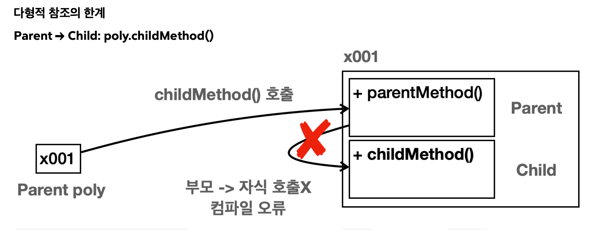
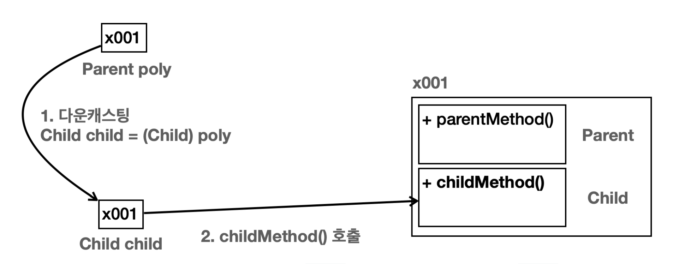
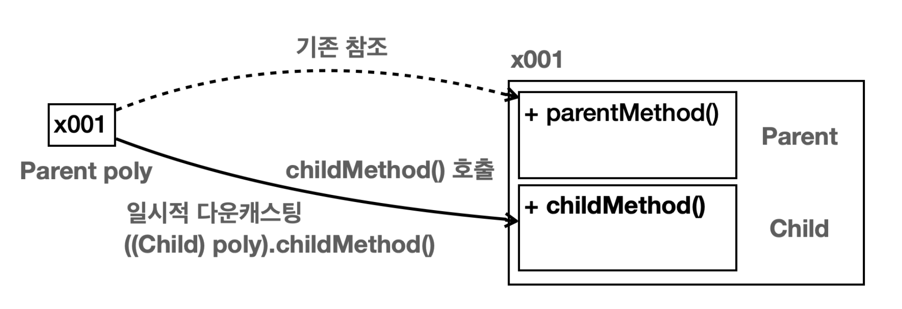
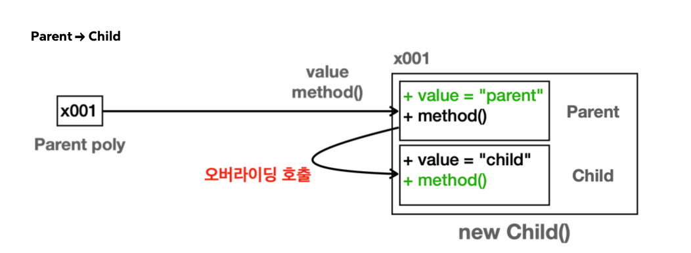

# 다형성(polymorphism)

> 다형성(polymorphism), IS-A, HAS-A

<!-- more -->

## 📌 다형성(polymorphism)이란?

1. 하나의 코드가 여러 자료형으로 구현되어 실행되는 것
2. 같은 코드에서 여러 다른 실행 결과가 나옴
3. 정보 은닉(캡슐화), 상속과 더붙어 객체지향 프로그래밍의 가장 큰 특징 중 하나이다.
4. 다형성을 잘 활용하면 유연하고 확장성이 있고, 유지보수가 편리한 프로그램을 만들 수 있다.


### 🍀 다형성 예제1

```java
import java.util.ArrayList;

class Animal {
	public void move() {
		System.out.println("동물이 움직입니다.");
	}

	public void eatting() {
		System.out.println("동물이 먹습니다.");
	}
}

class Dog extends Animal {

	// @Override
	public void move() {
		System.out.println("강아지가 움직입니다.");
	}

	public void eatting() {
		System.out.println("강아지가 사료를 먹습니다.");
	}

}

class Tiger extends Animal {
	public void move() {
		System.out.println("호랑이가 네발로 걸어다닙니다.");
	}

	public void eatting() {
		System.out.println("호랑이가 사냥한 것을 먹습니다.");
	}

	public void hunting() {
		System.out.println("호랑이가 사냥을 합니다.");
	}
}

class Eagle extends Animal {

	public void move() {
		System.out.println("독수리가 하늘을 날아갑니다.");
	}

	public void flying() {
		System.out.println("독수리가 날개를 펴도 날아갑니다.");
	}
}

public class AnimalTest {

	public static void main(String[] args) {
		Animal animal = new Animal();
		Animal dAnimal = new Dog();
		Animal tAnimal = new Tiger();

		animal.move();
		dAnimal.move();
		tAnimal.move();
		System.out.println("-----------");

		ArrayList<Animal> animalList = new ArrayList<>();
		animalList.add(animal);
		animalList.add(tAnimal);
		animalList.add(dAnimal);

		for (Animal animal2 : animalList) {
			animal2.move();
		}

	}
}
```

```bash
동물이 움직입니다.
강아지가 움직입니다.
호랑이가 네발로 걸어다닙니다.
-----------
동물이 움직입니다.
호랑이가 네발로 걸어다닙니다.
강아지가 움직입니다.
```

### 🍀 다형성 예제2

```java
class A {

}

class B extends A {
}

class C extends B {
}

class D extends B {
}

public class PolymorphismTest {

	public static void main(String[] args) {

		A a = new A();
		B b = new B();
		C c = new C();
		D d = new D();

		A a1 = new B();
		A a2 = new C();
		A a3 = new D();

		B b1 = new C();
		B b2 = new D();

	}
}
```

## 📌 클래스간의 관계

### 💡 IS-A 관계 (inheritance)

    - 일반적(general) 개념과 구체적인(specific) 개념과의 관계
    - 상위 클래스: 하위 클래스보다 일반적인 개념 (ex: Employee)
    - 하위 클래스: 상위 클래스보다 구체적인 개념들이 더해짐 (ex: Engineer, Manager, developer)
    - 상속은 클래스간의 결합도가 높은 설계

### 💡 HAS-A 관계 (composition)

    - 클래스가 다른 클래스를 포함하는 관계 (참조변수로 선언)
    - 코드 재사용의 가장 일반적인 방법
    - 예 : Student가 Subject를 포함, Library를 구현할 때 ArrayList 생성하여 사용


## 📌 다형적 참조

- Parent 타입의 변수는 다음과 같이 자신인 Parent는 물론이고, 자식 타입까지 참조할 수 있다. 만약 손자가 있다면 손자, 그 하위 타입도 참조할 수 있다.
  

	```java
	Parent poly = new Parent();
	Parent poly = new Child();
	Parent poly = new Grandson();  // Child 하위에 손자가 있다면 가능

	```

### 🍀 다형적 참조 예시

```java
public class Parent {
    public void parentMethod(){
        System.out.println("Parent.ParentMethod");
    }
}

```

```java
public class Child extends Parent {
    public void childMethod() {
        System.out.println("Child.childMethod");
    } }

```

```java
public class PolyMain {
    public static void main(String[] args) {
        //부모 변수가 부모 인스턴스 참조
        System.out.println("Parent -> Parent");
        Parent parent = new Parent();
        parent.parentMethod();

        // 자식 변수가 부모 인스턴스 참조
        System.out.println("Child -> Child");
        Child child = new Child();
        child.parentMethod();
        child.childMethod();

        // 부모 변수가 자식 인스턴스 참조(다형적 참조)
        System.out.println("Parent -> child");
        Parent poly = new Child(); // 부모는 자식 타입을 담을 수 있다.

        // Child child1 = new Parent()  // 컴파일 오류 발생

        // 부모는 자식의 기능을 호출할 수 없다.
        //poly.childMethod();
    }
}

```

- poly는 Parent 타입이다. `Parent` 클래스부터 시작해서 필요한 기능을 찾는다. 그런데 상속 관계는 부모 방향으로 찾아 올라갈 수는 있지만 자식 방향으로 찾아 내려갈 수는 없다. `Parent` 는 부모 타입이고 상위에 부모가 없다. 따라서 `childMethod()` 를 찾을 수 없으므로 컴파일 오류가 발생한다.



- ⭐️ 다형적 참조의 핵심은 "부모는 자식을 품을 수 있다!". 반대는 안됨.
- 부모 객체에서 childMethod()를 호출하는 방법은? 캐스팅이 필요하다. 


## 📌 다형성과 캐스팅

### 1. 다운캐스팅



- 부모타입을 자식 타입으로 바꾸기
- 자바에서 부모는 자식을 담을 수 있다. 하지만 그 반대는 안된다. (꼭 필요하다면 다운캐스팅을 해야 한다.)

```java

public class CastingMain1 {
     public static void main(String[] args) {
	//부모 변수가 자식 인스턴스 참조(다형적 참조) 
	Parent poly = new Child();
	//단 자식의 기능은 호출할 수 없다. 컴파일 오류 발생 
	//poly.childMethod();

	//다운캐스팅(부모 타입 -> 자식 타입) 
	Child child = (Child) poly; 
	child.childMethod();
	} 
}
```
  
```java
Child child = (Child) poly // Parent poly 부모타입을 Child이라는 자식 타입으로 변경
child.childMerhod();  
```

```bash
 Child.childMethod
```


### 2. 일시적 다운 캐스팅

- 자식 타입의 기능을 사용하려면 다운캐스팅 결과를 변수에 담아두고 이후에 기능을 사용하면 된다. 하지만 다운캐스팅 결과를 변수에 담아두는 과정이 번거롭다. 이런 과정 없이 일시적으로 다운캐스팅을 해서 인스턴스 에 있는 하위 클래스의 기능을 바로 호출할 수 있다.
- ⭐️ 다운 캐스팅을 한다고 해서  `poly` 가 `Child` 타입으로 바뀌는 것은 아니다. 





```java
public class CastingMain2 {
	public static void main(String[] args) {
		//부모 변수가 자식 인스턴스 참조(다형적 참조)
		Parent poly = new Child();
		//단 자식의 기능은 호출할 수 없다. 컴파일 오류 발생
		//poly.childMethod();

		//다운캐스팅(부모 타입 -> 자식 타입)
		Child child = (Child) poly;
		child.childMethod();

		// 일시적 다운캐스팅 - 해당 메서드를 호출하는 순간만 다운 캐스팅
		((Child) poly).childMethod();  //  Child.childMethod
	}
}
```

### 3. 업캐스팅

- 현재 타입을 부모 타입으로 변경하는 것
- 업캐스팅은 (타입)을 생략할 수 있다. 다운캐스팅은 생략할 수 없다. 
	- 업캐스팅은 매우 자주 사용하기 때문에 생략을 권장한다.


```java
//upcasting vs downcasting
public class CastingMain3 {
    public static void main(String[] args) {
        Child child = new Child();
        Parent parent1 = (Parent) child; //업캐스팅은 생략 가능, 생략 권장 Parent parent2 = child; //업캐스팅 생략
        Parent parent2 = child;
        parent1.parentMethod();  // Parent.parentMethod
        parent2.parentMethod();  // Parent.parentMethod
    }
}
```


### ⚒️ 다운 캐스팅이 불가능한 경우

### ⚒️ 업캐스팅이 안전하고 다운캐스팅이 위험한 이유?


## instanceof

- 다형성에서 참조형 변수는 이름 그대로 다양한 자식을 대상으로 참조할 수 있다. 그런데 참조하는 대상이 다양하기 때문 에 어떤 인스턴스를 참조하고 있는지 확인하려면 어떻게 해야할까?

```java
 Parent parent1 = new Parent()
 Parent parent2 = new Child()
```
- 여기서 `Parent` 는 자신과 같은 `Parent` 의 인스턴스도 참조할 수 있고, 자식 타입인 `Child` 의 인스턴스도 참조할 수 있다. 이때 `parent1` , `parent2` 변수가 참조하는 **인스턴스의 타입을 확인**하고 싶다면 `instanceof` 키워드를 사용 하면 된다.


- 다운캐스팅을 수행하기 전 원하는 instanceof를 사용해 타입으로 변경이 가능한지 확인하자!
	- 자식 인스턴스가 맞다면 다운 캐스팅 가능한 로직

```java
public class CastingMain5 {
    public static void main(String[] args) {
        Parent parent1 = new Parent();
        System.out.println("parent1 호출");
        call(parent1);

        Parent parent2 = new Child();
        System.out.println("parent2 호출");
        call(parent2);

    }

    public  static void call(Parent parent) {
        parent.parentMethod();
        if(parent instanceof  Child) {
			// Child c = parent1 / Child c = new Parent(); (불가능)
			// Child c = parent2; / Child c = new Child(); (가능)
            System.out.println("Child 인스턴스 맞음");
			Child child = (Child) parent;
            child.childMethod();
        }
    }
}
```

```bash
parent1 호출
Parent.parentMethod
parent2 호출
Parent.parentMethod
Child 인스턴스 맞음
Child.childMethod
```

- instanceof 키워드는 오른쪽 대상의 자식 타입을 왼쪽에서 참조하는 경우 true
	- 즉 오른쪽에 있는 타입에 왼쪽에 있는 인스턴스 타입이 들어갈 수 있는지

```java
new Parent() instanceof Parent
Parent p = new Parent() //같은 타입 true

new Child() instanceof Parent
Parent p = new Child() //부모는 자식을 담을 수 있다. true

new Parent() instanceof Child
Child c = new Parent() //자식은 부모를 담을 수 없다. false 

new Child() instanceof Child
Child c = new Child() //같은 타입 true
```


## 🍀 다형성과 메서드 오버라이딩 예시

- 오버라이딩 된 메서드는 항상 우선권을 가진다!!!⭐️ 



- `poly` 변수는 `Parent` 타입이다. 따라서 `poly.value` , `poly.method()` 를 호출하면 인스턴스의 `Parent` 타입에서 기능을 찾아서 실행한다.
	- `poly.value` : `Parent` 타입에 있는 `value` 값을 읽는다.
	- `poly.method()` : `Parent` 타입에 있는 `method()` 를 실행하려고 한다. 그런데 하위 타입인  `Child.method()` 가 오버라이딩 되어 있다. **오버라이딩 된 메서드는 항상 우선권**을 가진다. 따라서 `Parent.method()` 가 아니라 `Child.method()` 가 실행된다.


```java
public class OverridingMain {
    public static void main(String[] args) {


        //자식 변수가 자식 인스턴스 참조
        Child child = new Child();
        System.out.println("Child -> Child");
        System.out.println("value = " + child.value);
        child.method();

        //부모 변수가 부모 인스턴스 참조
        Parent parent = new Parent();
        System.out.println("Parent -> Parent");
        System.out.println("value = " + parent.value);
        parent.method();

        //부모 변수가 자식 인스턴스 참조(다형적 참조)
        Parent poly = new Child();
        System.out.println("Parent -> Child");
        System.out.println("value = " + poly.value); //변수는 오버라이딩X
        poly.method(); // 메서드 오버라이딩!
} }


```

```bash
 Child -> Child
 value = child
 Child.method
 Parent -> Parent
 value = parent
 Parent.method
 Parent -> Child
 value = parent
 Child.method
```
