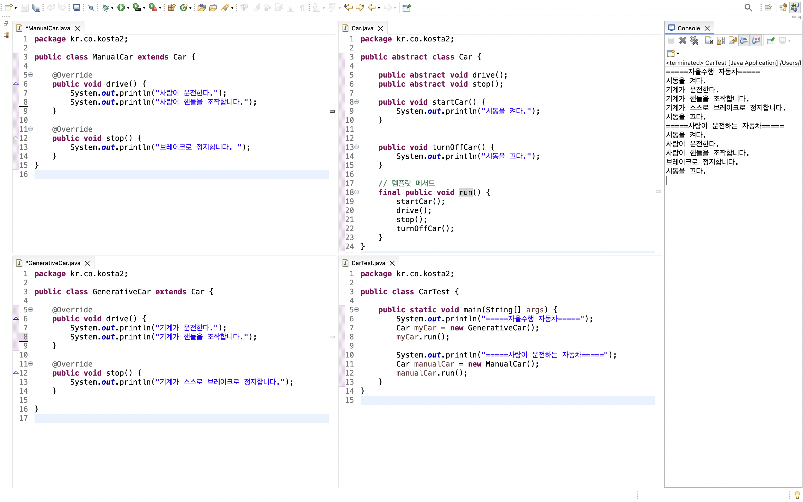

# 추상 클래스

> 추상클래스

<!-- more -->

## 💡 추상클래스 (abstract class)

1. 추상적
    - 구체적이지 않고 막연한 것
2. 구체적이지 않은 클래스 <---> concrete class
3. 정의
    - 구현코드없이 메서드의 선언만 있는 추상메서드(abstract method)를 포함한 클래스이다.
    - 추상클래스는 항상 추상메서드를 포함함
    - 추상 메서드는 구현 코드가 없다. 메서드의 body가 없다는 뜻
4. abstract 예약어를 사용
5. 추상 클래스는 new 할 수 없음(인스턴스화 할 수 없음)

## 💡 메서드

1. 메서드 선언(declaration)
    - 반환타입, 메서드 이름, 매개변수로 구성
2. 메서드 정의
    - 메서드 구현과 동일한 의미
    - 구현부(body)를 가진 ({})
3. 예시
   abstract int add(int a, int y); //선언부, 추상메서드
   int add(int a, int y) {}; // 구현부가 있음, 추상메서드 아님

## 💡 추상 클래스 구현하기

1. 메서드에 구현 코드가 없으면 abstract로 선언
2. abstract로 선언된 메서드를 가진 클래스는 abstract로 선언
3. 모든 메서드가 구현 된 클래스라도 abstract로 선언되면 추상 클래스로 인스턴스화 할 수 있음
4. 추상 클래스의 추상 메서드는 하위 클래스가 상속하여 구현
    - 추상 클래스의 추상 메서드 : 하위 클래스가 구현해야 하는 메서드
    - 추상 클래스의 구현된 메섣, : 하위클래스가 공통으로 사용하는 메서드, 필요에 따라 하위 클래스에서 재정의(overriding)함

## 💡 추상 클래스와 프레임워크

1. 추상클래스는 많은 프레임워크에서 사용하고 있는 구현 방식임
2. 안드로이드 앱을 만들 때 안드로이드 라이브러리에서 제공하는 많은 클래스를 사용
    - 클래스 중에는 모두 구현된 클래스도 있고, 읿부만 구현되어 있어서 상속을 받아 구현하는 경우도 많음
3. 상속받은 모든 클래스에서 공통으로 사용할 메서드를 제공함
    - 구현을 미루어 놓은 메서드(추상 메서드)는 실제 앱에서 어떻게 만드냐에 따라 다르게 구현해야 할 내용으로 앱에서 구현하도록 선언만 해 둔 것임

## 💡 추상 클래스 응용

1. 템플릿

    - 틀이 있는 메서드
    - 추상 메서드와 구현된 메서드를 활용하여 코드의 흐름을 정의하는 메서드
    - final로 선언ㅇ하여 하위 클래스에서 재정의 할 수 없게 함
    - 프레임워크에서 많이 사용되는 설계 패턴

2. 추상클래스로 선언된 상위 클래스에서 템플릿 메서드를 활용

    - 전체적인 흐름을 정의하고 하위 클래스에서 다르게 구현되어야 하는 부분은 추상 메서드로 선언하여 하위 클래스에서 구현하도록 함

3. final 예약어
    - `final 변수`: 값이 변경할 수 없는 상수
    - `final 메서드`: 하위 클래스에서 재정의 할 수 없는 메서드
    - `final 클래스`: 상속할 수 없는 클래스

### 🍀 템플릿(template) 메서드 예시

```java
public abstract class Car {

    public abstract void drive();
    public abstract void stop();

    public void startCar() {
        System.out.println("시동을 켜다.");
    }


    public void turnOffCar() {
        System.out.println("시동을 끄다.");
    }

    // 템플릿 메서드
    final public void run() {
        startCar();
        drive();
        stop();
        turnOffCar();
    }
}

```

```java
public class ManualCar extends Car {

	@Override
	public void drive() {
		System.out.println("사람이 운전한다.");
		System.out.println("사람이 핸들을 조작합니다.");

	}

	@Override
	public void stop() {
		System.out.println("브레이크로 정지합니다. ");
	}
}

```

```java
public class GenerativeCar extends Car {

	@Override
	public void drive() {
		System.out.println("기계가 운전한다.");
		System.out.println("기계가 핸들을 조작합니다.");

	}

	@Override
	public void stop() {
		System.out.println("기계가 스스로 브레이크로 정지합니다.");
	}

}

```

```java
public class CarTest {

	public static void main(String[] args) {
		System.out.println("=====자율주행 자동차=====");
		Car myCar = new GenerativeCar();
		myCar.run();

		System.out.println("=====사람이 운전하는 자동차=====");
		Car manualCar = new ManualCar();
		manualCar.run();
	}
}

```



-   [인터페이스 게시글] 인터페이스를 활용해서 코드 작성 예제 있음.
