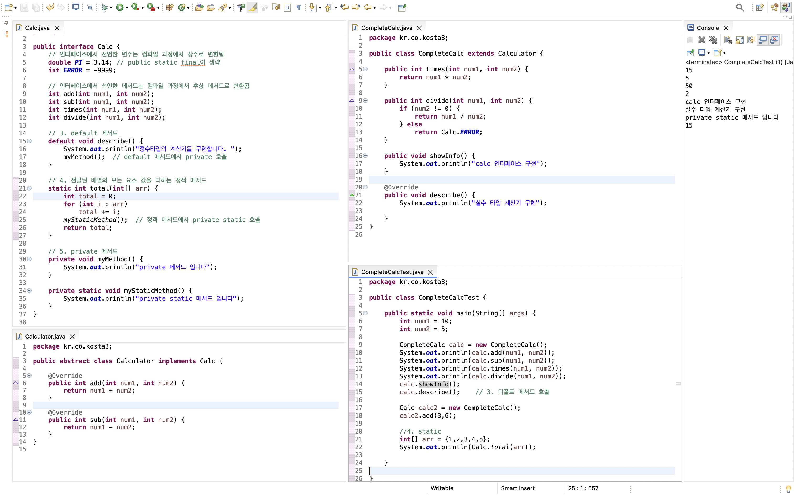

# 인터페이스

> 인터페이스

<!-- more -->

## 💡 인터페이스 (interface)란?

1. 모든 메서드가 추상메서드로 선언된(public abstract)
2. 모든 변수는 상수로 선언됨 (public static final)
3. 구현 코드가 없는 인터페이스

## 💡 인터페이스 문법

```java
interface 인터페이스이름 {
    void makeSomething();
    float PI = 3.14F;
}
```

## 💡 자바8 부터 일부 구현코드가 추가됨

1. 디폴트 메서드(default method)
2. 정적 메서드(static method)

## 💡 인터페이스 정의와 구현(interface)

1. 클래스 다이어그램에서 인터페이스를 구현하는 것은 점선으로 표시함
2. 인터페이스를 구현한 클래스는 인터페이스 형으로 선언한 변수로 형 변환 할 수 있다(upcasting)
    - 상속에서의 형 변환과 동일한 의미
    - 형변환 되는 경우 인터페이스에 선언된 메서드만 사용 가능
    ```java
    Calc calc = new CompleteCalc();
    ```

## 💡 인터페이스 하는 일

1. 클래스나 프로그램이 제공하는 기능을 명시적으로 선언
2. 일종의 클라이언트 코드와의 약속이며 클래스나 프로그램이 제공하는 명세(specification)
3. 클라이언트 프로그램은 인터페이스에 선언된 메서드 명세만 보고 이를 구현한 클래스를 사용할 수 있음
4. 어떤 객체가 하나의 인터페이스 타입이라는 것은 그 인터페이스가 제공하는 모든 메서드를 구현했다는 의미이다.
5. 인터페이스를 구현한 다양한 객체를 사용함 -> 다형성
    - JDBC 인터페이스

### 🍀 인터페이스 예시1

```java
package kr.co.kosta;

public interface Calc {

	// 인터페이스에서 선언한 변수는 컴파일 과정에서 상수로 변환됨
	double PI = 3.14;  // public static final이 생략
	int ERROR = -9999;

	// 인터페이스에서 선언한 메서드는 컴파일 과정에서 추상 메서드로 변환됨
	int add(int num1, int num2);
	int sub(int num1, int num2);
	int times(int num1, int num2);
	int divide(int num1, int num2);
}

```

```java
package kr.co.kosta;

public abstract class Calculator implements Calc {

	@Override
	public int add(int num1, int num2) {
		return num1 + num2;
	}

	@Override
	public int sub(int num1, int num2) {
		return num1 - num2;
	}

}


```

```java
package kr.co.kosta;

public class CompleteCalc extends Calculator {

	public int times(int num1, int num2) {
		return num1 * num2;
	}

	public int divide(int num1, int num2) {
		if (num2 != 0) {
			return num1 / num2;
		} else return Calc.ERROR;

	}

	public void showInfo() {
		System.out.println("calc 인터페이스 구현");
	}

}


```

```java
package kr.co.kosta;

public class CompleteCalcTest {

	public static void main(String[] args) {
		int num1 = 10;
		int num2 = 5;

		CompleteCalc calc = new CompleteCalc();
		System.out.println(calc.add(num1, num2));
		System.out.println(calc.sub(num1, num2));
		System.out.println(calc.times(num1, num2));
		System.out.println(calc.divide(num1, num2));

		Calc calc2 = new CompleteCalc();
		calc2.add(3,6);
		((CompleteCalc) calc2).showInfo();

	}

}


```

```bash
15
5
50
2
calc 인터페이스 구현


```


### 🍀 인터페이스 예시2

```java
package kr.co.kosta2;

public interface Schedule {

	public void getNextCall();  // 다음 전화를 가져오는 기능
	public void sendCallToAgent();  // 상담원에게 전화를 배분하는 기능

}

```

```java
package kr.co.kosta2;

//  상담원 한명 씩 돌아가며 동일하게 순서대로 상담업무 배분하기
public class RoundRobin  implements Schedule {

	@Override
	public void getNextCall() {
		System.out.println("상담 전화를 순서대로 대기열에서 가져오기");

	}

	@Override
	public void sendCallToAgent() {
		System.out.println("다음 순서 상담원에게 배분합니다.");

	}

}

package kr.co.kosta2;

// 현재 상담 업무가 없거나 상담대기가 가장 적은 상담원에게 배분
public class LeastJob implements Schedule {

	@Override
	public void getNextCall() {
		System.out.println("상담 전화를 순서대로 대기열에서 가져옵니다. ");

	}

	@Override
	public void sendCallToAgent() {
		System.out.println("현재 상담 업무가 없거나 대기가 가장적은 상담원에게 연결합니다.");

	}

}


package kr.co.kosta2;


//  우선순위에 따라 배분하기
public class PriorityAllocation implements Schedule {

	@Override
	public void getNextCall() {
		System.out.println("고객 등급이 높은 고객의 전화를 먼저 가져옵니다.");

	}

	@Override
	public void sendCallToAgent() {
		System.out.println("근무 경력이 오래된 사람한테 우선적으로 배분합니다.");

	}
}


```

```java
package kr.co.kosta2;

import java.io.IOException;

/*
 *  전화 상담 방식을
		R: 한 명씩 차례로 할당
		L: 쉬고 있거나 대기가 적은 상담원에게 할당
		P: 우선 순위가 높은 고객 먼저 할당

	L(입력 받기)
	상담 전화를 순서대로 대기열에서 가져옵니다.
	현재 상담 업무가 없거나 대기가 가장적은 상담원에게 연결합니다.
 */

public class SchedulerTest {

	public static void main(String[] args) throws IOException {

		System.out.println("전화 상담 할당 방식을 선택하세요.");
		System.out.println("R: 한 명씩 차례로 할당");
		System.out.println("L: 쉬고 있거나 대기가 적은 상담원에게 할당");
		System.out.println("P: 우선 순위가 높은 고객 먼저 할당");

		int kosta = System.in.read(); // 상담원 할당 방식을 입력 받아 kosta 변수에 대입
		Schedule scheduler = null;

		if (kosta == 'L' || kosta == 'l') {
			scheduler = new LeastJob();

		} else if (kosta == 'P' || kosta == 'p') {
			scheduler = new PriorityAllocation();

		} else if (kosta == 'R' || kosta == 'r') {
			scheduler = new RoundRobin();

		} else if (kosta == 'A' || kosta == 'a') {
			scheduler = new RoundRobin();

		} else {
			return;
		}
		scheduler.getNextCall();
		scheduler.sendCallToAgent();

	}

}

```

```bash
전화 상담 할당 방식을 선택하세요.
R: 한 명씩 차례로 할당
L: 쉬고 있거나 대기가 적은 상담원에게 할당
P: 우선 순위가 높은 고객 먼저 할당
p
고객 등급이 높은 고객의 전화를 먼저 가져옵니다.
근무 경력이 오래된 사람한테 우선적으로 배분합니다.

```

## 💡 인터페이스의 여러가지 요소

1. 상수
    - 모든 변수는 상수로 변환 됨(public static final)
2. 추상메서드
    - 모든 선언된 메서드는 추상 메서드(public abstract)
3. default method
    - 기본으로 제공되는 메서드
    - 인터페이스를 구현한 클래스가 생성되면
4. static method
    - 객체 생성과 무관하게 사용할 수 있음
    - 인터페이스 이름으로 직접 참조하여 사용함
5. private method(java9 이후)
    - 인터페이스를 구현한 클래스에서 사용하거나 재정의 할 수 있음
    - 인터페이스 내부에서만 사용하기 위해 구현하는 메서드
    - default 메서드나 static 메서드에서 사용함

### 🍀 인터페이스 요소 예제

```java
package kr.co.kosta3;

public interface Calc {

	// 인터페이스에서 선언한 변수는 컴파일 과정에서 상수로 변환됨
	double PI = 3.14; // public static final이 생략
	int ERROR = -9999;

	// 인터페이스에서 선언한 메서드는 컴파일 과정에서 추상 메서드로 변환됨
	int add(int num1, int num2);

	int sub(int num1, int num2);

	int times(int num1, int num2);

	int divide(int num1, int num2);

	// 3. default 메서드
	default void describe() {
		System.out.println("정수타입의 계산기를 구현합니다. ");
		myMethod();  // default 메서드에서 private 호출
	}

	// 4. 전달된 배열의 모든 요소 값을 더하는 정적 메서드
	static int total(int[] arr) {

		int total = 0;
		for (int i : arr)
			total += i;
		myStaticMethod();  // 정적 메서드에서 private static 호출
		return total;
	}

	// 5. private 메서드
	private void myMethod() {
		System.out.println("private 메서드 입니다");
	}

	private static void myStaticMethod() {
		System.out.println("private static 메서드 입니다");
	}
}

```

```java
package kr.co.kosta3;

public abstract class Calculator implements Calc {

	@Override
	public int add(int num1, int num2) {
		return num1 + num2;
	}

	@Override
	public int sub(int num1, int num2) {
		return num1 - num2;
	}

}

```

```java
package kr.co.kosta3;

public class CompleteCalc extends Calculator {

	public int times(int num1, int num2) {
		return num1 * num2;
	}

	public int divide(int num1, int num2) {
		if (num2 != 0) {
			return num1 / num2;
		} else
			return Calc.ERROR;
	}

	public void showInfo() {
		System.out.println("calc 인터페이스 구현");
	}

	@Override
	public void describe() {
		System.out.println("실수 타입 계산기 구현");

	}
}


```

```java
package kr.co.kosta3;

public class CompleteCalcTest {

	public static void main(String[] args) {
		int num1 = 10;
		int num2 = 5;

		CompleteCalc calc = new CompleteCalc();
		System.out.println(calc.add(num1, num2));
		System.out.println(calc.sub(num1, num2));
		System.out.println(calc.times(num1, num2));
		System.out.println(calc.divide(num1, num2));
		calc.showInfo();
		calc.describe();    // 3. 디폴트 메서드 호출

		Calc calc2 = new CompleteCalc();
		calc2.add(3,6);

		//4. static
		int[] arr = {1,2,3,4,5};
		System.out.println(Calc.total(arr));

	}

}


```

```bash
15
5
50
2
calc 인터페이스 구현
실수 타입 계산기 구현
private static 메서드 입니다
15
```



## 💡 인터페이스 활용

### 1️⃣ 한 클래스가 여러 인터페이스를 구현

> interfaceTest-kosta4

    ```java
    public interface Buyer {
    	void buy();
    }


    public interface Seller {

    	void sell();
    }

    ```

    ```java

    public class Customer implements Seller, Buyer{

    	@Override
    	public void buy() {
    		System.out.println("구매하기");
    	}

    	@Override
    	public void sell() {
    		System.out.println("판매하기");
    	}
    }

    ```

    ```java
    public class CustomerTest {

    	public static void main(String[] args) {
    		Customer customer = new Customer();

    		// Customer 클래스형 customer를 Buyer 인터페이스형 buyer에 대입
    		Buyer buyer = customer;
    		buyer.buy();

    		// Customer 클래스형 customer를 Seller 인터페이스형 seller에 대입
    		Seller seller = customer;
    		seller.sell();

    		if(seller instanceof Customer) {
    			// 다운캐스팅 (업캐스팅 된 seller을 하위 클래스형인 Customer로 다운캐스팅)
    			Customer customer2 = (Customer)seller;
    			customer2.buy();
    			customer2.sell();
    		}
    	}
    }

    ```

    ```bash
    구매하기
    판매하기
    구매하기
    판매하기

    ```

### 2️⃣ 두 인터페이스의 디폴트 메서드가 중복되는 경우

> interfaceTest-kosta5


-   디폴트 order() 메서드를 Customner 클래스에서 재정의 함

    ```java

    public class Customer implements Seller, Buyer{

    @Override
    public void buy() {
    	System.out.println("구매하기");
    }

    @Override
    public void sell() {
    	System.out.println("판매하기");
    }

    // 둘 중 하나를 오버라이드 해주기!
    @Override
    public void order() {
    	System.out.println("고객 판매 주문");
    }
    }
    ```

### 3️⃣ 인터페이스 간 상속

> interfaceTest-kosta6

-   인터페이스 간에도 상속이 가능하다. 이 때 키워드는 extends
-   `형상속(type inheritance)` : body는 없고 type만 있다.
-   인터페이스는 여러개를 동신에 상속 받을 수 있다.


```java
public interface X {

	void x();
}

public interface Y {

	void y();
}

```

```java
// 인터페이스는 인터페이스를 여 러개 상속 받을 수 있다.
public interface MyInterface extends X, Y {

	void myMethod();
}
```

```java
public class MyClass implements MyInterface {

	@Override
	public void x() {
		System.out.println("x()");

	}

	@Override
	public void y() {
		System.out.println("y()");

	}

	@Override
	public void myMethod() {
		System.out.println("my method()");

	}

}
```

```java
public class MyClassMain {
	public static void main(String[] args) {

		MyClass myClass = new MyClass();

		//상위 인터페이스 X형으로 대입하면 X에 선언된 메서드만 호출된다.
		X xClass = myClass;  // 업캐스팅
		xClass.x();

		//상위 인터페이스 Y형으로 대입하면 Y에 선언된 메서드만 호출된다.
		Y yClass = myClass;  // 업캐스팅
		yClass.y();

		MyInterface iClass = myClass;
		iClass.x();
		iClass.y();
		iClass.myMethod();
	}
}
```

```bash
x()
y()
x()
y()
my method()
```

### 4️⃣

> interfaceTest-kosta7

```java
public class Shelf {

	protected ArrayList<String> shelf;  // 자료를 순서대로 저장할 수 ArrayList 선언
	public Shelf() {
		shelf = new ArrayList<>();  // 디폴트 생성자로 Shelf 클래스 생성하면 ArrayList도 생성됨
	}

	public ArrayList<String> getShelf() {
		return shelf;
	}

	public int getCount() {
		return shelf.size();
	}
}


```

```java
public interface Queue {

	void enQueue(String title);
	String deQueue();
	int getSize();

}
```

```java
public class BookShelf extends  Shelf implements Queue {

	@Override
	public void enQueue(String title) {   // 배열에  요소 추가
		shelf.add(title);

	}

	@Override
	public String deQueue() {
		return shelf.remove(0); // 맨 처음 요소를 배열에서 삭제 하고 반환
	}

	@Override
	public int getSize() {
		return getCount();  // 배열 요소 개수 반환
	}

}

```

```java
public class BookShelfTest {

	public static void main(String[] args) {
		Queue shelfQueue = new BookShelf();
		shelfQueue.enQueue("책1");
		shelfQueue.enQueue("책2");
		shelfQueue.enQueue("책3");
		shelfQueue.enQueue("책4");

		System.out.println(shelfQueue.deQueue());
		System.out.println(shelfQueue.deQueue());
		System.out.println(shelfQueue.deQueue());
		System.out.println(shelfQueue.deQueue());
	}
}

```

```bash
책1
책2
책3
책4
```
