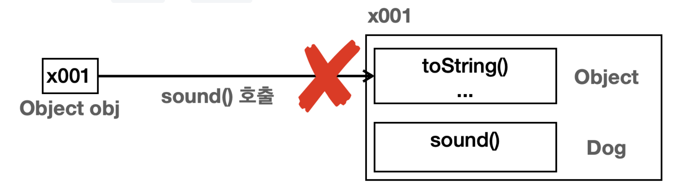
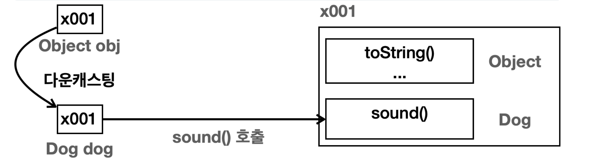
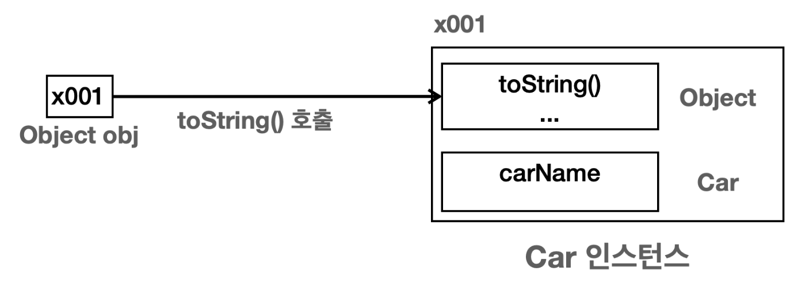
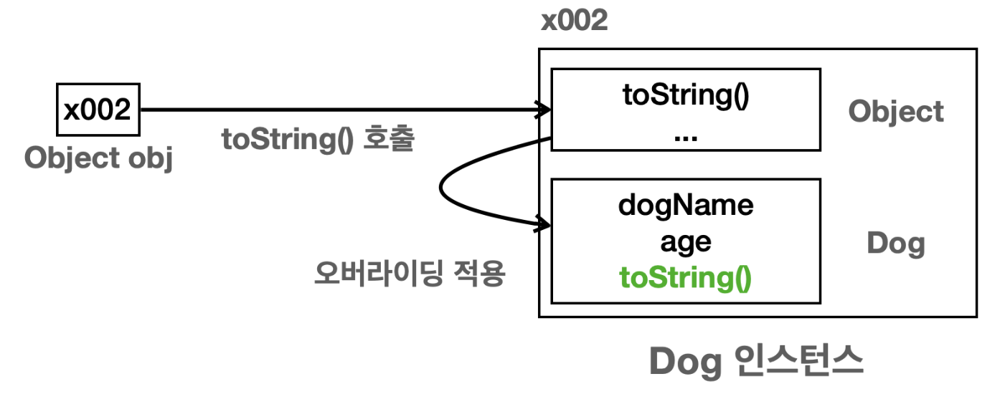
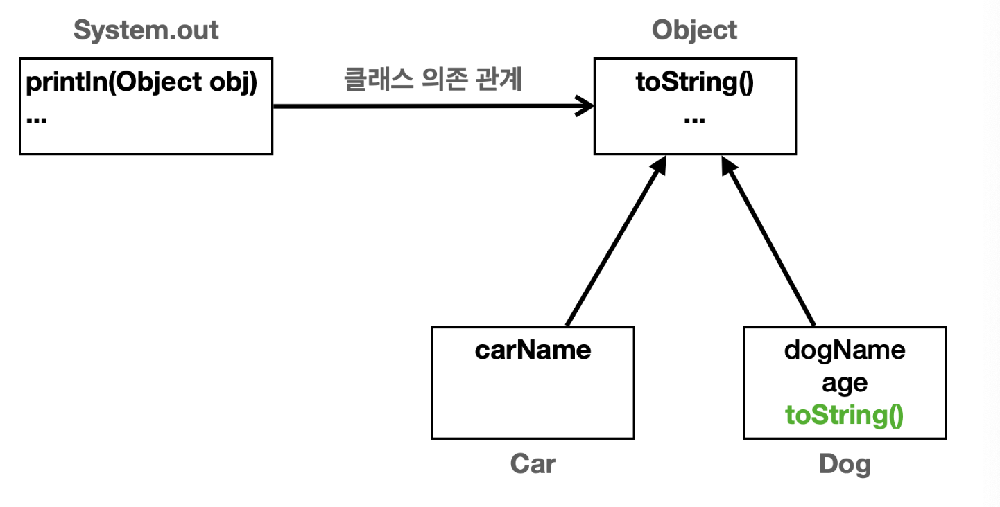

# Object 클래스

> Object 클래스

<!-- more -->

## 💡 Object 클래스란?

1. 모든 클래스의 최상위 클래스
2. java.lang 패키지에 속해 있음
    - 모든 프로그램에서 가장 많이 사용하는 기본 클래스 포함
    - 프로그래밍시 import 하지 않아도 자동으로 import 된다.
    - String, Integer, System...
3. 모든 클래스는 object를 상속 받음
    - Object클래스의 메서드 중 일부는 재정의 가능
    - 컴파일러가 extends obkect를 추가함

    ```java
    class Student => class abstract extends Object
    ```

<br>

## 💡 java에서 Object 클래스가 최상위 부모 클래스인 이유?

- 객체의 정보를 제공하고, 이 객체가 다른 객체와 같은지 비교하고, 객체가 어떤 클래스로 만들어졌는지 확인하는 기능은 모든 객체에게 필요한 기본 기능이다. 이런 기능을 객체로 만들 때마다 개발자가 새로운 메서드로 정의해서 만든다면 일관성이 없다. 따라서 모든 객체에 필요한 공통기능을 제공하기 위해 최상위 부모클래스로 제공하고, 모든 객체들은 상속(제공) 받을 수 있다.
 
### 1️⃣ 공통기능 제공
1. 객체의 정보를 제공하는 `toString()`
2. 객체의 같음을 비교하는 `equals()`
3. 객체의 클래스 정보를 제공하는 `getClass()` 
4. 기타 여러가지 기능

<br>

### 2️⃣ 다형성의 기본 구현

- 부모는 자식을 담을 수 있다. `Object` 는 모든 클래스의 부모 클래스이다. 따라서 모든 객체를 참조할 수 있다. -> 타입이 다른 객체들을 어딘가에 보관해야 한다면 바로 `Object` 에 보관하면 된다.  
- `Object` 클래스는 다형성을 지원하는 기본적인 메커니즘을 제공한다. 모든 자바 객체는 `Object` 타입으로 처리될 수 있으며, 이는 다양한 타입의 객체를 통합적으로 처리할 수 있게 해준다.

<br>

#### ⭕️ Object 다형성 장점


> `action(Object obj)`

-  `Object` 타입의 매개변수를 사용한다. 그런데 `Object` 는 모든 객체의 부모다. 따라서 어떤 객체든지 인 자로 전달할 수 있다.


```java
public class Dog {
    public void sound() {
        System.out.println("멍멍");
    }
}

public class Car {
   public void move(){
       System.out.println("자동차 이동");
   }
}
```

```java

public class Main {

    public static void main(String[] args) {
        Dog dog = new Dog();
        Car car = new Car();

        action(dog);
        action(car);
    }

    private static void action(Object object) {
        // Object는 Dog, Car를 모른다. 다운캐스팅이 필요하다
        // object.sound();  //object는 sound()가 없다
        // object.move();  //object는 move()가 없다

        // dog, car에 맞게 다운캐스팅
        if (object instanceof Dog dog) {
            dog.sound();
        } else if (object instanceof Car car) {
            car.move();
        }
    }

}

```

<br>

#### ❌ Object 다형성 한계

1. 메서드 오버라이딩 불가!!!
    - Object는 모든 객체의 부모이므로 모든 객체를 대상으로 다형적 참조를 할 수 있다. 하지만 Object에는 Dog.sound()와 같은 다른 객체의 메서드가 정의 되어 있지 않다.
2. 다운캐스팅 필요
    - 각 객체의 기능을 호출하려면 다운캐스팅이 필요하다. 물론 Object가 보유한 toString()은 오버라이딩 가능.

>  `obj` 는 `Object` 타입이기 때문에 최종부모로서 위로 올라가서 `sound()` 메서드를 찾을 수 없기 때문에 오류 발생
  


> 다운캐스팅을 통해 해결




<br>

## 💡 Object 배열

- 어떤 객체든 담을 수 있는 배열이다.
- size() 메서드는 Object타입만 사용한다. Object 타입은 세상의 모든 객체를 담을 수 있기 때문에, 새로운 클래스가 추가되거나 변경되어도 이 메서드는 수정하지 않아도 된다. 
 
```java
public class ObjectPolyExample2 {

    public static void main(String[] args) {
        Dog dog = new Dog();
        Car car = new Car();
        Object object = new Object();

        Object[] objects = {dog, car, object};
        size(objects);

    }

    public static void size(Object[] objects) {
        System.out.println("전달된 객체의 수는: " +  objects.length);
        // 전달된 객체의 수는: 3
    }
}

```

## 💡 toString() 메서드

> JDKObject-kosta StudentTest2.java


- 객체의 정보를 문자열로 표현하여 반환함
- 재정의하여 객체에 대한 설명이나 특정 멤버 변수 값을 반환함
    - String이나 Integer등 여러 JDK 클래스에서 toString() 메서드가 이미 재정의 되어 있음.
- 디버깅과 로깅에 유용하게 사용된다.
- Object가 toString()을 갖고있으므로 오버라이딩 해서 여러군데 사용할 수 있다.


- Object 가 제공하는 toString() 메서드는 기본적으로 패키지를 포함한 객체의 이름과 객체의 참조값(해시 코드)를 16진수로 제공한다.
    - 해시 코드: 객체의 참조값

```java
public String toString() {
    return getClass().getName() + "@" + Integer.toHexString(hashCode());
}
```
<br>

⭐️ println()과 toString()은 같은 결과를 반환한다. 

- `System.out.println()` 메서드는 사실 내부에서 `toString()` 을 호출하기 때문이다.
- println() 을 사용할 때, `toString()` 을 직접 호출할 필요 없이 객체를 바로 전달하면 객체의 정보를 출력할 수 있다.
  
    ```java
    public void println(Object x) {
        String s = String.valueOf(x);
        //...
    }


    public static String valueOf(Object obj) {
        return (obj == null) ? "null" : obj.toString();
    }
    ```


### 🍀 toString() 오버라이딩 예제

> Car, Dog 클래스 

- Dog 클래스에서 toString을 재정의 했다.

```java
public class Car {
    private  String carName;

    public Car(String carName) {
        this.carName = carName;
    }
}

public class Dog {
    private String dogName;
    private int age;

    public Dog(String dogName, int age) {
        this.dogName = dogName;
        this.age = age;
    }

    @Override
    public String toString() {
        return "Dog{" +
                "dogName='" + dogName + '\'' +
                ", age=" + age +
                '}';
    }
}
```
<br>

> ToStringMain2

- Car 인스턴트는 toString()을 재정의 하지 않았기 때문에, 기본 toString() 메서드를 사용한다 
- Dog 인스턴트는 toString()을 재정의 하여 객체의 상태를 명확하게 확인 가능
  

```java
public class ToStringMain2 {

    public static void main(String[] args) {

        Car car = new Car("Model Y");
        Dog dog1 = new Dog("멍멍이1", 1);
        Dog dog2 = new Dog("멍멍이2", 2);

        System.out.println("1. 단순 toString 호출");
        System.out.println(car.toString());  // lang.object.tostring.Car@452b3a41
        // toString()을 오버라이딩 한 dog
        System.out.println(dog1.toString());  //Dog{dogName='멍멍이1', age=1}
        System.out.println(dog2.toString());  //Dog{dogName='멍멍이2', age=2}


        // 사실 println 내부 로직에서 toString을 호출한다.
        System.out.println("2. println 내부에서 toString 호출");
        System.out.println(car);  // lang.object.tostring.Car@452b3a41
        System.out.println(dog1);  //Dog{dogName='멍멍이1', age=1}
        System.out.println(dog2);  //Dog{dogName='멍멍이2', age=2}
    }
}

```

```bash
1. 단순 toString 호출
lang.object.tostring.Car@452b3a41
Dog{dogName='멍멍이1', age=1}
Dog{dogName='멍멍이2', age=2}

1. println 내부에서 toString 호출
lang.object.tostring.Car@452b3a41
Dog{dogName='멍멍이1', age=1}
Dog{dogName='멍멍이2', age=2}

1. Object 다형성 활용
객체 정보 출력: lang.object.tostring.Car@452b3a41
객체 정보 출력: Dog{dogName='멍멍이1', age=1}
객체 정보 출력: Dog{dogName='멍멍이2', age=2}


```

<br>

> ObjectPrinter.print(Object obj)





⭐️ ObjectPrinter클래스는 OCP 원칙을 지키고 있다.
  
- 구체적인 Car, Dog에 의존하는 것이 아니라 추상적인 Object에 의존하기 때문에 OCP원칙을 지키고 있다.
    - Open : 새로운 클래스를 추가하고, toString() 을 오버라이딩해서 기능을 확장할 수 있다. 
    - Closed : 새로운 클래스를 추가해도 Object 와 toString() 을 사용하는 클라이언트 코드인 ObjectPrinter 는 변경하지 않아도 된다.
- 새로운 클래스를 추가하고 toString()메서드를 새롭게 오버라이딩 해서 기능을 확장할 수 있었다.
- 이러한 변화에도 클라이언트 코드인 ObjectPrinter는 변경할 필요가 없다.



<br>

```java

public class ObjectPrinter {
    public static void print(Object obj) {
        String string = "객체 정보 출력: " + obj.toString();
        System.out.println(string);
    }
}


public class ToStringMain2 {

    public static void main(String[] args) {

        Car car = new Car("Model Y");
        Dog dog1 = new Dog("멍멍이1", 1);
        Dog dog2 = new Dog("멍멍이2", 2);

        System.out.println("3. Object 다형성 활용");
        // static 이라서 바로 부를 수 있다.
        ObjectPrinter.print(car); // 객체 정보 출력: lang.object.tostring.Car@452b3a41
        ObjectPrinter.print(dog1);  // 객체 정보 출력: Dog{dogName='멍멍이1', age=1}
        ObjectPrinter.print(dog2); // 객체 정보 출력: Dog{dogName='멍멍이2', age=2}
    }
}

```

<br>

> 객체의 참조값 직접 출력

- `toString()` 이나 `hashCode()` 를 재정의하게 되면 객체의 참조값을 출력할 수 없다. 이때는 다음 코드를 사용하면 객체의 참조값을 출력할 수 있다.
-  예) dog1의 toString이 오버라이딩 되어있더라도 참조값을 볼 수 있는 방법


```java
public class ToStringMain2 {

    public static void main(String[] args) {

        Car car = new Car("Model Y");
        Dog dog1 = new Dog("멍멍이1", 1);
        Dog dog2 = new Dog("멍멍이2", 2);

        // 객체의 참조값 직접 출력
        String hexString = Integer.toHexString(System.identityHashCode(dog1));
        System.out.println("hexString = " + hexString);  //  refValue = 72ea2f77
    }
}
```

<br>

### ⚒️ 참고) 정적 vs 동적 의존관계

| 의존관계 유형   | 설명                                                                                              | 예시                                          |
|:--------------------------------:|:----------------------------------------------------------------:|:---------------------------------------------:|
| 정적 의존관계   | `컴파일` 시간에 결정되는 클래스 간의 관계. <br> 코드 분석만으로 의존관계 파악 가능.                                 | `ObjectPrinter`가 `Object` 클래스를 사용하는 관계   |
| 동적 의존관계   | `런타임`에 결정되며, 어떤 인스턴스가 사용될지 실행해야 알 수 있음. <br> a인스턴스의 실제 타입에 따라 달라짐.             | `ObjectPrinter.print(Object obj)`에서 `Car` 또는 `Dog`가 전달될 수 있음 |


## 💡 boolean equals(Object obj) 메서드

> JDKObject-kosta - StudentTest3.java

- 두 인스턴스 주소 값을 비교하여 boolean 값을 반환 해주는 메서드이다.
- 주소 값이 같다면 당연히 같은 인스턴스임
- 서로 다른 주소 값을 가질 때도 같은 인스턴스라고 정의할 수 있는 경우가 있음
    - 논리적 동일성: 재정의하여 두 인스턴스가 논리적으로 동일함의 여부를 구현함
    - 인스턴스가 다르더라도 논리적으로 동일한 경우 true를 반환하도록 재정의할 수 있음
    - 같은 학번, 같은 사번, 같은 아이디의 회원

<br>

### ⚒️ 동일성(==)과 동등성(equals())

1. `동일성(Identity)` : == 연산자를 사용해서 두 객체의 참조가 동일한 객체를 가리키고 있는지 확인 
2. `동등성(Equality)` : equals() 메서드를 사용하여 두 객체가 논리적으로 동등한지 확인


>  동일성과 동등성을 비교 예제

- Object가 기본으로 제공하는 equals() 는 `==` 으로 동일성 비교를 제공한다.

```java
public class EqualsMainV1 {

    public static void main(String[] args) {
        UserV1 user1 = new UserV1("id-100");
        UserV1 user2 = new UserV1("id-100");


        System.out.println("identity = " + (user1 == user2));  // false
        System.out.println("equality = " + user1.equals(user2));  // false
    }
}

```


>  id(고객번호)가 같으면 논리적으로 같은 객체로 정의하는 예제

- equals()는 Object 타입을 매개변수로 사용한다. 따라서 객체의 특정 값을 사용하려면 다운캐스팅이 필요
하다.
- UserV2에 있는 id 는 String 이다. 문자열 비교를 위해 `==` 이 아니라 equals()를 사용했다.

```java
public class UserV2 {
    private String id;

    public UserV2(String id) {
        this.id = id;
    }


    // 간단 버전
    @Override
    public boolean equals(Object obj) {
        UserV2 user = (UserV2) obj;
        return id.equals(user.id);  // 문자열 비교
    }


    /*  정확한 equals() 구현
    @Override
    public boolean equals(Object object) {
        if (this == object) return true;
        if (object == null || getClass() != object.getClass()) return false;
        UserV2 userV2 = (UserV2) object;
        return Objects.equals(id, userV2.id);
    }
    */
}

```

```bash
identity = false
equality = true
```


### ⚒️ equals 언제 사용하는걸까?

- 동일성 비교가 항상 필요한 것은 아니다. 
- 동일성 비교가 필요한 경우에만 equals()를 재정의하면 된다. 
- equals() hashcode()가 보통 함께 사용된다.

<br>


## 💡 int hashCode() 메서드

-   해시(hash)

    -   정보를 저장하거나 검색할 때 사용하는 자료구조
    -   index = hash(key)
        index -> 저장위치
        hash -> 해시함수
        key -> 객체 정보
        객테의 해시 코드 값이 반환됨(메모리 위치 값)

-   정보를 어디에 저장할 것인지, 어디서 가져올 것인지 해시 함수를 사용하여 구현함
-   해시 함수는 객체의 특정 정보(키 값)을 매개변수 값으로 넣으면 그 객체가 저장되어야 할 위치를 반환함
-   hashCode()는 인스턴스의 저장 주소를 반환홤
-   힙 메모리에 인스턴스가 저장되는 방식이 hash 방식
-   인스턴스가 다르더라도 논리적으로 동일한 경우 true를 반환하도록 재정의 할 수 있음

### 두 인스턴스가 같음
    - 두 인스턴스에 대한 equals()의 반환 값이 true
    - 두 인스턴스에 대한 hashCode()값을 반환
