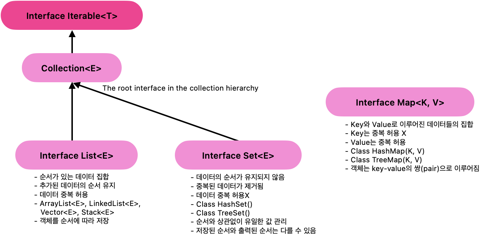

# 컬렉션 프레임워크

> 컬렉션 프레임워크 (ArrayList<E>, Vector<E>, LinkedList<E>)

<!-- more -->

## 💡 자료구조 (Data Structure)

1. 대량의 데이터를 효율적으로 관리하는 매커니즘을 자료구조라 함
    - 우편번호, 학번
    - 예) 무작위 명단
        - 무작위로 나열된 명단에서 특정 사람을 찾는 것은 비효율적임
        - 학년, 반, 번호로 관리
        - 체계적인 학생 관리를 통해 2학년 2반 30번 홍길동을 찾는 경우 효울적으로 찾을 수 있음
2. 배열, 리스트, 큐, 트리 등

    > 배열

    - 크기가 고정되어 있어서 데이터를 추가하거나 삭제할 수 있음
    - 새로 배열을 만들고 옮겨야 함

    > 리스트

    - 원소가 원소를 가리켜서 관리하는 자료구조임
    - 데이터가 추가되거나 삭제될 때 연결하는 정보만 바꾸면 쉽게 추가, 삭제 됨

    > 스택

    - 한쪽 끝 에서만 자료를 넣고 빼는 선형 구조
    - `LIFO(Last In First Out)` : 제일 먼저 쌓인 데이터가 제일 먼저 출력

    > 트리

    - 부모 노드 밑에 여러 자식 노드가 연결되어 있고, 자식 노드 가각에 다시 자식 노드가 연결되는 형태의 자료구조
    - 자식 노드에서 부모 쪽으로 계속 해서 타고 올라가다 보면 결국 부모가 없는 하나의 노드로 이어지게 됨(Root Node)
    - 루트노드를 중심으로 뻗어가는 모습이 나무의 구조와 비슷함.

## 💡 컬렉션(Collection)

1. 여러 데이터를 수집해 놓은 자료 구조
2. 저장 공간 크기가 동적으로 변화함
3. 당일한 타입을 묶어서 관리하는 자료 구조

## 💡 프레임워크

1. 클래스와 인터페이스의 묶음(라이브러리)
2. 클래스 정의에 설게하는 원칙 또는 구조가 존재
3. 리스트, 스택, 큐 등의 자료 구조에 정렬, 탐색 등의 알고리즘을 구현해 놓은 프레임워크
4. 자료구조를 개발자가 편리하게 사용할 수 있도록 컬랙션 프레임워크 제공

## 💡 주요 클래스와 인터페이스



## 💡 `List<E>` 컬렉션 인터페이스

1. 배열과 가장 비슷한 구조 지니고 있는 자료 구조

    - 순서가 있는 자료 관리
    - 데이터의 저장 순서 유지
    - 중복 허용
    - 베열을 이용하여 객체 저장

2. `ArrayList<E>`, `Vector<E>`, `LinkedList<E>`

3. 객체 생성

    - 구현 클래스 생성자로 동적 컬랙션 객체 생성
    - Arrays.asList(T...a) 메서드 이용해 정적 컬렉션 객체 생성
        - `static <T> List <T> asList(T...a)`

4. 주요 메서드

    - `add(E c)` : 객체를 추가함
    - `remove(Object o)` : 객체가 존재하면 제거함
    - `iterator`
    - `clear()`

<br>

## 💡 `Interface iterator<E>`

1. Collection 요소를 순회
2. 컬렉션 프레임워크에 저장된 요소들을 하나씩 차례로 참조하는 것
3. 순서가 있는 list 계열은 iterator대신 get(i)메서드를 사용한다.
4. Set 인터페이스의 경우 get(i)메서드가 제공되지 않으므로 Iterator를 이용하여 객체를 순회함
5. 메서드
    - `boolean hashNext()` : 이후에 요소가 더 있는지 체크하는 메서드. 요소가 있으면 true 반환
    - `E next()` : 다음에 있는 요소 반환

### 🍀 iterator 사용 예시

> CollectionFWTest - kosta2

```java
public class ArrayList3 {

	public static void main(String[] args) {

		List<String> list = new ArrayList<>();

		// 객체 저장: 순서 있음. 중복 허
		list.add("orange");
		list.add("apple");
		list.add("apple");
		list.add("banana");

		// 객체 참조 - 반복문 획득
		Iterator<String> itr = list.iterator();

		String str0;
		while(itr.hasNext()) {
			str0 = itr.next();
			System.out.println(str0 + " ");
		}
    }
}
```

## 💡 `Interface Set<E>`

1. 중복되지 않게 자료를 관리

    - 멤버의 중복 여부를 체크하기 위해 인스턴스의 동일성을 확인해야 함
    - 동일성 구혀을 위해 필요에 따라 equals() hashCode() 메서드를 재정의 해야한다.

2. 저장 순서가 유지되지 않음
3. 데이터 중복 저장을 허용하지 않음
4. 예시
    - 아이디 동일한 경우 같은 멤머이므로 중복되지 않도록 Member 클래스의 equals()와 hashCode()메서드를 재정의 해야함

### 🍀 set 예제

<details>
<summary>[Member]</summary>

```java
package kr.co.kosta5;

import java.util.Objects;

public class Member {
	private int memberId;
	private String memberName;

	public Member(int memberId, String memberName) {
		// super();
		this.memberId = memberId;
		this.memberName = memberName;
	}

	public int getMemberId() {
		return memberId;
	}

	public void setMemberId(int memberId) {
		this.memberId = memberId;
	}

	public String getMemberName() {
		return memberName;
	}

	public void setMemberName(String memberName) {
		this.memberName = memberName;
	}

	@Override
	public String toString() {
		return "회원님의 아이디는 " + memberId + ", 이름은 " + memberName + "입니다.";
	}

	@Override
	public boolean equals(Object obj) {
		if (obj instanceof Member) {
			Member member = (Member) obj;
			if (this.memberId == member.memberId)
				return true;
			else
				return false;
		}
		return super.equals(obj);
	}

	@Override
	public int hashCode() {
		return memberId;
	}

}

```

</details>

<details>
<summary>[MemberHashSet]</summary>

```java

public class MemberHashSet {

	private HashSet<Member> hashSet;

	public MemberHashSet() {
		hashSet = new HashSet<>();
	}

	public void addMember(Member member) {
		hashSet.add(member);
	}

	public boolean removeMember(int memberId) {

		Iterator<Member> ir = hashSet.iterator();

		while (ir.hasNext()) {
			Member member = ir.next();
			int tempId = member.getMemberId();
			if (tempId == memberId) {
				hashSet.remove(member);
				return true;
			}
		}
		System.out.println(memberId + "가 존재하지 않습니다.");
		return false;
	}


	public void showAllMembers() {

		for(Member member : hashSet)
			System.out.println(member);
		System.out.println();
	}

}


```

</details>

<details>
<summary>[MemberHashSetTest]</summary>

```java

public class MemberHashSetTest {

	public static void main(String[] args) {

		MemberHashSet memberHashSet =  new MemberHashSet();

		Member member1 = new Member(111, "이름1");
		Member member2 = new Member(222, "이름2");
		Member member3 = new Member(333, "이름3");
		Member member4 = new Member(444, "이름4");

		memberHashSet.addMember(member1);
		memberHashSet.addMember(member2);
		memberHashSet.addMember(member3);
		memberHashSet.addMember(member4);

		memberHashSet.showAllMembers();

		Member member5 = new Member(444, "이름5");
		memberHashSet.addMember(member5);

		memberHashSet.showAllMembers();  //중복여부가 체크 안되고 있음 -> Member객체에 hashcode, equals 오버라이드 필

	}

}


```

</details>

```bash
회원님의 아이디는 444, 이름은 이름4입니다.
회원님의 아이디는 333, 이름은 이름3입니다.
회원님의 아이디는 222, 이름은 이름2입니다.
회원님의 아이디는 111, 이름은 이름1입니다.

회원님의 아이디는 444, 이름은 이름4입니다.
회원님의 아이디는 333, 이름은 이름3입니다.
회원님의 아이디는 222, 이름은 이름2입니다.
회원님의 아이디는 111, 이름은 이름1입니다.
회원님의 아이디는 444, 이름은 이름5입니다.
```

📌 set인데 중복여부가 체크 안되고 있어서, 이미 set에있는 멤버가 추가 되고있는 상황.

-   Member객체에 hashcode(), equals() 오버라이드 필요!!

📌 왜 hashcode(), equals() 오버라이딩이 필요할까?

-   기본적으로 모든 클래스는 Object 클래스를 상속받으며, Object 클래스의 equals와 hashCode 메서드는 객체의 메모리 주소를 기준으로 동등성을 판단합니다.
-   Member 클래스에서 equals와 hashCode 메서드를 오버라이드하지 않으면, HashSet은 Member 객체의 실제 내용을 기준으로 중복을 확인할 수 없다.

<details>
<summary>[Member] 코드 수정</summary>

```java
package kr.co.kosta5;

import java.util.Objects;

public class Member {
	private int memberId;
	private String memberName;

	public Member(int memberId, String memberName) {
		// super();
		this.memberId = memberId;
		this.memberName = memberName;
	}

	// 생략

	@Override
	public String toString() {
		return "회원님의 아이디는 " + memberId + ", 이름은 " + memberName + "입니다.";
	}

	@Override
	public boolean equals(Object obj) {
		if (obj instanceof Member) {
			Member member = (Member) obj;
			if (this.memberId == member.memberId)
				return true;
			else
				return false;
		}
		return super.equals(obj);
	}

	@Override
	public int hashCode() {
		return memberId;
	}

}

```

</details>

📌 Member 클래스의 equals와 hashCode 메서드가 오버라이드 되었기 때문에, MemberHashSet 클래스의 addMember 메서드는 Member 객체의 memberId 필드를 기준으로 중복을 올바르게 확인 가능 하다.  
📌 member5를 추가하려고 하면, member4와 동일한 memberId를 가지기 때문에 HashSet은 중복으로 인식하여 추가하지 않는다.

```bash
회원님의 아이디는 444, 이름은 이름4입니다.
회원님의 아이디는 333, 이름은 이름3입니다.
회원님의 아이디는 222, 이름은 이름2입니다.
회원님의 아이디는 111, 이름은 이름1입니다.

회원님의 아이디는 444, 이름은 이름4입니다.
회원님의 아이디는 333, 이름은 이름3입니다.
회원님의 아이디는 222, 이름은 이름2입니다.
회원님의 아이디는 111, 이름은 이름1입니다.
```

## 💡 `Class TreeSet<E>`

1. 객체의 정렬에 사용하는 컬렉션 클래스
2. 정렬하기 위해 이진탐색트리(Binary Search Tree)를 사용함
3. 이진 탐색 트리

    - 트리 자료구조에서 각 자료가 들어가는 공간을 노드(node)라고 함
    - 위아래로 연결된 노드의 관계되는 자료의 중복을 허용하지 않고, 부모가 가지는 자식 노드는 2개 이하이다.
        - 각 노드의 왼쪽 서브 트리에는 해당 노드의 값보다 작은 값을 지닌 노드들로 이루어져 있음
        - 각 노드의 오른쪽 서브 트리에는 해당 노드의 값보다 큰 값을 지닌 노드들로 이루어져 있음
        - 중복된 노드가 없어야 함
        - 왼쪽 서브트리, 오른쪽 서브 트리 도한 이진 탐색 트리임
    - 어떤 기준으로 객체 크기를 비교할 것인지는 프로그래머가 직접 구현해야 함
    - ⭐️ 노드의 값을 비교하여 트리의 구조를 유지한다. 이 비교 기준을 정의하기 위해 자바의 `interface Comparable<T>` 인터페이스를 사용한다.

        - 인터페이스를 구현하는 클래스는 compareTo 메서드를 정의해야 한다. -> 두 객체를 비교하여 순서를 결정하는 데 사용

            ```java
            public int compareTo(T o);

            // 예시
            @Override
            public int compareTo(Student stu) {
            	// return this.age - stu.age; // 오름차순 정렬
            	return this.name.compareTo(stu.name);
            }
            ```

            - 인수로 전달된 o 가 작다면 양의 정수 반환
            - 인수로 전달된 0가 크다면 음의 정수 반환
            - 인수로 전달된 0와 같다면 0을 반환

4. TreeSet<T>에 저장할 객체들은 모두 Comparable<T> 인터페이스를 반드시 구현할 클래스의 객체여야 함
