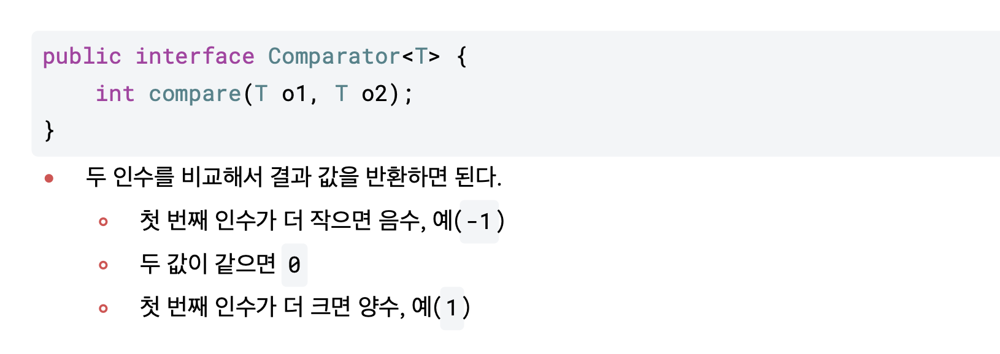

# 컬렉션 프레임워크

> 컬렉션 프레임워크 (ArrayList<E>, Vector<E>, LinkedList<E>)

<!-- more -->

## 💡 자료구조 (Data Structure)

1. 대량의 데이터를 효율적으로 관리하는 매커니즘을 자료구조라 함
    - 우편번호, 학번
    - 예) 무작위 명단
        - 무작위로 나열된 명단에서 특정 사람을 찾는 것은 비효율적임
        - 학년, 반, 번호로 관리
        - 체계적인 학생 관리를 통해 2학년 2반 30번 홍길동을 찾는 경우 효울적으로 찾을 수 있음
2. 배열, 리스트, 큐, 트리 등

    > 배열

    - 크기가 고정되어 있어서 데이터를 추가하거나 삭제할 수 있음
    - 새로 배열을 만들고 옮겨야 함

    > 리스트

    - 원소가 원소를 가리켜서 관리하는 자료구조임
    - 데이터가 추가되거나 삭제될 때 연결하는 정보만 바꾸면 쉽게 추가, 삭제 됨

    > 스택

    - 한쪽 끝 에서만 자료를 넣고 빼는 선형 구조
    - `LIFO(Last In First Out)` : 제일 먼저 쌓인 데이터가 제일 먼저 출력

    > 트리

    - 부모 노드 밑에 여러 자식 노드가 연결되어 있고, 자식 노드 가각에 다시 자식 노드가 연결되는 형태의 자료구조
    - 자식 노드에서 부모 쪽으로 계속 해서 타고 올라가다 보면 결국 부모가 없는 하나의 노드로 이어지게 됨(Root Node)
    - 루트노드를 중심으로 뻗어가는 모습이 나무의 구조와 비슷함.

## 💡 컬렉션(Collection)

1. 여러 데이터를 수집해 놓은 자료 구조
2. 저장 공간 크기가 동적으로 변화함
3. 당일한 타입을 묶어서 관리하는 자료 구조

## 💡 프레임워크

1. 클래스와 인터페이스의 묶음(라이브러리)
2. 클래스 정의에 설게하는 원칙 또는 구조가 존재
3. 리스트, 스택, 큐 등의 자료 구조에 정렬, 탐색 등의 알고리즘을 구현해 놓은 프레임워크
4. 자료구조를 개발자가 편리하게 사용할 수 있도록 컬랙션 프레임워크 제공

## 💡 주요 클래스와 인터페이스


## 💡 `List<E>` 컬렉션 인터페이스

1. 배열과 가장 비슷한 구조 지니고 있는 자료 구조

    - 순서가 있는 자료 관리
    - 데이터의 저장 순서 유지
    - 중복 허용
    - 베열을 이용하여 객체 저장

2. `ArrayList<E>`, `Vector<E>`, `LinkedList<E>`

3. 객체 생성

    - 구현 클래스 생성자로 동적 컬랙션 객체 생성
    - Arrays.asList(T...a) 메서드 이용해 정적 컬렉션 객체 생성
        - `static <T> List <T> asList(T...a)`

4. 주요 메서드

    - `add(E c)` : 객체를 추가함
    - `remove(Object o)` : 객체가 존재하면 제거함
    - `iterator`
    - `clear()`

<br>

## 💡 `Interface iterator<E>`

1. Collection 요소를 순회
2. 컬렉션 프레임워크에 저장된 요소들을 하나씩 차례로 참조하는 것
3. 순서가 있는 list 계열은 iterator대신 get(i)메서드를 사용한다.
4. Set 인터페이스의 경우 get(i)메서드가 제공되지 않으므로 Iterator를 이용하여 객체를 순회함
5. 메서드
    - `boolean hashNext()` : 이후에 요소가 더 있는지 체크하는 메서드. 요소가 있으면 true 반환
    - `E next()` : 다음에 있는 요소 반환

### 🍀 iterator 사용 예시

> CollectionFWTest - kosta2

```java
public class ArrayList3 {

	public static void main(String[] args) {

		List<String> list = new ArrayList<>();

		// 객체 저장: 순서 있음. 중복 허
		list.add("orange");
		list.add("apple");
		list.add("apple");
		list.add("banana");

		// 객체 참조 - 반복문 획득
		Iterator<String> itr = list.iterator();

		String str0;
		while(itr.hasNext()) {
			str0 = itr.next();
			System.out.println(str0 + " ");
		}
    }
}
```

## 💡 `Interface Set<E>`

1. 중복되지 않게 자료를 관리

    - 멤버의 중복 여부를 체크하기 위해 인스턴스의 동일성을 확인해야 함
    - 동일성 구혀을 위해 필요에 따라 equals() hashCode() 메서드를 재정의 해야한다.

2. 저장 순서가 유지되지 않음
3. 데이터 중복 저장을 허용하지 않음
4. 예시
    - 아이디 동일한 경우 같은 멤머이므로 중복되지 않도록 Member 클래스의 equals()와 hashCode()메서드를 재정의 해야함

### 🍀 set 예제

<details>
<summary>[Member]</summary>

```java
package kr.co.kosta5;

import java.util.Objects;

public class Member {
	private int memberId;
	private String memberName;

	public Member(int memberId, String memberName) {
		// super();
		this.memberId = memberId;
		this.memberName = memberName;
	}

	public int getMemberId() {
		return memberId;
	}

	public void setMemberId(int memberId) {
		this.memberId = memberId;
	}

	public String getMemberName() {
		return memberName;
	}

	public void setMemberName(String memberName) {
		this.memberName = memberName;
	}

	@Override
	public String toString() {
		return "회원님의 아이디는 " + memberId + ", 이름은 " + memberName + "입니다.";
	}

	@Override
	public boolean equals(Object obj) {
		if (obj instanceof Member) {
			Member member = (Member) obj;
			if (this.memberId == member.memberId)
				return true;
			else
				return false;
		}
		return super.equals(obj);
	}

	@Override
	public int hashCode() {
		return memberId;
	}

}

```

</details>

<details>
<summary>[MemberHashSet]</summary>

```java

public class MemberHashSet {

	private HashSet<Member> hashSet;

	public MemberHashSet() {
		hashSet = new HashSet<>();
	}

	public void addMember(Member member) {
		hashSet.add(member);
	}

	public boolean removeMember(int memberId) {

		Iterator<Member> ir = hashSet.iterator();

		while (ir.hasNext()) {
			Member member = ir.next();
			int tempId = member.getMemberId();
			if (tempId == memberId) {
				hashSet.remove(member);
				return true;
			}
		}
		System.out.println(memberId + "가 존재하지 않습니다.");
		return false;
	}


	public void showAllMembers() {

		for(Member member : hashSet)
			System.out.println(member);
		System.out.println();
	}

}


```

</details>

<details>
<summary>[MemberHashSetTest]</summary>

```java

public class MemberHashSetTest {

	public static void main(String[] args) {

		MemberHashSet memberHashSet =  new MemberHashSet();

		Member member1 = new Member(111, "이름1");
		Member member2 = new Member(222, "이름2");
		Member member3 = new Member(333, "이름3");
		Member member4 = new Member(444, "이름4");

		memberHashSet.addMember(member1);
		memberHashSet.addMember(member2);
		memberHashSet.addMember(member3);
		memberHashSet.addMember(member4);

		memberHashSet.showAllMembers();

		Member member5 = new Member(444, "이름5");
		memberHashSet.addMember(member5);

		memberHashSet.showAllMembers();  //중복여부가 체크 안되고 있음 -> Member객체에 hashcode, equals 오버라이드 필

	}

}


```

</details>

```bash
회원님의 아이디는 444, 이름은 이름4입니다.
회원님의 아이디는 333, 이름은 이름3입니다.
회원님의 아이디는 222, 이름은 이름2입니다.
회원님의 아이디는 111, 이름은 이름1입니다.

회원님의 아이디는 444, 이름은 이름4입니다.
회원님의 아이디는 333, 이름은 이름3입니다.
회원님의 아이디는 222, 이름은 이름2입니다.
회원님의 아이디는 111, 이름은 이름1입니다.
회원님의 아이디는 444, 이름은 이름5입니다.
```

📌 set인데 중복여부가 체크 안되고 있어서, 이미 set에있는 멤버가 추가 되고있는 상황.

-   Member객체에 hashcode(), equals() 오버라이드 필요!!

📌 왜 hashcode(), equals() 오버라이딩이 필요할까?

-   기본적으로 모든 클래스는 Object 클래스를 상속받으며, Object 클래스의 equals와 hashCode 메서드는 객체의 메모리 주소를 기준으로 동등성을 판단합니다.
-   Member 클래스에서 equals와 hashCode 메서드를 오버라이드하지 않으면, HashSet은 Member 객체의 실제 내용을 기준으로 중복을 확인할 수 없다.

<details>
<summary>[Member] 코드 수정</summary>

```java
package kr.co.kosta5;

import java.util.Objects;

public class Member {
	private int memberId;
	private String memberName;

	public Member(int memberId, String memberName) {
		// super();
		this.memberId = memberId;
		this.memberName = memberName;
	}

	// 생략

	@Override
	public String toString() {
		return "회원님의 아이디는 " + memberId + ", 이름은 " + memberName + "입니다.";
	}

	@Override
	public boolean equals(Object obj) {
		if (obj instanceof Member) {
			Member member = (Member) obj;
			if (this.memberId == member.memberId)
				return true;
			else
				return false;
		}
		return super.equals(obj);
	}

	@Override
	public int hashCode() {
		return memberId;
	}

}

```

</details>

📌 Member 클래스의 equals와 hashCode 메서드가 오버라이드 되었기 때문에, MemberHashSet 클래스의 addMember 메서드는 Member 객체의 memberId 필드를 기준으로 중복을 올바르게 확인 가능 하다.  
📌 member5를 추가하려고 하면, member4와 동일한 memberId를 가지기 때문에 HashSet은 중복으로 인식하여 추가하지 않는다.

```bash
회원님의 아이디는 444, 이름은 이름4입니다.
회원님의 아이디는 333, 이름은 이름3입니다.
회원님의 아이디는 222, 이름은 이름2입니다.
회원님의 아이디는 111, 이름은 이름1입니다.

회원님의 아이디는 444, 이름은 이름4입니다.
회원님의 아이디는 333, 이름은 이름3입니다.
회원님의 아이디는 222, 이름은 이름2입니다.
회원님의 아이디는 111, 이름은 이름1입니다.
```

## 💡 `Class TreeSet<E>`

1. 객체의 정렬에 사용하는 컬렉션 클래스
2. 정렬하기 위해 이진탐색트리(Binary Search Tree)를 사용함
3. 이진 탐색 트리

    - 트리 자료구조에서 각 자료가 들어가는 공간을 노드(node)라고 함
    - 위아래로 연결된 노드의 관계되는 자료의 중복을 허용하지 않고, 부모가 가지는 자식 노드는 2개 이하이다.
        - 각 노드의 왼쪽 서브 트리에는 해당 노드의 값보다 작은 값을 지닌 노드들로 이루어져 있음
        - 각 노드의 오른쪽 서브 트리에는 해당 노드의 값보다 큰 값을 지닌 노드들로 이루어져 있음
        - 중복된 노드가 없어야 함
        - 왼쪽 서브트리, 오른쪽 서브 트리 도한 이진 탐색 트리임
    - 어떤 기준으로 객체 크기를 비교할 것인지는 프로그래머가 직접 구현해야 함
    - ⭐️ 노드의 값을 비교하여 트리의 구조를 유지한다. 이 비교 기준을 정의하기 위해 자바의 `interface Comparable<T>` 인터페이스를 사용한다.

        - 인터페이스를 구현하는 클래스는 compareTo 메서드를 정의해야 한다. -> 두 객체를 비교하여 순서를 결정하는 데 사용

            ```java
            public int compareTo(T o);

            // 예시
            @Override
            public int compareTo(Student stu) {
            	// return this.age - stu.age; // 오름차순 정렬
            	return this.name.compareTo(stu.name);
            }
            ```

            - 인수로 전달된 o 가 작다면 양의 정수 반환
            - 인수로 전달된 0가 크다면 음의 정수 반환
            - 인수로 전달된 0와 같다면 0을 반환
            - 

4. TreeSet<T>에 저장할 객체들은 모두 Comparable<T> 인터페이스를 반드시 구현할 클래스의 객체여야 함
    - 그렇지 않으면 예외가 발생함.

### 🍀 treeSet 예제 1

<details>
<summary>Comparable 사용법 예제</summary>

```java

package kr.co.kosta6;

import java.util.Set;
import java.util.TreeSet;

class Student implements Comparable<Student> {
   private String name;
   private int age;

   public Student() {}

   public Student(String name, int age) {
      this.name = name;
      this.age = age;
   }

   public String toString() {
      return name +" : "+ age;
   }

   @Override
   public int compareTo(Student stu) {
      return this.age - stu.age;            // 나이 오름차순
      //return stu.age - this.age;         // 나이 내림차순
      //return this.name.compareTo(stu.name)   // 나이 오름차순
      //return this.age - stu.age;         // 나이 내림차순

   }
}

public class ComparableTest {
   public static void main(String[] args) {
      Set<Student> tree = new TreeSet<>();
      tree.add(new Student("이순신", 30));
      tree.add(new Student("신사임당", 40));
      tree.add(new Student("류성룡", 25));

      for(Student s : tree)
         System.out.println(s);


   }

}
```

```bash
류성룡 : 25
이순신 : 30
신사임당 : 40

```

</details>

### 🍀 treeSet 예제 2

-   treeSets 구조에서는 compareTo를 오버라이딩 해줘야 중복된 데이터 저장을 막을 수 있다.
-   Member클래스에서 Comparable<Member>를 implements 받아서 CompareTo를 오버라이딩 한다.

<details>
<summary> treeSet 구조 compareTo 오버라이딩 필요</summary>

```java
public class MemberTreeSet {
    private TreeSet<Member> treeSet;

    public MemberTreeSet() {
        treeSet = new TreeSet<>();
    }

    public void addMember(Member member1) {
        treeSet.add(member1);
    }

    public boolean removeMember(int memberId) {
        Iterator<Member> ir = treeSet.iterator();

        while (ir.hasNext()) {
            Member member = ir.next();
            int tempId = member.getMemberId();
            if (tempId == memberId) {
                treeSet.remove(member);
                return true;
            }

        }
        System.out.println(memberId + "가 존재하지 않습니다.");
        return false;
    }

    //showAllMember()
    public void showAllMembers() {
        for (Member m : treeSet) {
            System.out.println(m);
        }
        System.out.println();
    }

}

```

-   treeSets 에서 compareTo를 오버라이딩 해줘야 한다.

```java
package kr.co.kosta6;

public class Member implements Comparable<Member> {

	private int memberId;
	private String memberName;

	public Member(int memberId, String memberName) {
		this.memberId = memberId;
		this.memberName = memberName;
	}

	public int getMemberId() {
		return memberId;
	}

	public void setMemberId(int memberId) {
		this.memberId = memberId;
	}

	public String getMemberName() {
		return memberName;
	}

	public void setMemberName(String memberName) {
		this.memberName = memberName;
	}

	@Override
	public String toString() {
		return "Member{" + "memberId=" + memberId + ", memberName='" + memberName + '\'' + '}';
	}

	@Override
	public boolean equals(Object obj) {
		if (obj instanceof Member) {
			Member member = (Member) obj;
			if (this.memberId == member.memberId)
				return true;
			else
				return false;
		}
		return false;
	}

	@Override
	public int hashCode() {
		return memberId;
	}

	@Override
	public int compareTo(Member member) {
		// return this.memberId - member.memberId; // MemberId를 기준으로 오름차순 정렬
		// return member.memberId - this.memberId; // MemberId 기준 내림차순

		// MemberName 기준 오름차순
		// return this.memberName.compareTo(member.memberName);

		// MemberName 기준 내림차순
		// return member.memberName.compareTo(this.memberName);


		// 내림 차순
		if (this.memberId > member.memberId) {
			return 1;
		} else if (this.memberId < member.memberId) {

			return -1;
		}
		return 0;
	}

}


```

-   treeSet 구조에서는 중복된 데이터는 허용하지 않는다.

```java
package kr.co.kosta6;


public class MemberTreeSetTest {
    public static void main(String[] args) {

        MemberTreeSet treeSet = new MemberTreeSet();

        treeSet.addMember(new Member(111, "김김김"));
        treeSet.addMember(new Member(222, "이이이"));
        treeSet.addMember(new Member(333, "박박박"));
        treeSet.addMember(new Member(444, "강강강"));

        // Member 클래스에서 compareTo 오버라이드 해서 구현했기 떄문에 treeSet 구조에서 중복을 허용하지 않고 있다.
        treeSet.addMember(new Member(444, "강강강"));

        treeSet.showAllMembers();

    }
}


```

</details>

<br>

## 💡 `Interface Map(K key, V value)` 컬렉션 인터페이스

1.  Key와 Value로 이루어진 데이터들의 집합이다.
2.  Key는 중복 저장 불가, Value는 중복 가능
3.  Map.Entry는 Map의 각 키-값 쌍을 나타내는 인터페이스이다.
4.  메서드
    -   데이터 추가
        -   `V put(K key, V value)` : Map 객체에 추가 (add가 아니라 put)
    -   데이터 변경
        -   `V replace(K key, V value)`
    -   데이터 추출
        -   `V get(Object key)` : 매개변수 key 값에 해당하는 value를 리턴
        -   `Set<K> keySet()` : Map 데이터 중 key들만 뽑아 Set객체로 리턴
    -   데이터 삭제
        -   `V remove(Object key)` : 입력 매개변수 key를 갖는 엔트리 삭제. 단, 해당 키가 없다면 아무런 동작이 일어나지 않음
5.  대표적인 구현 클래스
    -   Class HashMap<K, V>
        -   가장 많이 사용되는 Map 인터페이스 기반 클래스
        -   key, value를 쌍으로 관리하는 메서드를 구현함
        -   검색을 위한 자료구조이다.
        -   key를 이용하여 값을 저장하고, 이 key를 이용하여 값을 꺼내오는 방식
        -   ⭐️ key가 되는 객체는 중복될 수 없고, 객체의 유일성을 비교를 위한 오버라이드(equals(), hashCode())를 해야 중복 방지가 보장됨.
    -   Class LinkedHashMap<K, V>
    -   Class HashTable<K, V>
    -   Class TreeMap<K, V>

### 🍀 Map 메서드 사용법

<details>
<summary>Hash 기본적인 메서드 사용해보기</summary>

```java
package kr.co.kosta7;

import java.util.Map;
import java.util.Set;
import java.util.HashMap;

public class HashMapTest {

	public static void main(String[] args) {

		Map<Integer, String> hMap1 = new HashMap<>();

		// put<K, V>
		hMap1.put(2, "나다라");
		hMap1.put(1, "가나다");
		hMap1.put(3, "다라마");
		System.out.println(hMap1.toString()); // {1=가나다, 2=나다라, 3=다라마}

		// putAll<K, V>
		Map<Integer, String> hMap2 = new HashMap<>();
		hMap2.putAll(hMap1);
		System.out.println(hMap2.toString()); // {1=가나다, 2=나다라, 3=다라마}

		// replace<K, V>
		hMap2.replace(1, "가가가");
		hMap2.replace(4, "라라라"); // 해당하는 키가 없다면 동작 x
		System.out.println(hMap2.toString()); // {1=가가가, 2=나다라, 3=다라마}

		hMap2.replace(1, "가가가", "gagaga");
		hMap2.replace(2, "가가가", "nadara"); // 2번째에 해당하는 값 나다라 이므로, 동작 x
		System.out.println(hMap2.toString()); // {1=gagaga, 2=나다라, 3=다라마}

		// get(Object key) : 데이터 정보 추출
		System.out.println(hMap2.get(1)); // gagaga
		System.out.println(hMap2.get(2)); // 나다라
		System.out.println(hMap2.get(3)); // 다라마

		// containsKey(Object key) : 데이터 정보 추출
		System.out.println(hMap2.containsKey(1)); // true
		System.out.println(hMap2.containsKey(15)); // false

		// containsKey(Object value) : 데이터 정보 추출
		System.out.println(hMap2.containsValue("gagaga")); // true
		System.out.println(hMap2.containsValue("nanana")); // false

		// Set<K> keySet()
		Set<Integer> keySets = hMap2.keySet();
		System.out.println(keySets); // [1, 2, 3]
		System.out.println(keySets.toString()); // [1, 2, 3]

		// Set<Map.Entry<K,V>> entrySet()
		Set<Map.Entry<Integer, String>> entrySet = hMap2.entrySet();
		System.out.println(entrySet); // [1=gagaga, 2=나다라, 3=다라마]

		System.out.println(hMap2.size()); // 3

		// V remove(Object key)
		hMap2.remove(1);
		hMap2.remove(4); // 없는 키값 -> 동작 오류
		System.out.println(hMap2); // {2=나다라, 3=다라마}
		System.out.println(hMap2.toString()); // {2=나다라, 3=다라마}

		// boolean remove(Object key, Object value): 데이터 삭제
		hMap2.remove(2, "나다라"); // key,value 일치 삭제 가능
		hMap2.remove(3, "dadad"); // value 불일치 삭제 불가능
		System.out.println(hMap2.toString()); // {3=다라마}

		// 전부 삭제
		hMap2.clear();
		System.out.println(hMap2.toString()); // {}

	}

}

```

</details>

### 🍀 HashMap 키 중복 처리 예제

<details>
<summary> HashMap<K, V>에서 equals와 hashCode 메서드를 오버라이드하여 키의 중복 확인 및 처리 </summary>

-   HashMap<K, V> 에서 key 중복시 확인 (논리적 동등성)

```java


class A {
	int data;

	public A(int data) {
		this.data = data;
	}
}
```

-   equals() 메서드 오버라이딩

```java
class B {
	int data;

	public B(int data) {
		this.data = data;
	}

	@Override
	public boolean equals(Object obj) {
		if (obj instanceof B) {
			this.data = ((B) obj).data;
			return true;
		}
		return false;
	}
}


```

-   equals() + hashCode() 메서드 오버라이딩

```java

class C {
	int data;

	public C(int data) {
		this.data = data;
	}

	@Override
	public boolean equals(Object obj) {
		if (obj instanceof C) {
			this.data = ((C) obj).data;
			return true;
		}
		return false;
	}

	@Override
	public int hashCode() {
		return Objects.hash(data);

	}
}

```

```java

public class HashMApKeyDuplicatedTest {

	public static void main(String[] args) {
		HashMap<A, String> hashMap1 = new HashMap<>();

		A a1 = new A(3);
		A a2 = new A(3);

		System.out.println(a1 == a2); // false
		System.out.println(a1.equals(a2)); // false 아직오버라이딩 하기 전 -> Object 꺼라서 equals하지 않다고 나온다.
		System.out.println(a1.hashCode() + ", " + a2.hashCode()); // 142257191, 1044036744 오버라이드 하기 전 -> Object 꺼라서
																	// hashCode 다르게 나온다.

		hashMap1.put(a1, "첫 번째");
		hashMap1.put(a2, "첫 번째");
		System.out.println(hashMap1.size()); // 2, 서로 다른 객체로 인식하고 있다 (어떤 것(equals, hashCode)도 오버라이딩 되지 않은 상태)
		System.out.println();

		// equals() 메서드만 오버라이딩 한 후!
		HashMap<B, String> hashMap2 = new HashMap<>();
		B b1 = new B(3);
		B b2 = new B(3);
		System.out.println(b1 == b2); // false
		System.out.println(b1.equals(b2)); // true (바뀐 부분!!)
		System.out.println(b1.hashCode() + ", " + a2.hashCode()); // 142257191, 1044036744 (여전히 다름)

		hashMap2.put(b1, "첫 번째");
		hashMap2.put(b2, "첫 번째");
		System.out.println(hashMap2.size()); // 2 {b1, "첫번째" }, {b1, "첫번째"}

		// equals() + hashCode() 메서드 오버라이딩!
		HashMap<C, String> hashMap3 = new HashMap<>();
		C c1 = new C(3);
		C c2 = new C(3);
		System.out.println(c1 == c2); // false
		System.out.println(c1.equals(c2)); // true (바뀐 부분!!)
		System.out.println(c1.hashCode() + ", " + c2.hashCode()); // 142257191, 1044036744 (여전히 다름)

		hashMap3.put(c1, "첫 번째");
		hashMap3.put(c2, "첫 번째");
		System.out.println(hashMap3.size()); // 1

	}
}

```

</details>

<br>

### 🍀 HashMap 예제 2

<details>
<summary> HashMap에서 향상된 for문 사용 , Iterator 사용 </summary>

```java
package kr.co.kosta7;

import java.util.HashMap;
import java.util.Map;

public class HashMapTest3 {
	public static void main(String[] args) {
		Map<Character, Integer> countMap = new HashMap<>();

		String str = "Hello, kosta Summer Festival!";
		char[] array = str.toCharArray();

		for(char c : array) {
			if(countMap.containsKey(c)) {
				countMap.put(c, countMap.get(c)+1);
			} else {
				countMap.put(c, 1);
			}
		}

		System.out.println("각 Charater 갯수");
		for(char c : countMap.keySet()) {  // keySet Map 데이터 중 key들만 뽑아 Set객체로 리턴
			System.out.println(c +  "," + countMap.get(c));
		}
	}
}

```

```java
package kr.co.kosta7;

import java.util.HashMap;
import java.util.Map;

public class HashMapTest3 {
	public static void main(String[] args) {
		Map<Character, Integer> countMap = new HashMap<>();

		String str = "Hello, kosta Summer Festival!";
		char[] array = str.toCharArray();

		for(char c : array) {
			if(countMap.containsKey(c)) {
				countMap.put(c, countMap.get(c)+1);
			} else {
				countMap.put(c, 1);
			}
		}

		System.out.println("각 Charater 갯수");
		for(char c : countMap.keySet()) {  // keySet Map 데이터 중 key들만 뽑아 Set객체로 리턴
			System.out.println(c +  "," + countMap.get(c));
		}
	}
}

```

```bash
각 Charater 갯수
 ,3
a,2
!,1
e,3
F,1
H,1
i,1
k,1
l,3
,,1
m,2
o,2
r,1
s,2
S,1
t,2
u,1
v,1
```

```java
package kr.co.kosta7;

import java.util.HashMap;
import java.util.Iterator;
import java.util.Map;
import java.util.Set;

public class HashMapTest4 {
	public static void main(String[] args) {

		Map<String, Integer> map = new HashMap<>();
		System.out.println("사이즈: " + map.size()); // 사이즈: 0

		System.out.println();

		map.put("이순신", 95);
		map.put("정도전", 90);
		map.put("신사임당", 80);
		map.put("정도전", 95);
		map.put("이성계", 95);
		System.out.println("사이즈: " + map.size()); // 사이즈: 4
		System.out.println("값: " + map.get("정도전")); // 값: 95
		System.out.println(map.toString()); // {정도전=95, 신사임당=80, 이성계=95, 이순신=95}

		Set<Map.Entry<String, Integer>> entrySet = map.entrySet();
		Iterator<Map.Entry<String, Integer>> entryIterator = entrySet.iterator();

		while (entryIterator.hasNext()) {
			Map.Entry<String, Integer> entry = entryIterator.next();
			String key = entry.getKey();
			Integer integer = entry.getValue();
			System.out.println(key + ": " + integer);

		}
		System.out.println();
		map.clear();
		System.out.println("사이즈 : " + map.size());

	}
}

```

```bash
사이즈: 0

사이즈: 4
값: 95
{정도전=95, 신사임당=80, 이성계=95, 이순신=95}
정도전: 95
신사임당: 80
이성계: 95
이순신: 95

사이즈 : 0

```

</details>

<br>

### 🍀 HashMap 예제 3

<details>
<summary> HashMap 예제 </summary>

```java
package kr.co.kosta8;


public class Member implements Comparable<Member>{
	private int memberId;
	private String memberName;

	public Member(int memberId, String memberName) {
		// super();
		this.memberId = memberId;
		this.memberName = memberName;
	}

	public int getMemberId() {
		return memberId;
	}

	public void setMemberId(int memberId) {
		this.memberId = memberId;
	}

	public String getMemberName() {
		return memberName;
	}

	public void setMemberName(String memberName) {
		this.memberName = memberName;
	}

	@Override
	public String toString() {
		return "회원님의 아이디는 " + memberId + ", 이름은 " + memberName + "입니다.";
	}

	@Override
	public boolean equals(Object obj) {
		if (obj instanceof Member) {
			Member member = (Member) obj;
			if (this.memberId == member.memberId)
				return true;
			else
				return false;
		}
		return super.equals(obj);
	}

	@Override
	public int hashCode() {
		return memberId;
	}

	// 추가
	@Override
	public int compareTo(Member member) {
		// TODO Auto-generated method stub
		return 0;
	}

}
```

```java
package kr.co.kosta8;

import java.util.HashMap;
import java.util.Iterator;

public class MemberHashMap {

	private HashMap<Integer, Member> hashMap;

	public MemberHashMap() {
		hashMap = new HashMap<>();
	}

	public void addMember(Member member) {
		hashMap.put(member.getMemberId(), member);
	}

	public boolean removeMember(int memberId) {
		if (hashMap.containsKey(memberId)) {
			hashMap.remove(memberId);
			return true;
		}
		System.out.println(memberId + "가 존재하지 않습니다.");
		return false;
	}

	public void showAllMember() {

		Iterator<Integer> iterator = hashMap.keySet().iterator();
		while (iterator.hasNext()) {
			int key = iterator.next();
			Member member = hashMap.get(key);
			System.out.println(member);
		}
		System.out.println();
	}
}

```

```java
package kr.co.kosta8;


public class MemberHashMapTest {

	public static void main(String[] args) {

		MemberHashMap memberHashMap =  new MemberHashMap();

		memberHashMap.addMember(new Member(111, "김김김"));
		memberHashMap.addMember(new Member(222, "이이이"));
		memberHashMap.addMember(new Member(333, "박박박"));
		memberHashMap.addMember(new Member(444, "강강강"));
		memberHashMap.addMember(new Member(444, "강강강"));

		memberHashMap.showAllMember();
		memberHashMap.removeMember(111);
		memberHashMap.showAllMember();


	}


}

```

```java
회원님의 아이디는 444, 이름은 강강강입니다.
회원님의 아이디는 333, 이름은 박박박입니다.
회원님의 아이디는 222, 이름은 이이이입니다.
회원님의 아이디는 111, 이름은 김김김입니다.

회원님의 아이디는 444, 이름은 강강강입니다.
회원님의 아이디는 333, 이름은 박박박입니다.
회원님의 아이디는 222, 이름은 이이이입니다.
```

</details>

## 📌 Quiz

1. 자바에서 컬랙션 프레임워크에 저장하는 데이터 타입을 일반화하는 방법을 무엇이라 하나요?
    - 제너릭
2. ArrayList에 영화 객체(Movie)만을 저장하기 위한 객체를 생성하시오

    ```java
    ArrayList<Movie>  movieList = new ArrayList<>();
    ```

3. 자바에서 순서가 있는 객체의 모음을 다루는 대표적인 인터페이스는?

    - list

4. 자바에서 중복된 원소가 없는 객채의 모음을 다루는 인터페이스는?

    - set

5. 자바에서 키 - 값 쌍의 객체를 다루는 인터페이스는?
    - map
