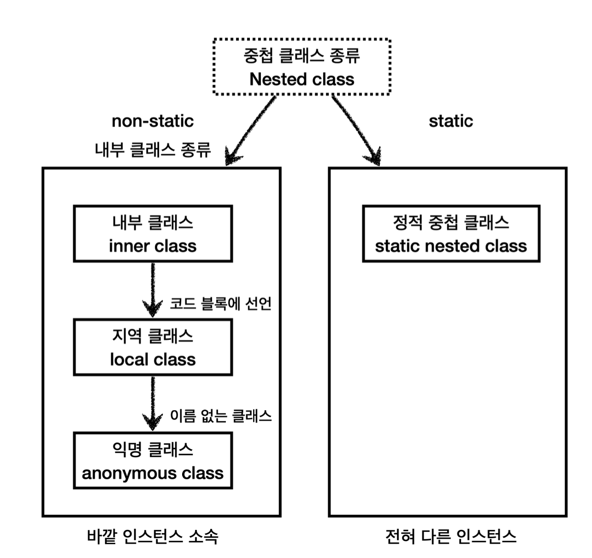

# 중첩클래스

> 내부 클래스, 지역 클래스, 정적 중첩 클래스, 익명 클래스

<!-- more -->

## 💡 서론

1. 클래스 내부
    - 필드, 메서드, 생성자
    - 이너 클래스, 이너 인터페이스
2. Inner Class
    - 클래스 내부에 선언한 클래스
    - 대개 이 이너클래스와 외부 클래스가 밀접한 관련이 있기 때문

## 💡 이너클래스



1. 클래스 내부에 포함되는 이너클래스(inner class)
2. 종류
    - 인스턴스 내부 클래스
    - 정적 내부 클래스
    - 지역 내부 클래스
    - 익명 내부 클래스

```java
class A { // 아우터 클래스

    class B { // 인스턴스 이너클래스

    }

    static class C {  // 정적 이너 클래스

    }
    void() {   // 지역 (이너)클래스
        class D {

        }
    }

}
```

1. 변수 유형과 내부 클래스 유형 비교하기

    ```java
    class ABC{
     int n1;  // 인스턴스 변수
     static int n2; // 정적변수
    }

    class ABC {  // 외부 클래스
        class In { // 인스턴스 내부 클래스
            static class SIn {  // 정적 내부 클래스

            }

        }

    }
    ```

2. 객체 생성하기

-   먼저 아우터 클래스의 객체를 생성
-   이후 생성한 아우터 클래스 객체의 참조 변수를 이용해 객체 내부에 있는 이너 클래스의 생성자 호출함
-   문법

    ```java
    아웃 클래스 아웃 클래스 참조 변수 = new 아웃 클래스();
    아웃 클래스.이너 클래스 이너 클래스 참조 변수 =  아웃 클래스 참조 변수.new 이너 클래스();


    class A{  // 아우터 클래스
        class B { // 이너 클래스

        }
    }

    A a = new A();
    A.B b = new a.B();
    ```

## 5. 정적 내부 클래스 메서드

|                                  | 일반 메서드 사용 가능 여부 | 정적 메서드 사용 가능 여부 |
| -------------------------------- | -------------------------- | -------------------------- |
| 외부 클래스의 인스턴스 변수      | x                          | x                          |
| 외부 클래스의 정적 변수          | o                          | o                          |
| 정적 내부 클래스의 인스턴스 변수 | o                          | x                          |
| 정적 내부 클래스의 정적 변수     | o                          | o                          |

## 6. 지역 내부 클래스

### 🍀 지역 내부 클래스 예제

<details>
<summary> [내부] 지역 클래스 예제 </summary>

```java
package kr.co.kosta3;


class Outer {

	int outNum = 100;
	static int sNum = 200;

	Runnable getRunnable(int i ) {
		int num = 100;   // 지역 변수


		class MyRunnable implements Runnable {  // 로컬 이너 클래스

			int localNum = 10 ; // 지역 내부 클래스의 인스턴스 변수

			@Override
			public void run() {
				// i = 10; 매개변수는 상수로 바뀌므로 값을변경할 수 없음
				//num = 11; 지역변수는  상수로 바뀌므로 값을변경할 수 없음
				System.out.println("매개변수" + i);
				System.out.println("지역변수" + num);
				System.out.println("지역 내부 클래스의 인스턴스 변수" + localNum);
				System.out.println("외부 클래스의 인스턴스 변수" + outNum);
				System.out.println("외부 클래스의 정적 변수"  + sNum);
			}
		}
		return new MyRunnable();
	}
}

public class localInnerTest {

	public static void main(String[] args) {

		 Outer outer = new Outer();
		 Runnable runnable = outer.getRunnable(100); // 메서드 호출
		 runnable.run();
	}
}

```

```bash
매개변수100
지역변수100
지역 내부 클래스의 인스턴스 변수10
외부 클래스의 인스턴스 변수100
외부 클래스의 정적 변수200
```

</details>

## 📌 익명 내부 클래스

-   클래스 이름을 사용하지 않는 클래스
-   이름이 없는 클래스
    -   지역 내부 클래스의 MyRunnable 클래스 이름은 실제로 호출되는 경우가 없음
-   클래스의 이름을 생략하고 주로 하나의 인터페이스나 하나의 추상클래스를 구현하여 반환
-   인터페이스나 추상 클래스 자료형의 변수에 직접 대입하여 클래스를 생성하거나 지역 내부 클래스의 메서드 내부에서 생성하여 반환할 수 있음
-   widget의 이벤트 핸들러에 활용됨.
-   지역클래스의 생성과 사용을 한 번에 수행한다.
    ```java
      Printer printer = new Printer(){
       //body
    }
    ```

### `new Printer() {body}`

-   익명 클래스는 클래스의 본문(body)을 정의하면서 동시에 생성한다. `new` 다음에 바로 상속 받으면서 구현 할 부모 타입을 입력하면 된다.
-   `{body}` 부분에 `Printer` 인터페이스를 구현한 코드를 작성
    -   익명 클래스의 본문
-   ⭐️ `Printer` 를 상속(구현) 하면서 바로 생성하는 것

### 익명 클래스 특징

1. 익명 클래스는 이름 없는 지역 클래스를 선언하면서 동시에 생성한다.
2. 익명 클래스는 부모 클래스를 상속 받거나, 또는 인터페이스를 구현해야 한다. 익명 클래스를 사용할 때는 상위 클 래스나 인터페이스가 필요하다.
3. 익명 클래스는 말 그대로 이름이 없다. 이름을 가지지 않으므로, 생성자를 가질 수 없다. (기본 생성자만 사용됨) 익명 클래스는 `AnonymousOuter$1` 과 같이 자바 내부에서 바깥 클래스 이름 + `$` + 숫자로 정의된다. 익명 클 래스가 여러개면 `$1` , `$2` , `$3` 으로 숫자가 증가하면서 구분된다.

### 익명 클래스 장단점

1. `장점`: 익명 클래스를 사용하면 클래스를 별도로 정의하지 않고도 인터페이스나 추상 클래스를 즉석에서 구현할 수 있어 코드 가 더 간결해진다. 하지만, 복잡하거나 재사용이 필요한 경우에는 별도의 클래스를 정의하는 것이 좋다.
2. `단점`: 익명 클래스는 단 한 번만 인스턴스를 생생할 수 있다. 다음과 같이 여러 번 생성이 필요하다면 익명 클래스를 사용할 수 없다. 대신에 지역 클래스를 선언하고 사용하면 된다.

    ```java
    Printer printer1 = new LocalPrinter();
    printer1.print();
    Printer printer2 = new LocalPrinter();
    printer2.print();
    ```

### 🍀 익명 클래스 예제

> 익명 클래스 사용

```java
public class AnonymousOuter {
     private int outInstanceVar = 3;
     public void process(int paramVar) {
         int localVar = 1;
         Printer printer = new Printer() {
int value = 0;
             @Override
             public void print() {
                 System.out.println("value=" + value);
                 System.out.println("localVar=" + localVar);
                 System.out.println("paramVar=" + paramVar);
                 System.out.println("outInstanceVar=" + outInstanceVar);
}
  };
         printer.print();
         System.out.println("printer.class=" + printer.getClass());
}
     public static void main(String[] args) {
         AnonymousOuter main = new AnonymousOuter();
         main.process(2);
} }
```

### 🛠️ 익명클래스 정리

-   익명 클래스는 이름이 없는 지역 클래스이다.
-   특정 부모 클래스(인터페이스)를 상속 받고 바로 생성하는 경우 사용한다.
-   지역 클래스가 일회성으로 사용되는 경우나 간단한 구현을 제공할 때 사용한다.

## 📌 내부클래스 정리

|         종류         |               구현 위치               |  사용할 수 있는 외부 클래스 변수   |                                    생성 방법                                     |
| :------------------: | :-----------------------------------: | :--------------------------------: | :------------------------------------------------------------------------------: |
| 인스턴스 내부 클래스 |     외부 클래스 멤버 변수와 동일      | 외부 인스턴스 변수, 외부 전역 변수 |                    외부클래스를 먼저 만든 후 내부클래스 생성                     |
|   정적 내부 클래스   |     외부 클래스 멤버 변수와 동일      |           외부 전역 변수           |                            외부클래스와 무관하게 생성                            |
|   지역 내부 클래스   |              메서드 내부              | 외부 전역 변수, 외부 인스턴스 변수 |                              메서드 호출할 때 생성                               |
|   익명 내부 클래스   | 메서드 내부 변수에 대입하여 직접 구현 | 외부 전역 변수, 외부 인스턴스 변수 | 메서드, 호출할 때 생성, 인터페이스 타입에 대입할 변수 new 연산자를 사용해서 생성 |
