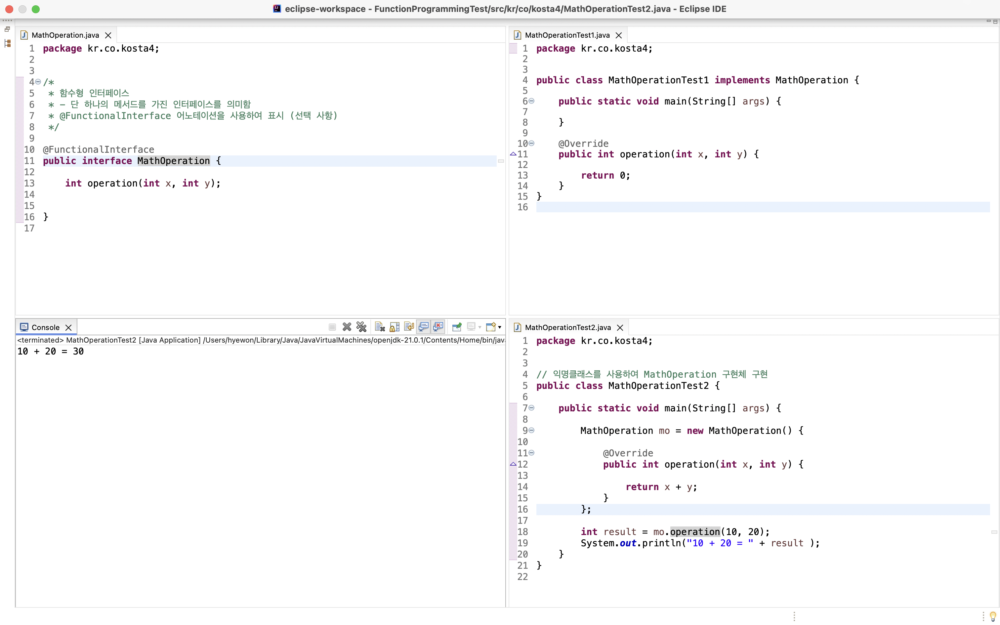

# 함수형 프로그래밍

> 프로그래밍 방법론, 함수형 프로그래밍

<!-- more -->

## 💡 프로그래밍 방법론

1. `절차식 프로그래밍`

    - 순차적 명령을 수행하고 간단한 분기만 가능

2. `구조적 프로그래밍`

    - 특정 변수에 묶어 구조화하고 이를 통해 프로그래밍 효율 높임

3. `객체지향 프로그래밍(OOP)`

    - 객체를 기반으로 한 프로그래밍이며 클래스, 속성, 기능들의 현식 세계 모델을 반영함.

4. `함수형 프로그래밍`

    - 객체의 형태를 벗어나 함수형을 확장해 함수를 변수처럼 사용 가능

## 💡 명령형 프로그래밍 vs 선언형 프로그래밍

1. Imperative Programming
    - how
    - OOP 객체지향 프로그래밍
2. Declarative Programming
    - what
    - Functional Programming

## 💡 First Class Citizen(1급 시민) 조건

1. 매개변수 로서 전달할 수 있는가?
2. 반한값(return)이 될 수 있는가?
3. 변수에 담을 수 있는가?

## 💡 함수형 프로그래밍과 람다식

    1) 객체를 기반으로 프로그램 구현시에는
       클래스가 없으면 메서드를 사용할 수 없음
    2) 함수형 프로그래밍 (Funtional Programming: FP)
        - 함수의 구현과 호출만으로 프로그램을 만드는 방식
        - 자바 8부터 지원하고 있음.
        - 람다식(Lambda expression)이라고 함
    3) 순수 함수(pure function)를 구현하고 호출
        - 외부 자료에 부수적인 영향(side effect)를 주지 않음
        - 함수 내부에서 함수 외부에 있는 변수를 사용하지 않아
          함수 수행되더라도 외부에 영향을 주지 않음

## 💡람다식 구현하기

1. 함수 이름이 없는 익명 함수를 만드는 것
2. 문법
   (매개변수) -> {실행문;}

-   메세드에서 사용하는 매개변수가 있고, 이 메서드가 매개변수를 사용하여 실행할 구현 내용, 즉 메서드의 구현부를 {} 내부에 사용함.

> 예

```java
int add(int a, int y) {
    return x + y;
}


(int x, int y)  -> { return x + y }
```

## 💡 람다식 문법

1. 매개변수 자료형과 괄호 생략하기

    - 매개변수가 하나인 경우에는 괄호 생략 가능함.

    ```java
    str -> {System.out.println(str);}
    ```

    - 매개변수가 두 개인 경우에는 바로 생략 불가

    ```java
    x, y -> {System.out.println(x + y);}   // 잘못된 형식
    ```

2. 중괄호 생략하기

    - 중괄호 안의 구현 부분이 한 문장인 경우 중괄호 생략 가능

    ```java
    str -> System.out.println(str);
    ```

    - 중괄호 안에 구현 부분이 한 문장이더라도 return문은 중괄호 생략 불가

    ```java
    str -> return str.lenhth();    // 잘못된 형식
    ```

3. return 생략하기

    - 중괄호 한의 구현 부분이 return문 하나라면 중괄호와 return을 모두 생략 가능

    ```java
    x, y -> x + y
    ```

    ```java
    str -> str.length()
    ```

## 💡 함수형 인터페이스

1. 람다식

-   메서드 이름이 없고 메서드 실행하는 데 필요한 매개변수와 매개변수를 활용한 실행 코드를 구현하는 것

2. 람다식 구현

-   함수형 인터페이스를 생성
-   인터페이스에 람다식으로 구현할 메서드를 선언
-   람다식은 하나의 메서드를 구현하여 인퍼터페이스형 변수에 대입
-   람다식은 이름 없는 익명 함수로 구현
    -   인터페이스에 메서드가 여러개 있다면 모호해짐
    -   람다식은 오직 하나의 메서드만 선언한 인터페이스를 구현할 수 있음.

3. `@FunctionalInterface`

```java
package kr.co.kosta;

@FunctionalInterface
public interface MyNumber {

	int getMax(int num1, int num2); // 추상 메서드 선언

}

```

```java
package kr.co.kosta;

public class MyNumberTest {

	public static void main(String[] args) {

		MyNumber max = (x, y) -> (x >= y) ? x : y;  // 람다식을 인터페이스형 max 변수에 대입
		System.out.println(max.getMax(10, 20)); //인터페이스형 변수로 메서드를 호출
	}

}

```

## OOP와 람다식 비교

1.  인터페이스 작성
2.  클래스에서 인터페이스 구현하기
3.  람다식으로 인터페이스 구현하기

    <details>
    <summary> 람다식으로 인터페이스 구현하기 </summary>

    ```java

    package kr.co.kosta2;

    public interface StringConcat {
        void makeString(String s1, String s2);
    }

    ```

    ```java
    package kr.co.kosta2;

    public class StringConcatImplTest2 {

        public static void main(String[] args) {

            String s1 = "hello";
            String s2 = "kosta";

            StringConcat concat2 =
                    (s, v) -> System.out.println(s + ", " + v);

            concat2.makeString(s1, s2);
        }
    }

    ```

    </details>

4.  익명 객체를 생성하는 람다식

    ```java
    package kr.co.kosta2;

    public class StringConcatImplTest2 {

        public static void main(String[] args) {

            String s1 = "hello";
            String s2 = "kosta";

            StringConcat concat2 =
                    (s, v) -> System.out.println(s + ", " + v);

            concat2.makeString(s1, s2);

            StringConcat concat3 = new StringConcat() {

                @Override
                public void makeString(String s1, String s2) {
                    System.out.println(s1 + ", " + s2);

                }
            };

            concat3.makeString(s1, s2);
        }

    }

    ```

## 💡 함수를 변수처럼 사용하는 람다식

1. 특정 자료형으로 변수 선언 후 대입하여 사용하기

    ```java
    int a = 10;

    ```

    - 인터페이스형 변수에 람다식 대입하기

### 🍀 익명 예제


