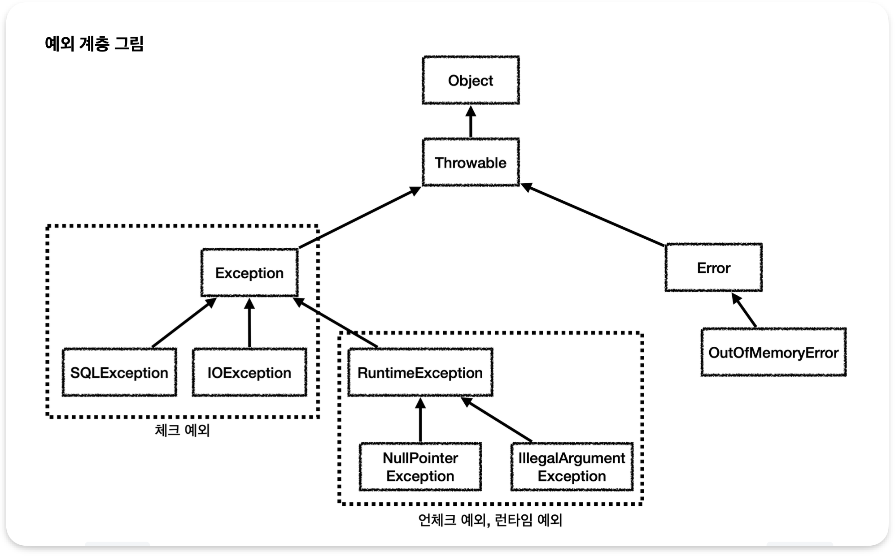
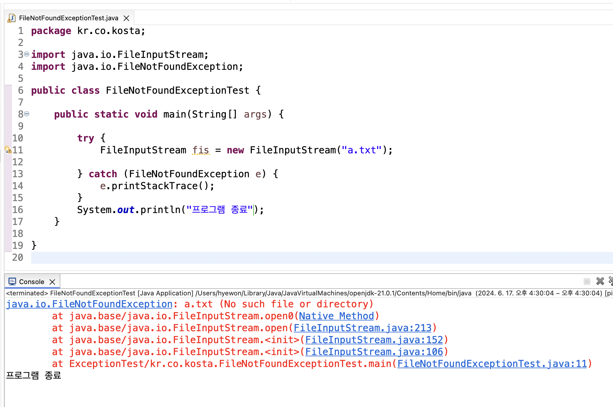
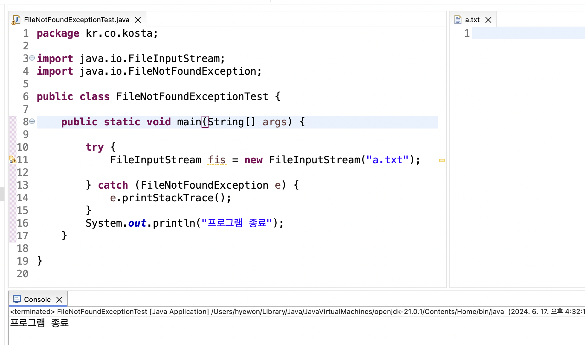

# 예외처리

> 오류 종류, 체크 예외, 언체크 예외(런타임 예외)

<!-- more -->

## 📌 오류 종류

1.  컴파일 오류(compile error)
2.  실행 오류(runtime error)
    -   bug
    -
3.  로그(log)분석을 통해 원인 파악 가능

## 📌 예외 계층 그림



## 📌 예외 처리하기

1.  try-catch문

    ```java
    try{

    } catch (처리할 예외 타입 e) {
        // try 블록 안에서 예외가 발생 했을 때 예외를 처리하는 부분
    }
    ```

    <hr>

2.  컴파일러에 의해 예외가 체크되는 경우

    -   파일 입출력에서 발생하는 예외처리

    > a.txt 생성 전 예외처리 됨.

    

    > a.txt 생성 후

    

3.  try ~ catch ~ finally 문

    -   프로그램에서 사용한 리소스는 프로그램이 종료 되면 자동으로 해제
    -   그러다 리소스 해제가 안되고 계속 수행되는 서비스의 경우 열기만 하고 닫지 않으면 문제가 발생함
        -   시스템에서 허용하는 자원은 한계가 있기 때문이다.
        -   그래서 리소스를 종료해야 한다.

    ```java
        try{

        } catch (처리할 예외 타입 e) {
            // try 블록 안에서 예외가 발생 했을 때 예외를 처리하는 부분
        } finally {
            // 항상 수행되는 부분
        }
    ```

    -   try{} 블럭이 수행되는 동안, finally{} 블럭은 항상 수행됨
    -   각각의 리소스 해제를 finally 블록에서 해제하도록 구현함

    <details>
    <summary>  try ~ catch ~ finally 문 예제</summary>

    ```java
    package kr.co.kosta2;

    import java.io.FileInputStream;
    import java.io.FileNotFoundException;
    import java.io.IOException;

    public class ExceptionFinallyTest {

        public static void main(String[] args) {

            FileInputStream fis = null;

            try {
                fis = new FileInputStream("a1.txt");

            } catch (FileNotFoundException e) {
                System.out.println(e);
                return;
                //e.printStackTrace();
            } finally {
                if(fis != null) {
                    try {
                        fis.close(); // close() 호출 한 곳에서도 예외처리 해야함
                    } catch (IOException e) {
                        // TODO Auto-generated catch block
                        e.printStackTrace();
                    }
                }
                System.out.println("항상 수행됩니다");
            }
            System.out.println("come here");

        }

    }

    ```

    ```bash
    java.io.FileNotFoundException: a1.txt (No such file or directory)
    항상 수행됩니다
    ```

    -   return; 을 주석처리한다면?

    ```bash
    java.io.FileNotFoundException: a1.txt (No such file or directory)
    항상 수행됩니다
    come here
    ```

    </details>

4.  try ~ with ~ resource문

    -   close() 메서드를 명시적으로 호출하지 않아도 try 불록내에서 열린 리소스를 자동으로 닫도(해제)록 해준다.
        -   리소스를 사용하는 경우 close()를 사용하지 않아도 자동으로 해제 되도록 함
    -   ⭐️ 해당 리소스가 `AutoCloseable` 인터페이스를 구현해야 함

        ```java
            public class MyAutoClass implements AutoCloseable {

                try( A a = new A(); B b = new B() ){

                } catch (Exception e) {

                }
            }
        ```

    -   리소스를 try() 내부에서 선언해야 함
    -   close()를 명시적으로 호출하지 않아도 try{} 블록에서 열린 리소스는 정상적인 경우나 예외가 발생한 경우 모두 자동으로 해제됨

        -   `AutoCloseable` 인터페이스 구현 필요

    -   자바 7 부터 제공

    <details>
      <summary> try ~ with ~ resource문 예제 </summary>

    ```java
    package kr.co.kosta3;

    public class MyAutoClass implements AutoCloseable {

        @Override
        public void close() throws Exception {

            System.out.println("리소스가 close() 되었습니다.");

        }

    }

    ```

    ```java
    package kr.co.kosta3;

    public class AutoCloseTest {

        public static void main(String[] args) {

            try (MyAutoClass obj = new MyAutoClass()) {
                // throw new Exception(); // throw : 강제로 예외 발생

            } catch (Exception e) {
                System.out.println("예외 부분입니다.");
            }
        }

    }

    ```

    ```bash
    리소스가 close() 되었습니다.
    ```

    -   throw new Exception(); 코드 추가
        -   throw : 강제로 예외 발생

    ```bash
    리소스가 close() 되었습니다.
    예외 부분입니다.
    ```

    -   이렇게 작성 해도 됨

    ```java
    package kr.co.kosta3;

    public class AutoCloseTest2 {

    	public static void main(String[] args) {

            // 추가된 코드
            MyAutoClass obj = new MyAutoClass();
    		try (obj) {

    		} catch (Exception e) {
    			System.out.println("예외 부분입니다.");
    		}
    	}

    }
    ```

      </details>

## 📌 예외 처리 미루기 - throws

1. throws 사용: 예외처리 미루기 위한 방법
2. throws를 이용하면 예외가 발생할 수 있는 부분을 사용하는 문장에서 예외를 처리할 수 있음
3. 하나의 try{} 블록에서 예외가 여러 개 발생하는 경우
    - 여러개의 예외가 발생하는 경우 예외를 묶어서 하나의 방법으로 처리할 수 있음
    - 각각의 예외를 따로 처리할 수도 있음.
        - Exception 클래스를 활용하여 default 처리를 할 때 Exception 블록은 맨 마지막에 위치해야 함

<details>
<summary> 예외 처리 미루기 예제1 - 다수 예외를 한 문장으로 처리 </summary>

```java
package kr.co.kosta4;

import java.io.FileInputStream;
import java.io.FileNotFoundException;

public class ThrowsTest {

	public Class loadClass(String fileName, String className)
			throws FileNotFoundException, ClassNotFoundException {  // 두 예외를 메서드가 호출 될 때마다 처리하도록 미룸

		FileInputStream fis = new FileInputStream(fileName);  // FileNotFoundException 발생 가능
		Class c = Class.forName(className);  // ClassNotFoundException 발생 가능
		return c;

	}

	public static void main(String[] args) {

		ThrowsTest test = new ThrowsTest();
		try {
			test.loadClass("a1.txt", "java.lang.String");  // 메서드 호출 할 때 예외 처리됨
		} catch (FileNotFoundException | ClassNotFoundException e) { // 여러 예외를 한 문장으로 처리함.
			// TODO Auto-generated catch block
			//e.printStackTrace();
			System.out.println(e);
		}
	}
}


```

</details>

<details>
<summary> 예외 처리 미루기 예제2 - 다수 예외를 catch문 사용하여 처리 </summary>

```java
package kr.co.kosta4;

import java.io.FileInputStream;
import java.io.FileNotFoundException;

public class ThrowsTest2 {

	public Class loadClass(String fileName, String className)
			throws FileNotFoundException, ClassNotFoundException {  // 두 예외를 메서드가 호출 될 때마다 처리하도록 미룸

		FileInputStream fis = new FileInputStream(fileName);  // FileNotFoundException 발생 가능
		Class c = Class.forName(className);  // ClassNotFoundException 발생 가능
		return c;

	}

	public static void main(String[] args) {

		ThrowsTest2 test = new ThrowsTest2();
		try {
			test.loadClass("a1.txt", "java.lang.String");    // 여러 catch문 사용

		} catch (FileNotFoundException e) {
			// TODO Auto-generated catch block
			//e.printStackTrace();
			System.out.println(e);
		}catch (ClassNotFoundException e) {
			// TODO: handle exception
			e.printStackTrace();
		} catch (Exception e) {
			e.printStackTrace();  // Exception: 위 2개 catch 예외처리 외의 예외 상황 처리
		}
	}

}

```

</details>

## 📌 사용자 정의 예외

<details>
<summary> 사용자 정의 예외 - ID 검증 예제 </summary>

```java
package kr.co.kosta5;

public class MakeIDException extends Exception {

	public MakeIDException(String message) { // 생성자의 매개변수로 예외상황 메시지를 받음
		super(message);
	}
}

```

```java
package kr.co.kosta5;

public class MakeIDExceptionTest {

	private String userId;

	public String getUserId() {
		return userId;
	}

	public void setUserId(String userId) throws MakeIDException {

		if (userId == null) {
			throw new MakeIDException("ID는 null일 수 없다. "); // 강제 예외 시킴
		} else if (userId.length() < 9 || userId.length() > 20) {
			throw new MakeIDException("ID가 9자 이상 20자 이하로 작성해주세요. "); // 강제 예외 시킴
		}
		// 예외를 통과한다면 ID 설정
		this.userId = userId;
	}

	public static void main(String[] args) {

		MakeIDExceptionTest test = new MakeIDExceptionTest();
		String userId = null;
		try {
			test.setUserId(userId);
		} catch (MakeIDException e) {

			//e.printStackTrace();
			System.out.println(e.getMessage());
		}

		userId = "12345678";
		try {
			test.setUserId(userId);
		} catch (MakeIDException e) {

			//e.printStackTrace();
			System.out.println(e.getMessage());
		}

		userId = "12345678910";
		try {
			test.setUserId(userId);
		} catch (MakeIDException e) {

			//e.printStackTrace();
			System.out.println(e.getMessage());
		}
	}
}

```

```bash
ID는 null일 수 없다.
ID가 9자 이상 20자 이하로 작성해주세요.
```

</details>

<details>
<summary> 사용자 정의 예외 - 점수 예제 </summary>

```java
package kr.co.kosta5;

class Student {

	private String name;
	private int score;

	public Student(String name, int score) {
		super();
		this.name = name;
		this.score = score;
	}

	public String getName() {
		return name;
	}

	public int getScore() {
		return score;
	}
}

// 사용자 정의 점수 예외 클래스
class LowScoreException extends Exception {

	public LowScoreException(String message) {
		super(message);
	}
}

public class MyScoreExceptionTest {

	public static void main(String[] args) {

		List<Student> students = new ArrayList<>();
		students.add(new Student("hong", 70));
		students.add(new Student("Lee", 90));
		students.add(new Student("Shin", 50));

		try {
			for (Student student : students)
				checkScore(student);
		} catch (LowScoreException e) {

			System.out.println(e.getMessage());
		}

	}

	// 점수가 60점 미만민 경우 예외를 발생시키는 메서드
	public static void checkScore(Student student) throws LowScoreException {
		System.out.println("점수 확인 중 -- "  + student.getName());
		if (student.getScore() < 60) {
			throw new LowScoreException("Failed -- " +  student.getName() + " 점수가 낮음, " +student.getScore() + "점 받음 \n");
		}
		System.out.println("Passed -- " +  student.getName() + " 만족스러운  " +student.getScore() + "점 받음 \n");


	}
}

```

```bash
점수 확인 중 -- hong
Passed -- hong 만족스러운  70점 받음

점수 확인 중 -- Lee
Passed -- Lee 만족스러운  90점 받음

점수 확인 중 -- Shin
Failed -- Shin 점수가 낮음, 50점 받음

```

</details>
