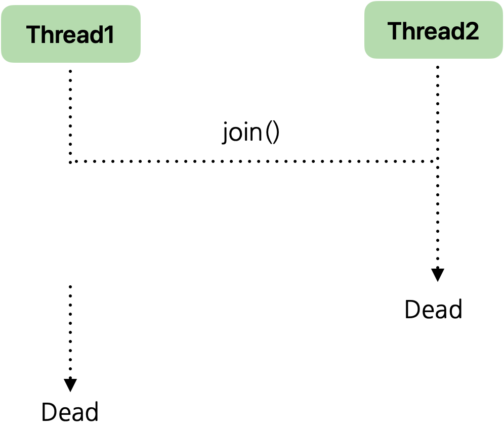

# Thread

> Thread

<!-- more -->

## 🍎 Thread

1. Process
    - 실행 중인 프로그램
    - 프로그램이 실행되면 OS로 부터 메모리를 할당받아 프로세스 상태가 됨
2. Thread

    - 하나의 프로세스는 하나 이상의 thread를 가지게 됨.
    - 실제 작업(task)를 수행하는 단위는 thread임.
    -

## 🍎 Thread 생성 방법 2가지

### 1️⃣ Thread 클래스 상속

<details>
<summary>Thread 만들기 - Thread 클래스 상속 </summary>

```java
package kr.co.kosta;

class MyThread extends Thread {

    public MyThread() {
        super();
    }

    @Override
    public void run() {
        System.out.println(Thread.currentThread() + "start");
        int i;
        for (i = 0; i < 200; i++) {
            System.out.print(i + "\t");
        }

        System.out.println(Thread.currentThread() + "end");
    }
}

public class ThreadTest {

    public static void main(String[] args) {
        System.out.println(Thread.currentThread() + "start!");

        MyThread thread1 = new MyThread();
        thread1.run();

        System.out.println(Thread.currentThread() + "end!");

    }

}
```

</details>


### 2️⃣ Runnable 인터페이스 구현


- Runnable 인터페이스
- 단일 메서드인 run() 구현
- ⭐️ 다중 상속 문제 해결 : Runnable 인터페이스를 구현함으로써 다른 클래스를 상속받으면서도 쓰레드 기능을 추가할 수 있다.
- Runnable 인터페이스는 Java에서 멀티쓰레딩 프로그래밍을 할 때 자주 사용됨.


<details>
<summary> Thread 만들기 - 클래스를 이용한 Runnable 인터페이스 구현1 </summary>


```java
package kr.co.kosta;

class MyThread2 implements Runnable {

@Override
public void run() {
    System.out.println(Thread.currentThread() + " start!");

    int i;
    for(i=0; i<20; i++)
        System.out.print(i + "\t");

    System.out.println(Thread.currentThread() + " end!");

}
}

public class ThreadTest2 {
public static void main(String[] args) {
System.out.println(Thread.currentThread() + " start!");

    MyThread2 runnable = new MyThread2();
    Thread thread = new Thread(runnable);
    thread.start();

    Thread thread2 = new Thread(new MyThread2());         // 익명 객체 (이름이 의미가 없음 -> anonymous 객체로 생성)
    thread2.start();

    Runnable anonymousThread = new Runnable() {         // 이름이 필요없기 때문에 익명

        @Override
        public void run() {
            System.out.println("anonymous Thread");
        }
    };

    anonymousThread.run();

    System.out.println(Thread.currentThread() + " end!");

    }
}
```
</details>


<details>
<summary> Thread 만들기 -  Runnable 인터페이스 구현2 </summary>

```java

public class RunnableInterfaceTest {
    public static void main(String[] args) {

        // Runnable 인터페이스 구현
        Runnable task = () -> {

            try {
                Thread.sleep(3000);
            } catch (InterruptedException e)
            {
                e.printStackTrace();
            }
            int sum = 0;
            for(int i =0; i<=10; i++)
                sum += i;
                String name = Thread.currentThread().getName(); // 현재 쓰레드의 이름을 가져옴
                System.out.println(name +" : "+ sum); //  쓰레드 이름과 합계 출력

            };
            Thread thread = new Thread(task);
            thread.start();

            System.out.println("main : " + Thread.currentThread().getName());
        }
}

```

</details>


<details>
<summary> MultiThreadTest 만들기 -  Runnable 인터페이스 사용 </summary>

```java


public class MultiThreadTest {
    public static void main(String[] args) {

        Runnable task1 = () -> {
            // 20 미만 짝수 출력
            for(int i = 0; i<20; i++) {
                System.out.print(i + " ");
                try {
                    Thread.sleep(1000);
                } catch (InterruptedException e ){
                    e.printStackTrace();
                }
            }
        };

        Runnable task2 = () -> {
            //10미만 수 출력 (9~1)
            for(int i=9; i>0; i--) {
                System.out.print(i + " ");
                try {
                    Thread.sleep(500);
                } catch (InterruptedException e) {
                    e.printStackTrace();
                }
            }
        };

        Thread thread1 = new Thread(task1);
        Thread thread2 = new Thread(task2);

        thread1.start();
        thread2.start();
    }
}
```

</details>


## 🍎 Thread 상태


## 🍎 Thread 클래스

1. Thread.Min_PRIORITY(1) ~ Thread.MAX_PRIORITY (10)
2. 디폴트 우선순위 : Thread.NORM_PRIORITY (5)         
3. 우선 순위가 높은 Thread가 CPU의 배분을 받을 확률이 높음 = 더 자주 실행될 가능성이 높다  
4. `setPriority(int newPriority)`  : Thread의 우선순위 설정
5. `getPriority()` : Thread의 현재 우선순위 반환    
   
    <details>
    <summary> Thread 만들기 -  Runnable 인터페이스 구현2 </summary>   

    ```java
    class PriorityThread extends Thread {
        @Override
        public void run() {
            int sum = 0;

            Thread thread = Thread.currentThread();
            System.out.println(thread + " start");
            for (int i = 0; i < 100000; i++)
                sum += i;
            System.out.println(thread.getPriority() + "end");

        }
    }

    public class PriorityTest {
        public static void main(String[] args) {
            int i;
            for(i=Thread.MIN_PRIORITY; i<=Thread.MAX_PRIORITY; i++) {
                PriorityThread pt = new PriorityThread();
                pt.setPriority(i);
                pt.start();
            }
        }
    }

    ```  

    ```bash
    Thread[#21,Thread-0,1,main] start
    Thread[#27,Thread-6,7,main] start
    Thread[#26,Thread-5,6,main] start
    Thread[#23,Thread-2,3,main] start
    Thread[#25,Thread-4,5,main] start
    Thread[#28,Thread-7,8,main] start
    Thread[#24,Thread-3,4,main] start
    Thread[#22,Thread-1,2,main] start
    Thread[#29,Thread-8,9,main] start
    Thread[#30,Thread-9,10,main] start
    7end
    8end
    1end
    10end
    2end
    5end
    3end
    9end
    4end
    6end
    ```
    </datails>


    <datails>
    <summary> thread 우선순위 예재2 - 반드시 높은 우선순위의 스레드가 먼저 실행되지 X</summary>  

    ```java
    class PriorityThread2 extends Thread {

        @Override
        public void run() {
            int sum = 0;

            Thread thread = Thread.currentThread();
            System.out.println(thread + " start");
            for(int i=0; i<1000000; i++)
                sum += i;

            System.out.println(thread.getPriority() + " end");
        }
    }

    public class PriorityTest2 {
        public static void main(String[] args) {
            PriorityThread2 pt1 = new PriorityThread2();
            PriorityThread2 pt2 = new PriorityThread2();
            PriorityThread2 pt3 = new PriorityThread2();

            pt1.setPriority(Thread.MIN_PRIORITY);
            pt2.setPriority(Thread.NORM_PRIORITY);
            pt3.setPriority(Thread.MAX_PRIORITY);

            pt1.start();
            pt2.start();
            pt3.start();
        }
    }
    ```

    - 항상 우선순위가 높은 10이먼저 실행된다는 보장이 없다.JVM과 운영체제의 스케줄링 정책에 따라 달라진다. 
    - 쓰레드 우선순위는 쓰레드 스케줄링에 영향을 주는 힌트로 사용될 뿐, 절대적인 실행 순서를 제어하는 것은 아니다.
    
    ```bash
    Thread[#23,Thread-2,10,main] start
    Thread[#21,Thread-0,1,main] start
    Thread[#22,Thread-1,5,main] start
    5 end
    10 end
    1 end
    ```

    </datails>

6. join()
    - 동시에 두 개 이상의 Thread()가 실행될 때 다른 Thread의 결과를 참조하여 실행하는 경우 join 메서드 활용한다.
    - 다른 Thread가 끝날 때까지 현재 Thread를 대기시키는 기능
    - join() 메서드를 호출한 Thread가 Not Runnalbe 상태가 되어 실행을 멈추고, 다른 Thread 가 수행이 끝나면 Runnable 상태로 돌아간다.
  
    

    ```java
    Thread t1 = new Thread(() -> {
    // t1의 작업
    });

    Thread t2 = new Thread(() -> {
        try {
            t1.join(); // t1이 끝날 때까지 기다림
        } catch (InterruptedException e) {
            e.printStackTrace();
        }
        // t2의 작업
    });

    ```
### 🍀 join() 예제

    - 두 개의 쓰레드 jt1과 jt2가 각각 1에서 50, 51에서 100까지의 합을 계산하는 예제
    - 그러나, main 쓰레드에서 두 쓰레드가 계산을 마치기 전에 합을 구하고 출력하려고 하기 때문에 예상한 결과가 출력되지 않을 수 있다. 
    - 이는 main 쓰레드가 jt1과 jt2의 계산이 완료되기 전에 total 값을 읽기 때문이다.
  
    <details>
    <summary>join() 사용 하기 전</summary>

    ```java
    public class JoinTest extends  Thread {

        int start;
        int end;
        int total;

        public JoinTest(int start, int end) {
            this.start = start;
            this.end = end;
        }

        @Override
        public void run() {
            int i;
            for(i = start; i<=end; i++)
                total += i;
        }

        public static void main(String[] args) {

            JoinTest jt1 = new JoinTest(1, 50);
            JoinTest jt2 = new JoinTest(51, 100);
            jt1.start();
            jt2.start();

            int sum = jt1.total + jt2.total;

            System.out.println("jt1.total = " + jt1.total);
            System.out.println("jt2.total = " + jt2.total);

            System.out.println("전체 sum = " + sum);

            System.out.println(Thread.currentThread() + " end");
        }
    }

    ```

    ```bash
    jt1.total = 1275
    jt2.total = 3775
    전체 sum = 1275
    Thread[#1,main,5,main] end
    ```

    </details>

    - join()을 사용하여 jt1과 jt2의 실행이 끝날 때까지 main 스레드가 기다리도록 하기

    <details>
    <summary>join() 사용 후</summary>

    ```java
    package ThreadTest.ksota3;

    public class JoinTest extends Thread {

        int start;
        int end;
        int total;

        public JoinTest(int start, int end) {
            this.start = start;
            this.end = end;
        }

        @Override
        public void run() {
            int i;
            for (i = start; i <= end; i++)
                total += i;
        }

        public static void main(String[] args) {
            JoinTest jt1 = new JoinTest(1, 50);
            JoinTest jt2 = new JoinTest(51, 100);
            jt1.start();
            jt2.start();

            try {
                jt1.join(); // jt1 쓰레드가 끝날 때까지 기다림
                jt2.join(); // jt2 쓰레드가 끝날 때까지 기다림
            } catch (InterruptedException e) {
                e.printStackTrace();
            }

            int sum = jt1.total + jt2.total;

            System.out.println("jt1.total = " + jt1.total);
            System.out.println("jt2.total = " + jt2.total);

            System.out.println("전체 sum = " + sum);

            System.out.println(Thread.currentThread() + " end");
        }
    }

    ```

    ```bash
    jt1.total = 1275
    jt2.total = 3775
    전체 sum = 5050
    Thread[#1,main,5,main] end
    ```

    </details>

<br>

7. Thread 종료하기 
    - 무한 루프의 경우 while(Flag)의 flag 변수값을 false로 바꾸어 종료 한다.             
    - 예시) stopThread() 메서드를 호출하여 running 변수를 false로 바꾸어 Thread를 종료할 수 있다.
  
    ```java
    class MyThread extends Thread {
        private volatile boolean running = true;

        public void run() {
            while (running) {
                // 작업 수행
            }
        }

        public void stopThread() {
            running = false; // 종료 조건 설정
        }
    }
    ```
### 🍀 Thread 종료 예제

<details>
<summary></summary>

```java
package ThreadTest.ksota4;

import java.io.IOException;

public class TerminateThreadTest extends Thread {

    private boolean flag = false;

    public TerminateThreadTest(String name) {
        super(name);
    }

    public void setFlag(boolean flag) {
        this.flag = flag;
    };

    @Override
    public void run() {  // flag가 true가 되면 쓰레드는 종료 메시지를 출력하고 종료
        while (!flag) {
            try {
                Thread.sleep(3000);
            } catch (InterruptedException e ) {
                e.printStackTrace();
            }
        }
        System.out.println(this.getName() + " end");
    }

    public static void main(String[] args) throws IOException {

        TerminateThreadTest threadA = new TerminateThreadTest("A");
        TerminateThreadTest threadB = new TerminateThreadTest("B");
        TerminateThreadTest threadC = new TerminateThreadTest("C");
        threadA.start();
        threadB.start();
        threadC.start();

        int i;
        while(true) {
            int in = System.in.read();

            if(in == 'A') {
                threadA.setFlag(true);
            } else if(in == 'B') {
                threadB.setFlag(true);
            } else if(in == 'C') {
                threadC.setFlag(true);
            } else if(in == 'M') {
                threadA.setFlag(true);
                threadB.setFlag(true);
                threadC.setFlag(true);
                break;  // 'M' 키를 입력하면 모든 쓰레드를 종료하고 루프를 빠져나옴
            } else {
                System.out.println("try again");
            }
        }

        // 메인 스레드는 사용자 입력을 계속 대기함. 스레드 종료 후에도 다른 스레드는 계속 실행됨
        // isAlive()가 모두 false가 되면 종료
        while(threadA.isAlive() || threadB.isAlive() || threadC.isAlive()) {
            // 스레드가 종료되기를 대기
        }
        System.out.println("모든 스레드 종료!!");
    }
}

```

```bash
A
try again
A end
B
try again
B end
C
try again
C end
M
모든 스레드 종료!!
```
</details>


## 🍎 Multi-threading 프로그래밍의 동기화 
1. `임계구역(critical section)`은 두개 이상의 thread가 동시에 접근하는 경우 문제가 생길 수 있기 때문에 동시에 접근할 수 없도록 영역처리해 주는 것

2. 동기화의 필요성
- 한 순간 오직 하나의 thread가 접근할 수 있도록 해야한다.
- 현재 쓰레드가 임계 구역을 빠져나갈 때까지 대기(blocking) 상태가 된다.

3. 동기화 (synchronization)
    - 두 개의 thread가 같은 객체에 접근 할 경우, 동시에 접근 함으로써 데이터 불일치 문제 발생함.
    - 동기화는 critical section(임계 영역)에 접근할 경우 공유 자원을 잠그는 lock하여 다른 thread의 접근을 제어 
    - 동기화를 잘못 구현하면 교착상태(`deadlock`)에 빠질 수 있음.
        - 두 쓰레드가 서로가 필요하는 자원을 잠가버려 영원히 대기 상태에 빠지는 것

## 🍎 자바에서의 동기화 구현 방법

###  1️⃣ synchronized 블록 

- 현재 객체 또는 다른 객체를 lock으로 만듦
- synchronized 블록 안의 코드는 동시에 하나의 쓰레드만 실행할 수 있다.

    
```java
synchronized(참조형 수식) {
        수행문;
        }        
```

### 2️⃣ synchronized 메서드 

- 객체의 메서드에 synchronized 키워드 사용 
- 현재 이 메서드가 속해있는 객체에 lock을 걸음                          


### 🍀 Synchronization 예제

- Lee와 Shin 클래스의 쓰레드는 모두 동일한 Bank 객체 (SynchronizationTest.myBank)에 접근하여 입출금을 수행한다. 
- 이로 인해 쓰레드가 동시에 접근할 때 발생할 수 있는 문제(예: 데이터 불일치)를 방지하기 위해서는 동기화가 필요하다.

<details>
<summary> 데이터 불일치 문제 발생 - 동기화 적용 전</summary>

```java
class Bank {
    private int money = 10000;

    public int getMoney() {
        return money;
    }

    public void setMoney(int money) {
        this.money = money;
    }

    //예금하다
    public void deposite(int save) {
        int m = this.getMoney();

        try {
            Thread.sleep(3000);
        } catch (InterruptedException e) {
            e.printStackTrace();
        }

        setMoney(m + save);
    }

    //인출하다
    public void withdraw(int minus) {
        int m = this.getMoney();

        try {
            Thread.sleep(1000);
        } catch (InterruptedException e) {
            e.printStackTrace();
        }

        setMoney(m - minus);
    }
}

class Lee extends Thread {
    @Override
    public void run() {
        System.out.println("입금 시작");
        SynchronizationTest.myBank.deposite(3000);
        System.out.println("3000원 입금 : " + SynchronizationTest.myBank.getMoney());
    }
}

class Shin extends Thread {
    @Override
    public void run() {
        System.out.println("출금 시작");
        SynchronizationTest.myBank.withdraw(1000);
        System.out.println("1000원 출금 : " + SynchronizationTest.myBank.getMoney());
    }
}

public class SynchronizationTest {

    public static Bank myBank = new Bank();

    public static void main(String[] args) {
        Lee threadLee = new Lee();
        threadLee.start();

        Shin threadShin = new Shin();
        threadShin.start();

    }
}
```

- 입금 금액이 9000 + 3000원이 맞다.

```bash
입금 시작
출금 시작
1000원 출금 : 9000
3000원 입금 : 13000

```
</details>

>  1  메서드 수준의 동기화

- 메서드 자체가 동기화된다. synchronized 키워드를 메서드 선언에 붙인다.
- 간결하지만, 특정객체(this)에 대해 메서드 전체가 동기화 되므로, 객체의 다른 동기화 메서드와 충돌 가능성이 있다.

<details>
<summary>동기화 적용 방법 1 - 메서드 수준 동기화</summary>

```java
class Bank {
	private int money = 10000;

	public int getMoney() {
		return money;
	}

	public void setMoney(int money) {
		this.money = money;
	}
	
	//예금하다
	public synchronized void deposite(int save) {
		int m = this.getMoney();
		
		try {
			Thread.sleep(3000);
		} catch (InterruptedException e) {
			e.printStackTrace();
		}
		
		setMoney(m + save);
	}
	
	//인출하다
	public synchronized void withdraw(int minus) {
		int m = this.getMoney();
		
		try {
			Thread.sleep(1000);
		} catch (InterruptedException e) {
			e.printStackTrace();
		}
		
		setMoney(m - minus);
	}
}

class Lee extends Thread {
	@Override
	public void run() {
		System.out.println("입금 시작");
		SynchronizationTest.myBank.deposite(3000);
		System.out.println("3000원 입금 : " + SynchronizationTest.myBank.getMoney());
	}
}

class Shin extends Thread {
	@Override
	public void run() {
		System.out.println("출금 시작");
		SynchronizationTest.myBank.withdraw(1000);
		System.out.println("1000원 출금 : " + SynchronizationTest.myBank.getMoney());
	}
}

public class SynchronizationTest {
	public static Bank myBank = new Bank();
	public static void main(String[] args) {
		Lee threadLee = new Lee();
		threadLee.start();
		
		Shin threadShin = new Shin();
		threadShin.start();
		
	}
}
```

```bash
입금 시작
출금 시작
3000원 입금 : 13000
1000원 출금 : 12000
```
</details>

> 2 특정 블록 동기화 (메서드 내부에서 동기화)

- 동기화 범위 지정: 메서드 전체가 아닌 특정 코드 블록만 동기화 가능
- 메서드 내부에서 동기화 블록을 사용하여, 메서드의 특정 부분만 동기화할 수 있다.
- 특정 객체(this)에 대해 동기화를 수행하므로, 메서드 전체를 동기화할 필요 없이 필요한 부분만 동기화할 수 있다.
- 동기화가 필요한 부분만 명시적으로 지정할 수 있어, 불필요한 동기화를 피할 수 있다.


<details>
<summary>동기화 적용 방법 2 - 메서드 내부 동기화</summary>

```java
package kr.co.kosta5.solve2;

class Bank {
	private int money = 10000;

	public int getMoney() {
		return money;
	}

	public void setMoney(int money) {
		this.money = money;
	}
	
	//예금하다
	public void deposite(int save) {
		
		synchronized (this) {
			int m = this.getMoney();	
			try {
				Thread.sleep(3000);
			} catch (InterruptedException e) {
				e.printStackTrace();
			}
			
			setMoney(m + save);			
		}
		
	}
	
	//인출하다
	public void withdraw(int minus) {
			
		synchronized (this) {
			int m = this.getMoney();
			try {
				Thread.sleep(1000);
			} catch (InterruptedException e) {
				e.printStackTrace();
			}
			
			setMoney(m - minus);			
		}
		
	}
}

class Lee extends Thread {
	@Override
	public void run() {
		System.out.println("입금 시작");
		SynchronizationTest.myBank.deposite(3000);
		System.out.println("3000원 입금 : " + SynchronizationTest.myBank.getMoney());
	}
}

class Shin extends Thread {
	@Override
	public void run() {
		System.out.println("출금 시작");
		SynchronizationTest.myBank.withdraw(1000);
		System.out.println("1000원 출금 : " + SynchronizationTest.myBank.getMoney());
	}
}

public class SynchronizationTest {
	public static Bank myBank = new Bank();
	public static void main(String[] args) {
		Lee threadLee = new Lee();
		threadLee.start();
		
		Shin threadShin = new Shin();
		threadShin.start();
		
	}
}
```
</details>

>  3 특정 블록 동기화 (쓰레드에서 동기화)

- 특정 객체(SynchronizationTest.myBank)에 대해 동기화를 수행
- 메서드 전체가 아닌 `특정 코드 블록 부분`만 동기화할 수 있다 (세밀함)
- 동기화가 필요한 코드를 명시적으로 블록으로 감싸서 동기화 가능


<details>
<summary>동기화 적용 방법 3</summary>

```java

class Bank {
	private int money = 10000;

	public int getMoney() {
		return money;
	}

	public void setMoney(int money) {
		this.money = money;
	}
	
	//예금하다
	public void deposite(int save) {
		int m = this.getMoney();
		
		try {
			Thread.sleep(3000);
		} catch (InterruptedException e) {
			e.printStackTrace();
		}
		
		setMoney(m + save);
	}
	
	//인출하다
	public void withdraw(int minus) {
		int m = this.getMoney();
		
		try {
			Thread.sleep(1000);
		} catch (InterruptedException e) {
			e.printStackTrace();
		}
		
		setMoney(m - minus);
	}
}

class Lee extends Thread {
	@Override
	public void run() {
		System.out.println("입금 시작");
		SynchronizationTest.myBank.deposite(3000);
		System.out.println("3000원 입금 : " + SynchronizationTest.myBank.getMoney());
	}
}

class Shin extends Thread {
	@Override
	public void run() {
		System.out.println("출금 시작");
		SynchronizationTest.myBank.withdraw(1000);
		System.out.println("1000원 출금 : " + SynchronizationTest.myBank.getMoney());
	}
}

public class SynchronizationTest {
	public static Bank myBank = new Bank();
	public static void main(String[] args) {
		Lee threadLee = new Lee();
		threadLee.start();
		
		Shin threadShin = new Shin();
		threadShin.start();
		
	}
}

```

</details>


> 요약

- 방법 1은 메서드 전체를 동기화하는 가장 간결한 방법으로, 메서드 호출 시 자동으로 동기화가 이루어집니다.
- 방법 2는 메서드 내부에서 동기화 블록을 사용하여 필요한 부분만 동기화할 수 있어, 불필요한 동기화를 피할 수 있습니다.
- 방법 3은 쓰레드에서 특정 객체에 대해 동기화를 수행하는 방법으로, 동기화가 필요한 부분을 명시적으로 지정할 수 있어 유연합니다.


## 🍎 wait() / notity(), notifyAll() 메서드 활용한 동기화 프로그래밍 


1. 리소스가 어떤 조건에서 더 이상 유효하지 않은 경우 리소스를 기다리기 위해 Thread가 wait() 상태가 됨 

2. wait() 상태가 된 thread은 notify()가 호출 될 까지 기다림.

3. 유효한 자원이 생기면 nofity()가 호출되고 wait()하고 있는 Thread 중 무작위로 하나의 Thread를 재시작 함.

4. notifyAll()이 호출되는 경우 wait()하고 있는 `모든 Thread`가 재시작됨.
    - 이 경우 유효한 리소스만큼의 Thread만이 수행될 수 있고 자원을 갖지 못한 Thread의 경우는 다시 wait() 상태로 만듦            


### 🍀  wait() / notity(), notifyAll() 예제

- ArrayList는 동기화되지 않은 컬렉션이므로, 여러 쓰레드가 동시에 접근하여 요소를 제거하거나 추가할 때 데이터 불일치 문제가 발생할 수 있다.
- lendBook 메서드가 예외를 발생 가능 ⛔️


<details>
<summary></summary>

```java

import java.util.ArrayList;

class KostaBooks {
    public ArrayList<String> shelf = new ArrayList<>();

    public KostaBooks() {
        shelf.add("오리역1");
        shelf.add("오리역2");
        shelf.add("오리역3");
        shelf.add("오리역4");
        shelf.add("오리역5");
        shelf.add("오리역6");
    }

    public String lendBook() {
        String book = shelf.remove(0);
        System.out.println(Thread.currentThread().getName() + ": " + book +  " 빌림");
        return book;
    }

    public void returnBook(String book) {
        shelf.add(book);
        System.out.println(Thread.currentThread().getName() + ": " + book +  " 반납함");
    }
}

class Person extends Thread {
    public Person(String name) {
        super(name);
    }

    @Override
    public void run() {
        String title = SynWaitNotifyTest.koBooks.lendBook();
        if(title == null) return;

        try {
            Thread.sleep(5000);
            SynWaitNotifyTest.koBooks.returnBook(title);
        } catch (InterruptedException e) {
            e.printStackTrace();
        }
    }
}

public class SynWaitNotifyTest {

    public static KostaBooks koBooks = new KostaBooks();

    public static void main(String[] args) {

            Person person1 = new Person("person1");
            Person person2 = new Person("person2");
            Person person3 = new Person("person3");
            Person person4 = new Person("person4");
            Person person5 = new Person("person5");
            Person person6 = new Person("person6");

            person1.start();
            person2.start();
            person3.start();
            person4.start();
            person5.start();
            person6.start();

    }
}

```
```bash
person5: 오리역5 빌림
person3: 오리역3 빌림
person2: 오리역2 빌림
person6: 오리역6 빌림
person4: 오리역4 빌림
person1: 오리역1 빌림
person5: 오리역5 반납함
person6: 오리역6 반납함
person2: 오리역2 반납함
person3: 오리역3 반납함
person4: 오리역4 반납함
person1: 오리역1 반납함

```

</details>


> notifyAll


- 동기화:synchronized 키워드를 사용하여 lendBook 및 returnBook 메서드를 동기화합니다. 이렇게 하면 여러 쓰레드가 동시에 해당 메서드에 접근하지 못하게 되어 데이터 불일치 문제를 방지할 수 있습니다.

- 쓰레드 협력:lendBook 메서드에서 wait() 메서드를 사용하여 책이 없을 때 쓰레드를 대기 상태로 만듭니다.returnBook 메서드에서 notify() 메서드를 사용하여 대기 중인 쓰레드를 깨워 다시 책을 대여할 수 있도록 합니다.


<details>
<summary>wait(), notify() 메서드 사용</summary>

```java
package kr.co.kosta6.solve;

import java.util.ArrayList;

class KostaBooks {
	public ArrayList<String> shelf = new ArrayList<>();
	
	public KostaBooks() {
		shelf.add("오리역1");
		shelf.add("오리역2");
		shelf.add("오리역3");
	}
	
	public synchronized String lendBook() throws InterruptedException {
		
		if (shelf.size() == 0) {
			System.out.println(Thread.currentThread().getName() + " waiting start ");
			wait();
			System.out.println(Thread.currentThread().getName() + " waiting end ");
		}
		
		if (shelf.size() > 0) {
			String book = shelf.remove(0);
			System.out.println(Thread.currentThread().getName() + ": " + book +  " 빌림");
			return book;			
		}
		else return null;

	}
	
	public synchronized void returnBook(String book) {
		shelf.add(book);
		notify();
		System.out.println(Thread.currentThread().getName() + ": " + book +  " 반납함");
	}
}

class Person extends Thread {
	public Person(String name) {
		super(name);
	}
	
	@Override
	public void run() {
		
		try {
			String title = SynWaitNofityTest.koBooks.lendBook();
			
			if(title == null) {
				System.out.println(getName() + " 빌리지 못했음");
				return;
			}
			
			Thread.sleep(5000);
			SynWaitNofityTest.koBooks.returnBook(title);
		
		} catch (InterruptedException e) {
			e.printStackTrace();
		}
	}
}

public class SynWaitNofityTest {
	public static KostaBooks koBooks = new KostaBooks();
	public static void main(String[] args) {
		Person person1 = new Person("person1");
		Person person2 = new Person("person2");
		Person person3 = new Person("person3");
		Person person4 = new Person("person4");
		Person person5 = new Person("person5");
		Person person6 = new Person("person6");
		
		person1.start();
		person2.start();
		person3.start();
		person4.start();
		person5.start();
		person6.start();
	}
}
```
```bash
person3: 오리역3 빌림
person5: 오리역5 빌림
person1: 오리역1 빌림
person6: 오리역6 빌림
person2: 오리역2 빌림
person4: 오리역4 빌림
person1: 오리역1 반납함
person3: 오리역3 반납함
person5: 오리역5 반납함
person6: 오리역6 반납함
person4: 오리역4 반납함
person2: 오리역2 반납함

```

</details>


> notifyAll

<details>
<summary>wait(), notifyAll() 메서드 사용</summary>

```java
package kr.co.kosta6.solve2;

import java.util.ArrayList;

class KostaBooks {
	public ArrayList<String> shelf = new ArrayList<>();
	
	public KostaBooks() {
		shelf.add("오리역1");
		shelf.add("오리역2");
		shelf.add("오리역3");
	}
	
	public synchronized String lendBook() throws InterruptedException {
		
		if (shelf.size() == 0) {
			System.out.println(Thread.currentThread().getName() + " waiting start ");
			wait();
			System.out.println(Thread.currentThread().getName() + " waiting end ");
		}
		
		if (shelf.size() > 0) {
			String book = shelf.remove(0);
			System.out.println(Thread.currentThread().getName() + ": " + book +  " 빌림");
			return book;			
		}
		else return null;

	}
	
	public synchronized void returnBook(String book) {
		shelf.add(book);
		notifyAll();
		System.out.println(Thread.currentThread().getName() + ": " + book +  " 반납함");
	}
}

class Person extends Thread {
	public Person(String name) {
		super(name);
	}
	
	@Override
	public void run() {
		
		try {
			String title = SynWaitNofityTest.koBooks.lendBook();
			
			if(title == null) {
				System.out.println(getName() + " 빌리지 못했음");
				return;
			}
			
			Thread.sleep(5000);
			SynWaitNofityTest.koBooks.returnBook(title);
		
		} catch (InterruptedException e) {
			e.printStackTrace();
		}
	}
}

public class SynWaitNofityTest {
	public static KostaBooks koBooks = new KostaBooks();
	public static void main(String[] args) {
		Person person1 = new Person("person1");
		Person person2 = new Person("person2");
		Person person3 = new Person("person3");
		Person person4 = new Person("person4");
		Person person5 = new Person("person5");
		Person person6 = new Person("person6");
		
		person1.start();
		person2.start();
		person3.start();
		person4.start();
		person5.start();
		person6.start();
	}
}

```
```bash
```

</details>