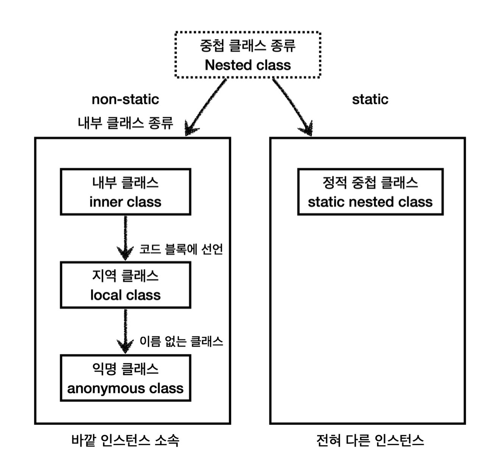

# Thread

> Thread

<!-- more -->

## 🍎 Thread

1. Process
    - 실행 중인 프로그램
    - 프로그램이 실행되면 OS로 부터 메모리를 할당받아 프로세스 상태가 됨
2. Thread

    - 하나의 프로세스는 하나 이상의 thread를 가지게 됨.
    - 실제 작업(task)를 수행하는 단위는 thread임.
    -

## 🍎 Thread 생성 방법 2가지

### 1️⃣ Thread 클래스 상속

        <details>
        <summary>Thread 만들기 - Thread 클래스 상속 </summary>

        ```java
        package kr.co.kosta;

        class MyThread extends Thread {

            public MyThread() {
                super();
            }

            @Override
            public void run() {
                System.out.println(Thread.currentThread() + "start");
                int i;
                for (i = 0; i < 200; i++) {
                    System.out.print(i + "\t");
                }

                System.out.println(Thread.currentThread() + "end");
            }
        }

        public class ThreadTest {

            public static void main(String[] args) {
                System.out.println(Thread.currentThread() + "start!");

                MyThread thread1 = new MyThread();
                thread1.run();

                System.out.println(Thread.currentThread() + "end!");

            }

        }

        ```

        ```java
        package kr.co.kosta;

        class MyThread2 implements Runnable {

        @Override
        public void run() {
            System.out.println(Thread.currentThread() + " start!");

            int i;
            for(i=0; i<20; i++)
                System.out.print(i + "\t");

            System.out.println(Thread.currentThread() + " end!");

        }
        }

        public class ThreadTest2 {
        public static void main(String[] args) {
        System.out.println(Thread.currentThread() + " start!");

            MyThread2 runnable = new MyThread2();
            Thread thread = new Thread(runnable);
            thread.start();

            Thread thread2 = new Thread(new MyThread2());         // 익명 객체 (이름이 의미가 없음 -> anonymous 객체로 생성)
            thread2.start();

            Runnable anonymousThread = new Runnable() {         // 이름이 필요없기 때문에 익명

                @Override
                public void run() {
                    System.out.println("anonymous Thread");
                }
            };

            anonymousThread.run();

            System.out.println(Thread.currentThread() + " end!");

        }
        }
        ```

        </details>

### 2️⃣ Runnable 인터페이스 구현

        <details>
        <summary> Thread 만들기 - Runnable 인터페이스 구현 </summary>

        ```java
        package kr.co.kosta;

        /*
        *task1
        *20 미만의 수 출력
        *1000 밀리세컨드 (1초) 쉼
        *
        *task2
        *	10미만의 수 출력 (9~1까지 출력 )
        *500 밀리 세컨드 쉼
        */

        public class MultiThreadTest {
            public static void main(String[] args) {

                Runnable task1 = () -> {
                    // 20 미만의 짝수
                    for (int i = 0; i < 20; i++) {
                        System.out.print(i + " ");
                        try {
                            Thread.sleep(1000);
                        } catch (InterruptedException e) {
                            e.printStackTrace();
                        }
                    }
                };


                Runnable task2 = () -> {
                    // 20 미만의 짝수
                    for (int i = 9; i > 0; i--) {
                        System.out.print(i + " ");
                        try {
                            Thread.sleep(500);
                        } catch (InterruptedException e) {
                            e.printStackTrace();
                        }
                    }
                };

                Thread thread1 = new Thread(task1);
                Thread thread2 = new Thread(task2);

                thread1.start();
                thread2.start();
            }
        }

        ```

        </details>

## Thread 상태



5. join()
    - 동시에 두 개 이상의 Thread()가 실행될 때 다른 Thread의 결과를 참조하여 실행하는 경우 join 메서드 활용한다.

-
