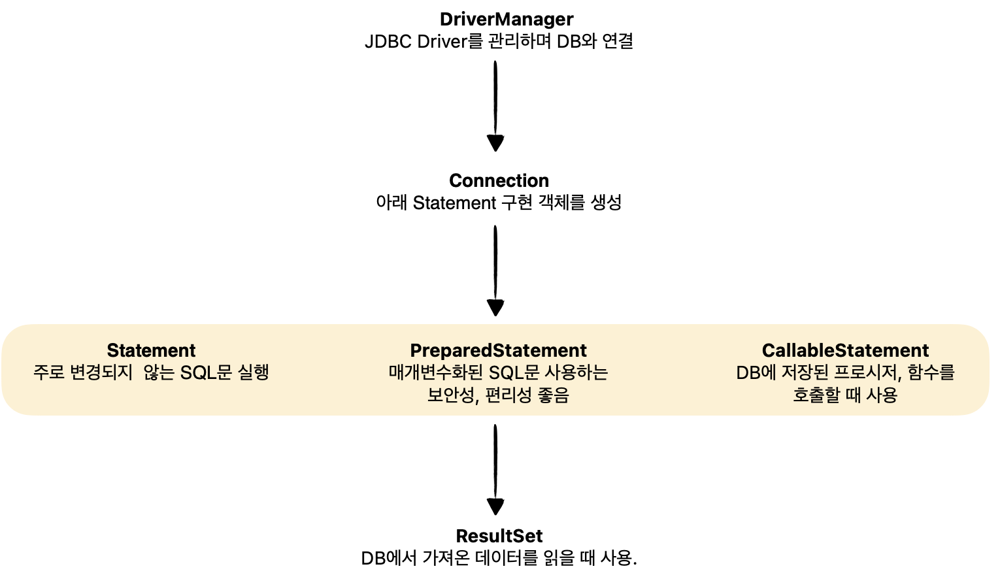
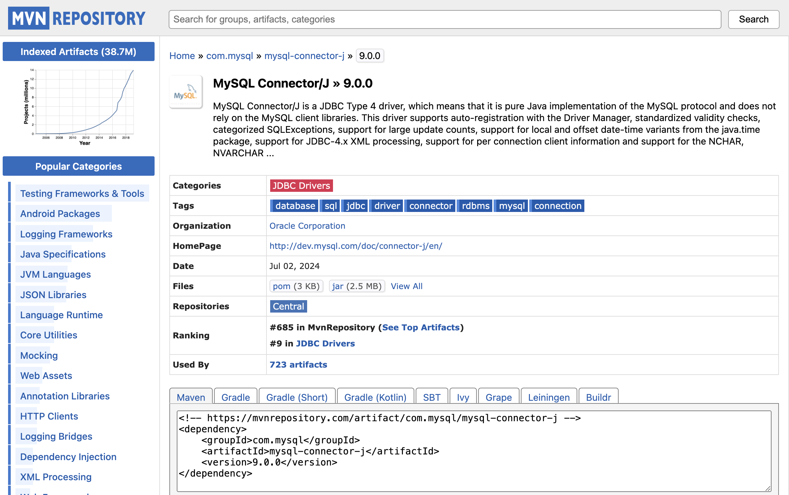
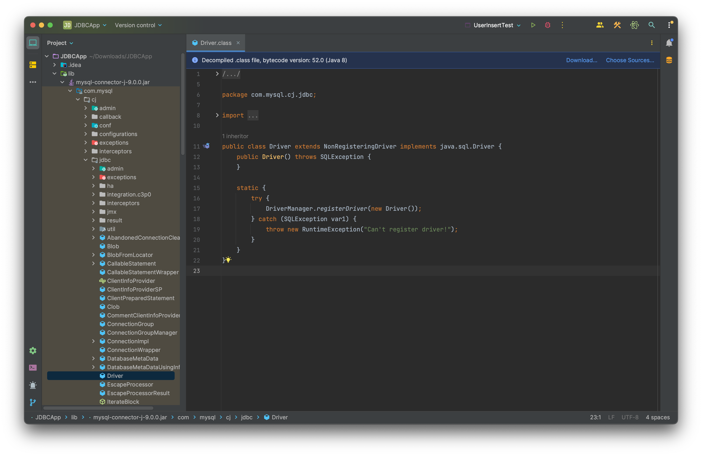

# JDBC

> 데이터베이스와 통신하는 방법, 트랜젝션(transaction) 처리

<!-- more -->

## 📌 JDBC (Java Database Connectivity)

1. 자바에서 데이터베이스에 접근할 수 있도록 도와주는 자바 API(인터페이스)
2. JDBC 구조
   

3. java.sql 패키지 제공
    - 데이터베이스 관리시스템(DBMS)의 종류와 상관없이 동일하게 사용할 수 있는 클래스와 인터페이스로 구성됨

## 📌 DB 연결

1.  해당 DBMS의 JDBC Driver가 필요함
    
2.  JDBC Driver 준비(설치)
    -   https://mvnrepository.com/artifact/com.mysql/mysql-connector-j/9.0.0
    -   jar파일 다운로드 후 프로젝트 bin 폴더 안에 위치시키기
        
3.  JDBC Driver를 메모리로 할당

    -   DriverManager에 JDBC Driver 객체를 등록하게 됨
        

    ```java
    Class.forName("com.mysql.cj.jdbc.Driver");
    ```

4.  getConnection() 메서드로 DB와 연결

    ```java
    Connection conn = DriverManager.getConnection("url", "사용자", "비밀번호");
    // 예시
    String url = "jdbc:mysql://localhost:3306/jdbc(DB명)";
    ```

## 📌 데이터 저장

1. 매개변수화된 INSERT문으로 변경

    - 값을 ?(물음표)로 대체한 매개변수화된 INSERT문으로 변경함

    ```sql
    INSERT INTO jdbc.users
    (userid, username, userpassword, userage, useremail)
    VALUES(?, ?, ?, ?, ?);
    ```

2. PreparedStatement 객체 생성

    - 매개변수화된 SQL문 실행하려면 PreparedStatement가 필요함

    ```java
    PreparedStatement pstmt = conn.prepareStatement(sql);
    ```

3. ?에 들어갈 값 지정

    - ?는 순서에 따라 1번부터 번호가 부여됨
        - 값의 타입에 따라 Setter 메소드 선택
        - 첫번째에는 순번, 두번째에는 값 지정함

    ```java
    pstmt.setString(1,"kosta2");
    pstmt.setString(2,"코스타2");
    pstmt.setString(3,"pass123#");
    pstmt.setInt(4,30);
    pstmt.setString(5,"kosta2@kosta.com");
    ```

4. executeUpdate() 메서드 호출

    - sql문 실행
    - 리턴하는 값은 저장된 행의 수
        - 테이블 1개 행 저장됨
        - 정상적으로 실행되었을 경우 1 리턴됨

    ```java
    int rowsInserted = pstmt.executeUpdate();
    ```

5. PreparedStatement 객체를 더 이상 사용하지 않을 경우 close() 메서드 호출

    - 사용했던 메모리 해제

    ```java
    pstmt.close();
    ```

6. JDBC 표준 인터페이스

    - 3가지 기능을 인터페이스로 정의하여 제공
        - Connection (연결)
        - Statement (SQL 전달)
        - ResultSet (결과 응답)

### 🍀 데이터 저장 예시 (INSERT)

<details>
<summary> 테이블에 INSERT 예시 </summary>

```java
package kr.co.kosta.mysql;

import java.sql.Connection;
import java.sql.DriverManager;
import java.sql.PreparedStatement;
import java.sql.SQLException;

public class UserInsertTest {
    public static void main(String[] args) {
        Connection conn = null;
        try {
            // JDBC Drvier 등록
            Class.forName("com.mysql.cj.jdbc.Driver");

            //  연결하기
            conn = DriverManager.getConnection(
              "jdbc:mysql://127.0.0.1:3306",
              "root",
              "pass123#"
            );
            String sql = ""+
                    "insert into jdbc.users (userid, username, userpassword, userage, useremail) "+
                    "VALUES(?,?,?,?,?);";
            // PreparedStatement 객체 얻기(생성)
            PreparedStatement pstmt = conn.prepareStatement(sql);
            // 값 지정
            pstmt.setString(1,"kosta2");
            pstmt.setString(2,"코스타2");
            pstmt.setString(3,"pass123#");
            pstmt.setInt(4,30);
            pstmt.setString(5,"kosta2@kosta.com");

            // SQL문 실행
            int rows=pstmt.executeUpdate();
            System.out.println("저장된 행 수 : "+rows);
            //  PreparedStatement 닫기
            pstmt.close();

        }catch (ClassNotFoundException | SQLException e){
            throw new RuntimeException(e);
        }finally {
            if(conn !=null){
                // 연결끊기
                try {
                    conn.close();
                    System.out.println("연결 끊기");
                } catch (SQLException e) {
                    throw new RuntimeException(e);
                }
            }
        }
    }
}
```

</<details>

## 📌 데이터 수정

```sql
UPDATE boards
SET btitle='비오는 수요일', bcontent='장마가 이제 시작되었습니다', bwriter='kosta1', bfilename='event2.png'
WHERE bid=1;
```

### 🍀 데이터 저장 예시 (UPDATE)

<details>
<summary> 테이블 UPDATE 예시 </summary>

```java
package kr.co.kosta.mysql;

import java.sql.Connection;
import java.sql.DriverManager;
import java.sql.PreparedStatement;
import java.sql.SQLException;

public class BoardUpdateTest {
    public static void main(String[] args) {
        Connection conn=null;
        try {
        // JDBC Drvier 등록
            Class.forName("com.mysql.cj.jdbc.Driver");

            conn= DriverManager.getConnection(
                    "jdbc:mysql://127.0.0.1:3306",
                    "kosta",
                    "pass123#"
            );
            String sql= new StringBuilder()
                    .append("UPDATE jdbc.boards SET ")
                    .append("btitle=?, ")
                    .append("bcontent= ?, ")
                    .append("bwriter=?, ")
                    .append("bfilename= ? " )
                    .append("WhERE bid=?")
                    .toString();
            // PreparedStatement 객체 얻기(생성)
            PreparedStatement pstmt =conn.prepareStatement(sql);
            pstmt.setString(1,"비 그친 오후");
            pstmt.setString(2,"비구름이 지금은 위로 옮겼습니다.");
            pstmt.setString(3,"kosta1");
            pstmt.setString(4,"event.png");
            pstmt.setInt(5,1);

            // SQL문 실행
            int rows =pstmt.executeUpdate();
            System.out.println("수정된 행 수 : "+rows);
            // PreparedStatement close
            pstmt.close();

        }catch (ClassNotFoundException | SQLException e){
            throw  new RuntimeException(e);
        }finally {
            if(conn !=null){
                // 연결끊기
                try {
                    conn.close();
                    System.out.println("연결 끊기");
                } catch (SQLException e) {
                    throw new RuntimeException(e);
                }
            }
        }
    }
}

```

## 📌 데이터 삭제

### 🍀 데이터 삭제 예시 (DELETE)

<details>
<summary> 테이블 DELETE 예시 </summary>

```java
package kr.co.kosta.mysql;

import java.sql.Connection;
import java.sql.DriverManager;
import java.sql.PreparedStatement;
import java.sql.SQLException;

public class BoardUpdateTest {
    public static void main(String[] args) {
        Connection conn=null;
        try {
        // JDBC Drvier 등록
            Class.forName("com.mysql.cj.jdbc.Driver");

            conn= DriverManager.getConnection(
                    "jdbc:mysql://127.0.0.1:3306",
                    "kosta",
                    "pass123#"
            );
            String sql= new StringBuilder()
                    .append("UPDATE jdbc.boards SET ")
                    .append("btitle=?, ")
                    .append("bcontent= ?, ")
                    .append("bwriter=?, ")
                    .append("bfilename= ? " )
                    .append("WhERE bid=?")
                    .toString();
            // PreparedStatement 객체 얻기(생성)
            PreparedStatement pstmt =conn.prepareStatement(sql);
            pstmt.setString(1,"비 그친 오후");
            pstmt.setString(2,"비구름이 지금은 위로 옮겼습니다.");
            pstmt.setString(3,"kosta1");
            pstmt.setString(4,"event.png");
            pstmt.setInt(5,1);

            // SQL문 실행
            int rows =pstmt.executeUpdate();
            System.out.println("수정된 행 수 : "+rows);
            // PreparedStatement close
            pstmt.close();

        }catch (ClassNotFoundException | SQLException e){
            throw  new RuntimeException(e);
        }finally {
            if(conn !=null){
                // 연결끊기
                try {
                    conn.close();
                    System.out.println("연결 끊기");
                } catch (SQLException e) {
                    throw new RuntimeException(e);
                }
            }
        }
    }
}

```

## 📌 데이터 조회(읽기)

```sql
SELECT * FROM boards
WHERE bwriter='kosta1';
```

### ResultSet

-   select 문에 기술된 컬럼으로 구성된 행의 집합(row)
-   커서가 있는 행의 데이터만 읽을 수 있음
-   커서 : 행을 가르키는 포인터를 말함
-   실제 가져온 데이터 행의 앞과 뒤에 beforeFirst()행과 afterLast()행을 가르킴
-   첫번 째 데이터 행인 first행을 읽으려면 커서를 이동시켜야 함
-   next() 메소드 사용

|  데이터 행   |     날짜      |      내용      |   커서 위치   |
| :----------: | :-----------: | :------------: | :-----------: |
| 최초커서위치 |               |                | beforeFirst() |
|      4       | 비오는 수요일 | 장마가 시작됨1 |    first()    |
|      5       | 비오는 목요일 | 장마가 시작됨2 |               |
|      6       | 비오는 금요일 | 장마가 시작됨3 |    next()     |
|      7       | 비오는 토요일 | 장마가 시작됨4 |               |
|      8       | 비오는 일요일 | 장마가 시작됨5 |    last()     |
|              |               |                |  afterLast()  |

### boolean next()

    -   이동한 행에 데이터가 있으면 true를 없으면 false를 리턴함

## 💡 query

<details>
<summary>[query9.sql] JDBC 실습할 때 사용한 쿼리 </summary>

```sql
drop table users;
create table users (
	userid		varchar(50)		primary key,
    username	varchar(50)		not null,
    userpassword	varchar(50)	not null,
    userage		numeric(3)		not null,
    useremail	varchar(50)		not null
);

drop table boards;
create table boards (
	bid			int				primary key	auto_increment,
    btitle		varchar(100)	not null,
    bcontent	longtext		not null,
    bwriter		varchar(50)		not null,
    bdate		datetime		default now(),
    bfilename	varchar(50)		null,
    bfiledata	longblob		null
);

drop table accounts;
create table accounts (
	aid			varchar(20)		primary key,
    owner		varchar(20)		not null,
    balance		numeric			not null
);


INSERT INTO jdbc.users (userid, username, userpassword, userage, useremail)
VALUES('kosta1', '코스타1', 'pass123#', 25, 'kosta1@kosta.com');


INSERT INTO jdbc.boards
(btitle, bcontent, bwriter, bdate, bfilename)
VALUES('비오는 수요일', '장마가 이제 시작되었습니다.', 'kosta1', now(), 'event.png');


UPDATE jdbc.boards
SET btitle='비오는 수요일', bcontent='장마가 이제 시작되었습니다', bwriter='kosta1', bfilename='event2.png'
WHERE bid=1;

DELETE FROM jdbc.boards
WHERE bid=1;

DELETE FROM jdbc.boards WHERE bwriter='kosta1';
```

</details>

## 📌 트랜젝션(transaction)

1. 기능처리의 최소 단위
    - 소작업들을 분리할 수 없음
    - 전체를 하나로 본다.
2. 하나의 기능은 여러 가지 소작업들로 구성될 수 있음
3. 트랜젝션은 소작업들이 모두 성공하거나 모두 실패해야함
    - 커밋(commit)
        - DML문(SELECT, INSERT, UPDATE, DELETE)을 실행할 때마다 자동 커밋이 되고 있었음
    - 콜백(rollback)
4. 계좌이체
    - 출금 작업, 입금 작업으로 구성된 트랜잭션임
    - 출금과 입금 작업 중 하나만 성공할 수 없음
    - 모두 성공하거나 모두 실패되어야 함

## 📌 게시판 만들기

> JDBC를 활용한 게시판 구현하기

```java

```
