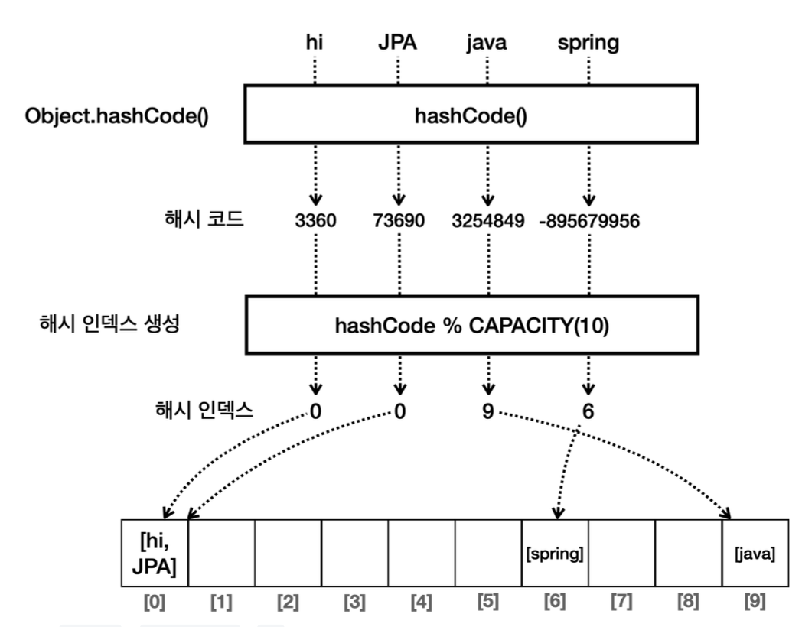

# 컬렉션 프레임워크 - Set

> 컬렉션 프레임워크중 Set에 대해 알아보자. 그리고 hashCode와 equals의 중요성 알아보기

1. hashSet()
2. LinkedHashSet()
3. TreeSet()

<!-- more -->

## 💡 List vs Set

> 간단 정리

-   List: 순서가 있으며 중복을 허용하는 요소의 집합. ArrayList, LinkedList, Vector
-   Set: 순서가 없고 중복을 허용하지 않는 요소의 집합. HashSet, LinkedHashSet, TreeSet
-   Map: 고유한 키와 그 키에 연결된 값의 쌍으로 이루어진 데이터의 집합. HashMap, LinkedHashMap, TreeMap

### List

> 순서가 중요하거나 중복된 요소를 허용해야 하는 경우 사용한다.

1. 순서가 있다.
2. 중복을 허용한다.
3. 인덱스를 통해 접근한다.

> List 예시

-   장바구니 목록(슨서대로 보여주기), 순서가 중요한 일련의 이벤트 목록

### Set

> 즉 중복을 허용하고, 요소의 유무만 중요할 때 사용한다.

1. 유일성
2. 순서 미보장
3. 빠른 검색

> Set 예시

-   회원 ID집합, 고유한 항목의 집합

### Set 구현하기

> 셋 구현 매소드

1. add(value)`: 셋에 값을 추가한다. 중복 데이터는 저장하지 않는다.`
2. contains(value)`: 셋에 값이 있는지 확인한다.` 보통 O(N)이 걸린다.
3. remove(value)` : 셋에 있는 값을 제거한다.

> set 코드로 구현

```java
package collection.set;

import java.sql.PreparedStatement;
import java.util.Arrays;

public class MyHashSetV0 {

    private  int[] elementData = new int[10];
    private  int size = 0;

    //add
    public boolean add(int value) {

        if (contains(value)) {
            return  false;
        }
        elementData[size] = value;
        size++;
        return true;
    }

    public boolean contains(int value) {

        for(int data : elementData) {
            if(data == value) {
                return true;
            }
        }
        return false;
    }

    public int size( ){
        return  size;
    }

    @Override
    public String toString() {
        return "MyHashSetV0{" +
                "elementData=" + Arrays.toString(Arrays.copyOf(elementData, size)) +
                ", size=" + size +
                '}';
    }
}

```

```java
package collection.set;

public class MyHashSetV0Main {

    public static void main(String[] args) {

        MyHashSetV0 set = new MyHashSetV0();
        set.add(1);  //O(1)
        set.add(2);  //O(N)
        set.add(3);  //O(N)
        set.add(4);  //O(N)
        set.add(5);  //O(N)
        set.add(6);  //O(N)
        System.out.println(set);  // MyHashSetV0{elementData=[1, 2, 3, 4, 5, 6], size=6}

        boolean result = set.add(4); // 중복 데이터 저장
        System.out.println("중복 데이터 저장 결과 = " + result);  // 중복 데이터 저장 결과 = false
        System.out.println(set);  // MyHashSetV0{elementData=[1, 2, 3, 4, 5, 6], size=6}

        System.out.println("set.contains(99) = " + set.contains(99)); //set.contains(99) = false
        System.out.println("set.contains(3) = " + set.contains(3)); // set.contains(3) = true
    }
}

```

데이터의 추가할 떄마다 중복 데이터가 있는지 체크하기 위해서 셋의 전체 데이터를 확인해야한다. 이때 O(N)이므로 성능이 떨어진다. 중복 데이터를 찾는 부분의 성능이 떨어지게 된다.

## 💡 해시 알고리즘

### index 사용하기

-   해시(hash) 알고리즘을 사용하면 데이터를 찾는 검색 성능을 평균 O(1)로 개선할 수 있다. `데이터의 값 자체를 배열의 인덱스로 사용하는것이다.`
    -   인덱스 1 -> 데이터 1
    -   인덱스 5 -> 데이터 5
    -   인덱스 8 -> 데이터 8
    -   데이터 1을 찾으려면 array[1]을 하면 된다. 데이터 8을 찾으려면 array[8]을 하면 된다. O(1)의 검색 연산으로 바꾸게 된 것이다.

### index 적용 전

```java
package collection.set;

import java.util.Arrays;

public class HashStart1 {
    public static void main(String[] args) {
        Integer[] inputArray = new Integer[4];
        inputArray[0] = 1;
        inputArray[1] = 2;
        inputArray[2] = 5;
        inputArray[3] = 8;
        System.out.println("inputArray = " + Arrays.toString(inputArray));

        int searchValue = 8;
        //4번 반복 O(n)
        for (int inputValue : inputArray) {
            if (inputValue == searchValue) {
                System.out.println(inputValue);
            }
        }
    }
}

```

### index 적용 후 hash

-   검색 성능을 O(1)로 개선했다(속도 개선). 하지만 입력 값의 범위 만큼 큰 배열을 사용하다보니 배열에 낭비되는 공간이 많이 발생한다.

```java
package collection.set;

import java.util.Arrays;

// [null, 1, 2, null, null, 5, null, null, 8, null]
public class HashStart2 {
    public static void main(String[] args) {
        Integer[] inputArray = new Integer[10];
        inputArray[1] = 1;
        inputArray[2] = 2;
        inputArray[5] = 5;
        inputArray[8] = 8;
        System.out.println("inputArray = " + Arrays.toString(inputArray)); // inputArray = [null, 1, 2, null, null, 5, null, null, 8, null]

        int searchValue = 8;
        Integer i = inputArray[searchValue];   // O(1)
        System.out.println("i = " + i);

    }
}

```

## 💡 해시 알고리즘 - 메모리 낭비

-   `한계` : 데이터의 값을 인덱스로 사용한 덕분에 O(1)의 매우 빠른 검색 속도를 얻을 수 있다. 하지만 낭비되는 메모리 공간이 너무 많다.

```java
package collection.set;

import java.util.Arrays;

public class HashStart3 {
    public static void main(String[] args) {

        // 입력 : {1, 2, 5, 8, 14, 99}
        //[null, 1, 2, null, null, 5, null   , null, 8, .., 14 ....., 99]
        Integer[] inputArray = new Integer[100];
        inputArray[1] = 1;
        inputArray[2] = 2;
        inputArray[5] = 5;
        inputArray[8] = 8;
        inputArray[14] = 14;
        inputArray[99] = 99;
        System.out.println("inputArray = " + Arrays.toString(inputArray));

        int searchValue = 99;
        Integer i = inputArray[searchValue];   // O(1)
        System.out.println("i = " + i);
    }
}
```

```shell
inputArray = [null, 1, 2, null, null, 5, null, null, 8, null, null, null, null, null, 14, null, null, null, null, null, null, null, null, null, null, null, null, null, null, null, null, null, null, null, null, null, null, null, null, null, null, null, null, null, null, null, null, null, null, null, null, null, null, null, null, null, null, null, null, null, null, null, null, null, null, null, null, null, null, null, null, null, null, null, null, null, null, null, null, null, null, null, null, null, null, null, null, null, null, null, null, null, null, null, null, null, null, null, null, 99]

```

## 💡 해시 알고리즘 - 나머지 연산

-   `나머지 연산` : 공간도 절약하면서, 넓은 범위의 값을 사용할 수 있는 방법
-   1 % 10 = 1
-   2 % 10 = 2
-   5 % 10 = 5
-   8 % 10 = 8
-   14 % 10 = 4
-   99 % 10 = 9

<br>

### hashIndex

-   해시 인덱스 반환
-   해시 인덱스는 입력 값을 계산해서 인덱스로 사용하는 것을 뜻한다. 입력 값을 배열의 크기로 나머지 연산해서 구한다.
    -   hashIndex = value % CAPACITY(=10)
-   add() : 해시 인덱스를 먼저 구한 후, 구한 해시 인덱스의 위치에 데이터를 저장한다.
-   조회 : 해시 인덱스를 구하고, 배열에 해시 인덱스를 대입해서 값을 조회한다.
    -   `inputArray[hashIndex]`


```java
package collection.set;

import java.util.Arrays;

public class HashStart4 {
    static final int CAPACITY = 10;

    public static void main(String[] args) {
        //{1, 2, 5, 8, 14, 99}
        System.out.println("hashIndex(1) = " + hashIndex(1));
        System.out.println("hashIndex(2) = " + hashIndex(2));
        System.out.println("hashIndex(5) = " + hashIndex(5));
        System.out.println("hashIndex(8) = " + hashIndex(8));
        System.out.println("hashIndex(14) = " + hashIndex(14));
        System.out.println("hashIndex(99) = " + hashIndex(99));

        Integer[] inputArray = new Integer[CAPACITY];
        add(inputArray, 1);
        add(inputArray, 2);
        add(inputArray, 5);
        add(inputArray, 8);
        add(inputArray, 14);
        add(inputArray, 99);
        System.out.println("inputArray = " + Arrays.toString(inputArray)); // inputArray = [null, 1, 2, null, 14, 5, null, null, 8, 99]

        // 검색
        int searchValue = 14;
        int hashIndex = hashIndex(searchValue);  // 해시 인덱스를 구해서 검색 해야됨
        System.out.println("searchValue hashIndex = " + hashIndex);   // searchValue hashIndex = 4
        Integer result = inputArray[hashIndex]; // O(1)
        System.out.println(result);  // 14
    }

    private static void add(Integer[] inputArray, int value) {
        int hashIndex = hashIndex(value);
        inputArray[hashIndex] = value;
    }
    static int hashIndex(int value) {

        return value % CAPACITY;
    }
}

```

> 결론

-   입력 값의 범위가 넓어도 실제 모든 값이 들어오지는 않기 때문에 배열의 크기를 제한하고, 나머지 연산을 통해 메모리가 낭비되는 문제도 해결할 수 있다.
-   해시 인덱스를 사용해서 O(1)의 성능으로 데이터를 저장하고, O(1)의 성능으로 데이터를 조회할 수 있게 되었다. 덕분에 자료 구조의 조회 속도를 향상할 수 있게 되었다.

> 한계 - 해시 충돌

-   1 % 10 = 1
-   11 % 10 = 1

<br>

## 💡 해시 알고리즘 - 해시 충돌

-   해시 충돌이 낮은 확률로 일어날 것이라고 가정한다.
-   해시 충돌이 일어나면, 단순하게 해시 인덱스의 값을 같은 인덱스에 함께 저장한다. 배열안에 배열을 만든다.
-   예시 (저장)
    -   99 % 10 = 9
    -   9 % 10 = 9
    -   9번 인덱스 안에 [99, 9]를 저장하는 것이다.
-   예시 (조회) -만약 99를 조회한다고 가정했을 때, 9번 인덱스에있는 모든 값을 검색할 값과 하나씩 비교한다.
    
-   최악의 경우
    -   9, 19, 29, 99인 경우 9번 인덱스에 가서 저장한 데이터의 수 만큼 반복 해서 비교해야됨.
    -   O(N)
    -   하지만 대부분의 경우 분포가 되어있을 것이고, 확률적으로 충돌 날 수도 있다.

### 해시 충돌 구현

> 순서

1. 배열선언

    - 배열의 이름은 buckets이다. 배열안에 단순 값이 들어가는 것이 아니라, 해시 충돌을 고려해서 배열안에 배열이 들어가야한다.
    - 배열안에 배열 대신 더 편리하게 사용할 수 있는 연결리스트 사용했다.
    - 즉 배열 안에 연결리스트가 들어있고, 연결리스트 안에 데이터가 들어가는 구조이다.
        - buckets -> 배열
        - bucket -> 연결리스트
        - 연결리스트 내에 데이터들

    ```java
    LinkedList<Integer>[] buckets = new LinkedList[CAPACITY]
    ```

2. 데이터 등록

    - 우선 hashIndex를 구한다.
    - 해시 인덱스로 배열의 인덱스를 찾는다. 배열에는 연결리스트가 들어있다.
    - set은 중복을 허용하지 않으므로, 바구니에 값을 저장하기 전에 contains()를 이용해 중복여부 확인한다.
        - O(N)의 성능을 가진다.
        - 하지만 해시 충돌이 발생하지 않으면 데이터가 1개만 들어있으므로 O(1)의 성능을 가진다.

    ```java
    private static void add(LinkedList<Integer>[] buckets, int value) {
        int hashIndex = hashIndex(value);
        LinkedList<Integer> bucket = buckets[hashIndex]; //O(1)
        if (!bucket.contains(value)) { //O(n)
            bucket.add(value);
        }
    }
    ```

3. 데이터 검색

    - 해시 인덱스로 배열의 인덱스를 찾는다. 여기에는 연결 리스트가 들어있다.
    - 연결 리스트의 `bucket.contains(searchValue)` 메서드를 사용해서 찾는 데이터가 있는지 확인한다.
    - 연결 리스트의 `contains()` 는 모든 항목을 다 순회하기 때문에 O(n)의 성능이다.
        - 하지만 해시 충돌이 발생하지 않으면 데이터가 1개만 들어있기 때문에 O(1)의 성능을 가진다.

    ```java
    private static boolean contains(LinkedList<Integer>[] buckets, int searchValue)
    {
        int hashIndex = hashIndex(searchValue);
        LinkedList<Integer> bucket = buckets[hashIndex]; //O(1)
        return bucket.contains(searchValue); //O(n)
    }
    ```

<details>
<summary> 해시 충돌 전체 코드 </summary>

```java
package collection.set;

import java.util.Arrays;
import java.util.LinkedList;

public class HashStart5 {
    static final int CAPACITY = 10;

    public static void main(String[] args) {
        //{1, 2, 5, 8, 14, 99}
        // 배열안에 배열을 링크드리스트를 통해 표현
        LinkedList<Integer>[] buckets = new LinkedList[CAPACITY]; // 링크드리스트를 넣을 수 있는 배열 생성
        System.out.println("buckets = " + Arrays.toString(buckets));
        for (int i = 0; i < CAPACITY; i++) {
            buckets[i] = new LinkedList<>();
        }

        add(buckets, 1);
        add(buckets, 2);
        add(buckets, 5);
        add(buckets, 8);
        add(buckets, 14);
        add(buckets, 99);
        add(buckets, 9); //중복
        System.out.println("buckets = " + Arrays.toString(buckets));

        //검색
        int searchValue = 9;
        boolean contains = contains(buckets, searchValue);
        System.out.println("buckets.contains(" + searchValue + ") = " + contains);
    }

    private static boolean contains(LinkedList<Integer>[] buckets, int searchValue) {

        int hashIndex = hashIndex(searchValue);
        LinkedList<Integer> bucket = buckets[hashIndex]; //O(1)
        return bucket.contains(searchValue);
    }

    private static void add(LinkedList<Integer>[] buckets, int value) {
        int hashIndex = hashIndex(value);
        LinkedList<Integer> bucket = buckets[hashIndex]; // O(1)
        if (!bucket.contains(value)) { // O(n)
            bucket.add(value);
        }
    }

    private static int hashIndex(int value) {
        return value % CAPACITY;
    }
}
```

```shell
buckets = [null, null, null, null, null, null, null, null, null, null]
buckets = [[], [1], [2], [], [14], [5], [], [], [8], [99, 9]]
buckets.contains(9) = true
```

</details>

## 💡 자바가 제공하는 Set

### 1️⃣ HashSet

-   구현: 해시 자료 구조를 사용해서 요소를 저장한다.
-   순서: 요소들은 특정한 순서 없이 저장된다. 즉, 요소를 추가한 순서를 보장하지 않는다.
-   시간 복잡도: `HashSet` 의 주요 연산(추가, 삭제, 검색)은 평균적으로 `O(1)` 시간 복잡도를 가진다.
-   용도: 데이터의 유일성만 중요하고, 순서가 중요하지 않은 경우에 적합하다.

### 2️⃣ LinkedHashSet

-   구현: `LinkedHashSet` 은 `HashSet` 에 연결 리스트를 추가해서 요소들의 순서를 유지한다.
-   순서: 요소들은 추가된 순서대로 유지된다. 즉, 순서대로 조회 시 요소들이 추가된 순서대로 반환된다.
-   시간 복잡도: `LinkedHashSet` 도 `HashSet` 과 마찬가지로 주요 연산에 대해 평균 `O(1)` 시간 복잡도를 가진다.
-   용도: 데이터의 유일성과 함께 삽입 순서를 유지해야 할 때 적합하다.
-   참고: 연결 링크를 유지해야 하기 때문에 `HashSet` 보다는 조금 더 무겁다.

### 3️⃣ TreeSet

-   구현: `TreeSet` 은 이진 탐색 트리를 개선한 레드-블랙 트리를 내부에서 사용한다.
-   순서: 요소들은 정렬된 순서로 저장된다. 순서의 기준은 비교자( `Comparator` )로 변경할 수 있다. 비교자는 뒤에 서 다룬다.
-   시간 복잡도: 주요 연산들은 `O(log n)` 의 시간 복잡도를 가진다. 따라서 `HashSet` 보다는 느리다.
-   용도: 데이터들을 정렬된 순서로 유지하면서 집합의 특성을 유지해야 할 때 사용한다. 예를 들어, 범위 검색이나 정렬된 데이터가 필요한 경우에 유용하다. 참고로 입력된 순서가 아니라 데이터 값의 순서이다. 예를 들어 3, 1, 2 를 순서대로 입력해도 1, 2, 3 순서로 출력된다.

```java
public class JavaSetMain {
     public static void main(String[] args) {
         run(new HashSet<>());
         run(new LinkedHashSet<>());
         run(new TreeSet<>());
}
     private static void run(Set<String> set) {
         System.out.println("set = " + set.getClass());
         set.add("C");
         set.add("B");
         set.add("A");
         set.add("1");
         set.add("2");
         Iterator<String> iterator = set.iterator();
         while (iterator.hasNext()) {
             System.out.print(iterator.next() + " ");
         }
         System.out.println();
     }
}
```

```bash
set = class java.util.HashSet A1B2C
set = class java.util.LinkedHashSet CBA12
set = class java.util.TreeSet 12ABC
```

## equals, hashCode

-   해시 인덱스가 충돌할 경우 해시 인덱스에 있는 데이터들을 하나하나 비교해서 찾아야 한다. 이때 equals()를 사용한다.
-   equals()는 언제 사용될까?
    
    -   "JPA"를 조회할 때 해시 인덱스는 0이다. 따라서 배열의 `0` 번 인덱스를 조회한다. 여기에는 `[hi, JPA]` 라는 회원 두 명이 있다. 이것을 하나하나 비교해야 한다. 이때 `equals()` 를 사용해서 비교한다.
-   따라서 해시 자료 구조를 사용할 때는 `hashCode()` 는 물론이고, `equals()` 도 반드시 재정의해야 한다.
-   자바 제공하는 기본 클래스들은 대부분 `hashCode()` , `equals()` 를 함께 재정의해 두었다.

<br>

> Object의 기본 기능

-   `hashCode()` : 객체의 참조값을 기반으로 해시 코드를 반환한다.
-   `equals()` : `==` 동일성 비교를 한다. 따라서 객체의 참조값이 같아야 `true` 를 반환한다.
-   따라서 클래스를 만들때 재정의하지 않는다면, 해시 자료구조에서 Object가 기본으로 제공하는 hashCode, equals를 사용하게 된다. 그러면 단순히 인스턴스 참조(주소지)를 기반으로 작동하게 된다.
