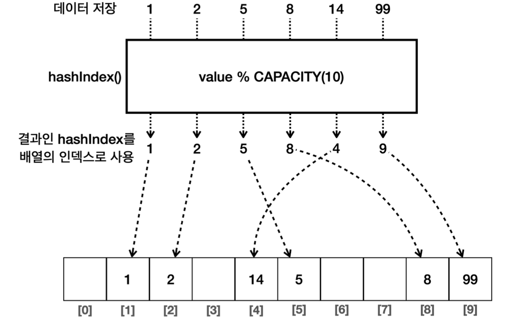
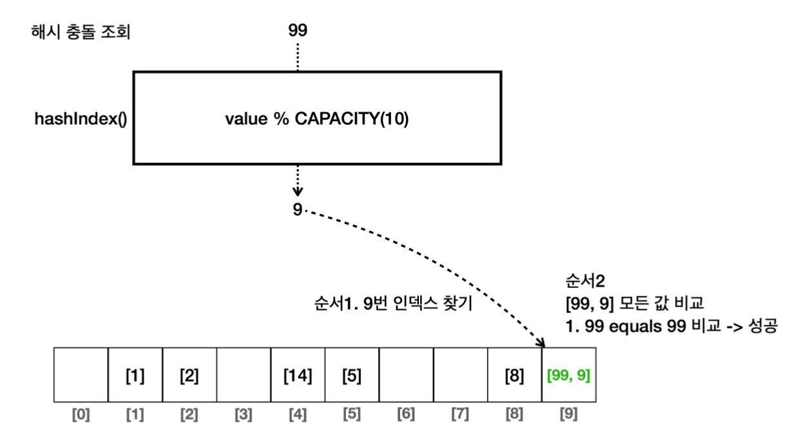

# 컬렉션 프레임워크

> 컬렉션 프레임워크 (Hash)

<!-- more -->

## 💡 List vs Set

### List

> 순서가 중요하거나 중복된 요소를 허용해야 하는 경우 사용한다.

1. 순서가 있다.
2. 중복을 허용한다.
3. 인덱스를 통해 접근한다.

> List 예시

-   장바구니 목록(슨서대로 보여주기), 순서가 중요한 일련의 이벤트 목록

### Set

> 즉 중복을 허용하고, 요소의 유무만 중요할 때 사용한다.

1. 유일성
2. 순서 미보장
3. 빠른 검색

> Set 예시

-   회원 ID집합, 고유한 항목의 집합

### Set 구현하기

> 셋 구현 매소드

1. add(value)`: 셋에 값을 추가한다. 중복 데이터는 저장하지 않는다.`
2. contains(value)`: 셋에 값이 있는지 확인한다.` 보통 O(N)이 걸린다.
3. remove(value)` : 셋에 있는 값을 제거한다.

> set 코드로 구현

```java
package collection.set;

import java.sql.PreparedStatement;
import java.util.Arrays;

public class MyHashSetV0 {

    private  int[] elementData = new int[10];
    private  int size = 0;

    //add
    public boolean add(int value) {

        if (contains(value)) {
            return  false;
        }
        elementData[size] = value;
        size++;
        return true;
    }

    public boolean contains(int value) {

        for(int data : elementData) {
            if(data == value) {
                return true;
            }
        }
        return false;
    }

    public int size( ){
        return  size;
    }

    @Override
    public String toString() {
        return "MyHashSetV0{" +
                "elementData=" + Arrays.toString(Arrays.copyOf(elementData, size)) +
                ", size=" + size +
                '}';
    }
}

```

```java
package collection.set;

public class MyHashSetV0Main {

    public static void main(String[] args) {

        MyHashSetV0 set = new MyHashSetV0();
        set.add(1);  //O(1)
        set.add(2);  //O(N)
        set.add(3);  //O(N)
        set.add(4);  //O(N)
        set.add(5);  //O(N)
        set.add(6);  //O(N)
        System.out.println(set);  // MyHashSetV0{elementData=[1, 2, 3, 4, 5, 6], size=6}

        boolean result = set.add(4); // 중복 데이터 저장
        System.out.println("중복 데이터 저장 결과 = " + result);  // 중복 데이터 저장 결과 = false
        System.out.println(set);  // MyHashSetV0{elementData=[1, 2, 3, 4, 5, 6], size=6}

        System.out.println("set.contains(99) = " + set.contains(99)); //set.contains(99) = false
        System.out.println("set.contains(3) = " + set.contains(3)); // set.contains(3) = true
    }
}

```

데이터의 추가할 떄마다 중복 데이터가 있는지 체크하기 위해서 셋의 전체 데이터를 확인해야한다. 이때 O(N)이므로 성능이 떨어진다. 중복 데이터를 찾는 부분의 성능이 떨어지게 된다.

## 💡 해시 알고리즘

### index 사용하기

-   해시(hash) 알고리즘을 사용하면 데이터를 찾는 검색 성능을 평균 O(1)로 개선할 수 있다. `데이터의 값 자체를 배열의 인덱스로 사용하는것이다.`
    -   인덱스 1 -> 데이터 1
    -   인덱스 5 -> 데이터 5
    -   인덱스 8 -> 데이터 8
    -   데이터 1을 찾으려면 array[1]을 하면 된다. 데이터 8을 찾으려면 array[8]을 하면 된다. O(1)의 검색 연산으로 바꾸게 된 것이다.

### index 적용 전

```java
package collection.set;

import java.util.Arrays;

public class HashStart1 {
    public static void main(String[] args) {
        Integer[] inputArray = new Integer[4];
        inputArray[0] = 1;
        inputArray[1] = 2;
        inputArray[2] = 5;
        inputArray[3] = 8;
        System.out.println("inputArray = " + Arrays.toString(inputArray));

        int searchValue = 8;
        //4번 반복 O(n)
        for (int inputValue : inputArray) {
            if (inputValue == searchValue) {
                System.out.println(inputValue);
            }
        }
    }
}

```

### index 적용 후 hash

-   검색 성능을 O(1)로 개선했다(속도 개선). 하지만 입력 값의 범위 만큼 큰 배열을 사용하다보니 배열에 낭비되는 공간이 많이 발생한다.

```java
package collection.set;

import java.util.Arrays;

// [null, 1, 2, null, null, 5, null, null, 8, null]
public class HashStart2 {
    public static void main(String[] args) {
        Integer[] inputArray = new Integer[10];
        inputArray[1] = 1;
        inputArray[2] = 2;
        inputArray[5] = 5;
        inputArray[8] = 8;
        System.out.println("inputArray = " + Arrays.toString(inputArray)); // inputArray = [null, 1, 2, null, null, 5, null, null, 8, null]

        int searchValue = 8;
        Integer i = inputArray[searchValue];   // O(1)
        System.out.println("i = " + i);

    }
}

```

## 💡 해시 알고리즘 - 메모리 낭비

-   `한계` : 데이터의 값을 인덱스로 사용한 덕분에 O(1)의 매우 빠른 검색 속도를 얻을 수 있다. 하지만 낭비되는 메모리 공간이 너무 많다.

```java
package collection.set;

import java.util.Arrays;

public class HashStart3 {
    public static void main(String[] args) {

        // 입력 : {1, 2, 5, 8, 14, 99}
        //[null, 1, 2, null, null, 5, null   , null, 8, .., 14 ....., 99]
        Integer[] inputArray = new Integer[100];
        inputArray[1] = 1;
        inputArray[2] = 2;
        inputArray[5] = 5;
        inputArray[8] = 8;
        inputArray[14] = 14;
        inputArray[99] = 99;
        System.out.println("inputArray = " + Arrays.toString(inputArray));

        int searchValue = 99;
        Integer i = inputArray[searchValue];   // O(1)
        System.out.println("i = " + i);
    }
}
```

```shell
inputArray = [null, 1, 2, null, null, 5, null, null, 8, null, null, null, null, null, 14, null, null, null, null, null, null, null, null, null, null, null, null, null, null, null, null, null, null, null, null, null, null, null, null, null, null, null, null, null, null, null, null, null, null, null, null, null, null, null, null, null, null, null, null, null, null, null, null, null, null, null, null, null, null, null, null, null, null, null, null, null, null, null, null, null, null, null, null, null, null, null, null, null, null, null, null, null, null, null, null, null, null, null, null, 99]

```

## 💡 해시 알고리즘 - 나머지 연산

-   `나머지 연산` : 공간도 절약하면서, 넓은 범위의 값을 사용할 수 있는 방법
-   1 % 10 = 1
-   2 % 10 = 2
-   5 % 10 = 5
-   8 % 10 = 8
-   14 % 10 = 4
-   99 % 10 = 9

<br>

### hashIndex

-   해시 인덱스 반환
-   해시 인덱스는 입력 값을 계산해서 인덱스로 사용하는 것을 뜻한다. 입력 값을 배열의 크기로 나머지 연산해서 구한다.
    -   hashIndex = value % CAPACITY(=10)
-   add() : 해시 인덱스를 먼저 구한 후, 구한 해시 인덱스의 위치에 데이터를 저장한다.
-   조회 : 해시 인덱스를 구하고, 배열에 해시 인덱스를 대입해서 값을 조회한다.
    -   `inputArray[hashIndex]`



```java
package collection.set;

import java.util.Arrays;

public class HashStart4 {
    static final int CAPACITY = 10;

    public static void main(String[] args) {
        //{1, 2, 5, 8, 14, 99}
        System.out.println("hashIndex(1) = " + hashIndex(1));
        System.out.println("hashIndex(2) = " + hashIndex(2));
        System.out.println("hashIndex(5) = " + hashIndex(5));
        System.out.println("hashIndex(8) = " + hashIndex(8));
        System.out.println("hashIndex(14) = " + hashIndex(14));
        System.out.println("hashIndex(99) = " + hashIndex(99));

        Integer[] inputArray = new Integer[CAPACITY];
        add(inputArray, 1);
        add(inputArray, 2);
        add(inputArray, 5);
        add(inputArray, 8);
        add(inputArray, 14);
        add(inputArray, 99);
        System.out.println("inputArray = " + Arrays.toString(inputArray)); // inputArray = [null, 1, 2, null, 14, 5, null, null, 8, 99]

        // 검색
        int searchValue = 14;
        int hashIndex = hashIndex(searchValue);  // 해시 인덱스를 구해서 검색 해야됨
        System.out.println("searchValue hashIndex = " + hashIndex);   // searchValue hashIndex = 4
        Integer result = inputArray[hashIndex]; // O(1)
        System.out.println(result);  // 14
    }

    private static void add(Integer[] inputArray, int value) {
        int hashIndex = hashIndex(value);
        inputArray[hashIndex] = value;
    }
    static int hashIndex(int value) {

        return value % CAPACITY;
    }
}

```

> 결론

-   입력 값의 범위가 넓어도 실제 모든 값이 들어오지는 않기 때문에 배열의 크기를 제한하고, 나머지 연산을 통해 메모리가 낭비되는 문제도 해결할 수 있다.
-   해시 인덱스를 사용해서 O(1)의 성능으로 데이터를 저장하고, O(1)의 성능으로 데이터를 조회할 수 있게 되었다. 덕분에 자료 구조의 조회 속도를 향상할 수 있게 되었다.

> 한계 - 해시 충돌

-   1 % 10 = 1
-   11 % 10 = 1

<br>

## 💡 해시 알고리즘 - 해시 충돌

-   해시 충돌이 낮은 확률로 일어날 것이라고 가정한다.
-   해시 충돌이 일어나면, 단순하게 해시 인덱스의 값을 같은 인덱스에 함께 저장한다. 배열안에 배열을 만든다.
-   예시 (저장)
    -   99 % 10 = 9
    -   9 % 10 = 9
    -   9번 인덱스 안에 [99, 9]를 저장하는 것이다.
-   예시 (조회) -만약 99를 조회한다고 가정했을 때, 9번 인덱스에있는 모든 값을 검색할 값과 하나씩 비교한다.



### 해시 충돌 구현
