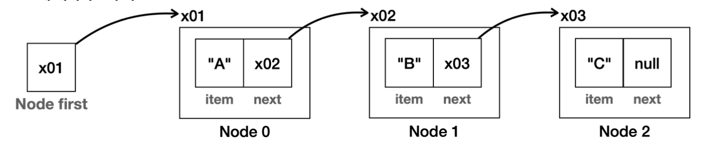
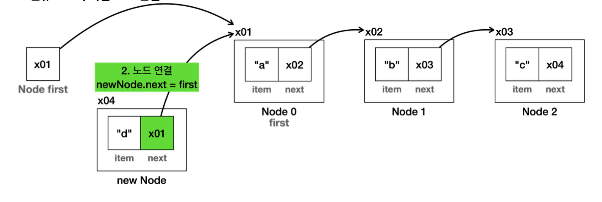
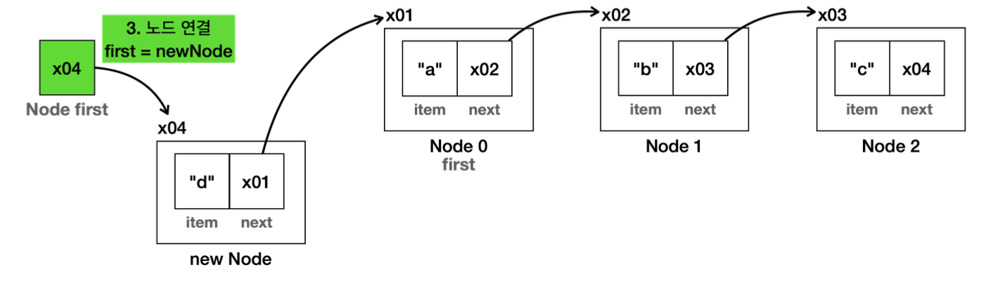
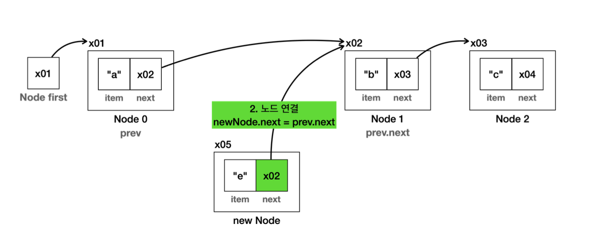
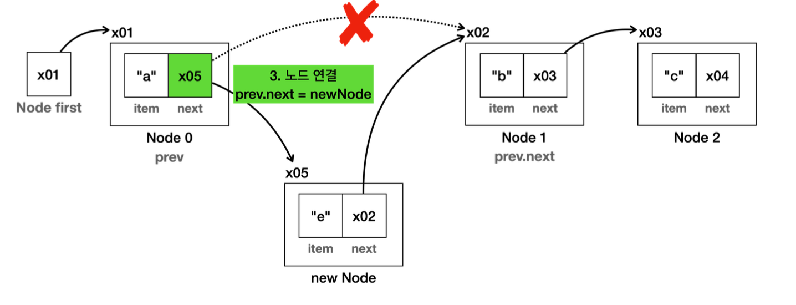
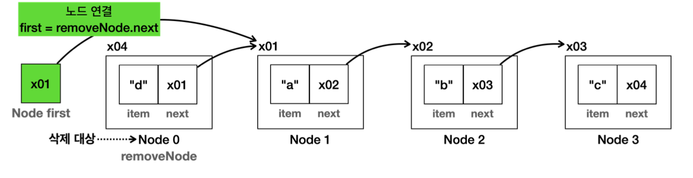
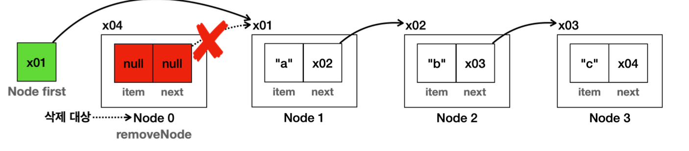
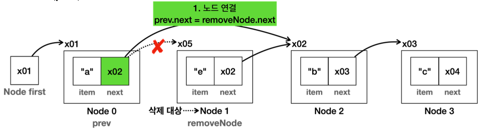
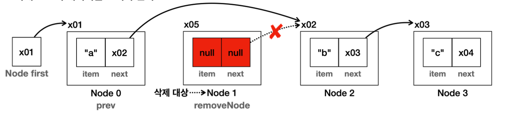

# ArrayList, LinkedList, List

> ArrayList, LinkedList, List 인터페이스

<!-- more -->

## List란?

동적으로 데이터를 추가할 수 있는 자료구조  
순서가 있고, 중복을 허용하는 자료구조

-   배열 : 순서가 있고 중복을 허용하지만 크기가 정적으로 고정된다.
-   리스트 : 순서가 있고 중복을 허용하지만 크기가 동적으로 변할 수 있다.

## 배열 리스트(ArrayList) 구현하기

-   리스트(List ) 자료구조를 사용 하는데, 내부의 데이터는 배열(Array)에 보관하는 것

> MyArrayListV1

        elementData = Arrays.copyOf(elementData, newCapacity);

## 배열 리스트에 제네릭 작용

```java
public class MyArrayListV3BadMain {

    public static void main(String[] args) {
        MyArrayListV3 numberList = new MyArrayListV3();
        // 숫자만 입력 하기를 기대
        numberList.add(1);
        numberList.add(2);
        numberList.add("문자3"); //문자를 입력
        System.out.println(numberList);  // [1, 2, 문자3] size=3, capacity=5


        //Object를 반환하므로 다운 캐스팅 필요
        Integer num1 = (Integer) numberList.get(0);
        Integer num2 = (Integer) numberList.get(1);

        // ClassCastException 발생, 문자를 Integer로 캐스팅
        //Integer num3 = (Integer) numberList.get(2);
    }
}
```

### 🍀 제네릭을 도입해보자!!!

```java
public class MyArrayListV4Main {
    public static void main(String[] args) {
        MyArrayListV4<String> stringlist = new MyArrayListV4<>();
        stringlist.add("a");
        stringlist.add("b");
        stringlist.add("c");
        // stringlist.add(1); // 숫자는 못들어가
        String string = stringlist.get(2);
        System.out.println("string = " + string);

        MyArrayListV4<Integer> intList = new MyArrayListV4<>();
        intList.add(1);
        intList.add(2);
        intList.add(3);
        Integer integer = intList.get(0);
        System.out.println("intList = " + integer);

    }
}

```

```java
 package collection.array;

import java.util.Arrays;

public class MyArrayListV4<E> {
    private static final int DEFAULT_CAPACITY = 5;

    private Object[] elementData;
    private int size = 0;

    public MyArrayListV4() {
        elementData = new Object[DEFAULT_CAPACITY];
    }

    public MyArrayListV4(int initialCapacity) {
        elementData = new Object[initialCapacity];
    }

    public void add(E e) {
        if (size == elementData.length) {
            grow();
        }
        elementData[size] = e;
        size++;
    }

    // 코드 추가
    public void add(int index, E e) {
        if (size == elementData.length) {
            grow();
        }
        shiftRightFrom(index);
        elementData[size] = e;
        size++;
    }

    @SuppressWarnings("unchecked")
    public E get(int index) {
        return (E) elementData[index];
    }

}

```

```bash
string = c
intList = 1
```

<br>

📌 위 예제에서 `Object[] elementData` 을 그대로 사용하는 이유?

-   제네릭은 런타임에 이레이저에 의해 타입 정보가 사라진다. 따라서 런타임에 타입 정보가 필요한 생성자에 사용할 수 없다.
-   `제네릭의 한계` : 제네릭을 기반으로 배열을 생성하는 다음 코드는 작동하지 않고, 컴파일 오류가 발생한다.
    -   `new E[DEFAULT_CAPACITY]`
-   대신에 다음과 같이 모든 데이터를 담을 수 있는 `Object` 를 그대로 사용해야 한다.
    -   `new Object[DEFAULT_CAPACITY]`

```java
private Object[] elementData;
    private int size = 0;

    public MyArrayListV4() {
        elementData = new Object[DEFAULT_CAPACITY];
    }
```

그렇다면 `Object[]` 을 생성해서 사용해도 해도 문제가 없을까?
어떤 타입으로 컴파일러가 변경해야 될지 모를것 같은데..!

📌 `new MyArrayListV4<String>` 을 사용한 경우 `E` 가 다음과 같이 처리된다.

> 제네릭 타입 인자 적용 전

-   `add(E e)` 메서드 : `E` 타입으로 데이터를 입력한다.
-   `get()` 메서드 : `E` 타입으로 데이터를 다운 캐스팅 해서 반환한다.
-   문제 없다.

```java
Object[] elementData;

void add(E e) {
    elementData[size] = e;
    ...
}

 dE get(int index) {
    return (E) elementData[index];
}
```

> 제네릭 타입 인자 적용 후

```java


Object[] elementData;

void add(String e) {
    elementData[size] = e;
}

String get(int index) {
    return (String) elementData[index];
}
```

<br>

📌 정리

-   생성자에서는 제네릭 타입 매개변수를 사용할 수 없다.
-   따라서 배열을 생성할 때 대안으로 Object 배열을 사용해야 한다.
-   제네릭이 리스트의 데이터를 입력 받고 반환하는 곳의 타입을 고정해준다.
    -   고정된 타입으로 Object 배열에 데이터를 보관하고, 또 데이터를 꺼낼 때도 같은 고정된 타입으로 안전하게 다운 캐 스팅 할 수 있다.

## 💡 ArrayList 단점

1. 정확한 크기를 미리 알지 못하면 메모리가 낭비된다.
    - 배열을 사용하므로 배열 뒷 부분에 사용되지 않고, 낭비되는 메모리가 있다.
2. 데이터를 중간에 추가하거나 삭제할 때 비효율적이다.
    - 데이터를 한 칸씩 밀어야 한다. O(n)으로 성능이 좋지 않다.

## 💡 ArrayList의 빅오 정리

1. 데이터 추가
    - 마지막에 추가: O(1)
    - 앞, 중간에 추가: O(n)
2. 데이터 삭제
    - 마지막에 삭제: O(1)
    - 앞, 중간에 삭제: O(n)
3. 인덱스 조회: O(1)
    - 데이터 검색: O(n)

<br>

## LinkedList

## 노드와 연결



```java
public class Node {
    Object item;
    Node next;

    public Node(Object item) {
         this.item = item;
    }
}
```

```java
public class NodeMain1 {

    public static void main(String[] args) {

        //노드 생성하고 연결하기: A -> B -> C
        Node first = new Node("A"); first.next = new Node("B"); first.next.next = new Node("C");

        System.out.println("모든 노트 탐색하기"); Node x = first;
        while (x != null) {
            System.out.println(x.item);
        x = x.next;
        }
    }
}
```

## LinkedList 구현

> void add(Object e)

-   마지막에 데이터를 추가한다. 새로운 노드를 만들고, 마지막 노드를 찾아서 새로운 노드를 마지막에 연결한다.
-   만약 노드가 하나도 없다면 새로운 노드를 만들고 `first` 에 연결한다.

> Object set(int index, Object element)

-   특정 위치에 있는 데이터를 찾아서 변경한다. 그리고 기존 값을 반환한다.
-   `getNode(index)` 를 통해 특정 위치에 있는 노드를 찾고, 단순히 그 노드에 있는 `item` 데이터를 변경한다.

> Object get(int index)

-   특정 위치에 있는 데이터를 반환한다.
-   `getNode(index)` 를 통해 특정 위치에 있는 노드를 찾고, 해당 노드에 있는 값을 반환한다.

> int indexOf(Object o)

-   데이터를 검색하고, 검색된 위치를 반환한다.
-   모든 노드를 순회하면서 `equals()` 를 사용해서 같은 데이터가 있는지 찾는다.

<br>

```java

public class MyLinkedListV1 {

    private Node first;
    private int size=0;

    // 리스트 맨 뒤에 추가하는 메서드
    public void add(Object e) {
        Node newNode = new Node(e);
        if(first == null){
            first = newNode;
        } else {
            Node lastNode = getLastNode();
            lastNode.next = newNode;
        }
        size++;
    }

    private Node getLastNode() {
        Node x = first;
        while(x.next != null) {
            x = x.next;
        }
        return x;
    }

    // 특정 인덱스에 있는 노드의 데이터(item) 값 반환
    public Object get(int index) {
        Node node = getNode(index);
        return node.item;
    }

    // 특정 인덱스에 있는 노드를 반환
    private Node getNode(int index) {
        Node x = first;
        for (int i = 0; i < index; i++) {
            x = x.next;
        }
        return x;
    }

    // 특정 인덱스에 있는 요소를 새 요소로 교체하고, 이전 요소를 반환
    public Object set(int index, Object element) {
        Node x = getNode(index);
        Object oldValue = x.item;
        x.item = element;
        return oldValue;
    }

    // 리스트에서 특정 요소의 인덱스를 찾기
    public int indexOf(Object o) {
        int index = 0;
        for (Node x = first; x != null; x = x.next) {
            if (o.equals(x.item))
                return index;
            index++;
        }
        return -1;
    }

    public int size() {
        return size;
    }
    @Override
    public String toString() {
        return "MyLinkedListV1{" +
                "first=" + first +
                ", size=" + size +
                '}';
    }
}

```

```java
public class MyLinkedListV1Main {
    public static void main(String[] args) {
        MyLinkedListV1 list = new MyLinkedListV1();
        System.out.println("==데이터 추가==");
        System.out.println(list);
        list.add("a");
        System.out.println(list);
        list.add("b");
        System.out.println(list);
        list.add("c");
        System.out.println(list);

        System.out.println("==기능 사용==");
        System.out.println("list.size(): " + list.size());
        System.out.println("list.get(1): " + list.get(1));
        System.out.println("list.indexOf('c'): " + list.indexOf("c"));
        System.out.println("list.set(2, 'z'), oldValue: " + list.set(2, "z"));
        System.out.println(list);

        System.out.println("==범위 초과==");
        list.add("d");
        System.out.println(list);
        list.add("e");
        System.out.println(list);
        list.add("f");
        System.out.println(list);
    }
}

```

```bash
==데이터 추가==
MyLinkedListV1{first=null, size=0}
MyLinkedListV1{first=[a], size=1}
MyLinkedListV1{first=[a->b], size=2}
MyLinkedListV1{first=[a->b->c], size=3}
==기능 사용==
list.size(): 3
list.get(1): b
list.indexOf('c'): 2
list.set(2, 'z'), oldValue: c
MyLinkedListV1{first=[a->b->z], size=3}
==범위 초과==
MyLinkedListV1{first=[a->b->z->d], size=4}
MyLinkedListV1{first=[a->b->z->d->e], size=5}
MyLinkedListV1{first=[a->b->z->d->e->f], size=6}
```

📌 `리스트의 단점인 메모리 낭비 해결` : 연결 리스트를 통해 데이터를 추가하는 방식은 꼭 필요한 메모리만 사용한다. 물론 연결을 유지하기 위한 추가 메모리가 사용되는 단점도 함께 존재한다.

📌 배열 리스트는 중간에 `데이터를 추가하거나 삭제`할 때 기존 데이터를 한 칸씩 이동해야 하는 문제가 있었다. 연결리스트는 새로 생성한 노드의 참조만 변경하면 된다.

<br>

## LinkedList 추가와 삭제

아래 두 가지 기능을 추가해야 한다.

1. `void add(int index, Object e)`  
   특정 위치에 데이터를 추가한다. 내부에서 노드도 함께 추가된다.

2. `Object remove(int index)`  
   특정 위치에 있는 데이터를 제거한다. 내부에서 노드도 함께 제거된다.

> MyLinkedListV2

### LinkedList 데이터 추가

> 첫 번째 위치에 데이터 추가

```java
// 첫 번째 위치에 데이터 추가 코드
    public void add(int index, Object e){
        Node newnode = new Node(e);
        if(index == 0) {
            newnode.next = first;
            first = newnode;
        }
    }
```

-   신규 노드와 다음 노드 연결



-   first에 신규 노드 연결



<br>

> 중간위치에 데이터 추가

```java
public void add(int index, Object e){
    Node newnode = new Node(e);
    if(index == 0) {
        newnode.next = first;
        first = newnode;
    } else {  // 첫번째가 아닌 중간위치에 데이터 추가 코드
        Node prevnode = getNode(index - 1);
        newnode.next = prevnode.next;
        prevnode.next = newnode;
    }
    size++;
}
```

-   신규 노드와 다음 노드를 연결한다. 직전 노드(prev)의 다음 노드를 연결
    

-   직전 노드(prev)에 신규 노드를 연결
    

### LinkedList 데이터 삭제

> 첫 번째 위치 데이터 삭제

```java
// 첫 번째 위치 데이터 삭제
public void remove(int index, Object element) {
    Node removeNode = getNode(index);
    Object removedItem = removeNode.item;  // 삭제할 아이템
    if(index == 0) {
        first = removeNode.next;
    }
    removeNode.item = null;
    removeNode.next = null;
    size--;
    return removedItem;
}
```

-   삭제 대상 선택
-   first에 삭제 대상의 다음 노드 연결



-   삭제 대상의 데이터 초기화
    -   더는 삭제 노드를 참조하는 곳이 없다. 이후 삭제 노드는 GC의 대상이 되어서 제거된다.
    -   노드를 삭제했으므로 오른쪽 노드의 index가 하나씩 당겨진다.
    -   O(1) : 연결 리스트의 첫 번째 항목에 값을 삭제하는 것은 매우 빠르다.



<br>

> 중간위치에 데이터 삭제

```java
public void remove(int index, Object element) {
    Node removeNode = getNode(index);
    Object removedItem = removeNode.item;  // 삭제할 아이템
    if(index == 0) {
        first = removeNode.next;
    } else {  // 중간위치에 데이터 삭제
        Node prevNode = getNode(index - 1);
        prevNode.next = removeNode.next;
    }
    removeNode.item = null;
    removeNode.next = null;
    size--;
    return removedItem;
}
```

-   삭제 대상을 찾는다. 그리고 삭제 대상의 직전 노드(prev)도 찾아둔다.

-   직전 노드(prev)의 다음 노드를 삭제 노드의 다음 노드와 연결한다.
    

-   삭제 노드의 데이터를 초기화 한다.
    -   더는 삭제 노드를 참조하는 곳이 없다. 삭제 노드는 이후 GC의 대상이 되어서 제거된다.



📌 중간에 있는 항목을 추가하거나 삭제하는 경우

-   연결 리스트는 인덱스를 사용해서 노드를 추가할 위치를 찾는데 O(n)
-   위치를 찾고 노드를 추가하는데 O(1)
-   따라서 O(n)이 걸린다.
-   엥 배열리스트랑 성능이 별 다를게 없는데...?

### 배열 리스트와 연결 리스트의 성능 비교

|      기능      | ArrayList (배열 리스트) |               LinkedList (연결 리스트)                |
| :------------: | :---------------------: | :---------------------------------------------------: |
|  인덱스 조회   |          O(1)           |                         O(n)                          |
|      검색      |          O(n)           |                         O(n)                          |
| 앞에 추가/삭제 |          O(n)           |                         O(1)                          |
| 뒤에 추가/삭제 |          O(1)           | O(n), O(1) <- 자바가 제공하는 이중 연결 리스트인 경우 |
| 평균 추가/삭제 |          O(n)           |                         O(n)                          |

## 연결리스트에 제네릭 도입

<details>
<summary>연결리스트에 제네릭 도입 코드 (MyLinkedListV3)</summary>

```java
package collection.link;

// 제네릭 적용
public class MyLinkedListV3<E> {

    private Node<E> first;
    private int size = 0;

    public void add(E e) {
        Node<E> newNode = new Node<>(e);
        if(first == null){
            first = newNode;
        } else {
            Node<E> lastNode = getLastNode();
            lastNode.next = newNode;
        }
        size++;
    }

    // 첫 번째 위치에 데이터 추가 코드
    public void add(int index, E e){
        Node<E> newnode = new Node<>(e);
        if(index == 0) {
            newnode.next = first;
            first = newnode;
        } else {  // 첫번째가 아닌 중간위치에 데이터 추가 코드
            Node<E> prevnode = getNode(index - 1);
            newnode.next = prevnode.next;
            prevnode.next = newnode;
        }
        size++;
    }

    // 첫 번째 위치 데이터 삭제
    public E remove(int index) {
        Node<E> removeNode = getNode(index);
        E removedItem = removeNode.item;  // 삭제할 아이템
        if(index == 0) {
            first = removeNode.next;
        } else {
            Node<E> prevNode = getNode(index - 1);
            prevNode.next = removeNode.next;
        }
        removeNode.item = null;
        removeNode.next = null;
        size--;
        return removedItem;
    }

    private Node<E> getLastNode() {
        Node<E> x = first;
        while(x.next != null) {
            x = x.next;
        }
        return x;
    }

    // 특정 인덱스에 있는 노드의 데이터(item) 값 반환
    public E get(int index) {
        Node<E> node = getNode(index);
        return node.item;
    }

    // 특정 인덱스에 있는 노드를 반환
    private Node<E> getNode(int index) {
        Node<E> x = first;
        for (int i = 0; i < index; i++) {
            x = x.next;
        }
        return x;
    }

    // 특정 인덱스에 있는 요소를 새 요소로 교체하고, 이전 요소를 반환
    public E set(int index, E element) {
        Node<E> x = getNode(index);
        E oldValue = x.item;
        x.item = element;
        return oldValue;
    }

    // 리스트에서 특정 요소의 인덱스를 찾기
    public int indexOf(E o) {
        int index = 0;
        for (Node<E> x = first; x != null; x = x.next) {
            if (o.equals(x.item))
                return index;
            index++;
        }
        return -1;
    }

    public int size() {
        return size;
    }
    @Override
    public String toString() {
        return "MyLinkedListV1{" +
                "first=" + first +
                ", size=" + size +
                '}';
    }
    // 코드 추가, 중첩클래스
    public static class Node<E> {

        E item;
        Node<E> next;

        public Node(E item) {
            this.item = item;
        }

        @Override
        public String toString() {
            // 가변인 stringBuilder 사용
            StringBuilder sb = new StringBuilder();
            Node<E> x = this;
            sb.append("[");
            while (x !=null) {
                sb.append(x.item);
                if(x.next != null) {
                    sb.append("->");
                }
                x = x.next;
            }
            sb.append("]");

            return sb.toString();
        }

    }
}

```

</details>

<details>
<summary>연결리스트에 제네릭 도입 코드 (MyLinkedListV3Main)</summary>

```java
public class MyLinkedListV3Main {
    public static void main(String[] args) {

        MyLinkedListV3<String> stringList = new MyLinkedListV3<>();
        stringList.add("a");
        stringList.add("b");
        stringList.add("c");
        String string = stringList.get(0);
        System.out.println("string = " + string);  // string = a

        MyLinkedListV3<Integer> intList = new MyLinkedListV3<>();
        intList.add(1);
        intList.add(2);
        intList.add(3);
        Integer integer = intList.get(0);
        System.out.println("integer = " + integer);  // integer = 1
    }
}
```

</details>
