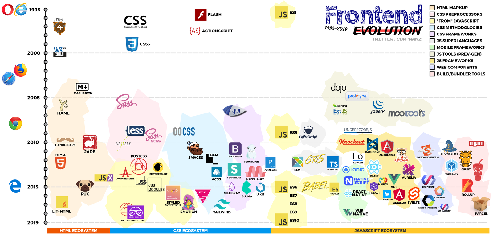

# React

> React Router

<!-- more -->



## React란

1.  현대 프레임워크 핵심요소

    1. 화면과 데이터의 분리 그리고 렌더링
        - 데이터의 변경사항을 감지하여 자동으로 화면으로 그려주기 위한 독자적인 방법들 고안해냄
    2. React의 1)에 대한 기법들
        - JSX
            - JavaScript에 HTML을 결합한 템플릿
        - Virtual DOM
            - JSX를 통해 실제 DOM이 아닌 가상 DOM 데이터 구조를 만들어냄
        - JSX와 Virtual DOM 그리고 re-rendering
            - 데이터의 변경을 감지하고, JSX로 새로운 가상 DOM을 생성하여
              기존의 가상 DOM과 비교함.
            - 변경된 부분만 실제 DOM에 반영함으로써,
              불필요한 DOM 조작을 줄여 성능을 최적화하는 방식
        - 컴포넌트 기반 아키텍쳐
            - React는 화면과 데이터의 분리라는 개념을 공유하면서도,
              데이터 관리와 UI 업데이트를 합친 컴포넌트 중심 접근 방식 제시함

2.  리액트 컴포넌트 (React Component)

    1. html에서 화면을 구성하는 요소로도 볼수 있음 (버튼, 링크, 이미지 등)
    2. 이미 작성한 컴포넌트를 재사용 => 개발 속도 빠라짐, 유지보수 유리함
    3. 컴포넌트는 JavaScript 파일내의 하나의 함수로 작성하거나 JavaScript 파일 자체로도 작성할 수 있음.

    4. 컴포넌트 활용하기

        - App.jsx에 작성된 내용도 하나의 컴포넌트임

            - return() 내에 출력할 내용을 작성
                - 하나의 태그로 감싸야 함
                - <div></div> 태그도 사용 가능
                - <> </> 태그를 주로 사용함
                    - Fragment라고 함
                    - HTML 트리 구조에서 흔적을 남기지 않고 그룹화 해줌

        - 컴포넌트 작성 (JSX 파일)

            - JSX는 리액트에서 사용하는 파일
                - JavaScript 코드 안에 HTML과 유사한 코드를 작성할 수 있게 해줌
                - 리액트 컴포넌트를 정의하고 UI를 구성하는데 매우 유용함
                - 브라우저에서 직접 실행되지 않으며, Babel이나 Vite와 같은 변환기를 통해
                  JavaScript로 변환 후 실행됨
                - 리액트 자체 빌드도구 덕분에 _.js, _.jsx로 작성해도 아무 문제 없이 실행됨
                - JSX 문법
                    - { JS표현식 }
                    - 중괄호 {}를 사용하여 JavaScript 표현식을 JSX안에 포함할 수 있음.

        - 컴포넌트 생성

            - src 폴더 내에 Component1.jsx 파일 생성

        - 컴포넌트 적용

            - App.jsx에서 Component1.jsx import

        - 컴포넌트에 함수가 2개 이상인 경우
            - 하나의 함수에 default 적용하는 경우
                - default를 작성한 함수는 { }로 import를 하지 않음

    5. JSX 파일 내에서 JavaScript 변수 사용
        - Component3.jsx에 함수 내에 변수 선언하기

<br>

### 🍏 Props

-   Properties (특성) 약자
-   부모 컴포넌트에서 자식 컴포넌트로 전달되는 데이터(객체,배열)나 함수
-   컴포넌트 간의 데이터를 전달하기 위해 사용되는 리액트 객체
-   props 전달

    -   Child.jsx에서 props를 받기 위해 함수 수정
        -   부모로부터 전달받은 props를 직접 받으려면 {} 안에 속성 이름 작성함
        -   props를 전달받는 경우
            -   props.속성이름 행태로 값 사용함
    -   App.jsx에서 보내는 문법
        -   import 한 컴포넌트 태그 내에 속성이름=값 형태로 작성하여 전달

-   여러 개의 값 전달

    -   Child2.jsx
        -   중괄호 안에 전달받는 속성 이름을 콤마(,)로 구분하여 나열
        -   props를 전달받는 경우
    -   App.jsx에서 보내는 문법
        -   숫자를 보내는 경우 {} 안에 작성

-   JavaScript Object를 포함하여 여러 개 값 전달
-   Child3.jsx
    -   중괄호 안에 전달받는 속성 이름을 콤마(,)로 구분하여 나열
    -   props를 전달받는 경우

<br>

### 🍏 State

1.  Props는 리액트 컴포넌트의 특성을 나타냄

    -   부모 컴포넌트에가 자식 컴포넌트에 데이터를 전달할 수 있음.
    -   자식 컴포넌트에서는 변경이 불가능함

2.  State

    -   '상태'
    -   리액트 컴포넌트의 현재 상태를 의미함
    -   이 컴포넌트 상태는 변경이 가능
        -   사용자 입력 등에 따라 변경 될 수 있음
    -   한 컴포넌트 안에서 유동적인 데이터를 다룰때에 사용됨
    -   컴포넌트 안에서 데이터가 변경되고 그 내용이 화면에 반영되어야 할 때에 사용함
        -   state 변경되면 리액트는 자동으로 해당 컴포넌트와 자식 컴포넌트를 다시 렌더링 함
    -   State를 가지는 컴포넌트를 생성하기 위해서는 리엑트가 제공하는 useState()를 사용해야 함

<br>

### 🍏 리액트 훅(Hooks)

-   함수형 컴포넌트에서 상태와 생명주기 기능을 사용할 수 있도록 해주는 기능
-   클래스 인스턴스를 생성하지 않으므로 빠름
-   다양한 종류의 훅이 있으며, 대표적으로 useState, useEffect, useCallback 등이 있음

1.  Hooks 사용

    -   버튼 작성

    ```react
        function App() {
        const [count, setCount] = useState(0)

              return (
                  <>
                      ....
                  </>
              )

        }
    ```

    -   const 배열 = useState(데이터 초깃값)

        -   배열[0] : 데이터 초깃값이 들어간 변수
        -   배열[1] : 데이터를 수정할 수 있는 set 함수

    -   const [State 변수명, set함수명] = useState(데이터 초깃값)

    -   리액트의 useState 훅은 함수로, 생성할 State 변수의 초기값을 매개변수로 전달하여 호출함

        -   결과값으로는 배열을 반환함
        -   반환된 배열에는 useState 함수를 호출할 때에 설정한 초기값이 할당된 변수,
            해당 변수를 수정하기 위한 set함수가 포함됨 (구조 분해 할당, Destructuring assignment)

    -   ex) 버튼을 클릭했을 때 up()함수를 호출함

    -   폼 작성1

        -   input 태그 작성
        -   입력값을 state에 담기
            -   input에 값을 입력하면 inputName()함수에서 입력값을 콘솔에 출력하기
            -   name이라는 state를 정의하여 입력값을 담기

    -   폼 작성2

        -   회원 정보를 입력 받는 폼 정의
        -   입력 정보를 profile이라는 하나의 object로 state 지정
        -   inputUpdate()
            -   입력한 값 name, value를 콘솔에 출력함
        -   객체 비구조 할당 (Object Destructuring assignment)
            -   const {name, value} = e.target
        -   state에 값 담기

            -   전개 연산자 (spread operator)

                -   배열이나 객체의 요소를 개별 요소로 분리할 때 사용하는 연산자
                -   객체 값을 복사할 때 활용함

                -   예) setProfile({...profile, [name:]: value, })
                    -   ...profile : 기존 profile에 담긴값을 그대로 가져옴
                    -   [name:]: value, : 새롭게 추가된 값은 바꿔줌

### 🍏 조건부 랜더링

1. state 값에 따라 화면에 보여줄 요소를 다르게 하는 것
2. 삼항 연산자 활용함

    - 조건에 따라 실행할 내용을 구분할 수 있도록 하는 연산자
    - 문법

    ```bash
    [조건] ? 실행블록1((참인경우) ) : 실행블록2((거짓인경우))
    ```

3. 적용하기
    - 조건에 대한 변수(isLogin)를 state로 지정하기 => 값이 바뀜에 따라 화면에 보여지는 내용을 바꿈
    - 버튼을 클릭할 때마다 isLogin의 반대 값을 isLogin 값으로 저장
        - 로그인상태(Logout), 로그아웃상태(Login) 출력

## 📌 React Router

### 라우팅

1. URL

    - 'L'은 위치 제공자 (location)
    - 원하는 자원을 얻으려면 자원이 있는 경로와 쿼리 매개변수 등을 조합하여 웹 서버로 요청
    - 웹 서버에서 URL에 명시된 자원을 찾는 과정을 라우팅(routing)이라고 함

2. 보통 웹에서 라우팅은 항상 서버에서 일어남
    - server-side routing
3. 웹브라우저에서 발생하는 라우팅
    - client-side routing
    - location, history 객체 기능으로 일어남

### 🍏 SPA 방식 특징

1. 다중 페이지 앱 (MPA, multi page application)
    - 웹서버와 웹브라우가 여러 HTML 파일 주고 받는 방식
2. 단일 페이지 앱 (SPA, single page application)
    - 라우팅이 웹 브라우저에서만 일어나는 웹 방식
3. SPA 방식 웹 앱
    - 클라이언트 측 라우팅은 수많은 컴포넌트 중 특징 컴포넌트를 찾아 화면에 보여줌
    - CSR은 프로그래밍은 URL을 입력하지만 서버에 전송하는 url이 아니므로 사용자가 보고있는 컴포넌트가 바뀌어도 화면 새로 고침(refresh)가 발생하지 않음

### 🍏 React Router(패키지)

1. CSR 패키지
2. 리액트 훅 기술에 기반을 둠
3. BrowserRouter -- 최상위 컴포넌트

### 하위 컴포넌트 생성 방법

1. /주소요청에 Home, /info 주소요청에 Info컴포넌트를 화면에 랜더링
2. function 함수이름 () {}
3. const 함수이름 = () => {}
