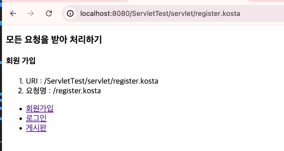
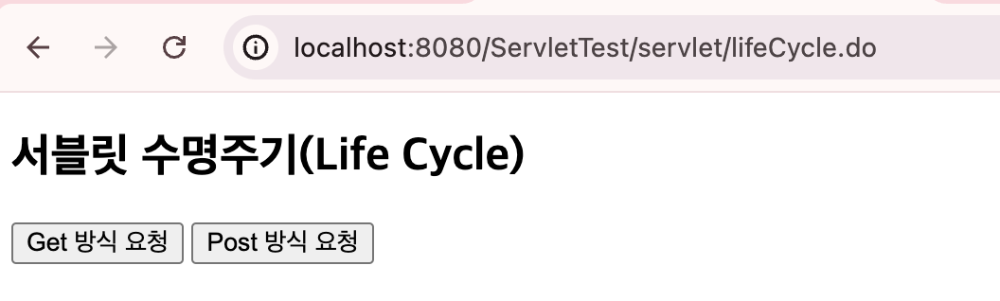

# servlet

<!-- more -->

## 🍏 웹 페이지(정적 & 동적)

1. static Web Page
    - 저장되어 있는 파일 그대로 웹 브라우저에 전송해 출력하는 웹 페이지 (서버가 갖고있음)
    - 항상 동일한 모습(정적)
2. dynamic Web Page
    - 서버가 클라이언트의 요청을 해석하여 가장 적절한 웹 페이지를 동적으로 데이터를 보여준다.

## 서블릿 (servlet + let)

1. 서버 측에서 실행되는 자바 프로그램
2. 클라이언트의 요청을 받으면 서버에서 처리 한 후, 결과를 응답으로 결과값을 보내주는 구조
   

3. 구조

    - 웹 브라우저(클라이언트)
    - WAS(Seb Server, Servlet Container + JSP 엔진 (Tomcat))

## 🍏 JSP

1. 서블리릿의 단점을 보완해서 나옴
2. 서블릿은 기본적으로 자바 코드이다. - 결과로 보여줄 HTML 코드를 만드는데 너무 많으 코드가 필요하다.
3. 구조
   

## 🍏 Servlet 의미

1.  Servlet은 JSP가 나오기 전, 자바로 웹 애플리케이션으 개발할 수 있는 기술
2.  서버 단에서 클라이언트 요청을 받아 처리한 후 응답하는 역할함
    -   동적으로 작동하는 웹 애플리케이션 컴포넌트
3.  MVC 모델에서 컨트롤러(Controller) 역할을 함
4.  모든 메서드는 스레드로 동작함
5.  HttpServlet 클래스를 상속받음
    -   jakarta.servlet.http.HttpServlet

## 🍏 서블릿 컨테이너

1. 서블릿을 관리하는 컨테이너 (수명주기 관리)
    - (HTTP)요청
    - 요청 전달
    - 서블릿 로드
    - 초기화
    - 요청 처리
    - (HTTP) 응답
2. 네트워크 지원
3. 멀티스레딩 관리
4. JSP 지원

## 🍏 서블릿 동작 방식

1. Controller 역할을 함 (MVC 패턴)
    - 요청 받아서 해당 요청 처리할 서블릿 찾음
    - 서비스 조직 호출
    - 모델(Model)로부터 그 결과값을 받아서 결과값을 출력할 뷰(View)를 선택함

## 🍏 서블릿 작성

### 1️⃣ web.xml에 기술

-   http://localhost:8080/HelloServlet/Servlet/helloServlet.do
-   호스트명 / 컨텍스트루트명 / 요청명

     <details>
     <summary>  web.xml 예제 </summary>

    ```java
    package kr.co.kosta.servlet;

    import jakarta.servlet.ServletException;
    import jakarta.servlet.annotation.WebServlet;
    import jakarta.servlet.http.HttpServlet;
    import jakarta.servlet.http.HttpServletRequest;
    import jakarta.servlet.http.HttpServletResponse;
    import java.io.IOException;


    public class HelloServlet extends HttpServlet {
        private static final long serialVersionUID = 1L;


        public HelloServlet() {

        }


        protected void doGet(HttpServletRequest request, HttpServletResponse response) throws ServletException, IOException {
        request.setAttribute("message", "Hello Servlet");
        request.getRequestDispatcher("/servlet/helloServlet.jsp").forward(request, response);
        }


        protected void doPost(HttpServletRequest request, HttpServletResponse response) throws ServletException, IOException {

        }

    }

    ```

    ```jsp
    <%@ page language="java" contentType="text/html; charset=UTF-8"
        pageEncoding="UTF-8"%>
    <!DOCTYPE html>
    <html>
    <head>
    <meta charset="UTF-8">
    <title>Insert title here</title>
    </head>
    <body>
        <h2>web.xml에서 매핑 후 JSP에서 출력하기</h2>
        <p>
            <%= request.getAttribute("message") %>
            <br/>
            <a href ="./helloServlet.do">바로가기</a>
        </p>
    </body>
    </html>
    ```

    </details>

### 2️⃣ @WebsServlet으로 매핑


<details>
<summary>  @WebsServlet 예제 </summary>

    ```java
    package kr.co.kosta.servlet;

    import java.io.IOException;

    import jakarta.servlet.ServletException;
    import jakarta.servlet.annotation.WebServlet;
    import jakarta.servlet.http.HttpServlet;
    import jakarta.servlet.http.HttpServletRequest;
    import jakarta.servlet.http.HttpServletResponse;

    @WebServlet("/Servlet/annoMappingServlet.do")
    public class AnnoMappingServlet extends HttpServlet {

        @Override
        protected void doGet(HttpServletRequest req, HttpServletResponse resp) throws ServletException, IOException {

            req.setAttribute("message2", "@WebServlet으로 매핑");
            req.getRequestDispatcher("/servlet/annoMapping.jsp").forward(req, resp);

        }
    }
    ```

    ```jsp
    <%@ page language="java" contentType="text/html; charset=UTF-8"
        pageEncoding="UTF-8"%>
    <!DOCTYPE html>
    <html>
    <head>
    <meta charset="UTF-8">
    <title>Insert title here</title>
    </head>
    <body>
    <h2>애너테이션으로 매핑하기</h2>
        <p>
            <%= request.getAttribute("message2") %>
            <br/>
        </p>

    </body>
    </html>
    ```

</details>

### 3️⃣ 프론트 컨트롤러 작성

<details>
<summary> 프론트 컨트롤러 예제</summary>

```java
package kr.co.kosta.servlet;

import java.io.IOException;

import jakarta.servlet.ServletException;
import jakarta.servlet.annotation.WebServlet;
import jakarta.servlet.http.HttpServlet;
import jakarta.servlet.http.HttpServletRequest;
import jakarta.servlet.http.HttpServletResponse;

// _.kosta로 끝나는 모든 요청을 FrontController 서블릿이 처리
@WebServlet("_.kosta")
public class FrontController extends HttpServlet {
@Override
protected void doGet(HttpServletRequest request, HttpServletResponse response)
throws ServletException, IOException {
String uri = request.getRequestURI();
// 마지막으로 나타나는 슬래시 /의 인덱스 반환
// /servlet/ -> 8
int lastSlash = uri.lastIndexOf("/");
// lastSlash 위치부터 문자열의 끝까지를 반환
String commandStr = uri.substring(lastSlash); // "/register.kosta"
if(commandStr.equals("/register.kosta"))
registFunc(request);
else if(commandStr.equals("/login.kosta"))
loginFunc(request);
else if(commandStr.equals("/board.kosta"))
boardFunc(request);
request.setAttribute("uri", uri);
request.setAttribute("commandStr", commandStr);
request.getRequestDispatcher("/servlet/frontController.jsp").forward(request, response);
}
private void boardFunc(HttpServletRequest request) {
request.setAttribute("resultValue", "<h4>게시판</h4>");
}

    public void loginFunc(HttpServletRequest request) {
    	request.setAttribute("resultValue", "<h4>로그인</h4>");
    }

    public void registFunc(HttpServletRequest request) {
    	request.setAttribute("resultValue", "<h4>회원 가입</h4>");
    }

}

```

```jsp
<%@ page language="java" contentType="text/html; charset=UTF-8"
    pageEncoding="UTF-8"%>
<!DOCTYPE html>
<html>
<head>
<meta charset="UTF-8">
<title>Insert title here</title>
</head>
<body>
	<h3>모든 요청을 받아 처리하기</h3>
	${resultValue }
	<ol>
		<li>URI : ${uri }</li>
		<li>요청명 : ${commandStr }</li>
	</ol>
	<ul>
		<li><a href="../servlet/register.kosta">회원가입</a></li>
		<li><a href="../servlet/login.kosta">로그인</a></li>
		<li><a href="../servlet/board.kosta">게시판</a></li>
	</ul>
</body>
</html>

```

</details>

> 결과 화면

`http://localhost:8080/ServletTest/servlet/register.kosta`


`http://localhost:8080/ServletTest/servlet/login.kosta`

`http://localhost:8080/ServletTest/servlet/board.kosta`

## 🍏 서블릿의 생명주기(lifecycle) 메서드

1. 클라이언트의 요청이 들어오면 먼저 서블릿 객체를 생성하고, 서블릿을 초기화하고, 요청을 처리함
2. 서버를 종료할 때 서블릿 객체 소멸시킴
3. 서블릿의 수명주기 관리는 서블릿 컨테이너가 담당함
    - 서블릿 객체 생성 => @PostConstruct (전처리) => init()
      service()
      doGet(), doPost()
      destroy() => @PreDestroy (후처리)서블릿의 생명주기(lifecycle) 메서드

### 🍑 서블릿 lifecycle 예제

> url : `http://localhost:8080/ServletTest/servlet/lifeCycle.do`



<details>
<summary>서블릿의 생명주기(lifecycle) 예제 코드 </summary>

```java
package kr.co.kosta.servlet;

import java.io.IOException;

import jakarta.annotation.PostConstruct;
import jakarta.annotation.PreDestroy;
import jakarta.security.auth.message.callback.PrivateKeyCallback.Request;
import jakarta.servlet.ServletException;
import jakarta.servlet.annotation.WebServlet;
import jakarta.servlet.http.HttpServlet;
import jakarta.servlet.http.HttpServletRequest;
import jakarta.servlet.http.HttpServletResponse;

@WebServlet("/servlet/lifeCycle.do")
public class LifeCycle extends HttpServlet {

	@PostConstruct
	public void myPostConstruct() {
		System.out.println("@PostConstruct (전처리) 호출");
	}

	@Override
	public void init() throws ServletException {
		System.out.println("init() 호출");
	}

//	@Override
//	protected void service(HttpServletRequest request, HttpServletResponse response)
//			throws ServletException, IOException {
//		System.out.println("service() 호출");
//		request.getRequestDispatcher("/servlet/lifeCycle.jsp").forward(request, response);
//	}

	@Override
	protected void doGet(HttpServletRequest request, HttpServletResponse response)
			throws ServletException, IOException {
		System.out.println("doGet() 호출");
		request.getRequestDispatcher("/servlet/lifeCycle.jsp").forward(request, response);
	}

	@Override
	protected void doPost(HttpServletRequest request, HttpServletResponse response)
			throws ServletException, IOException {
		System.out.println("doPost() 호출");
		request.getRequestDispatcher("/servlet/lifeCycle.jsp").forward(request, response);
	}

	@Override
	public void destroy() {
		System.out.println("destory() 호출");
	}

	@PreDestroy
	public void myPreDestroy() {
		System.out.println("@PreDestroy (후처리) 호출");
	}
}

```

```jsp
<%@ page language="java" contentType="text/html; charset=UTF-8"
    pageEncoding="UTF-8"%>
<!DOCTYPE html>
<html>
<head>
<meta charset="UTF-8">
<title>Insert title here</title>
</head>
<body>
	<script	type="text/javascript">
		function requestAction(frm, met) {
			if (met == 1)
				frm.method = 'get'
			else
				frm.method = 'post'
			frm.submit()
		}
	</script>

	<h2>서블릿 수명주기(Life Cycle)</h2>
	<form action="./lifeCycle.do">
		<input type="button" value="Get 방식 요청" onclick="requestAction(this.form, 1)" />
		<input type="button" value="Post 방식 요청" onclick="requestAction(this.form, 2)" />
	</form>
</body>
</html>
```

</details>
