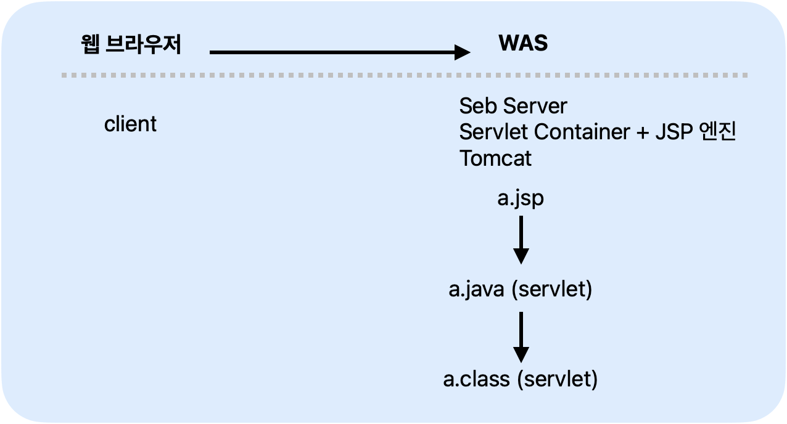
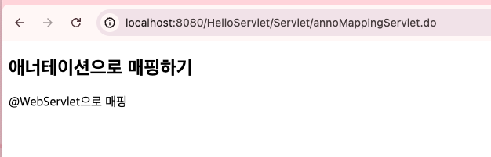

# servlet

<!-- more -->

## 웹 페이지(정적 & 동적)

1. static Web Page
    - 저장되어 있는 파일 그대로 웹 브라우저에 전송해 출력하는 웹 페이지 (서버가 갖고있음)
    - 항상 동일한 모습(정적)
2. dynamic Web Page
    - 서버가 클라이언트의 요청을 해석하여 가장 적절한 웹 페이지를 동적으로 데이터를 보여준다.

## 서블릿 (servlet + let)

1. 서버 측에서 실행되는 자바 프로그램
2. 클라이언트의 요청을 받으면 서버에서 처리 한 후, 결과를 응답으로 결과값을 보내주는 구조
   

3. 구조

    - 웹 브라우저(클라이언트)
    - WAS(Seb Server, Servlet Container + JSP 엔진 (Tomcat))

## JSP

1. 서블리스이 단점을 보완해서 나옴
2. 서블릿은 기본적으로 자바 코드이다. - 결과로 보여줄 HTML 코드를 만드는데 너무 많으 코드가 필요하다. -
   

## Servlet 의미

1. Servlet은

## 서블릿 컨테이너

1. 서블릿을 관리하는 컨테이너 (수명주기 관리)
    - (HTTP)요청
    - 요청 전달
    - 서블릿 로드
    - 초기화
    - 요청 처리
    - (HTTP) 응답
2. 네트워크 지원
3. 멀티스레딩 관리
4. JSP 지원

## 서블릿 동작 방식

## 서블릿 작성

### web.xml

-   http://localhost:8080/HelloServlet/Servlet/helloServlet.do
-   호스트명 / 컨텍스트루트명 / 요청명

     <details>
     <summary>  web.xml 예제 </summary>

    ```java
    package kr.co.kosta.servlet;

    import jakarta.servlet.ServletException;
    import jakarta.servlet.annotation.WebServlet;
    import jakarta.servlet.http.HttpServlet;
    import jakarta.servlet.http.HttpServletRequest;
    import jakarta.servlet.http.HttpServletResponse;
    import java.io.IOException;


    public class HelloServlet extends HttpServlet {
        private static final long serialVersionUID = 1L;


        public HelloServlet() {

        }


        protected void doGet(HttpServletRequest request, HttpServletResponse response) throws ServletException, IOException {
        request.setAttribute("message", "Hello Servlet");
        request.getRequestDispatcher("/servlet/helloServlet.jsp").forward(request, response);
        }


        protected void doPost(HttpServletRequest request, HttpServletResponse response) throws ServletException, IOException {

        }

    }

    ```

    ```jsp
    <%@ page language="java" contentType="text/html; charset=UTF-8"
        pageEncoding="UTF-8"%>
    <!DOCTYPE html>
    <html>
    <head>
    <meta charset="UTF-8">
    <title>Insert title here</title>
    </head>
    <body>
        <h2>web.xml에서 매핑 후 JSP에서 출력하기</h2>
        <p>
            <%= request.getAttribute("message") %>
            <br/>
            <a href ="./helloServlet.do">바로가기</a>
        </p>
    </body>
    </html>
    ```

    </details>

### @WebsServlet



<details>
<summary>  @WebsServlet 예제 </summary>

    ```java
    package kr.co.kosta.servlet;

    import java.io.IOException;

    import jakarta.servlet.ServletException;
    import jakarta.servlet.annotation.WebServlet;
    import jakarta.servlet.http.HttpServlet;
    import jakarta.servlet.http.HttpServletRequest;
    import jakarta.servlet.http.HttpServletResponse;

    @WebServlet("/Servlet/annoMappingServlet.do")
    public class AnnoMappingServlet extends HttpServlet {

        @Override
        protected void doGet(HttpServletRequest req, HttpServletResponse resp) throws ServletException, IOException {

            req.setAttribute("message2", "@WebServlet으로 매핑");
            req.getRequestDispatcher("/servlet/annoMapping.jsp").forward(req, resp);

        }
    }
    ```

    ```jsp
    <%@ page language="java" contentType="text/html; charset=UTF-8"
        pageEncoding="UTF-8"%>
    <!DOCTYPE html>
    <html>
    <head>
    <meta charset="UTF-8">
    <title>Insert title here</title>
    </head>
    <body>
    <h2>애너테이션으로 매핑하기</h2>
        <p>
            <%= request.getAttribute("message2") %>
            <br/>
        </p>

    </body>
    </html>
    ```

</details>
