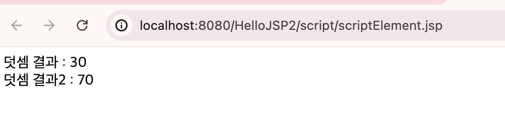

# JSP

<!-- more -->

## 지시어 (Directive)

1. page 지시어
    - import 속성
    - errorPage 속성 : 에러 페이지 지정
    - IsErrorPage 속성 : 에러 페이지 (true 값 설정)
2. include 지시어
    - 여러 페이지에서 반복되어 사용하는 내용을 삽입해야 하는 경우 사용
    - <% include file = "포함할 파일의 경로" %>

## 스크립트 요소 (Directive)

1. 서블릿 (자바코드)로 변환됨

    - \_jspService() 메서드가 생성됨

2. 선언부

    - 멤버변수, 메서드 선언
      -\_jspService() 메서드 "외부"에 선언됨
    - 형식
        - <%! 메소드 선언 %>

3. 스크립트릿 (scriptlet)

    - 자바 코드를 작성하는 영역
    - 서블릿 변환시 \_jspService()메서드 "내부"에 기술됨
    - 형식
        - <% %>

4. 표현식(expression)

    - 웹 브라우저 화면에 출력할 때 사용
    - 형식
        - <%= 자바 표현식%>

<details>
<summary>jsp 스크립트 사용 예제</summary>

```jsp
<%@ page language="java" contentType="text/html; charset=UTF-8"
	pageEncoding="UTF-8"%>
<%!public int add(int num1, int num2) {
		return num1 + num2;
	}%>
<!DOCTYPE html>
<html>
<head>
<meta charset="UTF-8">
<title>Insert title here</title>
</head>
<body>
<% // 스크립트 자바 코드
int result = add(10,20);
%>

덧셈 결과 : <%= result %> <br />
덧셈 결과2 : <%= add(30,40) %>

</body>
</html>
```

</details>


