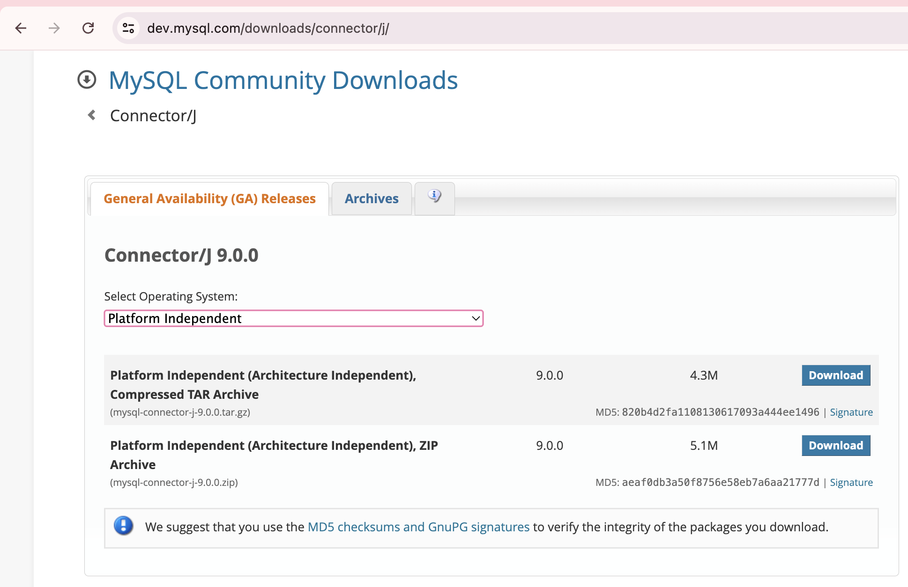
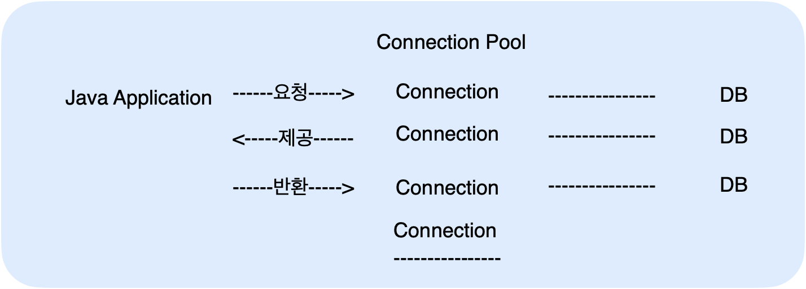
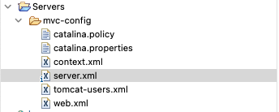

# JDBC

JDBC 연결하는 3가지 방법

1. 기본 생성자
2. 외부 매개변수를 통한 생성자 오버로딩
3. ServletContext를 사용한 생성자 오버로딩 ⭐️

JDNI를 이용한 데이터베이스 Connection Pool 관리

-   context.xml, server.xml 설정

<!-- more -->

## 📌 JDBC 연결

-   https://dev.mysql.com/downloads/connector/j/
-   platform Independent 선택
-   zip으로 된 jar 파일 다운!
    -   
-   압축 풀어서 이클립스 lib 폴더 아래에 넣어주기

### 🍀 JDBC 연결 3가지 방법

1. 기본 생성자
    - 클래스 내부에 하드코딩된 DB 연결 정보를 사용하여 데이터베이스에 연결
2. 생성자 오버로딩1
    - 생성자를 통해 외부에서 매개변수로 전달된 DB 연결 정보를 사용하여 데이터베이스에 연결
3. 생성자 오버로딩
    - ServletContext를 통한 설정 값 사용 : `ServletContext`에서 초기화 매개변수를 가져와서 데이터베이스에 연결합니다. 이는 설정을 web.xml에 두고, 코드에서 이를 읽어오는 방식
    - 설정정보를 코드와 분리하여 유지보수와 관리가 용이함

<details>
<summary>JDBC 연결 3가지 코드 예제</summary>

```java
package kr.co.kosta.jdbc;

import java.sql.Connection;
import java.sql.DriverManager;
import java.sql.PreparedStatement;
import java.sql.ResultSet;
import java.sql.SQLException;
import java.sql.Statement;

import jakarta.servlet.ServletContext;

public class JDBCConnectTest {
	public Connection con;
	public Statement stmt;
	public PreparedStatement pstmt;
	public ResultSet rs;

	// 기본 생성자
	public JDBCConnectTest() {
		try {
			// Driver Load
			Class.forName("com.mysql.cj.jdbc.Driver");

			// DB 연결
			String url = "jdbc:mysql://localhost:3306/teampro";
			String id = "root";
			String pwd = "pass123#";

			con = DriverManager.getConnection(url, id, pwd);

			System.out.println("DB 연결 성공(기본 생성자)");

		} catch (ClassNotFoundException | SQLException e) {
			e.printStackTrace();
		}
	}

	// 생성자 오버로딩1
    public JDBCConnectTest(String driver, String url, String id, String pwd) {
        try {
             // 드라이버 로드
            Class.forName("com.mysql.cj.jdbc.Driver");
            // DB 연결
            con = DriverManager.getConnection(url, id, pwd);
            System.out.println("DB 연결 성공(생성자 오버로딩1)");

        } catch (ClassNotFoundException | SQLException e) {
            e.printStackTrace();
        }
    }

	// 생성자 오버로딩 2
	public JDBCConnectTest(ServletContext application) {

		String driver = application.getInitParameter("MySQLDriver");

		try {
			// 드라이브 로드
			Class.forName(driver);
			// DB 연결
			String url = application.getInitParameter("MySQLURL");
			String id = application.getInitParameter("MySQLId");
			String pwd = application.getInitParameter("MySQLPwd");

			con = DriverManager.getConnection(url, id, pwd);
			System.out.println("DB 연결 성공( 생성자 오버로딩 2)");

		} catch (ClassNotFoundException  | SQLException e) {
			e.printStackTrace();
		}

	}

	//	연결 해제 및 자원 반납
	public void close() {
		if (con != null)
			try {
				con.close();
				System.out.println("JDBC 자원 해제");

			} catch (SQLException e) {
				e.printStackTrace();
			}
	}
}

```

```jsp
<%@page import="kr.co.kosta.jdbc.DBConnectionPoolTest"%>
<%@page import="kr.co.kosta.jdbc.JDBCConnectTest"%>
<%@ page language="java" contentType="text/html; charset=UTF-8"
	pageEncoding="UTF-8"%>
<!DOCTYPE html>
<html>
<head>
<meta charset="UTF-8">
<title>JDBC test1</title>
</head>

<body>
	<h2>JDBC 테스트 1</h2>
	<%
	JDBCConnectTest jdbc1 = new JDBCConnectTest();
	jdbc1.close();
	%>

	<h2>JDBC 테스트2: 생성자 오버로딩 1</h2>
	<%
	String driver = application.getInitParameter("MySQLDriver");
	//-> getInitParameter에 들어가는 파라미터값은 web.xml에서 얻어오는 param-name값
	String url = application.getInitParameter("MySQLURL");
	String id = application.getInitParameter("MySQLId");
	String pwd = application.getInitParameter("MySQLPwd");

	JDBCConnectTest jdbc2 = new JDBCConnectTest(driver, url, id, pwd);
	jdbc2.close();
	%>

	<h2>JDBC 테스트3 : 생성자 오버로딩 2</h2>
	<%
	JDBCConnectTest jdbc3 = new JDBCConnectTest(application);
	jdbc3.close();
	%>

</body>
</html>
```

✔️ web.xml : 초기화 매개변수 작성 -> 생성자 오버로딩2 예제를 위해서

```xml
<?xml version="1.0" encoding="UTF-8"?>
<web-app xmlns:xsi="http://www.w3.org/2001/XMLSchema-instance"
	xmlns="https://jakarta.ee/xml/ns/jakartaee"
	xsi:schemaLocation="https://jakarta.ee/xml/ns/jakartaee https://jakarta.ee/xml/ns/jakartaee/web-app_6_0.xsd"
	id="WebApp_ID" version="6.0">
	<display-name>JDBCJSP</display-name>
	<welcome-file-list>
		<welcome-file>index.html</welcome-file>
		<welcome-file>index.jsp</welcome-file>
		<welcome-file>index.htm</welcome-file>
		<welcome-file>default.html</welcome-file>
		<welcome-file>default.jsp</welcome-file>
		<welcome-file>default.htm</welcome-file>
	</welcome-file-list>
	<context-param>
		<param-name>MySQLDriver</param-name>
		<param-value>com.mysql.cj.jdbc.Driver</param-value>
	</context-param>
	<context-param>
		<param-name>MySQLURL</param-name>
		<param-value>jdbc:mysql://localhost:3306/teampro</param-value>
	</context-param>
	<context-param>
		<param-name>MySQLId</param-name>
		<param-value>root</param-value>
	</context-param>
	<context-param>
		<param-name>MySQLPwd</param-name>
		<param-value>pass123#</param-value>
	</context-param>
</web-app>
```

</details>

## 📌 커넥션 풀 (Connection Pool)

1.  어플리케이션이 시작될 때, 커넥션 객체를 미리 생성해두면, 데이터베이스 연결이 필요할 때마다 준비된 커넥션 객체를 사용
2.  
3.  JNDI

    -   WAS가 제공하는 커넥션을 이용함
    -   Java Naming and Directory Interface
        -   이름만으로 찾아 쓸 수있는 디렉토리 서비스
    -   우리가 연결하고 싶은 데이터베이스의 DB Pool을 미리 Naming 시켜주는 방법 중 하나이다. 우리가 저장해놓은 WAS 의 데이터베이스 정보에 JNDI를 설정해 놓으면 웹 애플리케이션은 JNDI만 호출하면 간단해진다.

### 🍀 JNDI 예제 (JDBCJSP프로젝트)

> server.xml

-   Resource 추가



```xml
<GlobalNamingResources>
    <!-- Editable user database that can also be used by
        UserDatabaseRealm to authenticate users
    -->
    <Resource auth="Container" description="User database that can be updated and saved" factory="org.apache.catalina.users.MemoryUserDatabaseFactory" name="UserDatabase" pathname="conf/tomcat-users.xml" type="org.apache.catalina.UserDatabase"/>
    <Resource
        auth = "Container"
        driverClassName = "com.mysql.cj.jdbc.Driver"
        type = "javax.sql.DataSource"
        initialSize = "0"
        minIdle = "5"
        minTotal = "20"
        maxIdle = "20"
        maxWaitMillis = "5000"
        url = "jdbc:mysql://localhost:3306/teampro?serverTimezone=UTC"
        name = "dbcp_mysql"
        username = "root"
        password = "pass123#"
        />
</GlobalNamingResources>
```

> context.xml

```xml
<ResourceLink
    global="dbcp_mysql"
    name = "dbcp_mysql"
    type = "javax.sql.DataSource"
/>
```

> DBConnectionPoolTest.java

```java
package kr.co.kosta.jdbc;

import java.sql.Connection;
import java.sql.PreparedStatement;
import java.sql.ResultSet;
import java.sql.SQLException;
import java.sql.Statement;

import javax.naming.Context;
import javax.naming.InitialContext;
import javax.naming.NamingException;
import javax.sql.DataSource;

public class DBConnectionPoolTest {

	public Connection con;
	public Statement stmt;
	public PreparedStatement pstmt;
	public ResultSet rs;

	public DBConnectionPoolTest() {

		try {
			// DataSource(Connection Pool) 객체 얻기
			Context context = new InitialContext();
			Context ctx = (Context) context.lookup("java:comp/env");
			DataSource dataSource = (DataSource) ctx.lookup("dbcp_mysql");

			// 커넥션 풀을 통해서 연결 객체 얻기
			con = dataSource.getConnection();

			System.out.println("DB연결 성공 ( 커넥션 풀 )");

		} catch (NamingException | SQLException e) {
			System.out.println("DB연결 실패  ( 커넥션 풀 )");
			e.printStackTrace();
		}

	}

	//	연결 해제 및 자원 반납
	public void close() {
		if (con != null)
			try {
				con.close();
				System.out.println("커넥션 풀 자원 해제");

			} catch (SQLException e) {
				e.printStackTrace();
			}
	}
}
```
