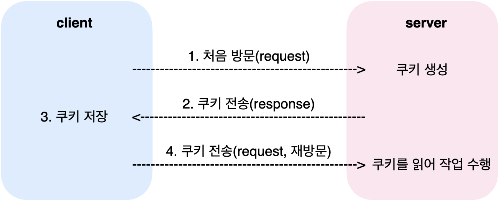
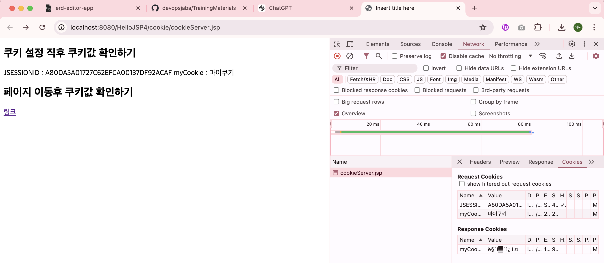

# 쿠키 & 세션

<!-- more -->

> 개요

1. 클라이언트의 상태 정보를 클라이언트 PC에 저장
2. 웹 사이트가 방문자를 기억하는 수단
3. 사용자별 맞춤 광고, 로그 분서그 서비스 개선 활용

#### Jakarta EE 9 API 문서

-   https://jakarta.ee/specifications/platform/9/apidocs/

## 🍪 쿠키

1. 주로 웹 브라우저에 키와 값 형태로 저장
2. 다음 요청 시 저장된 쿠키를 함께 전송함
3. 웹 서버는 브라우저가 전송한 쿠키로부터 필요한 데이터를 읽어올 수 있음
4. RFC 6265 : 하나의 호스트나 도메인에서 최대 50개 까지 만들 수 있음
5. 동작 원리
   

<details>
<summary>쿠키 예제</summary>

```java
package kr.co.kosta.util;

import jakarta.servlet.jsp.JspWriter;

public class JSFunction {
public static void alertLocation(String msg, String url, JspWriter out) {
    try {
        String script = "<script>" + "alert(`" + msg + "`)" + "location.href = `" + url + "` " + "</script>";
        out.println(script);
    } catch (Exception e) {
    }
}

public static void alertBack(String msg, JspWriter out) {
    try {
        String script = "<script>" + "alert(`" + msg + "`)" + "history.back() " + "</script>";
        out.println(script);
    } catch (Exception e) {
        }
    }

}

```

```jsp
<%@ page language="java" contentType="text/html; charset=UTF-8"
pageEncoding="UTF-8"%>
<%
Cookie cookie = new Cookie("myCookie", "마이쿠키");
cookie.setPath(request.getContextPath()); // 경로를 컨텍스트 루트로 설
cookie.setMaxAge(3600); // 유지기간 설정
response.addCookie(cookie); // 응답헤더에 쿠키 추가
%>

<!DOCTYPE html>
<html>
    <head>
        <meta charset="UTF-8" />
        <title>Insert title here</title>
    </head>
    <body>
        <h2>쿠키 설정 직후 쿠키값 확인하기</h2>
        <% Cookie[] cookies = request.getCookies(); if(cookies != null) {
        for(Cookie c : cookies) { String cookieName = c.getName(); String
        cookieValue = c.getValue(); out.println(String.format("%s : %s",
        cookieName, cookieValue)); } } %>

        <h2>페이지 이동후 쿠키값 확인하기</h2>
        <a href="cookieClinet.jsp">링크</a>
    </body>
</html>
```

```jsp
<%@ page language="java" contentType="text/html; charset=UTF-8"
    pageEncoding="UTF-8"%>
<!DOCTYPE html>
<html>
<head>
<meta charset="UTF-8">
<title>Insert title here</title>
</head>
<body>
<h2>쿠키값 확인하기(추가된 쿠키 생성 여부 확인) </h2>

<%
Cookie[] cookies = request.getCookies();
if(cookies != null) {
	for(Cookie c : cookies) {
		String cookieName = c.getName();
		String cookieValue = c.getValue();
		out.println(String.format("%s : %s", cookieName, cookieValue));
	}
}
%>
</body>
</html>

```

</details>



-   CookieManager 추가
-   쿠키 만들기, 쿠키 값 확인, 삭제를 메서드로 static 메서드로 분리하자

<br>

### 🍀 여기에 예시 넣기

<br>
<br>

## 🥖 세션

1.  클라이언트가 웹 브라우저를 통해 서버에 접속한 후 요청을 하고 웹 브라우저가 닫히고 서버와의 접속 종료하는 하나의 단위

    -   서버에 접속해 있는 동안 그 상태를 유지하는 것

### 🍀 세션과 DB를 이용한 로그인

1. 로그인 페이지
2. DAO(Data Transfer Object) & DAO(Data Access Object) 패턴
    - DTO
        - 계층 사이에서 데이터를 교환하기 위해 생성하는 객체
    - DAO
        - 데이터베이스의 데이터에 접근하기 위한 객체
        - JDBC API 통해 구현함
        - CRUD를 통해 구현함

```bash
session 설정 확인
세션 유지 기간 : 1200
세션 아이디 : 4BE939BB9218C96FDE10E81C53C858EE
최초 요청 시작 : 14:43:51
마지막 요청 시작 : 14:43:51


session 설정 확인
세션 유지 기간 : 1200
세션 아이디 : 4BE939BB9218C96FDE10E81C53C858EE
최초 요청 시작 : 14:43:51
마지막 요청 시작 : 14:46:37
```

-   session 폴더 만들고 xml 파일 갖고오고, JDBC 폴더 갖구옴

## 쿠키 VS 세션

|              |            쿠키             |              세션              |
| :----------: | :-------------------------: | :----------------------------: |
| **저장위치** | 클라이언트 PC에 text로 저장 | 웹 서버에 Object 타입으로 저장 |
|   **보안**   |         보안에 취약         |         보안에 안전함          |
|   **속도**   |          세션 빠름          |         쿠키보다 느림          |
| **유지시간** |    설정된 시간만큼 존재     |         web.xml에 설정         |

<br>
<br>
<br>
<br>
