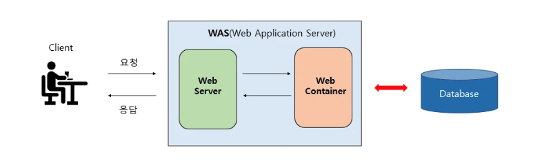
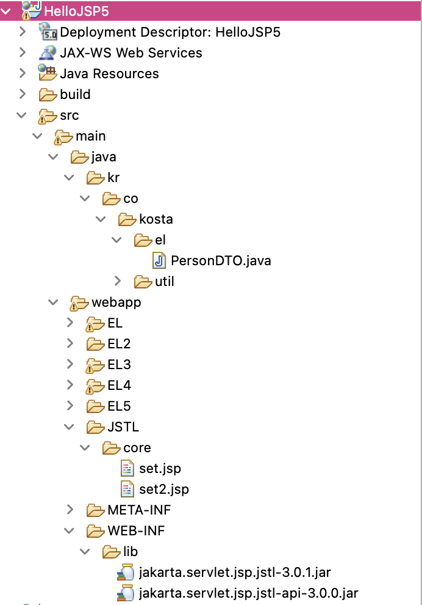
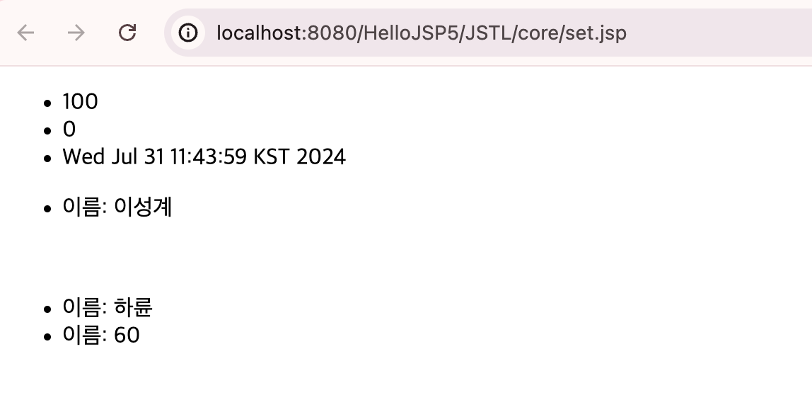
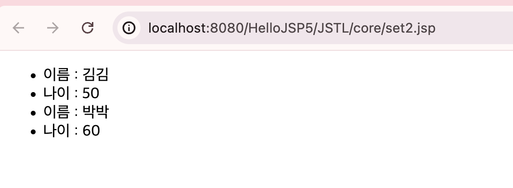
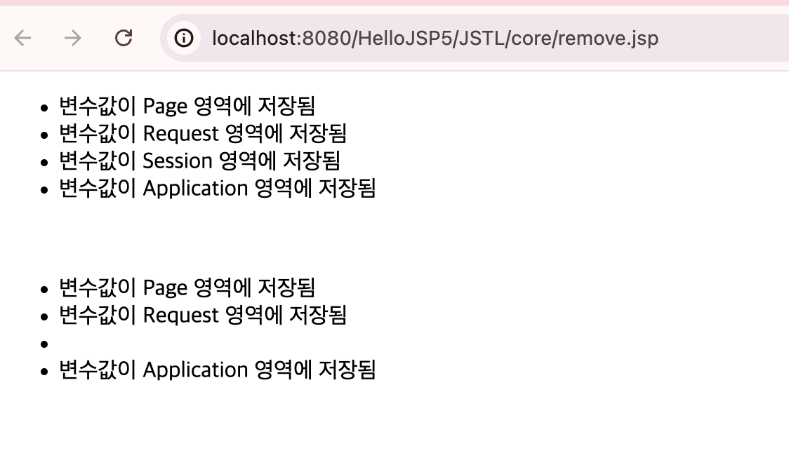
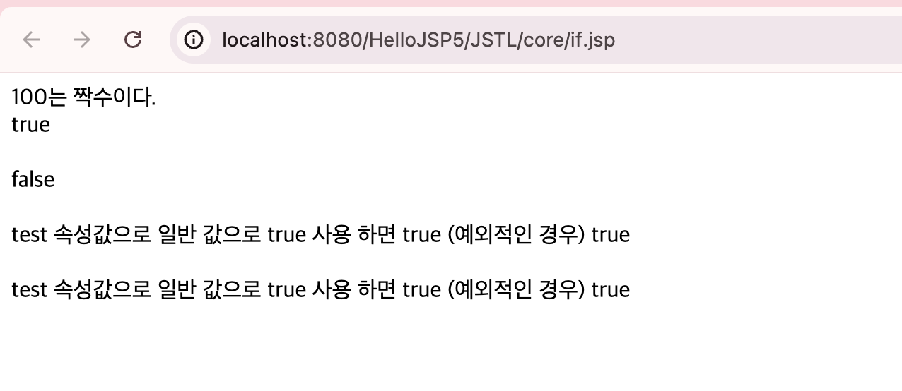

# JSP action tag, el, jstl

<!-- more -->

> 개요

## 📌 액션 태그 (action tag)

1.  JSP 표준 태그
2.  `<jsp:forward>`

    -   현재 페이지에 들어온 요청을 다음 페이지로 보내는 기능
    -   현재 페이지에서 다음 페이지로 요청을 포워딩하는 기능

    ```jsp
    <jsp:forward page="nextPage.jsp"/>
    ```

3.  <jsp:param>
    -   다른 페이지에 값을 전달해주는 액션 태그
    -   nextPage.jsp로 요청을 포워딩하면서 username 파라미터에 JohnDoe 값 전달
    ```jsp
    <jsp:forward page="nextPage.jsp">
        <jsp:param name="username" value="JohnDoe"/>
    </jsp:forward>
    ```

## 📌 표현 언어 (Expression Language, EL)

1.  스크립트 언어
2.  사용법

    -   ${ 속성 }
    -   ${username}
    -   영역에 저장된 속성값 출력

3.  내장 객체
    -   4가지 영역에 접근하기 위한 내장 객체
        -   `pageScope`
            -   pageContext 내장 객체와 같이 page 영역에 저장된 속성값을 읽어옴
        -   `requestScope`
            -   request 내장 객체와 같이 request 영역에 저장된 속성값을 읽어옴
        -   `sessionScope`
            -   session 내장 객체와 같이 session 영역에 저장된 속성값을 읽어옴
        -   `applicationScope`
            -   application 내장 객체와 같이 application 영역에 저장된 속성값을 읽어옴
4.  form 값 처리

    ```jsp
    <p>Parameter: ${param.paramName}</p>
    <p>Parameter Values: ${paramValues.paramName[0]}</p>
    ```

    -   `param`
        -   단일 매개변수 값을 가져온다.
        -   request.getParameter("매개변수명")
    -   `paramValues`
        -   매개변수의 여러 값을 배열로 가져온다.
        -   request.getParameterValues("매개변수명")

5.  객체 전달

    -   객체를 영역에 저장한 후, 내장 객체의 영역이 공유됨

    ```jsp
    <% request.setAttribute("user", new User("John", 25)); %>
    <p>User Name: ${requestScope.user.name}</p>
    <p>User Age: ${requestScope.user.age}</p>
    ```

6.  기타 내장 객체

    -   cookie, header, headerValues, initParam, pageContext

    ```jsp
    <p>Cookie: ${cookie.cookieName.value}</p>
    <p>Header: ${header.headerName}</p>
    <p>Init Param: ${initParam.paramName}</p>
    ```

7.  collection

    

    <details>
    <summary>colleciton 예제  HelloJSP5-EL5</summary>

    ```java
    package kr.co.kosta.el;

    public class PersonDTO {
        private String name;
        private int age;

        public PersonDTO() {
            //super();
        }

        public PersonDTO(String name, int age) {
            //super();
            this.name = name;
            this.age = age;
        }

        public String getName() {
            return name;
        }

        public void setName(String name) {
            this.name = name;
        }

        public int getAge() {
            return age;
        }

        public void setAge(int age) {
            this.age = age;
        }
    }

    ```

    ```jsp
    <%@page import="java.util.HashMap"%>
    <%@page import="javax.print.attribute.HashAttributeSet"%>
    <%@page import="java.util.logging.Handler"%>
    <%@page import="java.util.Map"%>
    <%@page import="kr.co.kosta.el.PersonDTO"%>
    <%@page import="java.util.List"%>
    <%@page import="java.util.ArrayList"%>
    <%@page import="kr.co.kosta.util.CookieManager"%>
    <%@ page language="java" contentType="text/html; charset=UTF-8"
        pageEncoding="UTF-8"%>
    <%
    List<Object> list = new ArrayList<>();
    list.add("홍길동");
    list.add(new PersonDTO("이방원", 70));

    pageContext.setAttribute("person", list);

    Map<String, String> map = new HashMap<>();
    map.put("세종", "훈민정음");
    map.put("태종", "왕권");
    map.put("moon", "국방 강화");
    pageContext.setAttribute("king", map);
    %>
    <!DOCTYPE html>
    <html>
    <head>
    <meta charset="UTF-8">
    <title>Insert title here</title>
    </head>
    <body>

        <ul>
            <li>0번째 요소: ${person[0]}</li>
            <li>1번째 요소: ${person[1].name}, ${person[1].age}</li>
        </ul>

        <ul>
            <li>0번째 요소: ${king["세종"]}, ${king['태종']}, ${king.moon}</li>
            <li>1번째 요소: ${king["세종"]}, ${king['태종']}, ${king.moon}</li>
        </ul>

    </body>
    </html>

    ```

    </details>

8.  EL연산자들

-   산수, 비교, 논리연산자

<details>
<summary></summary>
```java
```

```jsp

```

</details>

## 📌 JSTL

1. JSP Standard Tag Library
2. 코어태그

    - set, remove
    - if
    - choose, when, otherwise
    - forEach, forTokens
    - import, redirect, url
    - catch

3. 국제화 태그

    - 숫자
    - 날짜, 타임존
    - 로케일

4. JSTL 사용하기 위한 선언

    - `<%@ taglib prefix="c" uri="jakarta.tags.core" %>`
    - jar 다운로드 후 lib아래 넣기
        - https://mvnrepository.com/artifact/jakarta.servlet.jsp.jstl/jakarta.servlet.jsp.jstl-api/3.0.0
        - https://mvnrepository.com/artifact/org.glassfish.web/jakarta.servlet.jsp.jstl/3.0.1
          

## 📌 JSTL - CORE 태그

1. `<c:set>`

    - setAttribute() 메서드와 동일 기능
    - 변수 생성 형식

    ```jsp
      <c:set var="변수명" value="값" scope="영역" />
    ```

    - 변수나 자바 빈즈나 컬랙션 생성할 때 사용
        - 속성
            - `target`: 자바빈즈 생성
            - `property` : 멤버변수 값 지정

2. `<c:remove>`

    - <c:set> 태그로 설정한 변수를 제거할 때 사용
    - removeAttribute() 메서드와 같은 역할
    - 영역 지정하지 않을 경우 동일한 이름의 변수가 있다면 한꺼번에 삭제함
        - 영역 지정한 후 삭제해야 안전

3. `<c:if>`
    - 자바의 if와 동일
    - else가 없음
    - 속성
        - var, scope
        - test
            - if문에서 사용할 조건 지정
            - 값으로 EL이 아닌 일반 값이 오면 무조건 false 반환

### 🍀 JSTL 예제

-   scope에 request를 적용해야 el태그 내에서 requestScope. 사용하여 변수에 접근 가능
    -   `scope="request" => ${requestScope.psersonVar.name}`

<details>
<summary>JSTL c:set 예제</summary>
```java
```

```jsp
<%@page import="kr.co.kosta.el.PersonDTO"%>
<%@page import="java.util.Date"%>
<%@ page language="java" contentType="text/html; charset=UTF-8"
	pageEncoding="UTF-8"%>
<%@ taglib prefix="c" uri="jakarta.tags.core"%>
<!DOCTYPE html>
<html>
<head>
<meta charset="UTF-8">
<title>Insert title here</title>
</head>
<body>
	<c:set var="directVar" value = "100" />
	<c:set var="elVar" value = "${ directVar mod 5 } " />
	<c:set var="datavar" value="<%= new Date() %>" />
	<ul>
		<li>${pageScope.directVar}</li>
		<li>${elVar}</li>
		<li>${datavar}</li>
	</ul>

	<!-- 자바 빈즈 생성 : scope 사용 -->
	<c:set var="psersonVar" value= '<%= new PersonDTO("이성계", 50) %>' scope="request"/>
	<ul>
		<li>이름: ${requestScope.psersonVar.name}</li>
	</ul>

    <!-- 자바 빈즈 생성2 : property 사용 -->
	<c:set var="psersonVar2" value= "<%= new PersonDTO() %>" scope="request"/>
	<c:set target="${psersonVar2}" property="name" value="하륜" />
	<c:set target="${psersonVar2}" property="age" value="60" />
	<ul>
		<li>이름: ${psersonVar2.name}</li>
		<li>이름: ${psersonVar2.age}</li>
	</ul>

</body>
</html>
```

</details>



-   위 예제와 거의 동일하며 list 사용

<details>
<summary>JSTL c:set 예제2 (collection list 사용)</summary>

```jsp
<%@page import="kr.co.kosta.el.PersonDTO"%>
<%@page import="java.util.ArrayList"%>
<%@ page language="java" contentType="text/html; charset=UTF-8"
	pageEncoding="UTF-8"%>
<%@ taglib prefix="c" uri="jakarta.tags.core"%>
<%
ArrayList<PersonDTO> list = new ArrayList<>();
list.add(new PersonDTO("김김", 50));
list.add(new PersonDTO("박박", 60));
%>
<!DOCTYPE html>
<html>
<head>
<meta charset="UTF-8">
<title>Insert title here</title>
</head>
<body>

<c:set var="personlist" value="<%= list %>" scope="request" />
<ul>
<li>이름 :  ${requestScope.personlist[0].name}</li>
<li>나이 :  ${requestScope.personlist[0].age}</li>
<li>이름 :  ${personlist[1].name}</li>
<li>나이 :  ${personlist[1].age}</li>
</ul>

</body>
</html>
```

</details>



<details>
<summary>JSTL c:remove 예제</summary>

```jsp
<%@ page language="java" contentType="text/html; charset=UTF-8"
    pageEncoding="UTF-8"%>
<%@ taglib prefix="c" uri="jakarta.tags.core"%>

<c:set var="scoreVar" value="변수값이 Page 영역에 저장됨" scope="page"/>
<c:set var="scoreVar" value="변수값이 Request 영역에 저장됨" scope="request"/>
<c:set var="scoreVar" value="변수값이 Session 영역에 저장됨" scope="session"/>
<c:set var="scoreVar" value="변수값이 Application 영역에 저장됨" scope="application"/>

<!DOCTYPE html>
<html>
<head>
<meta charset="UTF-8">
<title>Insert title here</title>
</head>
<body>
	<ul>
		<li>${scoreVar}</li>
		<li>${requestScope.scoreVar}</li>
		<li>${sessionScope.scoreVar}</li>
		<li>${applicationScope.scoreVar}</li>
	</ul>

	<br />
	<c:remove var="scoreVar" scope="session"/>
	<ul>
		<li>${scoreVar}</li>
		<li>${requestScope.scoreVar}</li>
		<li>${sessionScope.scoreVar}</li>
		<li>${applicationScope.scoreVar}</li>
	</ul>
</body>
</html>
```

</details>



<details>
<summary>JSTL c:if 예제</summary>

```jsp
<%@ page language="java" contentType="text/html; charset=UTF-8"
    pageEncoding="UTF-8"%>
<%@ taglib prefix="c" uri="jakarta.tags.core"%>

<!DOCTYPE html>
<html>
<head>
<meta charset="UTF-8">
<title>Insert title here</title>
</head>
<body>
	<c:set var="number" value="100"/>
	<c:set var="string" value="jsp입니다."/>

	<c:if test="${number mod 2 eq 0 }" var="result">
	${number}는 짝수이다.
	</c:if>
	<br />
	${result }	<br /><br />


	<c:if test="100" var="result2">
	test 속성값으로 EL이 아닌 정수를 지정함
	</c:if>
	${result2 } <br /><br />

	<c:if test="true" var="result3">
	test 속성값으로 일반 값으로 true 사용 하면 true (예외적인 경우)
	</c:if>
	${result3 } <br /><br />

	<c:if test="TRUE" var="result4">
	test 속성값으로 일반 값으로 true 사용 하면 true (예외적인 경우)
	</c:if>
	${result4 } <br /><br />


</body>
</html>
```

</details>


