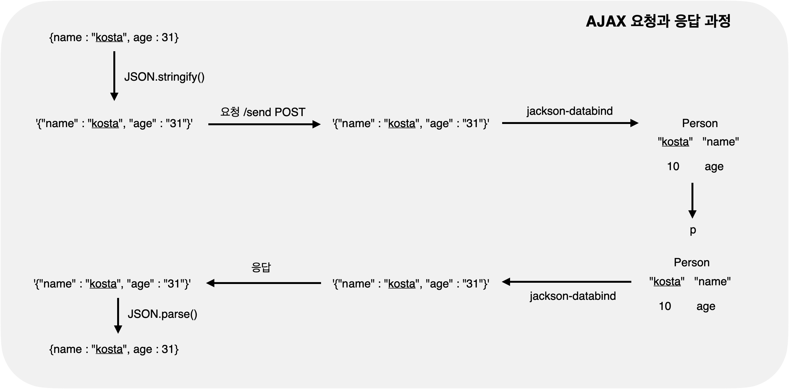

# AJAX

-   Javascript Object Notation (자바스크립트 객체 표기법)
-   JSON.stringify(), JSON.parse()
-   @RestController = @RequestBody, @Controller

<!-- more -->

## 📌 JSON

### JSON 배열

-   [ {}, {}, {} ]처럼 객체의 배열로 표현

    ```json
    [
        {
            "속성명": "속성값",
            "속성명": "속성값",
            "속성명": "속성값",
            "속성명": "속성값"
        },
        {
            "속성명": "속성값",
            "속성명": "속성값",
            "속성명": "속성값",
            "hobby": "속성값"
        }
    ]
    ```

### JSON 객체

-   { "key1": {}, "key2": {} }처럼 키-값 쌍으로 표현

    ```json
    {
        "키1": {
            "속성명1": "속성값1",
            "속성명2": "속성값2",
            "속성명3": "속성값3",
            "속성명4": "속성값4"
        },
        "키2": {
            "속성명1": "속성값1",
            "속성명2": "속성값2",
            "속성명3": "속성값3",
            "hobby": "속성값"
        }
    }
    ```

### JSON.stringify(), JSON.parse()

-   client side에서의 이야기이다.
-   `JSON.stringify()`
    -   JS 객체를 서버로 전달하기 위해서 직렬화(문자열로 변환)가 필요
    -   객체를
    -   {name : 홍길동, age : 30} -> "{"name" : "홍길동", "age" : "30"}"
-   `JSON.parse()`
    -   서버가 보낸 데이터(JSON 문자열)을 JS 객체로 변환이 필요. 역직렬화
    -   {name : 홍길동, age : 30} <- "{"name" : "홍길동", "age" : "30"}"
    -   서버로부터 데이터를

### jackson-databind

-   server side에서의 이야기
-   json문자열로 자바에서 받아서 사용할 수 있도록 JAVA 객체로 변환해주는 기능
-   JAVA 컨트롤러가 이를 받을 수 있다.

## 📌 jQuery를 이용한 AJAX

```ajax
$.ajax({
    type: post 또는 get,
    ascync : "true" or "false",
    url: "요청할 URL",
    data: {서버로 보낼 데이터},
    dataType : "text 서버에서 전송받을 데이터 형식",
    success: {
        // 정상 요청, 응답 시 처리
    },
    error : {
        // 오류 발생시 처리
    } ,
    complete : {
        // 작업 완료 후 처리
    }
```

## 📌 관련 어노테이션(@RequestBody, @Controller)

### @RequestBody

-   HTTP Request Message Body 를 통해 전달된 데이터를 지정한 객체로 deserialize
    -   JSON 형태의 데이터를 파라미터로 전달하고 싶을 때 사용

### @Controller

-   View를 반환하기 위해 사용됨
-   @RequestBody 어노테이션 활용
    -   Data를 반환할 때 사용 (JSON)
    -   반환되는 객체가 JSON으로 serialized 되어 반환됨

### @RestController

-   @RequestBody + @Controller
-   주목적은 JSON 형태의 데이터를 반환하는 것

## 📌 AJAX 요청과 응답 과정



```java
@Controller
public class SimpleRestController {

	@GetMapping("/ajax")
	public String  ajax() {
		return "ajax";
	}

	@ResponseBody
	@PostMapping("/send")
		public Person test(@RequestBody Person p) {
			System.out.println("p = " +  p);
			p.setName("kosta 0902");
			p.setAge(38);
			return p;
		}
	}

```

```jsp
<%@ page language="java" contentType="text/html; charset=UTF-8"
	pageEncoding="UTF-8"%>


<!DOCTYPE html>
<html>
<head>
<meta charset="UTF-8">
<link rel="stylesheet" href="<c:url value='/resources/css/menu.css' />" />
<link rel="stylesheet"
	href="https://cdnjs.cloudflare.com/ajax/libs/font-awesome/5.8.2/css/all.min.css" />
<script src="https://code.jquery.com/jquery-3.7.1.min.js"></script>
<title>Insert title here</title>
</head>
<body>
	<h2>{name : "kosta", age : 31}</h2>
	<button id="sentBtn" type="button">SEND</button>

	<h2>Data from server</h2>
	<div id="data"></div>

	<script type="text/javascript">
	$(document).ready(function) {
		let person = {name : "kosta", age : 28}
		let person2 = {}
		$("#sendBtn").click(function() {

			$ajax({
				type : "POST",
				url : '/october/send',
				headers: {"Content-Type": "application/json"},
				data: JSON.stringify(person),
				dataType : "text",
				success: function(result) {
			        person2 = JSON.parse(result);
			        alert("received: " + result);
			        $("#data").html("name = " + person2.name + " age = " + person2.age);
			    },
			    error: function() {
			        alert("error");
			    }
			})

			alert("this request is sent")
		})
	}
	</script>
</body>
</html>
```

## RestController

-   representational state transfer
-   웹서비스 디자인 아키텍처 접근 방식
-   프로토콜에 독립적임, 주로 HTTP를 사용해서 구현
    -   REST 규약을 준수하는 API
-   리소스 중심의 API 디자인
-   HTTP 메소드로 사용할 작업을 정의

| 리소스              | POST                        | GET                            | PUT                                     | DELETE         | UPDATE |
| ------------------- | --------------------------- | ------------------------------ | --------------------------------------- | -------------- | ------ |
| /products           | 새물건 만들기               | 모든 물건 검색                 | 물건 대량 업데이트                      | 모든 물건 삭제 |        |
| /products/821       | ERROR                       | 물건 821에 대한 정보 검색      | 물건 821이 있는 경우 세부 정보 업데이트 | 모든 물건 821  |        |
| /products/821/order | 물건 821에 대한 주문 만들기 | 물건 821에 대한 모든 주문 검색 | 물건 821에 주문 대량 업데이트           | 물건 821 삭제  |        |

### RESTful API 설계 및 비교

> 기존 api

| 작업 | URI                     | HTTP Method | 설명                      |
| ---- | ----------------------- | ----------- | ------------------------- |
| 읽기 | /products/read?cno=번호 | GET         | 지정된 번호의 글을 보여줌 |
| 쓰기 | /products/write         | POST        | 작성한 물건 저장          |
| 삭제 | /products/remove        | POST        | 물건 삭제                 |
| 수정 | /products/modify        | POST        | 수정된 물건을 수정함      |

> REST API

| 작업 | URI             | HTTP Method | 설명                      |
| ---- | --------------- | ----------- | ------------------------- |
| 읽기 | /products       | GET         | 모든글을 보여줌           |
| 읽기 | /products/{cno} | GET         | 지정된 번호의 글을 보여줌 |
| 쓰기 | /products       | POST        | 새로운 물건 저장          |
| 삭제 | /products/{cno} | DELETE      | 물건 삭제                 |
| 수정 | /products/{cno} | PUT/PATCH   | 수정된 물건을 저장함      |
