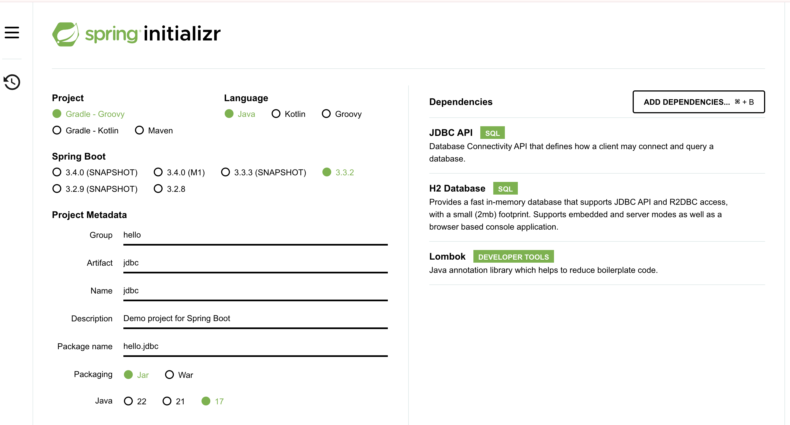
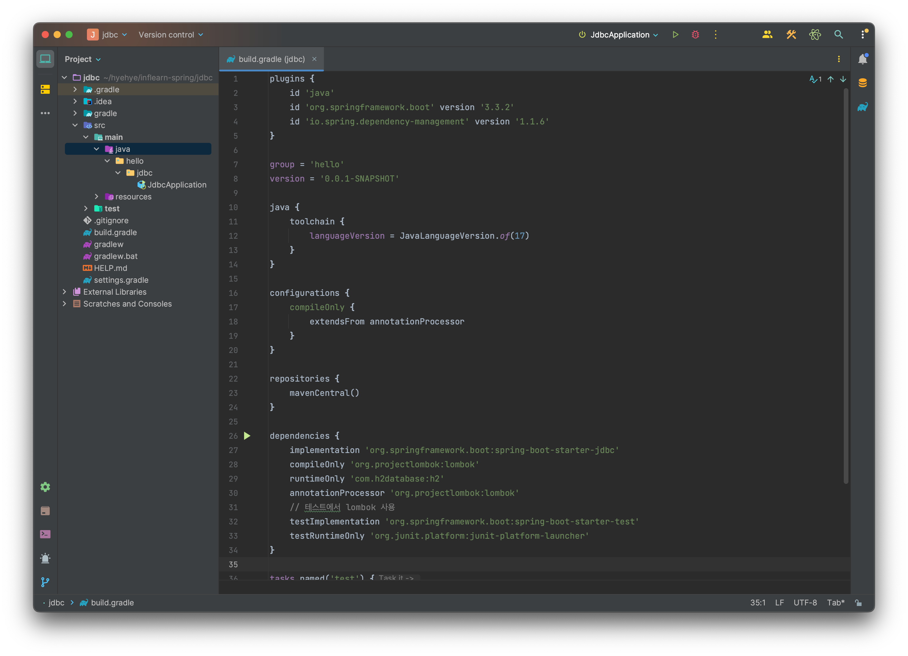
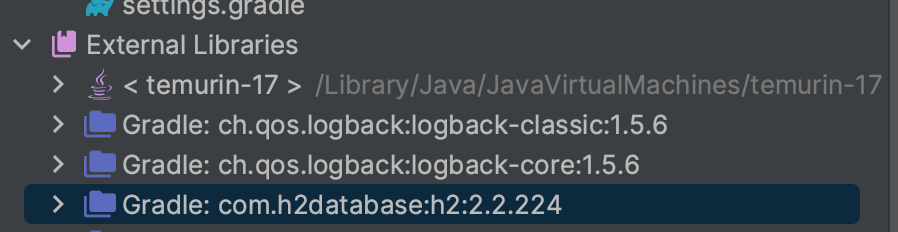
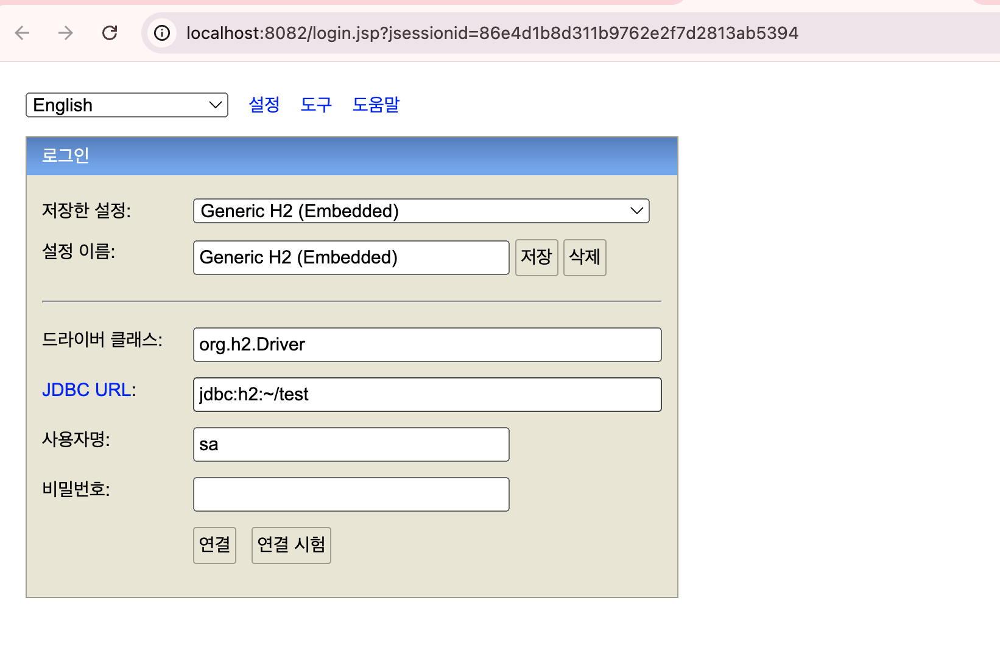
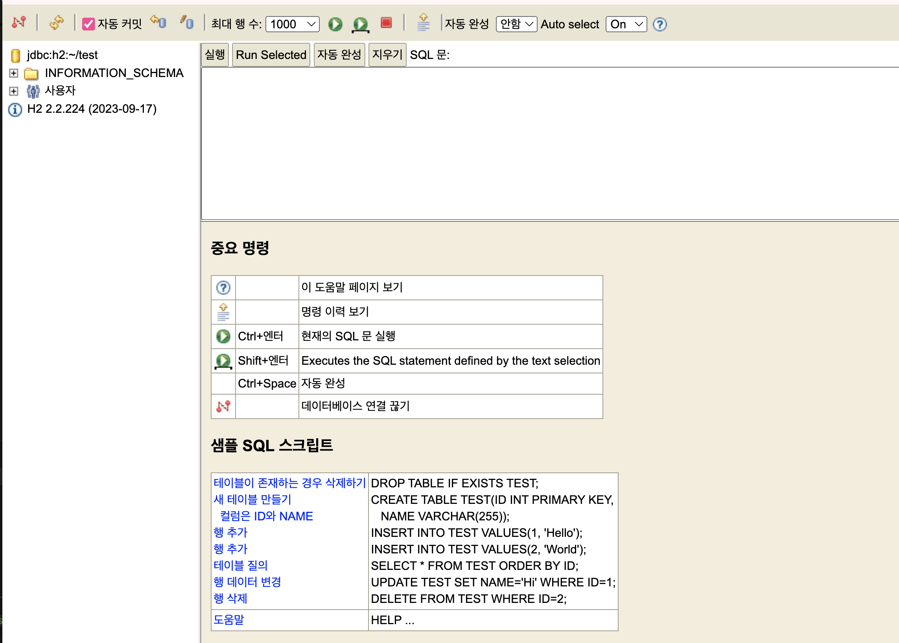
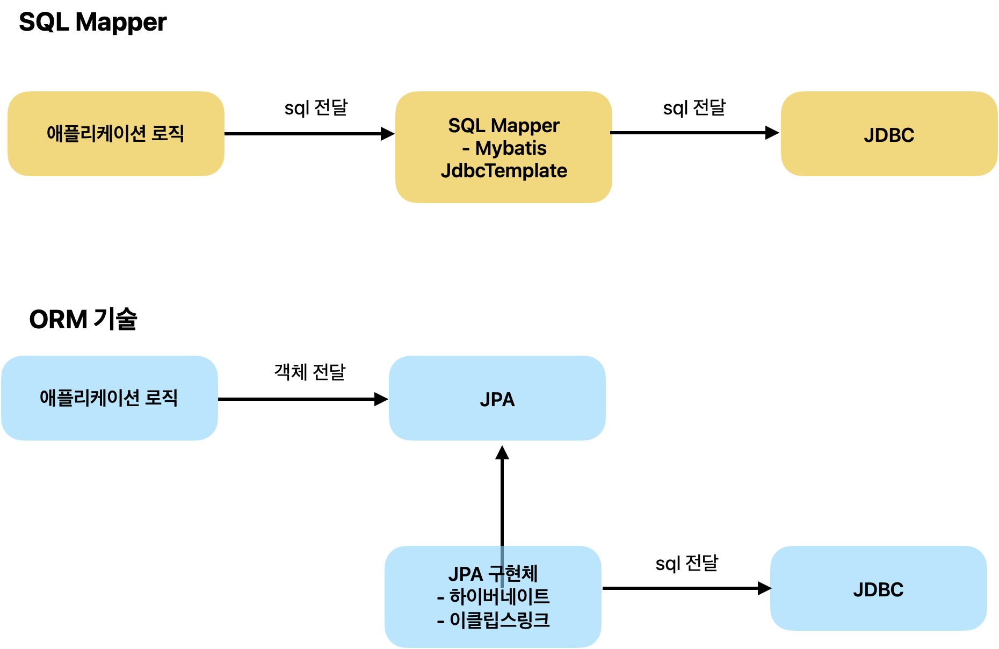

<!-- more -->

## 다양한 데이터 접근 기술

-   JDBC
-   JdbcTemplate
-   MyBatis
-   JPA
-   Spring Data JPA
-   Querydsl

1.  스프링 프로젝트 설정

    

2.  build.gradle 파일

    

## H2 데이터베이스 설정

    > https://www.h2database.com

1.  버전에 맞는 H2 db 다운로드 받기
    

    -   2.2.224 버전

2.  원하는 위치에 압축 풀기

    > MAC, 리눅스 사용자

    ```shell
    cd bin
    chmod 755 h2.sh
    ./h2.sh
    ```

    -   최초 한 번은 `jdbc:h2:~/test`로 연결한다. 그럼 `~/test.mv.db` 파일이 생성되는것을 확인할 수 있다.
        -   다음 연결 부터는 `jdbc:h2:tcp://localhost/~/test` 으로 접속
            
            

## JDBC

JDBC(Java Database Connectivity)는 JAVA에서 DB에 접속할 수 있도록 하는 자바 API이다.

> JDBC 등장 이유

1. 데이터베이스를 다른 종류의 데이터베이스로 변경하면 애플리케이션 서버에 개발된 데이터베이스 사용 코드도 함께 변경해야된다.
2. 개발자가 각각 데이터베이스마다 커넥션 연결, SQL전달, 그리고 그 결과를 응답 받는 방법을 새로 학습해야 하는데 번거로움이 있었다.

### JDBC 표준 인터페이스

> 자바는 아래와 같이 표준 인터페이스를 정의해두고, 개발자가 이 표준 인터페이스만 사용해서 개발할 수 있도록 했다.

1.  연결 : `java.sql.Connection`
2.  SQL을 담은 내용 : `java.sql.Statement`
3.  SQL 요창 응답 : `java.sql.ResultSet`

> JDBC 드라이버

각각의 DB에 맞도록 구현해서 라이브러리로 제공하는데, 이를 JDBC 드라이버 라고 한다. 예를들어 MySQL DB에 접근 할 수 있는 것은 `MySQL JDBC Driver`이다.

> 표준화의 한계

각각의 데이터베이스마다 SQL, 데이터타입 등의 일부 사용법 다르다. 결국 데이터베이스를 변경하면 JDBC 코드는 변경하지 않아도 되지만 SQL은 해당 데이터베이스에 맞도록 변경 해야한다. JPA(Java Persistence API)를 사용하면 이렇게 각각의 데이터베이스마다 다른 SQL을 정의해야 하는 문제도 많은 부분 해결할 수 있다.

### SQL Mapper

-   JDBC를 편하게 사용하도록 도와주는 것
    -   SQL 응답 결과를 객체로 편리하게 변환해준다.
    -   JDBC의 반복 코드를 제거해준다.
-   개발자가 SQL를 직접 작성해야한다. (추후 나오는 ORM과 비교되는 단점)
-   예시) MyBatis, JdbcTemplate

### SQL Mapper vs ORM



-   SQL Mapper는 SQL만 직접 작성하면 나머지 번거로운 일은 SQL Mapper가 대신 해결해준다. SQL Mapper는 SQL만 작성할 줄 알면 금방 배워서 사용할 수 있다.
-   ORM기술은 SQL 자체를 작성하지 않아도 되어서 개발 생산성이 매우 높아진다. 편리한 반면에 쉬운 기술은 아니므로 실무에서 사용하려면 깊이있게 학습해야 한다.

prestatement 는 statement를 상속받은것이다. prestatement는 파라미터를 바인딩 할 수 있다. 기능이 더 많음
또한 SQL Injection공격을 예방하기 위해서 사용한다.

데이터를 변경할 때 => executeUpdate()
데이터를 조회할 때 => executeQuery();
executeQuery는 resultSet을 반환한다.

@Data 어노테이션을 사용하면 Lombok이 equals 메서드를 오버라이드하여 객체의 필드 값을 비교하도록 설정합니다.
isEqualTo는 @Data 어노테이션에 의해 자동 생성된 equals 메서드를 사용하여 주소값이 아닌 필드 값을 비교합니다.
