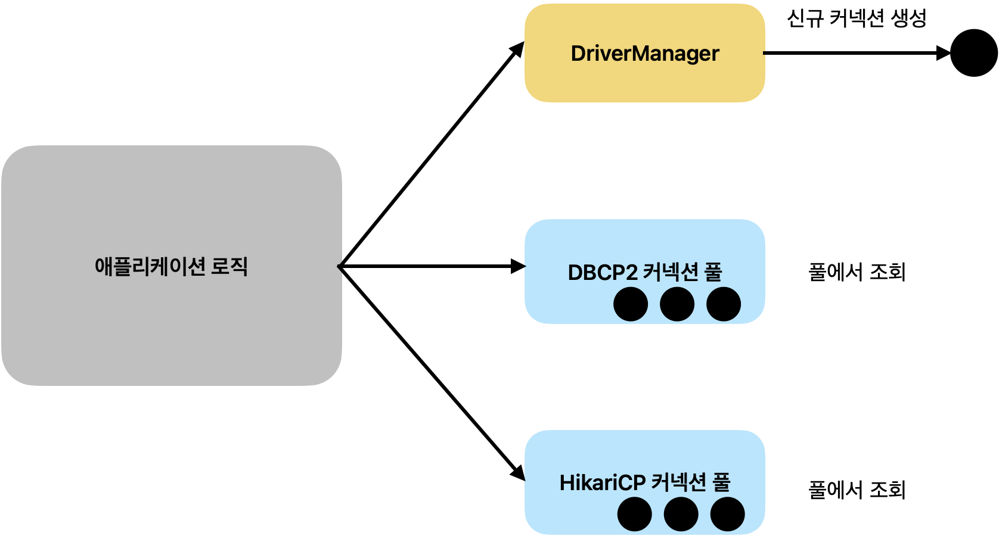
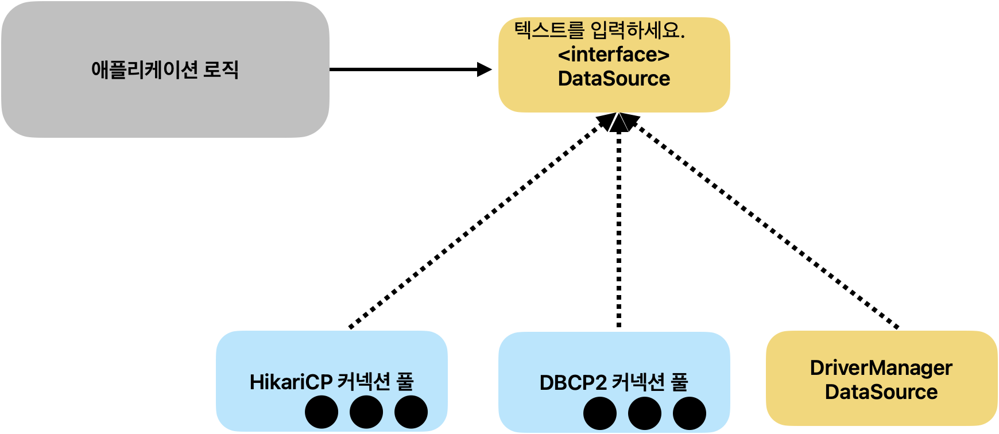
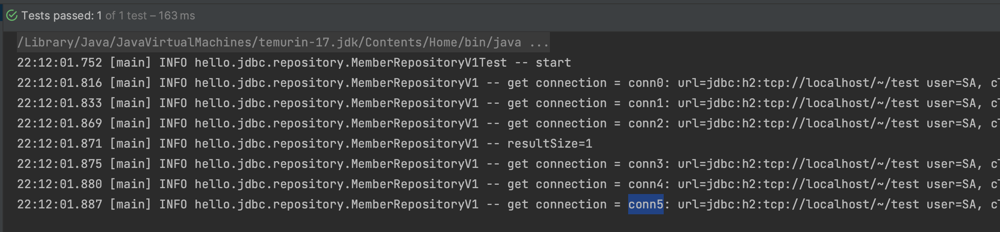
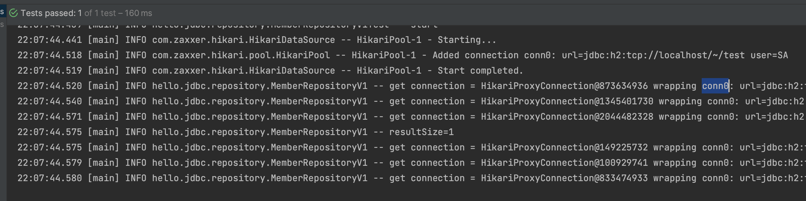

<!-- more -->

## DB Connection 과정

jdbc 드라이버는 데이터베이스 커넥션을 매번 획득했다.
데이터베이스 커넥션을 획득하는 과정은 다음과 같다. 커넥션을 새로 생성하기 위해 리소스를 매번 사용해야하고, 고객들이 애플리케이션을 사용할 떄 SQL문을 실행하는 시간 뿐만 아니라 커넥션을 새로 만드는 시간도 추가되어 응답속도에 영향을 미치게 된다. 이러한 문제를 해결하기 위해 커넥션을 미리 생성해두고 사용하는 커넥션풀 이라는 방법이 나왔다.

1. 애플리케이션 로직은 DB 드라이버를 통해 커넥션을 조회한다.
2. DB 드라이버는 DB와 `TCP/IP` 커넥션을 연결한다. 물론 이 과정에서 3 way handshake 같은 `TCP/IP` 연결을 위한 네트워크 동작이 발생한다.
3. DB 드라이버는 `TCP/IP` 커넥션이 연결되면 ID, PW와 기타 부가정보를 DB에 전달한다.
4. DB는 ID, PW를 통해 내부 인증을 완료하고, 내부에 DB 세션을 생성한다.
5. DB는 커넥션 생성이 완료되었다는 응답을 보낸다.
6. DB 드라이버는 커넥션 객체를 생성해서 클라이언트에 반환한다.

## Connection Pool

애플리케이션 로직에서 DB드라이버를 통해 새로운 커넥션을 획득하는 것이 아니라, 커넥션 풀을 통해 이미 생성된 커넥션을 객체 참조로 가져다 쓰는 것이다.

> Drive Connection 과정 2가지



1. 신규 커넥션 생성
2. 커넥션 풀에 미리 생성된 것 조회

## DataSource

> 커넥션을 획득하는 방법을 추상화하는 인터페이스



```java
public interface DataSource {
   Connection getConnection() throws SQLException;
}
```

자바는 `Datasource`를 통해 커넥션을 획득하는 방법을 추상화했다. 애플리케이션 로직은 `Datasource` 인터페이스에만 의존하면 된다. 따라서 `DriverManager DataSource`를 통해서 `DriverManage`를 사용하다가 커넥션 풀을 사용하도록 코드를 변경해도 애플리케이션 로직은 변경하지 않아도 된다.

### 🍀 Datasource 예제1 - DriverManager

> Datasource 실행결과

```shell
17:46:51.154 [main] INFO hello.jdbc.connection.ConnectionTest -- connection = conn0: url=jdbc:h2:tcp://localhost/~/test user=SA, class = class org.h2.jdbc.JdbcConnection
17:46:51.156 [main] INFO hello.jdbc.connection.ConnectionTest -- connection = conn1: url=jdbc:h2:tcp://localhost/~/test user=SA, class = class org.h2.jdbc.JdbcConnection
17:46:51.173 [main] INFO hello.jdbc.connection.ConnectionTest -- connection = conn2: url=jdbc:h2:tcp://localhost/~/test user=SA, class = class org.h2.jdbc.JdbcConnection
17:46:51.173 [main] INFO hello.jdbc.connection.ConnectionTest -- connection = conn3: url=jdbc:h2:tcp://localhost/~/test user=SA, class = class org.h2.jdbc.JdbcConnection


```

### 차이점

-   기존 `DriverManager` 를 통해서 커넥션을 획득하는 방법과 `DataSource` 를 통해서 커넥션을 획득하는 방법에는 차이가 있다.
-   설정과 사용을 분리했다.

-   `DriverManager` 는 커넥션을 획득할 때 마다 `URL` , `USERNAME` , `PASSWORD` 같은 파라미터를 계속 전달해야 한다. 반면에 `DataSource` 를 사용하는 방식은 처음 객체를 생성할 때만 필요한 파리미터를 넘겨두고, 커넥션을 획득할 때는 단순히 `dataSource.getConnection()` 만 호출하면 된다.

> DriverManager

```java
DriverManager.getConnection(URL, USERNAME, PASSWORD)
DriverManager.getConnection(URL, USERNAME, PASSWORD)
```

> DataSource

```java
 void dataSourceDriverManager() throws SQLException {
     DriverManagerDataSource dataSource = new DriverManagerDataSource(URL,
 USERNAME, PASSWORD);
     useDataSource(dataSource);
}

private void useDataSource(DataSource dataSource) throws SQLException {
     Connection con1 = dataSource.getConnection();
     Connection con2 = dataSource.getConnection();
     log.info("connection={}, class={}", con1, con1.getClass());
     log.info("connection={}, class={}", con2, con2.getClass());
}
```

<details>
<summary>Datasource 예제1 - DriverManager</summary>

```java
package hello.jdbc.connection;

import lombok.extern.slf4j.Slf4j;

import java.sql.Connection;
import java.sql.DriverManager;
import java.sql.SQLException;

import static hello.jdbc.connection.ConnectionConst.*;

@Slf4j
public class DBConnectionUtil {

    public static Connection getConnection() {

        try {
            // 이 커넥션을 DB가 바뀐다고 해서 바꿀 필요가 없다. Connection이 JDBC 표준 인터페이스이기
            Connection connection = DriverManager.getConnection(URL, USERNAME, PASSWORD);
            log.info("get Connection = {}, class = {}",connection , connection.getClass());
            return  connection;
        } catch (SQLException e) {
            throw new IllegalStateException(e);
        }

    }

}

```

```java
package hello.jdbc.connection;

import lombok.extern.slf4j.Slf4j;
import org.junit.jupiter.api.Test;
import org.springframework.jdbc.datasource DriverManagerDataSource;

import javax.sql.DataSource;
import java.sql.Connection;
import java.sql.DriverManager;
import java.sql.SQLException;

import static hello.jdbc.connection.ConnectionConst.*;

@Slf4j
public class ConnectionTest {
    @Test
    void driveManager() throws SQLException {
        Connection con1 = DriverManager.getConnection(URL, USERNAME, PASSWORD);
        Connection con2 = DriverManager.getConnection(URL, USERNAME, PASSWORD);
        log.info("connection = {}, class = {}", con1, con1.getClass());
        log.info("connection = {}, class = {}", con2, con2.getClass());
    }

    @Test
    void dataSourceDriverManager() throws SQLException {
        //DriverManagerDataSource - 항상 새로운 커넥션 획득
        DriverManagerDataSource datasource = new DriverManagerDataSource(URL, USERNAME, PASSWORD);
        useDataSource(datasource);
    }

    private void useDataSource(DataSource dataSource) throws SQLException {

        Connection con1 = dataSource.getConnection();
        Connection con2 = dataSource.getConnection();
        log.info("connection = {}, class = {}", con1, con1.getClass());
        log.info("connection = {}, class = {}", con2, con2.getClass());
    }
}


```

</details>

### 🍀 Datasource 예제2 - connection Pool

<details>
<summary>Datasource 예제2 - connection Pool</summary>

```java
package hello.jdbc.connection;

import com.zaxxer.hikari.HikariDataSource;
import lombok.extern.slf4j.Slf4j;
import org.junit.jupiter.api.Test;
import org.springframework.jdbc.datasource.DriverManagerDataSource;

import javax.sql.DataSource;
import java.sql.Connection;
import java.sql.DriverManager;
import java.sql.SQLException;

import static hello.jdbc.connection.ConnectionConst.*;

@Slf4j
public class ConnectionTest {
    @Test
    void driveManager() throws SQLException {
        Connection con1 = DriverManager.getConnection(URL, USERNAME, PASSWORD);
        Connection con2 = DriverManager.getConnection(URL, USERNAME, PASSWORD);
        log.info("connection = {}, class = {}", con1, con1.getClass());
        log.info("connection = {}, class = {}", con2, con2.getClass());
    }

    @Test
    void dataSourceDriverManager() throws SQLException {
        //DriverManagerDataSource - 항상 새로운 커넥션 획득
        DriverManagerDataSource datasource = new DriverManagerDataSource(URL, USERNAME, PASSWORD);
        useDataSource(datasource);
    }

    @Test
    void dataSourceConnectionPool() throws SQLException, InterruptedException {
        // 커넥션 풀링
        HikariDataSource dataSource = new HikariDataSource();
        dataSource.setJdbcUrl(URL);
        dataSource.setUsername(USERNAME);
        dataSource.setPassword(PASSWORD);
        dataSource.setPoolName("MyPool");
        dataSource.setMaximumPoolSize(10);

        useDataSource(dataSource);
        Thread.sleep(1000);

    }
    private void useDataSource(DataSource dataSource) throws SQLException {

        Connection con1 = dataSource.getConnection();
        Connection con2 = dataSource.getConnection();
        log.info("connection = {}, class = {}", con1, con1.getClass());
        log.info("connection = {}, class = {}", con2, con2.getClass());
    }
}
```

🤔 왜 별도의 쓰레드를 사용해서 커넥션 풀에 커넥션을 채우는 것일까?  
커넥션 풀에 커넥션을 채우는 것은 상대적으로 오래 걸리는 일이다. 애플리케이션을 실행할 때 커넥션 풀을 채울 때 까 지 마냥 대기하고 있다면 애플리케이션 실행 시간이 늦어진다. 따라서 이렇게 별도의 쓰레드를 사용해서 커넥션 풀을 채 워야 애플리케이션 실행 시간에 영향을 주지 않는다.

🤔 정해둔 커넥션풀 최대 개수를 모두 채운다면?  
-> 몇초간 대기하다가 에러발생

🤔 커넥션 풀에서 커넥션 획득  
커넥션 풀에서 커넥션을 획득하고 그 결과를 출력했다. 여기서는 커넥션 풀에서 커넥션을 2개 획득하고 반환하지는 않았다. 따라서 풀에 있는 10개의 커넥션 중에 2개를 가지고 있는 상태이다. 그래서 마지막 로그를 보면 사용중인 커넥션
`active=2` , 풀에서 대기 상태인 커넥션 `idle=8` 을 확인할 수 있다.

-   `MyPool - After adding stats (total=10, active=2, idle=8, waiting=0)`

</details>

### 🍀 Datasource 예제3

> driverManager

```java
@BeforeEach
    void beforeEach() {
        // 기본 driverManager - 항상 새로운 커넥션 획득
        DriverManagerDataSource dataSource = new DriverManagerDataSource(URL, USERNAME, PASSWORD);
        repository = new MemberRepositoryV1(dataSource);
    }
```

😎 항상 새로운 커넥션이 생성되는 것 확인



> 커넥션 풀링

```java
 @BeforeEach
    void beforeEach() {
        // 커넥션 풀링: HikariProxyConnection -> JdbcConnection
        HikariDataSource dataSource = new HikariDataSource();
        dataSource.setJdbcUrl(URL);
        dataSource.setUsername(USERNAME);
        dataSource.setPassword(PASSWORD);

        repository = new MemberRepositoryV1(dataSource);
    }
```

😎 conn0 만 사용되는 것 처럼 보이는 이유?


-   커넥션 풀 사용시 `conn0` 커넥션이 재사용 된 것을 확인할 수 있다.
-   테스트는 순서대로 실행되기 때문에 커넥션을 사용하고 다시 돌려주는 것을 반복한다. 따라서 `conn0` 만 사용된다.
-   웹 애플리케이션에 동시에 여러 요청이 들어오면 여러 쓰레드에서 커넥션 풀의 커넥션을 다양하게 가져가는 상황 을 확인할 수 있다.
