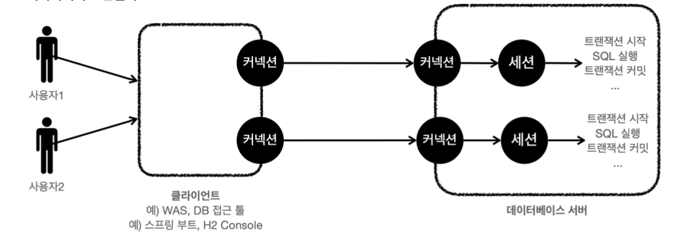

<!-- more -->

## 트랜잭션이란?

> 예시) 5000원 계좌이체

1. A의 잔고를 5000원 감소
2. B의 잔고를 5000원 증가

모든 작업이 성공해서 데이터베이스에 정상 반영하는것이 commit 이고, 작업 중 하나라도 실패하면 거래 이전으로 되돌리는 것을 rollback이라 한다.

### ACID

1. `원자성` : 트랜잭션 내에서 실행한 작업들은 마치 하나의 작업인 것처럼 모두 성공 하거나 모두 실패해야 한다.
2. `일관성` : 모든 트랜잭션은 일관성 있는 데이터베이스 상태를 유지해야 한다. 예를 들어 데이터베이스에서 정한 무 결성 제약 조건을 항상 만족해야 한다.
3. `격리성` : 동시에 실행되는 트랜잭션들이 서로에게 영향을 미치지 않도록 격리한다. 예를 들어 동시에 같은 데이터 를 수정하지 못하도록 해야 한다. 격리성은 동시성과 관련된 성능 이슈로 인해 트랜잭션 격리 수준(Isolation level)을 선택할 수 있다.
4. `지속성` : 트랜잭션을 성공적으로 끝내면 그 결과가 항상 기록되어야 한다. 중간에 시스템에 문제가 발생해도 데이 터베이스 로그 등을 사용해서 성공한 트랜잭션 내용을 복구해야 한다.

### 트랜잭션 격리 수준 - Isolation level

> 단계가 높아질수록 느려진다.

1. READ UNCOMMITED(커밋되지 않은 읽기)
2. READ COMMITTED(커밋된 읽기) - 기본으로 많이 사용
3. REPEATABLE READ(반복 가능한 읽기)
4. SERIALIZABLE(직렬화 가능)

## 데이터베이스 연결 구조와 DB 세션

-   커넥션을 연결하면 데이터베이스 서버 내부에서 세션이 만들어진다.
    -   커넥션이 10개 만들어지면 세션도 10개 만들어진다.
