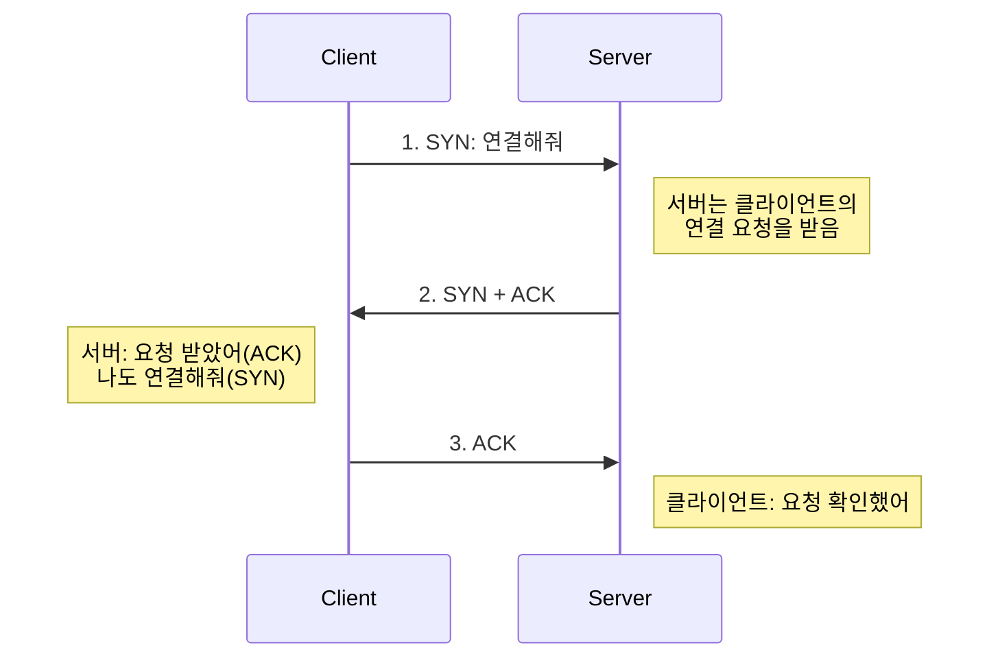
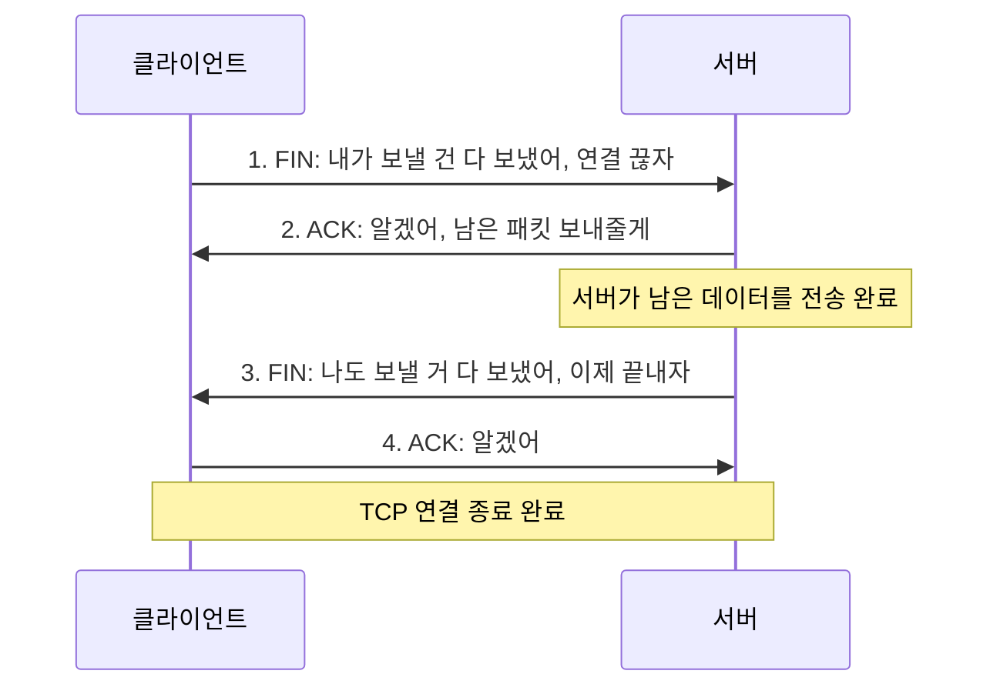

# TCP/UDP와 3 -Way Handshake & 4 -Way Handshake

> TCP의 3-Way Handshake 와 4-Way Handshake에 대해 알아보기 전에 전송(Transport) 프로토콜인 TCP와 UDP에 대해 알아보자

<!-- more -->

## TCP와 UDP

- OSI 7계층 중 4계층(전송)이다.
- TCP: "세그먼트"
- UDP: "데이터그램"

---

### 🍎 TCP (Transmission Control Protocol)

- 인터넷상에서 데이터를 메세지의 형태로 보내기 위해 IP와 함께 사용하는 프로토콜
- TCP는 애플리케이션에게 신뢰적이고 연결지향성 서비스 제공
- 일반적으로 TCP와 IP는 함께 사용되며 IP는 배달을, TCP는 패킷의 추적 및 관리
- TCP는 연결형 서비스로, 신뢰적인 전송을 보장하기에 hanshaking하고 데이터의 흐름제어와 혼잡제어를 수행
  - 3-way handshaking과정을 통해 연결을 설정하고 4-way handshaking을 통해 해제
- 속도가 느림

---

### 🍏 UDP (User Datagram Protocol)

- 데이터를 데이터그램 단위로 처리하는 프로토콜
  - 데이터그램 : 독립적인 관계를 지니는 패킷
- 비연결형 프로토콜
  - 할당되는 논리적인 경로가 없고 각각의 데이터(패킷)를 서로 다른 경로로 독립 처리하는 프로토콜
- 연결을 설정하고 해제하는 과정이 존재하지 않는다. 서로 다른 경로로 독립적으로 처리함에도 패킷에 순서를 부여하여 재조립하거나 흐름제어 및 혼잡제어를 수행하지 않는다.
- 신뢰성이 낮다
- TCP보다 속도가 빠르다

---

### 🌟 TCP와 UDP의 차이점

> 신뢰란? 데이터를 수신하는 입장에서 생각하기!  
> -> 전달 받은 데이터가 완벽하지 않아도 되는 경우(영상통화) → UDP 사용

| TCP (Transmission Control Protocol)                                             | UDP (User Datagram Protocol) |
| ------------------------------------------------------------------------------- | ---------------------------- |
| 연결 지향적 프로토콜                                                            | 비연결 지향적 프로토콜       |
| 높은 신뢰성 (데이터 패킷의 손실, 순서 바뀜, 중복 등을 감지하고 수정), 느린 속도 | 빠른 전송, 낮은 신뢰성       |
| handshake 과정을 통한 연결                                                      | Unicasting                   |
| 특정 아이피를 지정하여 데이터를 전송하는 유니캐스팅                             | Broadcasting                 |
| 수신 여부 확인                                                                  | 수신 여부 확인 x             |

## 3-Way Handshake와 4-Way Handshake

> 3-Way Handshake 는 TCP의 접속, 4-Way Handshake는 TCP의 접속 해제 과정이다.

### 🍏 플래그 정보

- SYN(Synchronize Sequence Number) / 000010
  - 연결 설정. Sequence Number를 랜덤으로 설정하여 세션을 연결하는 데 사용하며, 초기에 Sequence Number를 전송한다.
- ACK(Acknowledgement) / 010000
  - 응답 확인. 패킷을 받았다는 것을 의미한다.
- FIN(Finish) / 000001
  - 연결 해제. 세션 연결을 종료시킬 때 사용되며, 더 이상 전송할 데이터가 없음을 의미한다.

 
 

### 🍎 3-Way handshake

3-Way handshake는TCP/IP 프로토콜로 통신하기 전 정확한 정보 전송을 위해 상대방 컴퓨터과 세션을 연결/수립 하는 과정 (=TCP 연결 초기화)

 

> 3-way handshake의 작동 방식

1. 클라이언트가 서버에게 접속을 요청하는 SYN신호을 보낸다.
2. 서버는 요청을 수락하는 ACK를 포함하여 SYN+ACK신호를 클라이언트에게 발송한다.
3. 클라이언트가 이것을 수신한 후 다시 ACK를 서버에게 발송하면 연결이 이루어지고, 이로써 데이터를 주고받을 수 있게 된다.

---

### 🍎 4-Way handshake

3-Way handshake를 통해 Connection Setup을 했다면, TCP연결을 종료하는 Connection Termination 과정은 4-Way handshake를 통해 이루어집니

 

> 4-way handshake의 작동 방식

1. Client 에서 Process 종료할 떄 FIN 신호를 보낸다.
2. Server는 FIN 신호를 받았다는 응답에 대한 ACK를 Client로 보냅니다. 단, 서버에서 클라이언트로 데이터 전송이 완료가 아직 안 된 상태일 수 있습니다.
3. 서버에서 클라이언트로 모든 데이터 전송이 완료된 다음, FIN 신호를 클라이언트로 보냅니다.
4. 서버가 클라이언트로부터 ACK를 받으면 TCP 연결이 종료됩니다.

### 🍏 TIME_WAIT

- 클라이언트는 TIME_WAIT 상태가 되고 서버로 ACK를 보내면 서버가 CLOSED상태가 된다.
- 소켓이 바로 소멸되지 않고 일정 시간 유지되는 상태
    - 우분투(60초), 윈도우(4분)
- 일정시간 뒤에 닫는 이유?
    - 지연되는 패킷이 발생하여 데이터 무결성(데이터의 정확성과 일관성 보장) 문제를 방지하기 위함이다.

### 🍏 클라이언트가 마지막에 ACK를 굳이 보내는 이유는?
클라이언트가 서버로부터 FIN 패킷을 받고, 이에 대한 확인 응답으로 ACK을 보내면서 네트워크 통신의 신뢰성을 유지할 수 있고, 클라이언트가 FIN 패킷을 성공적으로 받았다는 것을 서버가 확인할 수 있어 클라이언트와 서버 모두 연결이 성공적으로 종료되었다는 것을 알 수 있다.

 
 
 
 
