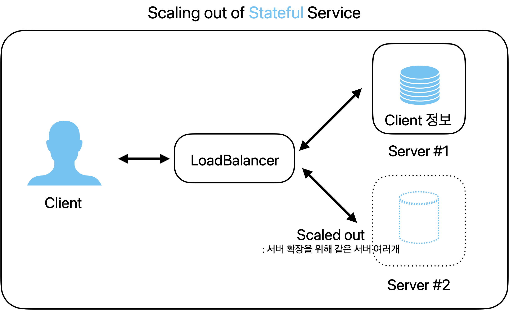
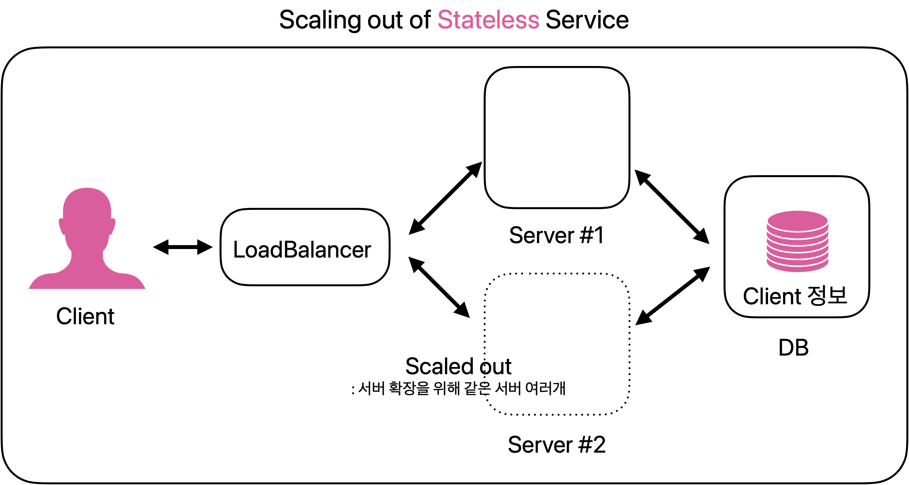

# RESTfulAPI
<!-- more -->

## 🍎 API란?
> 응용 프로그램에서 사용할 수 있도록, 운영 체제나 프로그래밍 언어가 제공하는 기능을 제어할 수 있게 만든 인터페이스

> 프로그램들이 서로 상호작용하는 것을 도와주는 매개체 = 점원
> 손님(프로그램)이 주문할 수 있게 메뉴(명령 목록)를 정리하고, 주문(명령)을 받으면 요리사(응용프로그램)와 상호작용하여 요청된 메뉴(명령에 대한 값)를 전달하는 과정

## 🍎 API의 역할
1. API는 서버와 데이터베이스에 대한 출입구 역할을 하며, 허용된 사람들에게만 접근성을 부여한다.

2. API는 애플리케이션과 기기가 원활하게 통신(데이터를 주고 받음)할 수 있도록 한다.
    - 애플리케이션: 우리가 흔히 알고 있는 스마트폰 어플이나 프로그램

3. API는 모든 접속을 표준화한다.
    - API는 모든 접속을 표준화하기 때문에 기계/운영체제 등과 상관없이 누구나 동일한 액세스 한다. 

## 🍎 API 종류 
1) private API  

- 내부 API  
- 회사 개발자가 자체 제품과 서비스를 개선하기 위해 내부적으로 발행  
- 제 3자에게 노출되지 않는다.

2) public API  

- 개방형 API, 누구나 제한 없이 API를 사용할 수 있다.
- OpenAPI: 접속하는 대상에 대한 제약이 없는 경우
    - 영화진흥위원회 API, 공공데이터, Kakao Developers(카카오 로그인)

3) partner API  

- 기업이 데이터 공유에 동의하는 특정인들만 사용할 수 있다. 
- 비즈니스 관계에서 사용되는 편이며, 종종 파트너 회사 간에 소프트웨어를 통합하기 위해 사용됨

---

## 🍎 REST란?(구성 요소)

### 1. 자원(RESOURCE)
- DB 안에 있는 데이터
    - ex) 유저 , 주문 등
- REST는 자원에 접근할 때 URI(Uniform Resource Identifier)를 이용
    - URI는 자원의 위치를 나타내는 식별자
- 리소스명은 동사보다는 명사를 사용해야 한다. 행위에 대한 표현X
- 예시1)URI: /blog/posts/678
    - 블로그 포스트에 대한 자원
- 예시2) URI: /weather/today?city=Seoul
    - 서울의 오늘 날씨 정보에 대한 자원

```
# bad
GET /getTodos/1
GET /todos/show/1
GET /members/delete/1


# good
GET /orders/book/1
```

### 2. 행위(Verb) - HTTP Method
- HTTP 프로토콜의 Method를 사용하여 원하는 자원에 대한 조작 요청
- POST : 생성 [Create]  
    - 예) http://bookseller/books -> 책 항목을 생성한다.   
- GET : 조회 [Select, Read] 
    - 예)http://bookseller/books -> 책 항목을 모두 조회한다.   
- PUT : 업데이트 [Update]  
    - 예)http://bookseller/books -> 해당 책 항목에 정보를 업데이트 한다.    
- DELETE : 삭제 [Delete] 
    - 예)http://bookseller/books -> 해당 책 항목들을 삭제 한다.

```
# bad
GET /members/delete/1

# good
DELETE /members/1
```

### 3. 표현(Representations)
- Client와 Server가 데이터를 주고받는 형태
    - JSON, XML, TEXT, RSS등

### 🚀 정리
> REST은 클라이언트와 서버 사이에서, HTTP URL을 통해 자원을 명시하고,  
HTTP Method(POST, GET, DELETE, PUT 등)를 통해 해당 자원에 대한 조작을 요청하고,    
이에 대한 응답을 받는 것을 의미한다.

---
## 🍎 Rest의 기본 원칙 6가지
### 1. 클라이언트-서버 모델  
- 클라이언트와 서버의 역할을 분리하여 유지보수가 용이함
    - REST 서버는 API 제공, 클라이언트는 사용자 인증이나 컨텍스트(세션, 로그인 정보)등을 직접 관리하는 구조
- 서버의 기능 개선이 클라이언트에 영향을 미치지 않고, 클라이언트 인터페이스 개선이 서버에 영향을 주지 않는다. 
    -> 의존성 감소

### 2. 무상태(Stateless)
- 서버가 클라이언트의 상태(세션정보 등)를 저장하지 않는다. 필요에 따라 외부DB에 저장한다.
- 서버의 처리가 단순화 되어, 확장성이 증가한다.
- 서버는 단순히 클라이언트의 요청에 대한 응답을 보내는 역할만하며, 세션관리는 클라이언트에게 책임이 있다.
  - 모든 클라이언트 요청에는 서버가 해당 요청을 이해하고 처리하는 데 필요한 모든 정보를 포함해야 한다.

> stateful의 경우 세션 정보가 scaled out된 server#2에 저장되어 있지 않다. 

- 서버가 클라이언트의 상태 정보(예: 사용자 세션 데이터)를 저장
- 상태 유지 환경에서 클라이언트의 세션 정보는 특정 서버에만 저장되며, 클라이언트가 다른 서버(예: server#1에서 server#2로)로 요청을 보내면, 새 서버는 사용자의 세션 정보를 갖고 있지 않아 문제가 발생할 수 있다.



> stateless의 경우 서버는 클라이언트 세션정보를 관리 하지 않으므로 고려하지 않아도 된다.

- 서버가 클라이언트의 상태 정보를 저장하지 않는다.
- 서버가 클라이언트의 세션 정보를 저장하거나 관리하지 않으므로, 클라이언트가 어떤 서버에 요청을 보내든 상관없다.
- 각 요청은 필요한 모든 정보를 포함하고 있어, 서버 간의 세션 정보 공유에 대한 걱정이 없다.




### 3. 캐시 가능(Cacheable)
- REST는 웹 표준인 HTTP를 그대로 사용하기 때문에, 웹에서 사용하는 기존 인프라를 그대로 사용할 수 있다. 따라서 HTTP가 가진 캐싱 기능을 적용할 수 있다.
- 클라이언트가 응답을 캐시하여 재사용함으로써 효율성을 높이고, 서버의 부담을 줄인다.
- 캐싱 처리는 보통 GET 요청에서 처리된다.
- Last-Modified태그, E-Tag을 통해 캐싱 구현
- 대량의 요청을 효율적으로 처리 가능

### 4. 인터페이스 일관성 (Uniform Interface)
- URI로 지정한 리소스에 대한 조작을 통일되고 한정적인 인터페이스로 수행하는 아키텍처 스타일
-  HTTP 표준 프로토콜에 따르는 모든 플랫폼에서 사용이 가능하다. 따라서 특정 언어나 기술에 종속되지 않는다.

### 5. 계층형 구조 (Layered System)
- REST 서버는 다중 계층으로 구성될 수 있으며 보안, 로드 밸런싱, 암호화 계층을 추가해 구조상의 유연성을 둘 수 있고 PROXY, 게이트웨이 같은 네트워크 기반의 중간매체를 사용할 수 있게 합니다.

### 6. 자체 표현 구조 (Self-descriptiveness)
- REST API 메시지만 보고도 이를 쉽게 이해 할 수 있는 자체 표현 구조로 되어 있다.


---

## 🍎 RESTful API란?
- REST의 특징을 기반으로 서비스 API를 구현한 것
- URI 형식으로 HTTP 메서드(GET, POST, PUT, DELETE)를 요청해 자원을 조회, 생성, 수정, 삭제할 수 있는 것
- ⭐️ 각 요청이 어떤 동작이나 정보를 위한 것인지를 그 요청의 모습 자체로 추론이 가능한 것 

### REST API의 설계 규칙
1. URI는 명사를 사용한다.(리소스명은 동사가 아닌 명사를 사용해야 한다.)  
  1-1. 아래와 같은 동사를 사용하지 말 것
  > /getAllUsers  
  >/getUserById  
  >/createNewUser  
  >/updateUser  
  >/deleteUser  

2. 슬래시( / )로 계층 관계를 표현한다.
```
http://restapi.example.com/houses/apartments  
http://restapi.example.com/animals/mammals/whales
```
3. URI 마지막 문자로 슬래시 ( / )를 포함하지 않는다.
4. 밑줄( _ )을 사용하지 않고, 하이픈( - )을 사용한다.
5. URI는 소문자로만 구성한다.
7. 파일확장자는 URI에 포함하지 않는다.  
    ex) http://hyehyehey.github.io/restapi/7/photo.jpg (X)
6. HTTP 응답 상태 코드 사용
- 클라이언트는 해당 요청에 대한 실패, 처리완료 또는 잘못된 요청 등에 대한 피드백을 받아야 한다.

    | 상태 코드 | 설명 |
    |-----------|------|
    | 200       | 클라이언트의 요청을 정상적으로 수행함. |
    | 201       | 클라이언트가 어떠한 리소스 생성을 요청하고, 해당 리소스가 성공적으로 생성됨 (POST를 통한 리소스 생성 작업 시 사용). |
    | 301       | 클라이언트가 요청한 리소스에 대한 URI가 변경되었을 때 사용하는 응답 코드. <br> (응답 시 Location header에 변경된 URI를 적어 줘야 함). |
    | 400       | 클라이언트의 요청이 부적절할 경우 사용하는 응답 코드. |
    | 401       | 클라이언트가 인증되지 않은 상태에서 보호된 리소스를 요청했을 때 사용하는 응답 코드. <br> (로그인하지 않은 유저가 로그인 했을 때 요청 가능한 리소스를 요청했을 때 사용). |
    | 403       | 유저 인증 상태와 관계 없이 응답하고 싶지 않은 리소스를 클라이언트가 요청했을 때 사용하는 응답 코드. <br> (403보다는 400이나 404를 사용할 것을 권고. 403 자체가 리소스가 존재한다는 뜻). |
    | 405       | 클라이언트가 요청한 리소스에서는 사용 불가능한 Method를 이용했을 경우 사용하는 응답 코드. |
    | 500       | 서버에 문제가 있을 경우 사용하는 응답 코드. |


 


## 🍎 REST의 장단점
### 장점
- 확장성 : 서버와 클라이언트 사이의 인터페이스가 명확하여 서로간의 의존성이 낮음
- 유연성
- 독립성

### 단점
- HTTP 프로토콜에 의존
- URI 설계가 복잡할 수 있음
- 상태 정보가 클라이언트 서버 간에 전송될 수 있음
- 필요한 문서화와 테스트 등의 추가 작업 필요


### 👀 REST API와 RESTful API의 차이는 뭘까?
RESTful은 REST의 설계 규칙을 잘 지켜서 설계된 API를 RESTful한 API라고 합니다.
즉, REST의 원리를 잘 따르는 시스템을 RESTful이란 용어로 지칭됩니다.

| 구분         | API                                                 | RESTful API                                          |
|--------------|-----------------------------------------------------|------------------------------------------------------|
| **제약 조건**   | 제약 조건이 없거나 제한적                              | 아키텍처의 제약 조건을 모두 따르도록 설계                |
| **호환성 및 이식성** | 다양한 프로그래밍 언어나 플랫폼에서 호환성 있도록 개발 | 표준 HTTP 메소드 사용, 인터페이스 일관성, 다양한 클라이언트에서 쉽게 사용 |
| **보안성과 안정성** | 제한적인 보안성과 안정성                             | 클라이언트-서버 구조, 무상태성, 캐시, 계층화, 유니폼 인터페이스 등 제약 조건으로 보안성 높음 |


### 🚀 결론: URI는 정보의 자원만 표현해야 하며, 자원의 행위는 HTTP Method에 명시한다!

---


## REST API 설계 예시
```java
@PostMapping("/review")
@ResponseBody
public ResponseEntity<BasicResponse> createReview(ReviewRequestVo reviewRequestVo){
    // 리뷰 등록 로직
}

@DeleteMapping("/review")
@ResponseBody
public ResponseEntity<BasicResponse> deleteReview(int lfReviewId){

    int result = standardService.deleteReview(lfReviewId);
    // 리뷰삭제 로직
}
```
<br>
<br>
<br>
<br>
<br>
<br>
