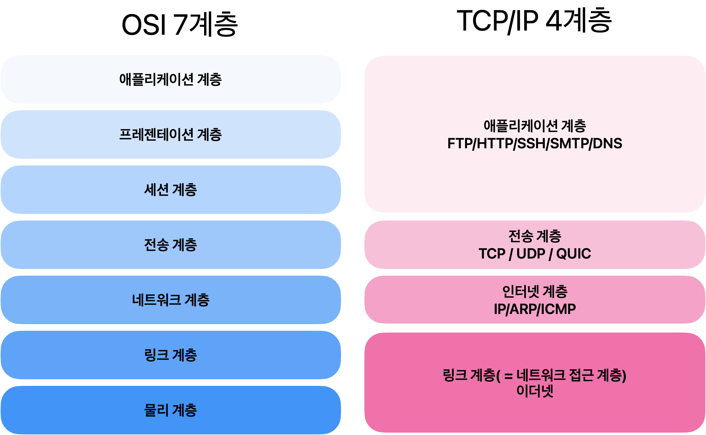
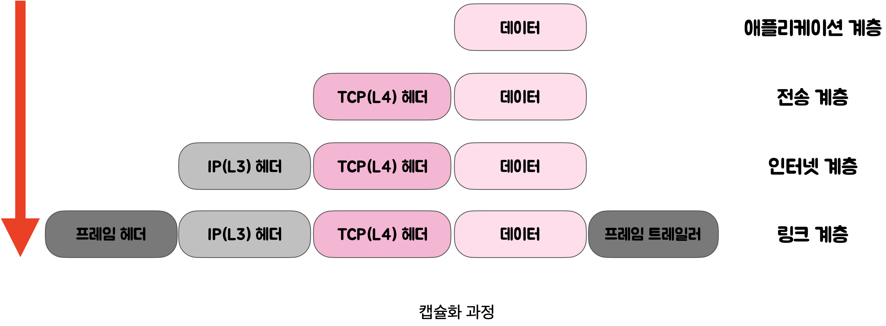
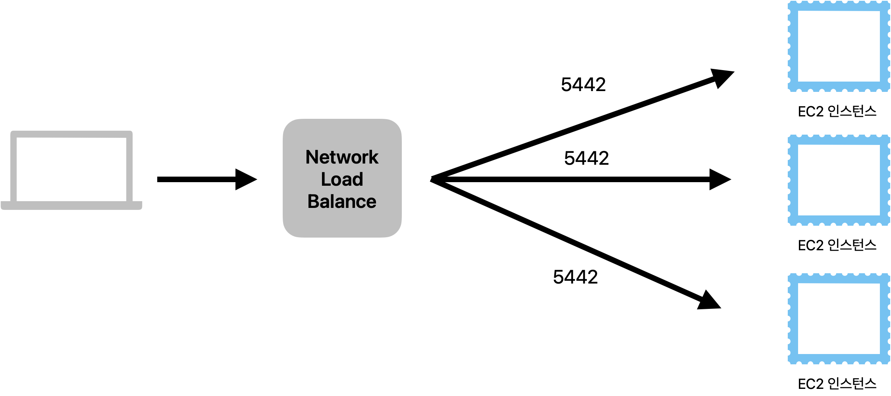

# 웹 브라우저와 네트워크 통신의 이해
> 웹 동작 방식 및 [개념] OSI 7계층 + TCP/IP 4계층 + L7, L4 로드밸런서 + DNS
<!-- more -->
## www.google.com을 주소창에 쳤을 때 화면이 나오기까지의 과정

1. 사용자가 브라우저에 URL([www.google.com](http://www.google.com/) )를 입력한다. HTTP request message를 생성한다.
2. IP 주소를 알아야 전송을 할 수 있으므로, DNS lookup을 통해 해당 domain의 server의 IP주소를 알아낸다.
3. 반환된 IP 주소(google의 server IP)로 HTTP 요청 메시지(request message) 전송 요청한다.
    - 생성된  HTTP 요청 메시지(request message)를 TCP/IP층에 전달한다. 
    - HTTP 요청 메시지에 헤더(TCP + IP)를 추가해서 TCP/IP패킷을 생성한다.
4. 패킷은 전기신호로 랜선을 통해 네트워크로 전송되고, 목적하는 google 서버에  전기적인 신호로 도달한다.
5. google 서버에 도착한 패킷은 decapsulation(↔ encapsulation)를 통해 메시지를 복원하고(http 데이터만 남게 된다), 서버의 어플리케이션(tomcat 등)으로 보낸다.
6. 서버 어플리케이션은 요청 메시지에 대한 response data를 가지고 HTTP응답 메시지(response message)를 생성한다.
7. HTTP 응답 메시지를 전달 받은 방식 그대로 client IP로 전송한다.
8. HTTP response message에 담긴 데이터를 토대로 웹브라우저에서 HTML 렌더링을 하여 모니터에 google화면 보여진다.
---

## 🍏 OSI 7계층
- 네트워크 통신이 일어나는 과정을 7단계로 나눈 국제 표준화 기구(ISO)에서 정의한 네트워크 표준 모델
- 7계층으로 나누는 이유?  
    통신이 일어나는 과정을 단계별로 알 수 있고, 특정한 곳에 이상이 생기면 그 단계만 수정할 수 있다.

---
7계층 - 응용 계층(Application Layer)

- 최종 목적지로, 사용자와 직적접으로 상호작용며 눈에 보이는 부분이다. (크롬, 사파리)
- User Interface 제공하는 계층
- HTTP, FTP, DNS 등

6계층 - 표현 계층(Presentation Layer)

- 전송하는 데이터의 **표현**방식을 결정(ex. 데이터변환, 압축, 암호화, 복호화 등)
- JPEG, MPEG, GIF, ASCII 등

5계층 - 세션 계층(Session Layer)

- 사용자와 서버간에 데이터가 통신하기 위한 논리적 연결을 담당한다.
- TCP/IP 세션을 만들고 없애는 책임을 지니고 있다.
- API, Socket

4계층 - 전송 계층(Transport Layer)

- TCP와 UDP 프로토콜을 통해 통신을 활성화한다.
- 포트를 열어두고, 프로그램들이 전송을 할 수 있도록 제공해준다
    - TCP : 신뢰성, 연결지향적
    - UDP : 비신뢰성, 비연결성, 실시간

3계층 - 네트워크 계층(Network Layer)

- 데이터를 목적지까지 가장 안전하고 빠르게 전달
- 라우터(Router)를 통해 경로를 선택하고 주소를 정하고(IP) 경로(Route)에 따라 패킷을 전달    
-> IP 헤더 붙음
- 이 계층에서 전송되는 단위 : 패킷(Packet)
- 장비 : 라우터

2계층 - 데이터 링크계층(DataLink Layer)

- 물리적 매체에 패킷 데이터를 실어 보내는 계층이다.
- 이 계층에서 전송되는 단위 : 프레임
- 장비 : 브리지, 스위치, 이더넷

1계층 - 물리계층(PhysicalLayer)

- 전기적, 기계적, 기능적인 특성을 이용해서 통신 케이블로 데이터를 전송하는 물리적인 장비
- 단지 데이터 전기적인 신호로 변환해서 주고받는 기능만 한다.
- 이 계층에서 사용되는 통신 단위: Bit
- 장비 : 통신 케이블, 리피터, 허브

---

- 서로간의 계층이 완벽하게 일치 하지 않고 세션, 표현 계층이 TCP/IP에는 없다.
- TCP/IP 4계층이 OSI 7계층보다 먼저 개발 되었다. TCP/IP 4계층은 인터넷이 발전 되면서 표준화되어 신뢰성이 우수하다.
- 그림에서 보면 OSI 7계층이 네트워크 전송의 데이터 표준을 정립 했다면, TCP/IP 4계층은 이를 실제로 사용하는 인터넷 표준인 것이다.

 

## 🍎 TCP/IP 4계층
4계층 - 응용 계층(Application Layer)  

- OSI 7계층의 세션 계층(5), 표현 계층(6), 응용 계층(7)에 해당한다.

3계층 - 전송 계층(Transport Layer)  

- OSI 7계층의 전송 계층(4)에 해당

2계층 - 인터넷 계층(Internet Layer)  

- OSI 7계층의 네트워크 계층(3)에 해당

1계층 - 네트워크 액세스 계층(Network Access Layer)  

- OSI 7계층의 물리계층(1)과 데이터 링크 계층(2)에 해당

---

### 계층 간 데이터 송수신 과정
> 사용자가 컴퓨터를 통해 다른 컴퓨터로 데이터를 요청한다면?   

- 애플리케이션 계층에서 전송 계층으로 사용자가 보내는 요청 값들이 캡슐화 과정을 통해 전달된다. 그리고 다시 링크 계층을 통해 해당 서버와 통신하고, 서버의 링크계층으로 부터 애플리케이션까지 비캡슐화 과정을 거쳐 데이터가 전송된다.
- 아래 그림과 같이 각 계층을 지날때마다(4 -> 1) 각 계층에서 Header가 붙게되고 수신측은 역순(1 -> 4)으로 헤더를 분석하게 된다.

  
---
## 캡슐화(encapsulation) ↔ 비캡슐화(decapsulation)
### **1️⃣ 캡슐화**  
캡슐화 과정은 상위 계층의 헤더와 데이터를 하위 계층의 데이터 부분에 포함시키고 해당 계층의 헤더를 삽입 하는 과정이다.  

1. 애플리케이션 계층 데이터 -> 전송 계층  
    - '세그먼트' or '데이터그램'화 되며 TCP(L4)화 된다.  
2. 전송 계층 -> 인터넷 계층  
    - IP(L3) 헤더가 붙여지며 '패킷'화 된다.  
3. 인터넷 계층 -> 링크 계층  
    - 프레임 헤더와 프레임 트레일러가 붙어 '프레임'화 된다.  

  

---
### **2️⃣ 비캡슐화**  
- 비캡슐화 과정은 하위 계층에서 상위 계층으로 가며 각 계층의 헤더 부분을 제거하는 과정이다.
- 캡슐화된 데이터를 받게 되면 링크 계층에서부터 올라오면서 프레임화된 데이터는 다시 패킷화를 거쳐 세그먼트, 데이터그램화를 거쳐 메시지화가 되는 비캡슐화 과정이 일어난다.   
- 최종적으로 애플리케이션에게 데이터를 전달하게 된다!

  
---
 
 
### 애플리케이션 계층을 처리하는 기기 (L7, L4)

> 로드밸런서란?

- 여러대의 서버에 부하를 분산하는 기기로 클라이언트로 부터 들어오는 요청들을 뒤쪽의 여러 서버로 나누는 역할
- 수많은 트래픽이 몰려왔을 때, 서버 부하를 방지하기 위해 서버 여러 대에 일을 분산 시켜 처리하는 방법.

> 로드밸런서 특징

1. 고가용성
    - 서버 중 하나가 실패하더라도, 트래픽을 다른 서버로 재분배한다.
    - 서비스의 지속성을 보장한다.
2. 스케일링
    - Scale-Out: 비슷한 사양의 서버를 추가로 연결해서 처리 가능한 데이터의 용량을 증가시킨다. 기존 서버의 부하를 분담해 성능 향상 효과를 기대할 수 있다.
    - Scale-Up: 기본 서버를 높은 사양으로 업그레이드 하는 방법이다. CPU, 메모리를 업그레이드 시킨다.

### **L4 로드 밸런서**
- **전송 계층(Transport Layer, Layer 4)** 에서 작동하는 로드 밸런서이다.
- 주로 TCP 및 UDP 프로토콜을 기반으로 클라이언트와 서버 간의 트래픽을 분산시킨다.
- 클라이언트의 IP 주소와 포트, nlbP 주소와 포트를 기반으로 로드 밸런싱을 수행한다.
- NLB(Network Load Balance)

### **L7 로드 밸런서**

- **애플리케이션 계층(Application Layer, Layer 7)** 에서 작동하는 로드 밸런서이다.
- 주로 HTTP 및 HTTPS 프로토콜을 기반으로 클라이언트와 서버 간의 트래픽을 분산시킨다.
- 요청 내용(URL, 캐시, 헤더, 쿠키 등)을 기반으로 트래픽을 분산한다.
- 만약 장애가 발생한 서버가 있다면 이를 트래픽 분산 대상에서 제외 해야 하는데, health check를 통해 이루어진다.
    - 서버에게 "잘 살아있니?" "네!" -> 대략 30초 마다 한번씩 체크한다.
- ALB (Application Load Balance)

### **L7 vs L4 차이점**

만약 http://bookstore.com/search/book/21이라는 url이 있다면,  
L7 로드 밸런서는 HTTP 헤더, URL의 경로를 분석하여 적절한 서버로 트래픽을 라우팅하는 반면, L4 로드 밸런서는 이러한 세부 내용을 고려하지 않고 IP 주소와 포트 번호를 기반으로 모든 요청을 여러 서버중 하나로 단순하게 라우팅한다.

| 항목 | L4 로드 밸런서 | L7 로드 밸런서 |
|------|---------------|---------------|
| 작동 계층 | 전송 계층(Layer 4) | 애플리케이션 계층(Layer 7) |
| 주요 프로토콜 | TCP, UDP | HTTP, HTTPS |
| 로드 밸런싱 기준 | IP 주소, 포트 | 요청 내용(URL, 헤더, 쿠키 등) |
| 처리 속도 | 상대적으로 빠름 | 상대적으로 느림 |
| 기능 및 유연성 | 상대적으로 제한적 | 다양한 기능 및 유연성 |

---
## DNS(Domain Name System)

- 인터넷의 전화번호부!  
- 사용자가 google.com과 같은 도메인 이름을 웹 브라우저에 입력하는 경우 DNS는 해당 사이트의 IP주소를 찾아주는 역할을 한다.  
- 웹사이트에 접속 할 때 우리는 외우기 어려운 IP 주소 대신 도메인 이름을 사용한다. 도메인 이름을 사용했을 때 입력한 도메인을 실제 네트워크상에서 사용하는 IP 주소로 바꾸고 해당 IP 주소로 접속하는 과정이 필요하다. 이러한 과정을 DNS라고 한다.  

 

💡 DNS 구성요소 3가지는 다음과 같다.

### 1. 도메인 네임 스페이스(Domain Name Space)
- 정해진 규칙에 따라 도메인 이름을 계층적 구조로 저장하는 것이다.  
- 하위 조직의 네임 스페이스를 할당하고 관리하는 방식은 각 하위 기관의 관리 책임자에게 위임된다.  
    예를 들어, hyewon.com 도메인은 .com 도메인(Root 도메인)이 있고, 아래 hyewon.com이라는 서브도메인 아래 www.hyewon.com라는 또 다른 서브도메인이다. 
  

### 2. 네임 서버(DNS Server, Name Server)
    
- 문자열로 표현된 도메인 이름을 실제 컴퓨터가 통신할 때 사용하는 IP주소로 변환시키기 위해 수 많은 IP주소의 도메인 정보를 가지고 있는 곳이다.  
- 리졸버(Resolver)로부터 요청 받은 도메인 이름에 대한 IP 정보를 다시 리졸버(Resolver)로 전달해주는 역할을 한다.
    
### 3. 리졸버(Resolver)
    
- DNS 클라이언트 요청을 네임 서버로 전달하고 찾은 정보를 클라이언트에게 제공하는 기능을 수행한다. 
- 루트 DNS 서버로부터 시작하여 필요한 DNS 정보를 차례대로 얻어서 IP 주소를 최종적으로 찾아낸다. 
- 즉 어떤 서버에서 찾아야 하는지, 이미 캐싱되어있는지 등을 찾아서 클라이언트에게 전달하는 역할을 수행한다.

 
 
 
 
 